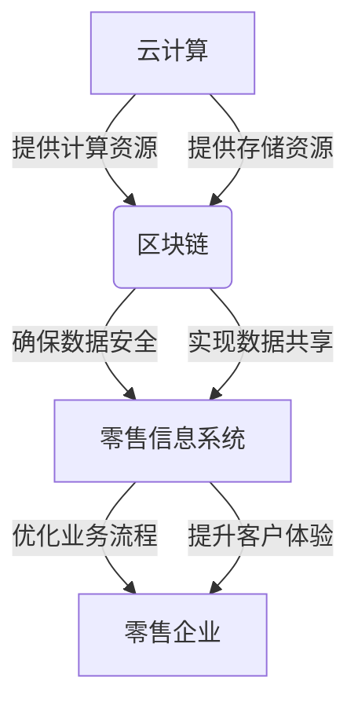

# 零售行业信息化建设中的云计算与区块链的结合

## 1.背景介绍

### 1.1 零售行业的数字化转型

在当今快节奏的商业环境中，零售行业正面临着前所未有的挑战和机遇。消费者期望获得无缝、个性化和高效的购物体验,而传统的零售模式已经难以满足这些需求。为了保持竞争力,零售企业必须紧跟数字化转型的步伐,利用新兴技术提升运营效率、优化供应链管理、改善客户体验。

### 1.2 云计算在零售行业中的应用

云计算作为一种灵活、可扩展的技术,为零售企业提供了强大的计算能力、存储资源和分析工具。通过将基础设施和应用程序迁移到云端,零售商可以降低IT成本、提高系统灵活性,并实现资源按需分配。此外,云计算还支持大数据分析、人工智能和物联网等创新技术的应用,帮助零售商深入了解消费者行为,优化营销策略。

### 1.3 区块链技术的兴起

区块链技术凭借其去中心化、不可篡改和透明性等特点,在金融、供应链、物联网等领域引起了广泛关注。在零售行业中,区块链可以用于产品溯源、支付结算、忠诚度计划等场景,提高供应链透明度,增强消费者信任,并简化业务流程。

### 1.4 云计算与区块链的融合

虽然云计算和区块链技术各自具有独特的优势,但将两者结合可以释放出更大的潜力。云计算为区块链提供了可扩展的计算资源和存储空间,而区块链则为云计算带来了分布式、不可篡改的特性。这种融合不仅有助于提高系统的安全性和可靠性,还能促进数据共享和业务协作,为零售行业带来全新的商业模式。

## 2.核心概念与联系

在探讨云计算与区块链在零售行业的结合之前,我们需要了解一些核心概念。

### 2.1 云计算概念

云计算是一种按需提供可配置的计算资源(如网络、服务器、存储、应用程序和服务)的模式,这些资源可以快速供给,只需很少的管理工作或与服务提供商进行少量交互。云计算的关键特征包括:

- 按需自助服务
- 广泛的网络访问
- 资源池化
- 快速弹性
- 可计量服务

云计算服务模式通常分为三种:基础设施即服务(IaaS)、平台即服务(PaaS)和软件即服务(SaaS)。

### 2.2 区块链概念

区块链是一种分布式账本技术,它通过密码学的方式将交易数据组织成一个个区块,并将这些区块通过加密技术串联起来形成一条不可篡改的链条。区块链的核心特征包括:

- 去中心化
- 不可篡改性
- 透明性
- 可追溯性

区块链技术可以应用于多个领域,如金融、供应链、物联网等,为各种场景提供安全、可信的数据共享和交易处理机制。

### 2.3 云计算与区块链的关系

云计算和区块链技术虽然来自不同的技术领域,但它们在某些方面存在着密切的联系:

1. **计算资源支持**: 区块链网络需要大量的计算资源来执行共识算法、验证交易和维护分布式账本,而云计算可以提供按需扩展的计算能力。

2. **存储支持**: 区块链需要存储大量的交易数据和区块信息,云存储可以提供可靠、高容量的存储空间。

3. **服务部署**: 区块链应用和节点可以部署在云平台上,利用云计算的灵活性和可扩展性。

4. **安全性增强**: 云计算可以为区块链应用提供安全的运行环境,如虚拟私有云、加密技术等。

5. **数据共享**: 区块链可以为云计算环境中的数据共享提供安全、透明的机制。

通过将云计算和区块链技术相结合,零售企业可以构建出更加灵活、安全和高效的信息化系统。

## 3.核心算法原理具体操作步骤

### 3.1 区块链核心算法

区块链的核心算法包括共识算法、加密算法和智能合约等。

#### 3.1.1 共识算法

共识算法是区块链系统中最关键的算法,它确保所有节点对网络状态达成一致,防止双重支付和数据篡改。常见的共识算法有:

1. **工作量证明(PoW)**: 通过计算机的算力竞争来获得记账权,比特币就采用了这种算法。

2. **权益证明(PoS)**: 根据节点持有的币龄来选择记账节点,以减少算力消耗。

3. **实用拜占庭容错(PBFT)**: 通过节点间的投票和共识过程达成一致。

4. **权威证明(PoA)**: 由预先认证的权威节点来记账和验证交易。

不同的共识算法在安全性、去中心化程度、效率等方面有所权衡。

#### 3.1.2 加密算法

区块链系统中广泛使用了多种加密算法,以确保数据的机密性、完整性和不可否认性。常见的加密算法包括:

1. **对称加密算法**: 如AES、DES等,用于加密区块数据。

2. **非对称加密算法**: 如RSA、ECC等,用于生成数字签名、身份认证。

3. **哈希算法**: 如SHA-256、Keccak-256等,用于生成数字指纹,确保数据的完整性。

加密算法为区块链系统提供了基础的安全保障。

#### 3.1.3 智能合约

智能合约是一种自动执行的计算机程序,它可以在满足预定条件时自动执行相应的操作。智能合约是区块链应用的核心,它可以用于编码各种业务逻辑,如支付结算、产品溯源等。

常见的智能合约语言有Solidity(以太坊)、Chaincode(Fabric)等。智能合约的执行过程包括:

1. 部署合约
2. 发送交易触发合约
3. 节点执行合约代码
4. 共识验证和写入区块

智能合约提高了区块链应用的灵活性和自动化程度。

### 3.2 云计算核心技术

云计算的核心技术包括虚拟化、容器化、自动化等。

#### 3.2.1 虚拟化

虚拟化技术是云计算的基础,它通过在单一物理硬件上运行多个虚拟机(VM),实现了资源的共享和隔离。常见的虚拟化技术包括:

1. **全虚拟化**: 如VMware、Hyper-V等,在硬件层模拟完整的硬件环境。

2. **半虚拟化**: 如Xen、KVM等,直接在硬件层运行Guest OS。

3. **操作系统虚拟化**: 如Docker、LXC等,在同一操作系统内核上运行多个隔离的用户空间实例。

虚拟化技术为云计算提供了灵活的资源管理和隔离能力。

#### 3.2.2 容器化

容器化是一种轻量级的虚拟化技术,它可以将应用程序及其依赖打包到一个可移植的容器中,实现"构建一次,到处运行"。常见的容器技术包括Docker、Kubernetes等。

容器化具有以下优势:

1. 轻量级: 容器比虚拟机更加轻量,启动速度快,资源占用少。

2. 可移植性: 容器可以在不同的操作系统和云平台上运行。

3. 隔离性: 容器之间相互隔离,提高了安全性和稳定性。

4. 自动化: 容器技术支持自动化部署、扩展和管理。

容器化技术为云原生应用提供了理想的运行环境。

#### 3.2.3 自动化

自动化是云计算的核心理念之一,它通过自动化工具和流程,实现了资源的按需供给、自动扩展和持续交付等功能。常见的自动化技术包括:

1. **基础设施即代码(IaC)**: 如Terraform、CloudFormation等,将基础设施资源定义为代码,实现自动化供给和管理。

2. **配置管理**: 如Ansible、Chef、Puppet等,用于自动化配置操作系统、应用程序和中间件。

3. **持续集成/持续交付(CI/CD)**: 通过自动化构建、测试和部署流程,实现应用程序的快速迭代。

4. **自动扩展**: 如Auto Scaling、Kubernetes HPA等,根据负载情况自动扩展或缩减资源。

自动化技术提高了云计算系统的灵活性、可靠性和效率。

通过将区块链和云计算的核心算法和技术相结合,零售企业可以构建出安全、高效、可扩展的信息化系统,满足业务发展需求。

## 4.数学模型和公式详细讲解举例说明

在区块链和云计算技术中,有许多涉及数学模型和公式的地方,下面我们将详细讲解其中的一些重要内容。

### 4.1 区块链共识算法中的数学模型

#### 4.1.1 工作量证明(PoW)

工作量证明是比特币等加密货币中广泛使用的共识算法,它的核心思想是通过计算机的算力竞争来获得记账权。

在PoW算法中,矿工需要解决一个密码学难题,即找到一个满足特定条件的随机数(称为"随机值"),使得该随机值与当前区块头的哈希值的组合结果小于一个预定的目标值。这个过程被称为"挖矿"。

我们可以用下面的公式来表示:

$$
H(prev\_block, tx, nonce) \le target
$$

其中:
- $H$是加密哈希函数,如SHA-256
- $prev\_block$是前一个区块的哈希值
- $tx$是当前区块包含的交易数据
- $nonce$是随机数,也称为"工作量证明"
- $target$是一个预定的目标值,用于控制难度

矿工需要不断尝试不同的$nonce$值,直到找到一个满足条件的解。由于哈希函数的单向性和随机性,这个过程需要大量的计算资源和时间。

第一个找到有效解的矿工将获得记账权和相应的奖励。PoW算法通过这种"算力竞争"的方式,确保了区块链网络的去中心化和安全性。

#### 4.1.2 权益证明(PoS)

权益证明是一种替代的共识算法,它根据节点持有的币龄(持币数量乘以持币时间)来选择记账节点,从而避免了大量的算力消耗。

在PoS算法中,每个节点根据其持有的币龄获得一定的权重,然后按照一定的规则(如随机选择或轮换机制)从中选出记账节点。记账节点将获得相应的奖励,但如果作恶(如双重支付),则会被惩罚,失去部分或全部押金。

我们可以用下面的公式来表示节点$i$被选中的概率:

$$
P_i = \frac{stake_i}{\sum_{j=1}^{n}stake_j}
$$

其中:
- $P_i$是节点$i$被选中的概率
- $stake_i$是节点$i$的币龄(持币数量乘以持币时间)
- $n$是参与共识的总节点数

PoS算法相比PoW更加节能环保,但存在一定的"无利害关系攻击"风险,即持币较少的节点可能会被攻击。

### 4.2 云计算资源调度中的数学模型

在云计算环境中,如何高效地调度和分配资源是一个重要的问题。常见的资源调度算法包括:

#### 4.2.1 整数规划模型

整数规划是一种常用的资源调度模型,它将资源调度问题建模为一个整数规