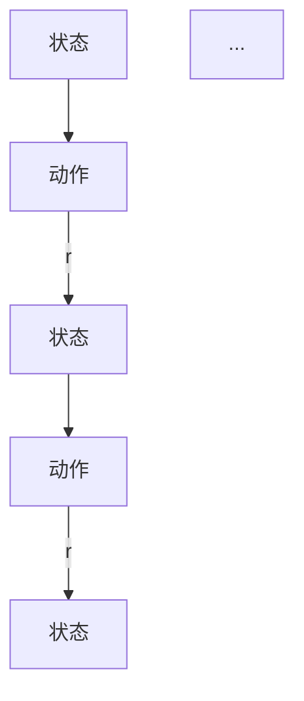

## 背景介绍

马尔可夫决策过程（Markov Decision Process，MDP）是一种用于解决具有随机性和动作选择性问题的数学模型。它起源于1960年代的控制论领域，通过将随机过程与动作策略相结合，形成了一种强大的决策框架。MDP广泛应用于人工智能、机器学习、控制论等领域，例如机器学习中的强化学习、计算机视觉中的图像识别等。

## 核心概念与联系

MDP的核心概念包括：状态、动作、奖励和策略。具体来说：

* **状态（State）：** 是一个系统的当前状态，表示为s。状态可以是连续的或离散的，可以包含多个属性。
* **动作（Action）：** 是系统可以执行的操作，表示为a。动作可以改变系统的状态，也可以保持状态不变。
* **奖励（Reward）：** 是系统执行动作后获得的反馈值，表示为r。奖励可以是正数或负数，表示系统的性能改善或恶化程度。
* **策略（Policy）：** 是一种确定或不确定的策略，用于选择下一个动作。策略可以是确定性的，也可以是概率性的。

MDP的核心概念与联系可以用以下Mermaid流程图表示：



## 核心算法原理具体操作步骤

MDP的核心算法原理是通过动态规划来计算最优策略。具体操作步骤如下：

1. **状态价值计算**：首先，计算每个状态的价值。价值表示了从该状态出发，按照一定策略执行动作所期望的累积奖励。
2. **动作值计算**：计算每个状态下每个动作的价值。动作值表示了从该状态执行某个动作后，按照一定策略执行其他动作所期望的累积奖励。
3. **策略更新**：根据动作值，更新策略。确定性的策略选择具有最高动作值的动作；概率性的策略则选择具有最高动作值的动作的概率分布。
4. **迭代更新**：通过上述步骤不断迭代更新，直到策略收敛。

## 数学模型和公式详细讲解举例说明

MDP的数学模型可以用以下公式表示：

$$
Q(s, a) = \sum_{s'} P(s' | s, a) [R(s, a, s') + \gamma \max_{a'} Q(s', a')]
$$

其中，Q(s, a)表示状态s下动作a的值；P(s' | s, a)表示从状态s执行动作a后转移到状态s'的概率；R(s, a, s')表示执行动作a从状态s转移到状态s'获得的奖励；γ表示折扣因子，用于衡量未来奖励的价值。

举例说明：假设有一个简单的MDP，其中有三个状态：{S1, S2, S3}，三个动作：{A1, A2, A3}，以及以下的转移概率、奖励和折扣因子：

* 转移概率：P(S2 | S1, A1) = 0.7，P(S3 | S1, A2) = 0.3
* 奖励：R(S1, A1, S2) = 1，R(S1, A2, S3) = -1
* 折扣因子：γ = 0.9

根据MDP的公式，我们可以计算Q(s, a)的值：

$$
Q(S1, A1) = 0.7 \times (1 + 0.9 \times \max_{a'} Q(S2, a')) \\
Q(S1, A2) = 0.3 \times (-1 + 0.9 \times \max_{a'} Q(S3, a'))
$$

## 项目实践：代码实例和详细解释说明

在本节中，我们将使用Python和OpenAI的Gym库实现一个MDP的简单示例。具体代码如下：

```python
import gym
import numpy as np

# 创建MDP环境
env = gym.make('CartPole-v0')

# 初始化Q表
Q = np.zeros([env.observation_space.shape[0], env.action_space.n])

# 学习参数
alpha = 0.1
gamma = 0.99
epsilon = 0.1

# 学习迭代次数
episodes = 1000

# 开始学习
for episode in range(episodes):
    state = env.reset()
    done = False
    
    while not done:
        # 选择动作
        if np.random.uniform(0, 1) < epsilon:
            action = env.action_space.sample()
        else:
            action = np.argmax(Q[state])
        
        # 执行动作
        next_state, reward, done, _ = env.step(action)
        
        # 更新Q表
        Q[state, action] = Q[state, action] + alpha * (reward + gamma * np.max(Q[next_state]) - Q[state, action])
        
        # 更新状态
        state = next_state
```

## 实际应用场景

MDP广泛应用于实际问题中，例如：

1. **强化学习**：MDP作为强化学习的基础框架，用于解决机器人控制、游戏策略等问题。
2. **计算机视觉**：MDP可以用于图像识别、图像分割等任务，通过动态规划计算最优策略。
3. **金融投资**：MDP可以用于金融投资决策，通过计算未来收益的期望值来选择最佳投资策略。
4. **交通流管理**：MDP可以用于交通流管理，通过计算各种交通措施的效果来选择最佳策略。

## 工具和资源推荐

对于学习和使用MDP，以下工具和资源推荐：

1. **Gym**：OpenAI的Gym库，提供了许多预先训练好的环境，可以用于实验和学习。
2. **PyMDP**：Python的MDP库，提供了许多MDP的实现和工具。
3. **MDP Book**：MDP相关书籍，包括《Markov Decision Processes: Discrete Event Systems》和《Reinforcement Learning: An Introduction》。
4. **MDP Lecture Notes**：MDP相关讲义和教材，例如斯坦福大学的《Reinforcement Learning Class Notes》。

## 总结：未来发展趋势与挑战

MDP在人工智能、机器学习等领域具有广泛的应用前景。随着计算能力的提高和数据量的增加，MDP在未来将越来越重要。然而，MDP仍然面临诸多挑战，例如计算效率、状态空间的非线性和复杂性等。未来，MDP将不断发展，寻求解决这些挑战，从而更好地服务于实际应用。

## 附录：常见问题与解答

1. **MDP与动态规划的区别**：MDP是一种特殊的动态规划方法，用于解决具有随机性和动作选择性问题。动态规划是一种广泛的优化方法，可以解决无论是否具有随机性和动作选择性的问题。MDP的核心特点是其状态转移概率和奖励结构。

2. **MDP与Q学习的区别**：MDP是一种数学模型，用于描述状态、动作、奖励和策略之间的关系。Q学习是一种基于MDP的强化学习方法，通过学习状态-action值表来找到最优策略。MDP可以用于其他领域的决策问题，而Q学习则专注于强化学习领域的应用。