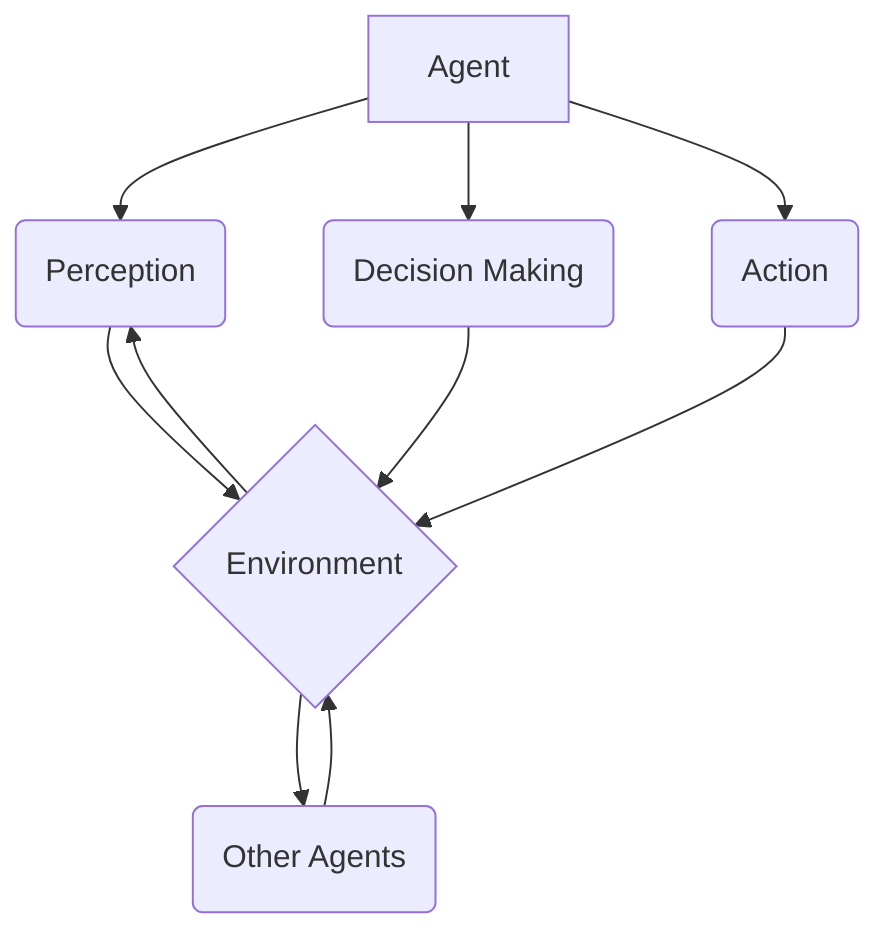

# AI Agent 智能体

## 1. 背景介绍
### 1.1 人工智能的发展历程
#### 1.1.1 早期人工智能
#### 1.1.2 专家系统时代 
#### 1.1.3 机器学习和深度学习的崛起

### 1.2 智能体的概念
#### 1.2.1 智能体的定义
#### 1.2.2 智能体的特征
#### 1.2.3 智能体与传统程序的区别

### 1.3 智能体在人工智能中的地位
#### 1.3.1 智能体是人工智能的重要研究方向
#### 1.3.2 智能体与其他AI技术的关系
#### 1.3.3 智能体在实际应用中的重要性

## 2. 核心概念与联系
### 2.1 Agent的定义与分类
#### 2.1.1 Agent的形式化定义
#### 2.1.2 反应型Agent和认知型Agent
#### 2.1.3 单Agent系统与多Agent系统

### 2.2 智能体的核心要素
#### 2.2.1 感知(Perception)
#### 2.2.2 决策(Decision Making)  
#### 2.2.3 执行(Action)
#### 2.2.4 学习(Learning)

### 2.3 智能体的环境交互模型
#### 2.3.1 Markov决策过程(MDP)
#### 2.3.2 部分可观察马尔可夫决策过程(POMDP)
#### 2.3.3 多智能体交互模型

### 2.4 智能体架构概述
#### 2.4.1 层次化架构
#### 2.4.2 BDI架构
#### 2.4.3 混合架构



## 3. 核心算法原理具体操作步骤
### 3.1 强化学习
#### 3.1.1 Q-Learning
##### 3.1.1.1 Q值更新
##### 3.1.1.2 探索与利用
##### 3.1.1.3 Q-Learning算法流程
#### 3.1.2 SARSA 
##### 3.1.2.1 SARSA与Q-Learning的区别
##### 3.1.2.2 SARSA算法流程
#### 3.1.3 Deep Q Network(DQN)
##### 3.1.3.1 神经网络价值函数逼近
##### 3.1.3.2 经验回放
##### 3.1.3.3 DQN算法流程

### 3.2 进化算法
#### 3.2.1 遗传算法(GA) 
##### 3.2.1.1 编码与解码
##### 3.2.1.2 选择、交叉与变异
##### 3.2.1.3 GA算法流程
#### 3.2.2 遗传编程(GP)
##### 3.2.2.1 GP个体表示
##### 3.2.2.2 GP遗传操作
##### 3.2.2.3 GP算法流程
#### 3.2.3 粒子群优化(PSO)
##### 3.2.3.1 粒子位置与速度更新
##### 3.2.3.2 PSO算法流程

### 3.3 多智能体算法
#### 3.3.1 博弈论
##### 3.3.1.1 纳什均衡
##### 3.3.1.2 最优反应
##### 3.3.1.3 重复博弈
#### 3.3.2 拍卖机制
##### 3.3.2.1 英式拍卖
##### 3.3.2.2 荷兰式拍卖
##### 3.3.2.3 Vickrey拍卖
#### 3.3.3 群体智能
##### 3.3.3.1 蚁群算法
##### 3.3.3.2 人工蜂群算法

## 4. 数学模型和公式详细讲解举例说明
### 4.1 马尔可夫决策过程(MDP)
#### 4.1.1 MDP的定义
MDP是一个五元组 $\langle S,A,P,R,\gamma \rangle$，其中：
- $S$ 是有限状态集合
- $A$ 是有限动作集合 
- $P$ 是状态转移概率矩阵，$P(s'|s,a)$ 表示在状态 $s$ 下执行动作 $a$ 后转移到状态 $s'$ 的概率
- $R$ 是奖励函数，$R(s,a)$ 表示在状态 $s$ 下执行动作 $a$ 获得的即时奖励
- $\gamma \in [0,1]$ 是折扣因子，表示未来奖励的重要程度

#### 4.1.2 最优价值函数与最优策略
- 状态价值函数：$V^\pi(s)=\mathbb{E}[\sum_{t=0}^{\infty}\gamma^t R(s_t,a_t)|s_0=s,\pi]$
- 动作价值函数：$Q^\pi(s,a)=\mathbb{E}[\sum_{t=0}^{\infty}\gamma^t R(s_t,a_t)|s_0=s,a_0=a,\pi]$
- 最优状态价值函数：$V^*(s)=\max_\pi V^\pi(s)$
- 最优动作价值函数：$Q^*(s,a)=\max_\pi Q^\pi(s,a)$
- 最优策略：$\pi^*(s)=\arg\max_a Q^*(s,a)$

#### 4.1.3 Bellman最优方程
$$
\begin{aligned}
V^*(s) &= \max_a Q^*(s,a) \\
&= \max_a \mathbb{E}[R(s,a)+\gamma V^*(s')|s,a] \\
Q^*(s,a) &= \mathbb{E}[R(s,a)+\gamma \max_{a'} Q^*(s',a')|s,a]
\end{aligned}
$$

### 4.2 部分可观察马尔可夫决策过程(POMDP)
#### 4.2.1 POMDP的定义 
POMDP是一个七元组 $\langle S,A,P,R,\Omega,O,\gamma \rangle$，其中：
- $S,A,P,R,\gamma$ 与MDP中的定义相同
- $\Omega$ 是有限观察集合
- $O$ 是观察概率矩阵，$O(o|s,a)$ 表示在状态 $s$ 下执行动作 $a$ 后观察到 $o$ 的概率

#### 4.2.2 信念状态与信念MDP
- 信念状态：$b(s)=P(s|o_1,a_1,...,o_t,a_t)$
- 信念MDP：将POMDP转化为MDP $\langle B,A,\tau,\rho,\gamma \rangle$
  - $B$ 是信念状态空间
  - $\tau(b,a,b')=\sum_{s'\in S} P(s'|b,a)b'(s')$
  - $\rho(b,a)=\sum_{s\in S} b(s)R(s,a)$

### 4.3 博弈论
#### 4.3.1 策略型博弈
- 纯策略：$s_i \in S_i$
- 混合策略：$\sigma_i \in \Delta(S_i)$，其中 $\Delta(S_i)$ 表示 $S_i$ 上的概率分布集合
- 期望收益：$u_i(s)=\sum_{s_{-i}\in S_{-i}} P(s_{-i}|s_i) u_i(s_i,s_{-i})$

#### 4.3.2 纳什均衡
- 纳什均衡的定义：如果对于任意玩家 $i$，$\forall \sigma_i' \in \Delta(S_i)$，都有 $u_i(\sigma_i^*,\sigma_{-i}^*) \geq u_i(\sigma_i',\sigma_{-i}^*)$，则称 $\sigma^*=(\sigma_1^*,...,\sigma_n^*)$ 是一个纳什均衡
- 纳什均衡的存在性：每个有限博弈都至少存在一个混合策略纳什均衡

## 5. 项目实践：代码实例和详细解释说明
### 5.1 Q-Learning算法实现
```python
import numpy as np

class QLearning:
    def __init__(self, num_states, num_actions, alpha, gamma, epsilon):
        self.Q = np.zeros((num_states, num_actions))
        self.alpha = alpha  # 学习率
        self.gamma = gamma  # 折扣因子
        self.epsilon = epsilon  # 探索概率
        
    def choose_action(self, state):
        if np.random.uniform() < self.epsilon:
            # 探索：随机选择动作
            action = np.random.randint(self.Q.shape[1])
        else:
            # 利用：选择Q值最大的动作
            action = np.argmax(self.Q[state])
        return action
        
    def update(self, state, action, reward, next_state):
        td_error = reward + self.gamma * np.max(self.Q[next_state]) - self.Q[state, action]
        self.Q[state, action] += self.alpha * td_error
```
- `__init__`方法初始化Q表、学习率、折扣因子和探索概率
- `choose_action`方法根据 $\epsilon$-贪婪策略选择动作，以 $\epsilon$ 的概率探索，$1-\epsilon$ 的概率利用
- `update`方法根据Q-Learning的更新公式 $Q(s,a) \leftarrow Q(s,a) + \alpha[r+\gamma \max_{a'} Q(s',a') - Q(s,a)]$ 更新Q表

### 5.2 遗传算法实现
```python
import numpy as np

class GeneticAlgorithm:
    def __init__(self, pop_size, num_genes, mutation_rate):
        self.pop_size = pop_size  # 种群大小
        self.num_genes = num_genes  # 基因数量
        self.mutation_rate = mutation_rate  # 变异概率
        self.population = np.random.randint(2, size=(pop_size, num_genes))
        
    def fitness(self, chromosome):
        # 适应度函数，根据具体问题定义
        pass
        
    def selection(self):
        # 选择算子，常见的有轮盘赌选择、锦标赛选择等
        pass
        
    def crossover(self, parent1, parent2):
        # 交叉算子，常见的有单点交叉、多点交叉、均匀交叉等
        pass
        
    def mutation(self, chromosome):
        # 变异算子，常见的有位翻转变异
        pass
    
    def evolve(self, num_generations):
        for i in range(num_generations):
            # 计算适应度
            fitness_scores = [self.fitness(chromosome) for chromosome in self.population]
            
            # 选择
            parents = self.selection()
            
            # 交叉
            offspring = []
            for j in range(self.pop_size // 2):
                parent1, parent2 = parents[j], parents[j+1]
                child1, child2 = self.crossover(parent1, parent2)
                offspring.append(child1)
                offspring.append(child2)
                
            # 变异
            for chromosome in offspring:
                self.mutation(chromosome)
            
            # 更新种群
            self.population = offspring
```
- `__init__`方法初始化种群、变异概率等参数，并随机生成初始种群
- `fitness`、`selection`、`crossover`、`mutation`方法分别表示适应度函数、选择算子、交叉算子和变异算子，需要根据具体问题进行定义和实现
- `evolve`方法描述了遗传算法的主要流程，包括适应度计算、选择、交叉、变异和种群更新

### 5.3 粒子群优化算法实现
```python
import numpy as np

class ParticleSwarmOptimization:
    def __init__(self, num_particles, dim, max_iter, c1, c2, w, lb, ub):
        self.num_particles = num_particles  # 粒子数量
        self.dim = dim  # 搜索空间维度
        self.max_iter = max_iter  # 最大迭代次数
        self.c1 = c1  # 认知学习因子
        self.c2 = c2  # 社会学习因子
        self.w = w  # 惯性权重
        self.lb = lb  # 搜索空间下界
        self.ub = ub  # 搜索空间上界
        
        self.particles = np.random.uniform(lb, ub, (num_particles, dim))
        self.velocities = np.zeros((num_particles, dim))
        self.pbest_positions = self.particles.copy()
        self.pbest_fitness = np.zeros(num_particles)
        self.gbest_position = np.zeros(dim)
        self.gbest_fitness = float('inf')
        
    def fitness(self, position):
        # 适应度函数，根据具体问题定义
        pass
        
    def optimize(self):
        for i in range(self.max_iter):
            # 计算每个粒子的适应度
            for j in range(self.num_particles):
                fitness = self.fitness(self.particles[j])
                if fitness < self.pbest_fitness[j]:
                    self.pbest_positions[j] = self.particles[j]
                    self.pbest_fitness[j] = fitness
                    
            # 更新全局最优位置
            gbest_index =