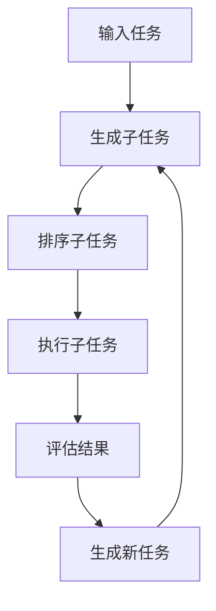

# AI Agent: AI的下一个风口 BabyAGI：根据任务结果自动创建、排序和执行新任务

## 1. 背景介绍

### 1.1 人工智能的发展历程

人工智能(Artificial Intelligence, AI)是当代科技发展的热点领域之一。自20世纪50年代AI概念被正式提出以来,经历了几个重要的发展阶段。

- **第一次AI浪潮(1956-1974年)**: 专家系统和逻辑推理是这一时期的主要研究方向。
- **AI寒冬时期(1974-1980年)**: 由于资金短缺和技术瓶颈,AI发展遇到了阻碍。
- **第二次AI浪潮(1980-1987年)**: 专家系统和神经网络成为研究热点。
- **第三次AI浪潮(1987年至今)**: 机器学习、深度学习等新兴技术大放异彩,推动AI取得了长足进步。

### 1.2 AI系统的发展瓶颈

尽管AI技术取得了令人瞩目的成就,但目前的AI系统仍然存在一些重大缺陷和局限性:

- **缺乏通用智能**: 现有AI系统大多专注于解决特定的任务,缺乏像人类那样的通用智能。
- **知识库有限**: AI系统的知识库有限,难以像人类那样不断学习和积累新知识。
- **缺乏自主性**: AI系统无法根据环境变化自主调整目标和策略。
- **缺乏因果推理能力**: AI系统难以进行复杂的因果推理和决策。

为了突破这些瓶颈,人工智能领域涌现出了一种新兴的研究范式——**AI Agent**。

## 2. 核心概念与联系

### 2.1 什么是AI Agent?

AI Agent是一种新型的人工智能系统,旨在模拟人类的认知过程,具备自主学习、规划和决策的能力。与传统AI系统相比,AI Agent具有以下核心特征:

- **自主性(Autonomy)**: 能够根据环境变化自主制定目标和行动策略。
- **交互性(Interactivity)**: 能够与环境和其他Agent进行实时交互。
- **持续学习(Continuous Learning)**: 能够持续学习,不断扩充知识库。
- **多任务处理(Multi-tasking)**: 能够同时处理多个任务,动态调整优先级。

AI Agent的核心目标是创建一种具备"通用人工智能"(Artificial General Intelligence, AGI)的智能体系,以突破传统AI系统的局限性。

### 2.2 BabyAGI: 一种新型AI Agent

BabyAGI是一种新型的AI Agent系统,由OpenAI的Anthropic团队于2022年提出。它的核心思想是通过模仿人类的认知过程,实现自动生成、排序和执行任务的能力。

BabyAGI的工作流程如下:

1. 输入初始任务
2. 根据任务,自动生成一系列相关的子任务
3. 对子任务进行排序,确定执行优先级
4. 执行子任务,获取结果
5. 评估子任务结果,检查是否满足初始任务要求
6. 根据评估结果,自动生成新的任务
7. 重复上述流程,不断优化任务执行策略

BabyAGI的核心创新之处在于,它能够根据任务执行的中间结果,自主生成新的子任务,从而逐步完成复杂的目标。这种"自我驱动"的工作模式极大地提高了AI系统的自主性和适应性。

## 3. 核心算法原理具体操作步骤

BabyAGI的核心算法由多个模块组成,包括任务生成器、任务排序器、执行器和评估器等。下面将详细介绍每个模块的工作原理和具体操作步骤。

### 3.1 任务生成器(Task Generator)

任务生成器的作用是根据当前任务和已有知识,生成一系列相关的子任务。它的工作原理基于一种称为"思维链"(Thought Chain)的认知模型。

思维链的基本思路是:将复杂的任务分解为一系列简单的步骤,每个步骤都是一个子任务。通过不断生成和执行子任务,最终完成整个复杂任务。

任务生成器的具体操作步骤如下:

1. 分析输入任务,提取关键信息和目标。
2. 基于已有知识库,搜索与任务相关的信息和资源。
3. 运用启发式规则和模式匹配技术,生成一系列可能的子任务。
4. 对生成的子任务进行筛选和优化,去除冗余和无关项。
5. 输出优化后的子任务列表。

例如,对于任务"预测未来一周天气",任务生成器可能会生成以下子任务:

- 搜索当前所在地区的天气数据
- 查找可靠的天气预报模型
- 收集未来一周的大气数据
- 使用天气预报模型进行预测
- 可视化并输出预测结果

### 3.2 任务排序器(Task Prioritizer)

任务排序器的作用是对生成的子任务进行排序,确定执行优先级。它的工作原理基于一种称为"价值函数"(Value Function)的评估模型。

价值函数旨在量化每个子任务对于完成最终目标的重要性和紧迫性。具有更高价值的子任务将被优先执行。

任务排序器的具体操作步骤如下:

1. 为每个子任务定义一个价值函数,包括重要性、紧迫性、难度等因素。
2. 基于价值函数,计算每个子任务的综合评分。
3. 根据评分,对子任务进行排序。
4. 输出排序后的子任务列表。

例如,对于"预测未来一周天气"的任务,任务排序器可能会给出如下优先级:

1. 搜索当前所在地区的天气数据
2. 收集未来一周的大气数据
3. 查找可靠的天气预报模型
4. 使用天气预报模型进行预测
5. 可视化并输出预测结果

### 3.3 执行器(Executor)

执行器的作用是按照排序后的子任务列表,依次执行每个子任务,并记录执行结果。它的工作原理基于一种称为"规划与行动"(Planning and Acting)的控制流程。

执行器的具体操作步骤如下:

1. 从排序后的子任务列表中取出最高优先级的子任务。
2. 分析子任务的具体要求,制定执行计划。
3. 利用已有的工具和资源,执行子任务。
4. 记录子任务的执行结果和状态。
5. 重复上述步骤,直到所有子任务执行完毕。

例如,对于子任务"搜索当前所在地区的天气数据",执行器可能会执行以下操作:

1. 在知识库中查找当前位置信息。
2. 访问天气数据API,获取当前位置的历史天气数据。
3. 将获取的数据存储到临时文件中,记录执行状态为"完成"。

### 3.4 评估器(Evaluator)

评估器的作用是对子任务的执行结果进行评估,判断是否满足最终任务的要求。它的工作原理基于一种称为"目标检测"(Goal Checking)的评估模型。

评估器的具体操作步骤如下:

1. 分析最终任务的目标和要求。
2. 检查已执行子任务的结果是否满足目标要求。
3. 如果满足要求,则任务执行完成;否则进入下一步。
4. 基于当前的子任务结果,由任务生成器生成新的子任务。
5. 重复上述流程,直到满足最终任务要求。

例如,对于"预测未来一周天气"的任务,评估器可能会执行以下操作:

1. 检查天气预报模型的输出结果是否包含未来一周的天气预测。
2. 如果包含,则任务执行完成;否则生成新的子任务,如"改进天气预报模型"。

通过上述四个模块的紧密协作,BabyAGI能够自主地生成、排序、执行和评估任务,从而逐步完成复杂的目标。这种"自我驱动"的工作模式极大地提高了AI系统的自主性和适应性。

## 4. 数学模型和公式详细讲解举例说明

在BabyAGI的核心算法中,数学模型和公式扮演着重要的角色,尤其是在任务排序器和评估器模块中。下面将详细介绍两个关键的数学模型及其公式。

### 4.1 价值函数(Value Function)

价值函数是任务排序器中的核心数学模型,用于量化每个子任务对于完成最终目标的重要性和紧迫性。

价值函数的基本形式如下:

$$V(t) = w_1 \times I(t) + w_2 \times U(t) + w_3 \times (1 - D(t))$$

其中:

- $V(t)$表示子任务$t$的价值评分
- $I(t)$表示子任务$t$的重要性评分,取值范围$[0, 1]$
- $U(t)$表示子任务$t$的紧迫性评分,取值范围$[0, 1]$
- $D(t)$表示子任务$t$的难度评分,取值范围$[0, 1]$
- $w_1, w_2, w_3$是权重系数,用于调节各项因素的相对重要性

重要性评分$I(t)$反映了子任务$t$对于完成最终目标的重要程度。例如,对于"预测未来一周天气"的任务,获取天气数据的重要性评分会高于可视化输出的重要性评分。

紧迫性评分$U(t)$反映了子任务$t$的时间敏感性。一些子任务可能有时间期限,需要优先执行。

难度评分$D(t)$反映了子任务$t$的执行难度。较难的子任务会获得较低的价值评分,从而降低其优先级。

通过调节权重系数$w_1, w_2, w_3$,可以根据具体任务的特点,调整各项因素的相对重要性。

例如,对于一个时间敏感的任务,可以增大$w_2$的值,提高紧迫性评分的权重;对于一个执行难度较大的任务,可以增大$w_3$的值,降低难度评分的影响。

### 4.2 目标检测函数(Goal Checking Function)

目标检测函数是评估器中的核心数学模型,用于判断子任务的执行结果是否满足最终任务的要求。

目标检测函数的基本形式如下:

$$G(R, T) = \sum_{i=1}^{n} w_i \times S_i(R, T)$$

其中:

- $G(R, T)$表示目标检测函数的评分,取值范围$[0, 1]$
- $R$表示子任务的执行结果
- $T$表示最终任务的目标和要求
- $S_i(R, T)$是第$i$个评分子函数,用于评估结果$R$是否满足要求$T$的某个方面,取值范围$[0, 1]$
- $w_i$是第$i$个评分子函数的权重系数,用于调节其相对重要性
- $n$是评分子函数的总数

评分子函数$S_i(R, T)$可以根据具体任务的特点进行定义。例如,对于"预测未来一周天气"的任务,可以定义以下几个评分子函数:

- $S_1(R, T)$: 评估结果$R$是否包含未来一周的天气预测
- $S_2(R, T)$: 评估结果$R$的预测准确性
- $S_3(R, T)$: 评估结果$R$的可读性和可视化质量

如果$G(R, T)$的值接近1,则表示执行结果$R$基本满足了最终任务$T$的要求;如果$G(R, T)$的值较低,则表示还需要进一步优化和执行新的子任务。

通过调节权重系数$w_i$,可以根据具体任务的特点,调整各个评分子函数的相对重要性。例如,对于一个强调预测准确性的任务,可以增大$w_2$的值,提高准确性