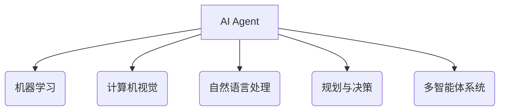

# AI Agent: AI的下一个风口 具身智能的核心与未来

## 1.背景介绍

### 1.1 人工智能的发展历程

人工智能(Artificial Intelligence, AI)是当代科技领域最具革命性和颠覆性的技术之一。自20世纪50年代AI概念被正式提出以来,经历了起起伏伏的发展历程。早期的AI系统主要集中在专家系统、机器学习等领域,取得了一些初步成果。但由于计算能力和数据资源的限制,AI的发展一度陷入了"AI寒冬"。

### 1.2 深度学习的突破

21世纪初,深度学习(Deep Learning)技术的兴起,为AI发展注入了新的动力。基于大数据和强大的计算能力,深度学习在计算机视觉、自然语言处理、语音识别等领域取得了突破性进展,推动了AI技术的飞速发展。

### 1.3 AI Agent的兴起

随着AI技术日益成熟,人们开始探索将AI应用于更广阔的领域。传统的AI系统大多局限于狭窄的任务范畴,缺乏灵活性和适应性。为了解决这一问题,AI Agent(智能代理)概念应运而生。AI Agent旨在创建具有自主性、交互性和智能决策能力的软件实体,能够与现实世界进行有效交互和协作。

## 2.核心概念与联系

### 2.1 AI Agent的定义

AI Agent是一种能够感知环境、处理信息、做出决策并采取行动的智能系统。它可以被视为一个软件实体,具有自主性、反应性、主动性和社会能力等特征。AI Agent需要具备以下几个核心能力:

1. **感知能力(Perception)**: 通过传感器获取环境信息,如视觉、听觉、触觉等。
2. **认知能力(Cognition)**: 对获取的信息进行理解、推理和决策。
3. **行为能力(Action)**: 根据决策结果采取相应的行动,影响环境状态。

### 2.2 AI Agent与其他AI系统的关系

AI Agent可以被视为一种通用的AI系统框架,它融合了多种AI技术,包括机器学习、计算机视觉、自然语言处理等。传统的AI系统通常专注于解决特定的任务,而AI Agent则旨在创建具有更广泛能力的智能系统,能够在复杂的环境中自主运行并与人类或其他智能体进行交互。



## 3.核心算法原理具体操作步骤

### 3.1 感知模块

感知模块负责从环境中获取原始数据,并将其转换为AI Agent可以理解的表示形式。常见的感知技术包括计算机视觉、语音识别、传感器融合等。

1. **计算机视觉**:使用摄像头或其他视觉传感器获取图像或视频数据,并通过图像处理和计算机视觉算法(如目标检测、语义分割等)提取有用的视觉特征。

2. **语音识别**:使用麦克风或其他音频传感器获取语音数据,并通过语音识别算法(如隐马尔可夫模型、深度神经网络等)将其转换为文本形式。

3. **传感器融合**:将来自多个传感器(如激光雷达、惯性测量单元等)的数据进行融合,获得更加准确和全面的环境表示。

### 3.2 认知模块

认知模块负责对感知模块获取的数据进行理解、推理和决策。这通常涉及机器学习、知识表示、规划和推理等技术。

1. **机器学习**:使用监督学习、无监督学习或强化学习等技术,从数据中学习模型,用于分类、预测、决策等任务。常见的机器学习算法包括深度神经网络、支持向量机、决策树等。

2. **知识表示与推理**:构建知识库,用于表示领域知识和规则。基于知识库,可以进行逻辑推理、规划和决策。常见的知识表示方法包括本体论、语义网络、规则库等。

3. **规划与决策**:根据当前状态和目标,生成行动序列以达成目标。常见的规划算法包括启发式搜索、动态规划、马尔可夫决策过程等。

### 3.3 行为模块

行为模块负责执行认知模块做出的决策,并将相应的行动反馈到环境中。这可能涉及机器人控制、自然语言生成、图像/视频生成等技术。

1. **机器人控制**:根据规划好的路径和动作序列,控制机器人执行器(如机械臂、车辆等)完成相应的动作。

2. **自然语言生成**:将认知模块的决策转换为自然语言形式,用于与人类进行交互。

3. **图像/视频生成**:根据决策结果,生成相应的图像或视频输出,用于可视化或增强现实等应用。

## 4.数学模型和公式详细讲解举例说明

AI Agent中涉及多种数学模型和算法,下面将详细介绍其中几种核心模型和公式。

### 4.1 马尔可夫决策过程(Markov Decision Process, MDP)

马尔可夫决策过程是一种用于建模序贯决策问题的数学框架,广泛应用于强化学习和规划领域。一个MDP可以用一个五元组 $(S, A, P, R, \gamma)$ 来表示:

- $S$ 是状态集合,表示环境的所有可能状态。
- $A$ 是动作集合,表示智能体可以采取的所有可能动作。
- $P(s'|s,a)$ 是状态转移概率,表示在状态 $s$ 下采取动作 $a$ 后,转移到状态 $s'$ 的概率。
- $R(s,a,s')$ 是奖励函数,表示在状态 $s$ 下采取动作 $a$ 后,转移到状态 $s'$ 所获得的即时奖励。
- $\gamma \in [0,1)$ 是折现因子,用于平衡即时奖励和长期奖励的权重。

在MDP中,智能体的目标是找到一个策略 $\pi: S \rightarrow A$,使得期望的累积折现奖励最大化:

$$
\max_\pi \mathbb{E}\left[\sum_{t=0}^\infty \gamma^t R(s_t, a_t, s_{t+1}) \right]
$$

其中 $s_t$ 和 $a_t$ 分别表示时刻 $t$ 的状态和动作。

### 4.2 Q-Learning算法

Q-Learning是一种常用的基于模型无关的强化学习算法,用于求解MDP问题。它通过迭代更新一个Q函数 $Q(s,a)$,该函数表示在状态 $s$ 下采取动作 $a$ 后,可获得的期望累积奖励。Q函数的更新规则如下:

$$
Q(s_t, a_t) \leftarrow Q(s_t, a_t) + \alpha \left[ r_t + \gamma \max_{a'} Q(s_{t+1}, a') - Q(s_t, a_t) \right]
$$

其中:

- $\alpha$ 是学习率,控制更新步长。
- $r_t$ 是在时刻 $t$ 获得的即时奖励。
- $\gamma$ 是折现因子。
- $\max_{a'} Q(s_{t+1}, a')$ 是在状态 $s_{t+1}$ 下可获得的最大期望累积奖励。

通过不断更新Q函数,算法最终会收敛到一个最优策略 $\pi^*(s) = \arg\max_a Q^*(s,a)$,其中 $Q^*$ 是最优Q函数。

### 4.3 深度神经网络

深度神经网络是一种强大的机器学习模型,在AI Agent的感知和认知模块中发挥着重要作用。一个典型的前馈神经网络可以表示为:

$$
\hat{y} = f_L(W_L f_{L-1}(W_{L-1} \cdots f_1(W_1 x + b_1) \cdots ) + b_{L-1}) + b_L
$$

其中:

- $x$ 是输入数据。
- $\hat{y}$ 是网络的输出。
- $W_i$ 和 $b_i$ 分别表示第 $i$ 层的权重矩阵和偏置向量。
- $f_i$ 是第 $i$ 层的激活函数,如ReLU、Sigmoid等。
- $L$ 是网络的总层数。

通过反向传播算法和梯度下降优化,可以学习网络参数 $W_i$ 和 $b_i$,使得网络在训练数据上的损失函数最小化。

深度神经网络在计算机视觉、自然语言处理等领域表现出色,是AI Agent感知和认知模块的核心组成部分。

## 5.项目实践:代码实例和详细解释说明

为了更好地理解AI Agent的实现,我们将通过一个简单的网格世界示例,展示如何使用Python和强化学习框架构建一个基本的AI Agent。

### 5.1 问题描述

考虑一个 $4 \times 4$ 的网格世界,其中有一个起点(S)、一个终点(G)和若干障碍物(H)。AI Agent的目标是从起点出发,找到一条到达终点的最短路径,同时避开障碍物。

```
+---+---+---+---+
| H |   |   |   |
+---+---+---+---+
|   |   | H |   |
+---+---+---+---+
|   |   |   |   |
+---+---+---+---+
| S |   |   | G |
+---+---+---+---+
```

### 5.2 环境建模

我们首先定义网格世界的状态空间和动作空间:

```python
import numpy as np

# 网格世界大小
GRID_SIZE = (4, 4)

# 状态空间
STATE_SPACE = np.prod(GRID_SIZE)

# 动作空间
ACTION_SPACE = 4  # 上、下、左、右

# 起点和终点位置
START_STATE = 0
GOAL_STATE = 15

# 障碍物位置
OBSTACLES = [0, 2, 7]
```

接下来,我们定义状态转移函数和奖励函数:

```python
def get_next_state(state, action):
    """状态转移函数"""
    row, col = state // GRID_SIZE[1], state % GRID_SIZE[1]
    if action == 0:  # 上
        row = max(row - 1, 0)
    elif action == 1:  # 下
        row = min(row + 1, GRID_SIZE[0] - 1)
    elif action == 2:  # 左
        col = max(col - 1, 0)
    else:  # 右
        col = min(col + 1, GRID_SIZE[1] - 1)
    next_state = row * GRID_SIZE[1] + col
    return next_state

def get_reward(state, action, next_state):
    """奖励函数"""
    if next_state == GOAL_STATE:
        return 1
    elif next_state in OBSTACLES:
        return -1
    else:
        return -0.1
```

### 5.3 Q-Learning实现

现在,我们使用Q-Learning算法训练一个AI Agent,让它学习如何在网格世界中导航。

```python
import random

# 初始化Q表
Q = np.zeros((STATE_SPACE, ACTION_SPACE))

# 超参数
LEARNING_RATE = 0.1
DISCOUNT_FACTOR = 0.9
EPISODES = 1000

# 训练
for episode in range(EPISODES):
    state = START_STATE
    done = False
    while not done:
        # 选择动作
        if random.uniform(0, 1) < 0.1:
            action = random.randint(0, ACTION_SPACE - 1)  # 探索
        else:
            action = np.argmax(Q[state, :])  # 利用

        # 执行动作
        next_state = get_next_state(state, action)
        reward = get_reward(state, action, next_state)

        # 更新Q值
        Q[state, action] += LEARNING_RATE * (reward + DISCOUNT_FACTOR * np.max(Q[next_state, :]) - Q[state, action])

        # 更新状态
        state = next_state

        # 判断是否到达终点
        if next_state == GOAL_STATE:
            done = True

# 输出最优策略
policy = np.argmax(Q, axis=1)
print("Optimal policy:")
for row in range(GRID_SIZE[0]):
    for col in range(GRID_SIZE[1]):
        state = row * GRID_SIZE[1] + col
        action = policy[state]
        if state == START_STATE:
            print("S", end="")
        elif state == GOAL_STATE:
            print("G", end=""){"msg_type":"generate_answer_finish","data":"","from_module":null,"from_unit":null}