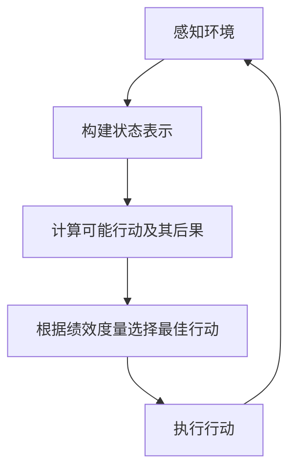

# AI Agent: AI的下一个风口 智能体的定义与特点

## 1.背景介绍

### 1.1 人工智能的发展历程

人工智能(Artificial Intelligence, AI)是当代科技发展中最具革命性和颠覆性的领域之一。自20世纪50年代AI概念被正式提出以来,经历了起起伏伏的发展历程。在早期,AI主要集中在专家系统、机器学习和自然语言处理等传统领域。进入21世纪后,随着计算能力的飞速提升、海量数据的积累以及深度学习算法的突破,AI迎来了全新的发展阶段。

### 1.2 AI系统的局限性

然而,传统的AI系统也存在一些明显的局限性。它们大多是专注于解决特定任务的"窄AI",缺乏灵活性和通用性。此外,这些系统往往缺乏自主性和主动性,无法根据环境变化自主作出决策和规划。因此,我们需要一种全新的AI范式来弥补这些不足,这就是智能体(Agent)的概念。

## 2.核心概念与联系   

### 2.1 什么是智能体

智能体(Agent)是人工智能领域中一个关键概念。智能体是指能够感知环境、处理信息、做出决策并采取行动的自主实体。与传统的AI系统不同,智能体不仅可以执行特定任务,还能根据环境变化自主地规划和调整行为策略。

智能体的核心特征包括:

- 自主性(Autonomy):能够独立做出决策和行动
- 反应性(Reactivity):能够及时响应环境变化
- 主动性(Proactiveness):不仅被动响应,还能主动追求目标
- 社会能力(Social Ability):能够与其他智能体协作和交互

### 2.2 智能体与传统AI系统的区别

相比传统的AI系统,智能体具有以下优势:

1. 更强的自主性和灵活性
2. 更好的环境适应能力
3. 更高的智能水平和决策能力
4. 更好的协作和交互能力

### 2.3 智能体在AI发展中的地位

智能体理论为AI系统带来了全新的设计范式,开辟了AI发展的新方向。智能体有望成为AI的下一个风口,在许多领域发挥重要作用,如机器人技术、智能交通系统、智能制造等。

## 3.核心算法原理具体操作步骤

智能体的核心算法原理是基于理性智能体(Rational Agent)的理论框架。理性智能体旨在选择能够最大化其绩效度量(Performance Measure)的行为。

智能体的工作流程可概括为感知(Perception)、决策(Decision Making)和行动(Action)三个主要步骤:



### 3.1 感知环境

智能体首先要通过传感器获取环境信息,构建对环境状态的表示。这个过程需要解决信息不完整、有噪声等问题。

### 3.2 决策过程

接下来,智能体需要计算在当前状态下可能采取的行动,并预测每个行动的后果。这通常需要建立一个转移模型(Transition Model)来描述状态与行动之间的关系。

然后,智能体会根据预定的绩效度量(如最大化奖励、最小化代价等),选择能够获得最优绩效的行动。这个过程常常借助于搜索算法(如A*算法)和决策理论(如马尔可夫决策过程MDP)。

### 3.3 执行行动

最后,智能体执行选定的行动,并观察行动对环境的影响,进入下一个决策循环。

## 4.数学模型和公式详细讲解举例说明

智能体的数学模型通常基于马尔可夫决策过程(Markov Decision Process, MDP)。MDP由以下几个要素组成:

- 一组状态 $S$
- 一组可选行动 $A$
- 转移概率 $P(s' | s, a)$,表示在状态 $s$ 采取行动 $a$ 后,转移到状态 $s'$ 的概率
- 奖励函数 $R(s, a, s')$,表示在状态 $s$ 采取行动 $a$ 后,转移到状态 $s'$ 获得的奖励

智能体的目标是找到一个策略(Policy) $\pi: S \rightarrow A$,使得期望的累积奖励最大化:

$$
\max_\pi \mathbb{E}\left[\sum_{t=0}^\infty \gamma^t R(s_t, a_t, s_{t+1})\right]
$$

其中 $\gamma \in [0, 1)$ 是折现因子,用于权衡当前奖励和未来奖励的重要性。

### 4.1 价值函数

为了评估一个策略的好坏,我们引入价值函数(Value Function)的概念。状态价值函数 $V^\pi(s)$ 表示在状态 $s$ 下,遵循策略 $\pi$ 所能获得的期望累积奖励:

$$
V^\pi(s) = \mathbb{E}_\pi\left[\sum_{t=0}^\infty \gamma^t R(s_t, a_t, s_{t+1}) \mid s_0 = s\right]
$$

类似地,状态-行动价值函数 $Q^\pi(s, a)$ 表示在状态 $s$ 下采取行动 $a$,之后遵循策略 $\pi$ 所能获得的期望累积奖励。

这些价值函数满足一组著名的贝尔曼方程(Bellman Equations):

$$
\begin{aligned}
V^\pi(s) &= \sum_{a \in A} \pi(a|s) Q^\pi(s, a) \\
Q^\pi(s, a) &= R(s, a) + \gamma \sum_{s' \in S} P(s' | s, a) V^\pi(s')
\end{aligned}
$$

### 4.2 策略迭代算法

基于贝尔曼方程,我们可以设计出求解最优策略的算法,例如策略迭代(Policy Iteration)算法:

1. 初始化一个策略 $\pi_0$
2. 对于当前策略 $\pi_i$,求解对应的价值函数 $V^{\pi_i}$
3. 基于 $V^{\pi_i}$,计算一个改进的策略 $\pi_{i+1}$
4. 如果 $\pi_{i+1} = \pi_i$,则停止迭代,否则转到步骤2

经过多次迭代,策略将收敛到最优策略。

### 4.3 深度强化学习

近年来,结合深度学习的深度强化学习(Deep Reinforcement Learning)技术取得了突破性进展。深度强化学习使用神经网络来逼近价值函数或策略,从而能够处理高维状态空间和连续动作空间。著名的算法包括深度Q网络(DQN)、策略梯度算法(Policy Gradient)等。

## 5.项目实践:代码实例和详细解释说明

为了更好地理解智能体的工作原理,我们以一个简单的格子世界(Gridworld)为例,实现一个基于Q-Learning的智能体代理。

### 5.1 问题描述

考虑一个 $4 \times 4$ 的格子世界,智能体代理的目标是从起点(0,0)到达终点(3,3)。每一步,代理可以选择上下左右四个方向之一移动一格。如果移动到了障碍格子,则会停留在原地。到达终点会获得正奖励,而其他步骤会有一定的负奖励(代价)。

### 5.2 Q-Learning算法

Q-Learning是一种著名的无模型强化学习算法,它直接学习状态-行动价值函数 $Q(s, a)$,而不需要了解环境的转移模型。算法步骤如下:

1. 初始化 $Q(s, a)$ 为任意值
2. 对于每一个状态-行动对 $(s, a)$:
    - 执行行动 $a$,观察下一个状态 $s'$ 和即时奖励 $r$
    - 更新 $Q(s, a)$ 值:
        $$Q(s, a) \leftarrow Q(s, a) + \alpha \left[r + \gamma \max_{a'} Q(s', a') - Q(s, a)\right]$$
    - 其中 $\alpha$ 是学习率, $\gamma$ 是折现因子

### 5.3 Python实现

```python
import numpy as np

# 格子世界的大小
WORLD_SIZE = (4, 4)

# 障碍格子的位置
OBSTACLES = [(1, 1), (3, 1)]

# 起点和终点
START = (0, 0)
GOAL = (3, 3)

# 奖励
REWARD = {
    GOAL: 10,
    START: 0,
}

# 行动
ACTIONS = ['U', 'D', 'L', 'R']

# Q-Learning参数
ALPHA = 0.1  # 学习率
GAMMA = 0.9  # 折现因子
EPSILON = 0.1  # 探索概率

# Q表,初始化为全0
Q = np.zeros((WORLD_SIZE + (len(ACTIONS),)))

def get_next_state(state, action):
    """根据当前状态和行动,计算下一个状态"""
    row, col = state
    if action == 'U':
        next_state = (max(row - 1, 0), col)
    elif action == 'D':
        next_state = (min(row + 1, WORLD_SIZE[0] - 1), col)
    elif action == 'L':
        next_state = (row, max(col - 1, 0))
    else:
        next_state = (row, min(col + 1, WORLD_SIZE[1] - 1))

    # 如果下一个状态是障碍,则保持原状态
    if next_state in OBSTACLES:
        next_state = state

    return next_state

def get_reward(state):
    """获取当前状态的即时奖励"""
    if state == GOAL:
        return REWARD[GOAL]
    elif state in OBSTACLES:
        return -5
    else:
        return REWARD[START]

def epsilon_greedy_policy(state):
    """epsilon-greedy策略,选择下一步行动"""
    if np.random.uniform() < EPSILON:
        # 探索,随机选择一个行动
        action = np.random.choice(ACTIONS)
    else:
        # 利用,选择Q值最大的行动
        action = ACTIONS[np.argmax(Q[state])]
    return action

def q_learning():
    """Q-Learning算法"""
    state = START
    while True:
        action = epsilon_greedy_policy(state)
        next_state = get_next_state(state, action)
        reward = get_reward(next_state)

        # 更新Q值
        Q[state + (ACTIONS.index(action),)] += ALPHA * (
            reward + GAMMA * np.max(Q[next_state]) - Q[state + (ACTIONS.index(action),)]
        )

        # 更新状态
        state = next_state

        # 到达终点,结束循环
        if state == GOAL:
            break

    # 输出最优路径
    state = START
    path = [state]
    while state != GOAL:
        action = ACTIONS[np.argmax(Q[state])]
        state = get_next_state(state, action)
        path.append(state)
    print("Optimal path:", " -> ".join([f"({x}, {y})" for x, y in path]))

if __name__ == "__main__":
    q_learning()
```

上述代码实现了一个简单的Q-Learning智能体代理,能够在格子世界中找到从起点到终点的最优路径。代码中包含了状态转移、奖励计算、epsilon-greedy策略选择以及Q值更新等核心功能。

通过这个例子,我们可以看到智能体是如何通过不断探索和利用来学习最优策略的。虽然这个例子比较简单,但是同样的思想也可以扩展到更复杂的环境和任务中。

## 6. 实际应用场景

AI智能体（AI Agent）在各个领域的应用场景非常广泛，以下是一些典型的实际应用场景：

#### 6.1 智能客服

智能客服是AI智能体的一个重要应用场景。通过自然语言处理（NLP）和机器学习技术，智能客服可以自动回答用户的问题，处理客户服务请求，并提供个性化的建议和解决方案。这样的系统不仅可以提高服务效率，还能显著降低人力成本。

#### 6.2 自动驾驶

在自动驾驶领域，AI智能体扮演着至关重要的角色。通过感知环境、规划路径和控制车辆，智能体能够实现自动驾驶功能。自动驾驶智能体需要融合多种传感器数据，如摄像头、激光雷达和雷达，以实时感知周围环境，并做出安全的驾驶决策。

#### 6.3 金融领域

AI智能体在金融领域的应用包括自动交易、风险管理和客户服务。智能交易系统可以实时分析市场数据，自动执行交易策略，从而提高交易效率和收益。风险管理智能体可以帮助金融机构识别和管理风险，提供更准确的风险评估和预测。

#### 6.4 医疗健康

在医疗健康领域，AI智能体可以用于疾病诊断、治疗方案推荐和健康管理。通过分析患者的病历数据和医学影像，智能体可以辅助医生进行诊断，并推荐个性化的治疗方案。此外，智能健康管理系统可以监测用户的健康状况，提供健康建议和预警。

#### 6.5 游戏和娱乐

AI智能体在游戏和娱乐领域也有广泛应用。智能体可以控制游戏中的NPC（非玩家角色），提供更逼真的游戏体验。此外，智能体还可以用于内容生成、玩家行为分析和个性化推荐，提升用户的娱乐体验。

## 7. 工具和资源推荐

#### 7.1 开源框架

- **OpenAI Gym**：一个用于开发和比较强化学习算法的工具包。
  [https://gym.openai.com/](https://gym.openai.com/)

- **TensorFlow Agents**：一个用于构建强化学习智能体的TensorFlow库。
  [https://www.tensorflow.org/agents](https://www.tensorflow.org/agents)

- **Ray RLlib**：一个用于分布式强化学习的高性能库。
  [https://docs.ray.io/en/latest/rllib.html](https://docs.ray.io/en/latest/rllib.html)

#### 7.2 在线课程

- **Coursera：强化学习**：由斯坦福大学提供的强化学习课程。
  [https://www.coursera.org/learn/machine-learning](https://www.coursera.org/learn/machine-learning)

- **Udacity：深度强化学习纳米学位**：由Udacity提供的深度强化学习课程。
  [https://www.udacity.com/course/deep-reinforcement-learning-nanodegree--nd893](https://www.udacity.com/course/deep-reinforcement-learning-nanodegree--nd893)

#### 7.3 书籍推荐

- **《强化学习：原理与实践》**：一本详细介绍强化学习原理和实践的书籍。
- **《人工智能：一种现代的方法》**：一本全面介绍人工智能领域的经典书籍。


## 8. 总结：未来发展趋势与挑战

AI智能体作为AI技术的一个重要方向，未来将继续在多个领域取得突破。然而，智能体的发展也面临一些挑战：

- **数据依赖性**：智能体的训练需要大量高质量的数据，数据的获取和标注成本较高。
- **计算资源需求**：智能体的训练和推理需要大量计算资源，特别是在处理复杂任务时。
- **安全性和可靠性**：在自动驾驶和医疗等关键领域，智能体的安全性和可靠性至关重要，需要严格的验证和测试。
- **伦理和隐私问题**：智能体的广泛应用带来了伦理和隐私问题，需要制定相关的法律法规和道德规范。

未来，AI智能体的发展将继续在以下几个方向上取得进展：

- **自监督学习**：通过自监督学习方法，减少对标注数据的依赖，提高智能体的泛化能力。
- **多智能体系统**：研究多个智能体之间的协作和竞争，提高系统的整体性能。
- **可解释性**：提高智能体的可解释性，使其在实际应用中更加透明和可信。
- **跨领域应用**：将智能体技术应用到更多领域，如教育、农业、环保等，解决实际问题。

## 9. 附录：常见问题与解答

#### 9.1 什么是AI智能体？

AI智能体是能够感知环境、做出决策并执行动作的人工智能系统。智能体通过与环境的交互，不断学习和改进自身的行为，以实现特定的目标。

#### 9.2 AI智能体与传统AI系统有何不同？

传统AI系统通常是预设规则和算法的，而AI智能体则具有自适应和学习能力，能够根据环境变化和任务需求不断调整和优化自身的行为。

#### 9.3 如何评估AI智能体的性能？

AI智能体的性能评估通常包括以下几个方面：
- **任务完成度**：智能体在特定任务中的表现，如准确率、成功率等。
- **学习效率**：智能体学习新任务的速度和效率。
- **鲁棒性**：智能体在不同环境和条件下的表现稳定性。
- **资源利用率**：智能体在计算资源和时间上的开销。

#### 9.4 AI智能体的应用前景如何？

AI智能体在多个领域具有广阔的应用前景，包括智能客服、自动驾驶、金融、医疗、游戏和娱乐等。随着技术的不断进步，智能体将进一步提升各行业的自动化和智能化水平。

---

**作者：禅与计算机程序设计艺术 / Zen and the Art of Computer Programming**