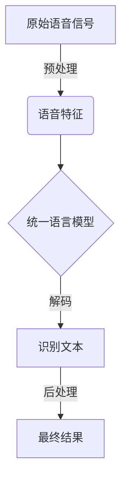

# AI LLM在语音识别中的实战应用：更精确、更智能

## 1.背景介绍

### 1.1 语音识别的重要性

语音识别技术是人工智能领域的一个关键组成部分,它使计算机能够从人类语音中识别和理解语音内容。随着人工智能技术的快速发展,语音识别在各个领域得到了广泛的应用,如智能助手、会议记录、语音控制系统等。语音识别不仅为人类与机器交互提供了一种自然、高效的方式,也为残障人士提供了更多的无障碍接入途径。

### 1.2 语音识别的挑战

尽管语音识别技术取得了长足的进步,但仍然面临着诸多挑战:

1. **语音变化性** 不同说话人的发音、语速、语调等存在较大差异,给识别带来困难。
2. **噪声干扰** 环境噪声会严重影响语音信号质量,降低识别准确率。
3. **词语多义性** 同一个词在不同语境下可能有不同含义,需要结合语境来理解。

### 1.3 大模型语言模型(LLM)的优势

近年来,大模型语言模型(Large Language Model,LLM)在自然语言处理领域取得了突破性进展。这些模型通过在海量文本数据上进行预训练,学习语言的语义和语法知识,从而具备了强大的语言理解和生成能力。将LLM应用于语音识别任务,可以有效克服上述挑战:

1. **语音变化性** LLM能够学习多种语音模式,提高对不同说话人的适应性。
2. **噪声鲁棒性** LLM具有强大的语义理解能力,能够从噪声中提取有效信息。
3. **语义理解** LLM能够利用上下文信息,更好地解决词语多义性问题。

## 2.核心概念与联系

### 2.1 语音识别流程

语音识别系统通常包括以下几个核心模块:

1. **语音信号预处理** 对原始语音信号进行预处理,如降噪、端点检测等。
2. **声学模型** 将预处理后的语音特征转换为语音单元序列。
3. **语言模型** 利用语言规则对语音单元序列进行解码,得到识别文本。
4. **后处理** 对识别结果进行规范化、错误修正等后续处理。

传统的语音识别系统中,声学模型和语言模型是两个相对独立的模块。而在基于LLM的语音识别系统中,声学模型和语言模型被统一到一个大型语言模型中,实现了端到端的建模。



### 2.2 自监督预训练

LLM的强大能力源自于在大规模无监督文本数据上进行自监督预训练。常见的自监督预训练目标包括:

1. **Masked Language Modeling** 根据上下文预测被掩码的词。
2. **Next Sentence Prediction** 判断两个句子是否为连续句子。
3. **Permutation Language Modeling** 预测打乱顺序的词语的原始顺序。

通过这些预训练目标,LLM能够学习丰富的语言知识,捕捉语义和语法规律。在语音识别任务中,我们可以将语音数据转换为文本形式,并将LLM应用于语音数据的自监督预训练,从而获得更强的语音建模能力。

### 2.3 微调和迁移学习

虽然LLM在大规模文本数据上进行了通用的语言预训练,但直接应用于语音识别任务效果可能不佳。这是因为语音数据与文本数据存在一定差异,如语音的时序性、发音变化等。因此,我们需要在语音数据上对LLM进行进一步的微调(Fine-tuning),使其适应语音识别任务。

微调过程中,LLM的大部分参数被冻结,只对最后几层的参数进行训练,以避免破坏预训练得到的通用语言知识。除了在语音数据上直接微调,我们还可以采用迁移学习的策略,先在相关的中间任务(如语音翻译)上进行微调,再转移到语音识别任务上,以获得更好的效果。

## 3.核心算法原理具体操作步骤  

### 3.1 语音特征提取

在将LLM应用于语音识别任务之前,需要先将原始语音信号转换为适当的特征表示。常用的语音特征包括:

1. **MFCC(Mel Frequency Cepstral Coefficients)** 基于人耳听觉感知特性,提取语音信号的频谱包络信息。
2. **FBANK(Filter Bank Features)** 对频谱进行梅尔滤波器组分组,提取频率信息。
3. **Spectrogram** 通过短时傅里叶变换,将语音信号转换为时频域的语谱图表示。

这些特征能够有效捕捉语音信号的时频特性,为后续的语音建模提供有效的输入。在实际应用中,我们通常会对这些特征进行标准化、加窗等预处理,以提高模型的收敛速度和泛化性能。

### 3.2 语音数据预训练

为了充分利用LLM在语音数据上的预训练知识,我们可以采用以下策略:

1. **Masked Speech Modeling** 类似于Masked Language Modeling,在语音特征序列中随机掩码部分时间步,让模型预测被掩码的特征。
2. **Speech-to-Text Pretraining** 将语音特征序列与对应的文本序列作为输入输出,让模型学习语音到文本的映射关系。
3. **Contrastive Pretraining** 通过构建正负样本对,让模型学习区分语音特征与文本的相似性。

这些预训练策略能够帮助LLM捕捉语音与文本之间的内在联系,为后续的微调奠定基础。预训练过程中,我们还可以引入一些正则化技术(如噪声注入、数据增广等),提高模型的泛化能力。

### 3.3 语音识别微调

在完成语音数据预训练后,我们需要对LLM进行进一步的微调,使其专门适应语音识别任务。常见的微调策略包括:

1. **Supervised Fine-tuning** 利用带有人工转录的语音数据,以最大化语音特征序列到文本序列的条件概率作为损失函数进行监督微调。
2. **Self-Supervised Fine-tuning** 在无监督数据上进行自监督微调,如Masked Speech Modeling、Speech-to-Text等。
3. **Multi-Task Fine-tuning** 将语音识别任务与相关的辅助任务(如语音翻译、语音分类等)进行多任务联合微调。

在微调过程中,我们需要注意以下几个关键点:

1. **学习率调度** 合理设置学习率策略,避免过拟合或欠拟合。
2. **层次微调** 先微调模型的高层,再逐层微调低层,以保留预训练得到的通用语言知识。
3. **数据平衡** 针对不同领域、说话人的数据进行适当的平衡和加权,提高模型的泛化能力。

经过充分的微调,LLM将能够更好地适应语音识别任务,提供更准确、更鲁棒的识别性能。

## 4.数学模型和公式详细讲解举例说明

在语音识别任务中,我们通常需要建立语音特征序列$X$与文本序列$Y$之间的概率模型$P(Y|X)$,以最大化条件概率作为目标进行训练和预测。

在基于LLM的语音识别系统中,我们可以将$P(Y|X)$decompose为:

$$P(Y|X) = \prod_{t=1}^{|Y|} P(y_t | y_{<t}, X)$$

其中$y_t$表示文本序列的第$t$个token, $y_{<t}$表示前$t-1$个token。这种decompose方式与LLM在文本生成任务中的做法一致,即将文本序列的生成视为一个token by token的自回归过程。

为了计算$P(y_t | y_{<t}, X)$,我们需要将语音特征序列$X$和前缀文本$y_{<t}$输入到LLM中,得到一个上下文表示$h_t$:

$$h_t = \text{LLM}(X, y_{<t})$$

然后,我们可以将$h_t$输入到一个线性层和softmax层中,得到下一个token的概率分布:

$$P(y_t | y_{<t}, X) = \text{softmax}(W h_t + b)$$

其中$W$和$b$是可训练参数。在训练阶段,我们将真实的文本序列$Y$作为监督信号,最小化负对数似然损失:

$$\mathcal{L} = -\sum_{t=1}^{|Y|} \log P(y_t | y_{<t}, X)$$

在预测阶段,我们则采用贪婪搜索或beam search等解码策略,生成最可能的文本序列作为识别结果。

除了上述基本模型,我们还可以引入一些改进技术,如注意力机制、Transformer结构、语音增强等,以进一步提升模型的性能。

## 5.项目实践:代码实例和详细解释说明

为了更好地理解LLM在语音识别中的应用,我们提供了一个基于Hugging Face Transformers库的实践项目示例。该示例基于预训练的Wav2Vec2模型,在LibriSpeech数据集上进行语音识别任务的微调。

### 5.1 数据准备

首先,我们需要准备LibriSpeech数据集,并将其转换为适当的格式。Hugging Face提供了一个便捷的数据处理工具`datasets`,可以自动下载和处理数据集。

```python
from datasets import load_dataset, load_metric

librispeech = load_dataset("librispeech_asr", "clean", split="validation")
wer_metric = load_metric("wer")
```

### 5.2 特征提取

接下来,我们需要将原始语音文件转换为模型可接受的特征表示。Wav2Vec2模型使用了一种名为`wav2vec2`的特殊特征提取方式,可以直接从原始语音波形中提取特征。

```python
from transformers import Wav2Vec2FeatureExtractor

feature_extractor = Wav2Vec2FeatureExtractor.from_pretrained("facebook/wav2vec2-base-960h")

def prepare_dataset(batch):
    audio = batch["audio"]
    batch["input_values"] = feature_extractor(audio["array"], sampling_rate=audio["sampling_rate"]).input_values[0]
    batch["input_length"] = len(batch["input_values"])
    
    with feature_extractor.as_target_processor():
        batch["labels"] = feature_extractor(batch["text"], sampling_rate=16000).input_ids
    return batch

librispeech = librispeech.map(prepare_dataset, remove_columns=librispeech.column_names, num_proc=4)
```

### 5.3 模型加载和微调

加载预训练的Wav2Vec2模型,并在LibriSpeech数据集上进行微调。我们使用Hugging Face的`Trainer`API,可以方便地配置训练参数和回调函数。

```python
from transformers import Wav2Vec2ForCTC

model = Wav2Vec2ForCTC.from_pretrained("facebook/wav2vec2-base-960h", attention_dropout=0.0, hidden_dropout=0.0, feat_proj_dropout=0.0, mask_time_prob=0.05, layerdrop=0.0, ctc_loss_reduction="mean", pad_token_id=feature_extractor.pad_token_id, vocab_size=len(feature_extractor.vocab))

from transformers import TrainingArguments, Trainer

training_args = TrainingArguments(output_dir="wav2vec2-librispeech", evaluation_strategy="steps", per_device_train_batch_size=16, gradient_accumulation_steps=2, eval_steps=200, logging_steps=200, save_steps=800, save_total_limit=2, num_train_epochs=30, fp16=True, save_best_model_metric="wer", metric_for_best_model="wer", load_best_model_at_end=True)

trainer = Trainer(model=model, data_collator=data_collator, args=training_args, compute_metrics=compute_metrics, train_dataset=librispeech["train"], eval_dataset=librispeech["validation"], tokenizer=feature_extractor)

trainer.train()
```

在训练过程中,我们使用Word Error Rate(WER)作为评估指标,并保存在验证集上表现最好的模型。

### 5.4 模型评估和推理

训练完成后,我们可以在测试集上评估模型的性能,并使用模型进行语音