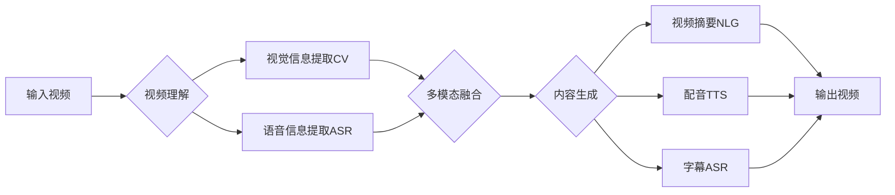

# AIGC从入门到实战：AI 赋能音频和视频创作，提升内容的传播价值

## 1.背景介绍
### 1.1 AIGC的兴起与发展
近年来,人工智能生成内容(AIGC)技术迅猛发展,在文本、图像、音频、视频等领域实现了从0到1的突破。尤其是在音视频领域,AIGC正在重塑内容生产方式,为音视频创作赋能,提升内容传播价值。

### 1.2 AIGC在音视频领域的应用现状
目前AIGC在音视频领域已有广泛应用,主要集中在以下几个方面:

- 智能配音:利用语音合成技术,自动生成各种风格的配音,大幅提升配音效率。
- 智能字幕:通过语音识别自动生成字幕,节省人工听打的时间成本。  
- 视频摘要:利用视频理解和自然语言处理,自动提取视频关键片段,快速生成预告和花絮。
- 虚拟主播:基于语音合成、人脸合成等技术,打造栩栩如生的虚拟主播形象。

### 1.3 AIGC赋能音视频创作的意义
AIGC为音视频内容创作带来诸多裨益:

- 提升创作效率:自动化流程替代了耗时费力的重复性工作,大幅缩短制作周期。
- 降低创作门槛:预制模板和智能工具使得非专业人士也能轻松创作出优质内容。  
- 丰富表现形式:多模态融合和风格迁移,催生出更加新颖多样的创意内容。
- 助力内容分发:根据平台和受众特点,智能化生成多样化的传播素材。

## 2.核心概念与联系
要理解AIGC在音视频领域的工作原理,需要先明确几个核心概念:

### 2.1 语音合成(Text-to-Speech,TTS)
即将输入的文本转化为逼真的语音,通过建模语音的韵律、音色等特征实现。其流程通常包括文本分析、语音合成、声码器等环节。

### 2.2 语音识别(Automatic Speech Recognition,ASR)  
将语音信号转换成相应的文本,需要通过声学模型和语言模型的结合来实现。

### 2.3 计算机视觉(Computer Vision,CV)
赋予机器对视觉信息的理解和处理能力,在视频领域主要应用于视频分析、目标检测与跟踪、人脸识别等。

### 2.4 自然语言处理(Natural Language Processing,NLP)
旨在实现人机之间用自然语言进行有效通信,在音视频场景下用于语音转写、视频摘要、问答系统等。

### 2.5 多模态学习(Multimodal Learning) 
融合视觉、听觉、语言等多种模态信息进行联合建模,挖掘不同模态间的语义联系,实现更全面、更准确的理解。

下图展示了上述核心概念在AIGC音视频处理流程中的作用:

## 3.核心算法原理具体操作步骤
AIGC在音视频处理中涉及多个环节,每个环节都有其特定的算法。下面以语音合成和视频摘要为例,详细讲解其核心算法原理和操作步骤。

### 3.1 语音合成
语音合成的目标是给定文本,生成自然流畅的语音。其主要分为两大步骤:

#### Step1:文本分析
对输入文本进行解析和标注,获取语言学特征,为后续语音合成提供依据。包括:

- 文本规范化:将数字、度量单位、特殊符号等非标准词转换为标准词。
- 分词和词性标注:将连续文本切分成有意义的词汇序列,并标注每个词的词性。  
- 语音单元划分:将词序列进一步细分为音节、音素等语音合成的基本单元。
- 韵律预测:预测合成语音的停顿、语调、节奏等韵律信息。

#### Step2:声学参数生成
根据文本分析获得的语言学特征,生成语音合成所需的声学参数,主要包括:

- 频谱参数:决定语音的音色和清晰度,通常采用Mel频率倒谱系数(MFCC)、线性预测系数(LPC)等。
- 基频参数:决定语音的音高和声调,使用基于统计参数的语音合成(SPSS)、神经网络声码器等生成。
- 时长参数:控制每个发音单元的持续时间,影响语音的节奏和流畅度。

#### Step3:语音合成
利用声学参数驱动声码器,生成最终的语音波形。常用的语音合成方法有:

- 拼接合成:将预先录制的语音片段拼接成连续语音,如PSOLA算法。
- 参数合成:根据声学参数生成语音波形,包括HMM合成、DNN合成等。
- 端到端合成:整合声学建模和声码器,直接由文本生成语音,代表工作如Tacotron、DeepVoice等。

### 3.2 视频摘要
视频摘要旨在自动提取视频的关键片段,生成简明扼要的预告或集锦。主要分为以下几个步骤:  

#### Step1:视频结构化
将视频转化为计算机可理解的结构化表示形式。常见的特征表示有:

- 帧级特征:color histogram、SIFT、HOG等。
- 镜头级特征:镜头边界、相机运动、景深等。
- 语义级特征:目标检测、场景分类、人脸识别等。

#### Step2:关键片段提取
从结构化的视频表示中识别出重要或具有代表性的片段。主要方法包括:

- 基于聚类的方法:如K-Means、层次聚类等,将相似镜头归为一类,每类中选取关键帧。
- 基于显著性的方法:通过视觉注意力模型预测每一帧的显著性,提取显著性较高的片段。

#### Step3:摘要生成
将提取出的关键片段按照一定的逻辑顺序组织成连贯的摘要。常见策略有:  

- 基于规则的方法:设计一系列启发式规则,如相似度、多样性等,优化挑选片段。
- 基于学习的方法:通过序列标注、强化学习等,建立片段重要性评分模型,自动学习提取规则。

#### Step4:后期合成
对提取出的摘要片段进行必要的后期处理,提升观感体验,如过渡特效、背景音乐等。

## 4.数学模型和公式详细讲解举例说明
在AIGC音视频处理中,很多环节都涉及复杂的数学模型,下面以语音识别的隐马尔可夫模型(HMM)为例进行详细讲解。

### 4.1 HMM的基本概念
HMM是一种统计模型,常用于描述一个隐含未知参数的马尔可夫过程。HMM由初始概率分布、状态转移概率分布以及观测概率分布确定。形式化定义如下:

设Q为所有可能的状态集合,V为所有可能的观测集合,则HMM可用五元组$\lambda=(S,V,\pi,A,B)$表示:

- $S=\{s_1,s_2,...,s_N\}$为N个状态的集合
- $V=\{v_1,v_2,...,v_M\}$为M个观测的集合  
- $\pi=(\pi_1,\pi_2,...,\pi_N)$为初始状态概率向量,其中$\pi_i=P(i_1=s_i),i=1,2,...,N$
- $A=\{a_{ij}\}$为状态转移概率矩阵,其中$a_{ij}=P(i_{t+1}=s_j|i_t=s_i),i,j=1,2,...,N$
- $B=\{b_j(k)\}$为观测概率矩阵,其中$b_j(k)=P(o_t=v_k|i_t=s_j),j=1,2,...,N;k=1,2,...,M$

### 4.2 HMM在语音识别中的应用
在语音识别任务中,音频信号首先被转化为一系列观测向量(如MFCC特征),然后使用HMM对观测序列进行建模,寻找最有可能生成该观测序列的状态序列,从而对应到音素或词汇。

以语音信号$O=\{o_1,o_2,...,o_T\}$,词汇$W=\{w_1,w_2,...,w_L\}$为例,语音识别的数学表达为:

$$\hat{W}=\arg\max_{W}P(W|O)$$

根据贝叶斯公式,可进一步表示为:

$$\hat{W}=\arg\max_{W}\frac{P(O|W)P(W)}{P(O)}=\arg\max_{W}P(O|W)P(W)$$

其中,$P(O|W)$由声学模型(HMM)计算,$P(W)$由语言模型(通常是N-gram)给出。

### 4.3 HMM的三个基本问题
在使用HMM时,通常需要解决三个基本问题:

#### 评估问题
给定模型$\lambda=(S,V,\pi,A,B)$和观测序列$O=\{o_1,o_2,...,o_T\}$,计算在该模型下观测序列出现的概率$P(O|\lambda)$。

前向-后向算法是一种高效的评估方法。定义前向概率$\alpha_t(i)$和后向概率$\beta_t(i)$如下:

$$\alpha_t(i)=P(o_1,o_2,...,o_t,i_t=s_i|\lambda)$$

$$\beta_t(i)=P(o_{t+1},o_{t+2},...,o_T|i_t=s_i,\lambda)$$

则$P(O|\lambda)$可表示为:

$$P(O|\lambda)=\sum_{i=1}^N\alpha_T(i)=\sum_{i=1}^N\pi_i\beta_1(i)$$

#### 解码问题
给定模型$\lambda=(S,V,\pi,A,B)$和观测序列$O=\{o_1,o_2,...,o_T\}$,找到最有可能生成观测序列的状态序列$I=\{i_1,i_2,...,i_T\}$。

维特比算法是一种常用的解码方法。定义在时刻t状态为$s_i$的最大概率为:

$$\delta_t(i)=\max_{i_1,i_2,...,i_{t-1}}P(i_t=s_i,i_{t-1},...,i_1,o_t,...,o_1|\lambda)$$

则最优状态序列$I^*$可通过反向回溯求得:

$$i_t^*=\arg\max_{1\leq i\leq N}\delta_t(i),t=T,T-1,...,1$$

#### 学习问题
给定观测序列$O=\{o_1,o_2,...,o_T\}$,估计模型参数$\lambda=(S,V,\pi,A,B)$,使得$P(O|\lambda)$最大。

Baum-Welch算法(即EM算法)通过迭代的方式估计参数。定义$\xi_t(i,j)$为给定模型$\lambda$和观测O,在时刻t处于状态$s_i$且在时刻t+1处于状态$s_j$的概率。$\gamma_t(i)$为给定模型$\lambda$和观测O,在时刻t处于状态$s_i$的概率。则有:

$$\xi_t(i,j)=\frac{\alpha_t(i)a_{ij}b_j(o_{t+1})\beta_{t+1}(j)}{\sum_{i=1}^N\sum_{j=1}^N\alpha_t(i)a_{ij}b_j(o_{t+1})\beta_{t+1}(j)}$$

$$\gamma_t(i)=\frac{\alpha_t(i)\beta_t(i)}{\sum_{j=1}^N\alpha_t(j)\beta_t(j)}$$

根据$\xi,\gamma$可对$\pi,A,B$进行重估,不断迭代直至收敛。

## 5.项目实践：代码实例和详细解释说明
下面以PyTorch实现一个简单的语音合成模型Tacotron2为例,对AIGC在音视