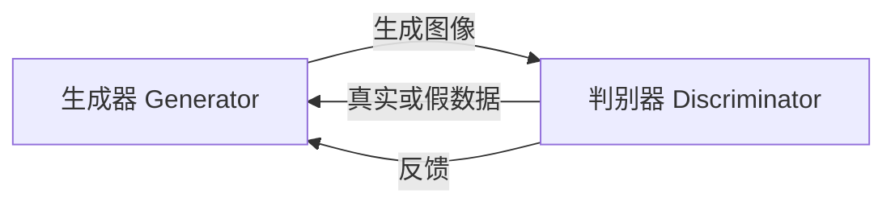
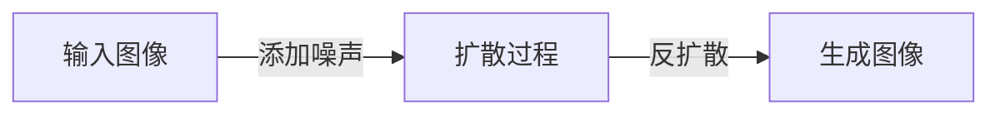
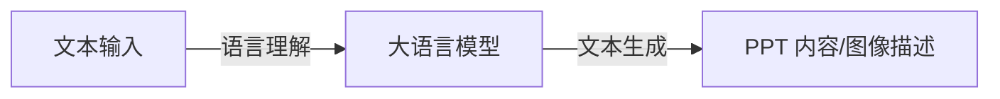
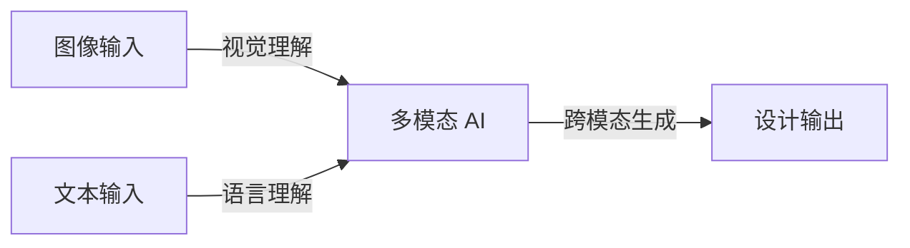

# AIGC从入门到实战：AI 辅助设计：基于 AI 生成图像和 PPT 的创意设计

## 1.背景介绍

### 1.1 AIGC 时代的到来

随着人工智能(AI)和生成式人工智能(Generative AI)技术的不断进化,AIGC(AI Generated Content,AI生成内容)正在改变着我们的工作和生活方式。AIGC指的是利用人工智能算法生成的各种形式的内容,包括文本、图像、视频、音频等。在过去的几年里,AIGC已经在多个领域取得了长足的进步,为创意设计领域带来了全新的机遇和挑战。

### 1.2 创意设计的重要性

在当今快节奏的商业环境中,创意设计扮演着至关重要的角色。无论是品牌推广、产品营销还是内容创作,出色的视觉呈现都能帮助企业和个人更好地吸引目标受众、传达信息并留下深刻印象。然而,传统的设计流程往往耗时耗力,需要设计师投入大量的时间和精力。

### 1.3 AI 辅助设计的优势

AI 辅助设计将人工智能技术与创意设计相结合,旨在提高设计效率、降低制作成本并激发创新思维。通过利用 AI 生成图像和 PPT 等功能,设计师可以快速创建出高质量的视觉内容,从而腾出更多时间专注于创意探索和细节优化。同时,AI 也能为设计师提供新颖的灵感和建议,帮助他们打破思维定式,创造出更加独特和吸引人的作品。

## 2.核心概念与联系

### 2.1 生成式对抗网络 (Generative Adversarial Networks, GANs)

生成式对抗网络(GANs)是一种基于深度学习的生成模型,由两个神经网络组成:生成器(Generator)和判别器(Discriminator)。生成器的目标是生成逼真的数据样本(如图像),而判别器则试图区分生成的数据和真实数据。通过不断训练和对抗,两个网络相互促进,最终使生成器能够生成高度逼真的数据。GANs 在图像生成领域取得了卓越的成就,是 AI 生成图像的核心技术之一。

### 2.2 扩散模型 (Diffusion Models)

扩散模型是另一种用于生成高质量图像的先进技术。它通过一系列的扩散和反扩散步骤来生成图像。在扩散过程中,模型将随机噪声逐步添加到输入图像中,直到图像完全被噪声覆盖。然后,在反扩散过程中,模型学习如何从纯噪声中重建原始图像。扩散模型能够生成非常逼真和细致的图像,在保持图像质量的同时具有更好的样本多样性。

### 2.3 大语言模型 (Large Language Models, LLMs)

大语言模型是一种基于自然语言处理(NLP)技术的人工智能模型,能够理解和生成人类可读的文本。LLMs 通过在海量文本数据上进行训练,学习到了丰富的语言知识和上下文理解能力。在 AI 辅助设计中,LLMs 可以用于生成 PPT 内容、图像描述和标题等,为设计师提供有价值的文本输入。

### 2.4 多模态 AI (Multimodal AI)

多模态 AI 是一种能够处理和生成多种形式数据(如文本、图像、视频等)的人工智能系统。它将不同的模态(如视觉和语言)进行融合,实现跨模态的理解和生成。在 AI 辅助设计中,多模态 AI 可以同时处理图像和文本信息,为设计师提供更加全面和智能的辅助。

## 3.核心算法原理具体操作步骤

### 3.1 生成式对抗网络 (GANs) 原理

GANs 由生成器和判别器两个神经网络组成,它们相互对抗以达到生成高质量图像的目标。具体操作步骤如下:

1. **初始化生成器和判别器网络**:随机初始化两个网络的权重参数。
2. **生成器生成图像**:生成器从随机噪声输入开始,生成一批假图像样本。
3. **判别器判别真伪**:判别器接收生成器生成的假图像和真实图像作为输入,并对它们进行真伪分类。
4. **计算损失函数**:根据判别器的输出计算生成器和判别器的损失函数。
5. **反向传播和优化**:使用反向传播算法计算梯度,并使用优化算法(如 Adam)更新生成器和判别器的权重参数。
6. **重复训练**:重复步骤 2-5,直到生成器能够生成逼真的图像,判别器无法很好地区分真伪。

在训练过程中,生成器和判别器相互对抗,生成器试图生成足以欺骗判别器的逼真图像,而判别器则努力区分真伪图像。通过这种对抗性训练,生成器最终能够生成高质量的图像。

### 3.2 扩散模型原理

扩散模型通过一系列扩散和反扩散步骤来生成图像,具体操作步骤如下:

1. **扩散过程**:将随机噪声逐步添加到输入图像中,直到图像完全被噪声覆盖。这个过程可以用一个马尔可夫链来建模,每一步都会增加一些噪声。
2. **训练反扩散模型**:使用监督学习训练一个神经网络模型,该模型可以从纯噪声图像开始,逐步去除噪声并重建原始图像。
3. **反扩散过程**:使用训练好的反扩散模型,从纯噪声图像开始,逐步去除噪声并生成最终的图像。
4. **引导过程(可选)**:在反扩散过程中,可以引入额外的条件信息(如文本描述或类别标签)来指导图像生成,从而生成具有特定语义或风格的图像。

扩散模型的关键在于能够学习到从噪声到图像的映射,并在反扩散过程中逐步重建出高质量的图像。通过引导过程,扩散模型还可以生成具有特定语义或风格的图像。

### 3.3 大语言模型 (LLMs) 原理

大语言模型通过在海量文本数据上进行预训练,学习到丰富的语言知识和上下文理解能力。它们可以用于生成各种形式的文本内容,如 PPT 内容、图像描述等。具体操作步骤如下:

1. **预训练**:在大规模文本语料库上使用自监督学习方法(如掩码语言模型)对大型神经网络进行预训练,学习到通用的语言表示能力。
2. **微调**:根据具体的下游任务(如文本生成、问答等),使用少量标注数据对预训练模型进行微调,使其更好地适应特定任务。
3. **文本生成**:使用微调后的模型,通过给定一个起始文本或提示,模型可以自动生成连贯、流畅的文本内容。
4. **条件生成(可选)**:在生成过程中,可以引入额外的条件信息(如主题、风格等),使模型生成的文本满足特定需求。

大语言模型的优势在于能够捕捉到丰富的语言知识和上下文信息,从而生成高质量、连贯的文本内容。通过微调和条件生成,LLMs 可以适应不同的下游任务和需求。

## 4.数学模型和公式详细讲解举例说明

### 4.1 生成式对抗网络 (GANs) 数学模型

GANs 的数学模型可以表示为一个极小极大游戏,生成器 G 和判别器 D 相互对抗,目标是找到一个纳什均衡点。具体表达式如下:

$$\min_G \max_D V(D, G) = \mathbb{E}_{x \sim p_{\text{data}}(x)}[\log D(x)] + \mathbb{E}_{z \sim p_z(z)}[\log (1 - D(G(z)))]$$

其中:

- $G(z)$ 是生成器网络,将随机噪声 $z$ 映射到生成的图像。
- $D(x)$ 是判别器网络,输出一个概率值,表示输入 $x$ 是真实图像的可能性。
- $p_{\text{data}}(x)$ 是真实图像数据的分布。
- $p_z(z)$ 是随机噪声的分布,通常为高斯分布或均匀分布。

在训练过程中,生成器 G 试图最小化 $\log (1 - D(G(z)))$,即生成足以欺骗判别器的逼真图像;而判别器 D 则试图最大化 $\log D(x)$ 和 $\log (1 - D(G(z)))$,即正确识别真实图像和生成图像。

通过不断优化这个极小极大游戏,生成器和判别器相互促进,最终达到纳什均衡,生成器能够生成逼真的图像。

### 4.2 扩散模型数学模型

扩散模型的数学模型基于马尔可夫链,描述了从原始图像到纯噪声图像的扩散过程。具体表达式如下:

$$q(x_t|x_0) = \mathcal{N}(x_t; \sqrt{1 - \beta_t} x_0, \beta_t I)$$

其中:

- $x_0$ 是原始图像。
- $x_t$ 是在时间步 $t$ 时的噪声图像。
- $\beta_t$ 是一个小的正常数,控制每一步添加的噪声量。
- $\mathcal{N}(\mu, \Sigma)$ 表示均值为 $\mu$,协方差矩阵为 $\Sigma$ 的高斯分布。

在反扩散过程中,我们需要学习一个反向过程 $p_\theta(x_{t-1}|x_t)$,从噪声图像 $x_t$ 重建出 $x_{t-1}$,直到最终重建出原始图像 $x_0$。这个反向过程可以通过最小化以下损失函数来优化:

$$\mathbb{E}_{x_0} \left[\left\lVert x_0 - x_T \right\rVert^2\right]$$

其中 $x_T$ 是通过反扩散过程生成的最终图像。

通过优化这个损失函数,扩散模型可以学习到从噪声到图像的映射,并在反扩散过程中逐步重建出高质量的图像。

### 4.3 大语言模型 (LLMs) 数学模型

大语言模型通常基于自注意力机制和Transformer架构,能够有效捕捉长距离依赖关系。其中,自注意力机制是核心组件之一,用于计算输入序列中每个位置的表示。具体公式如下:

$$\text{Attention}(Q, K, V) = \text{softmax}\left(\frac{QK^T}{\sqrt{d_k}}\right)V$$

其中:

- $Q$ 是查询矩阵(Query)。
- $K$ 是键矩阵(Key)。
- $V$ 是值矩阵(Value)。
- $d_k$ 是缩放因子,用于防止内积过大导致梯度消失。

自注意力机制通过计算查询和键之间的相似性,对值进行加权求和,从而捕捉到输入序列中的重要信息。

在语言模型中,通常使用掩码语言模型(Masked Language Model)的目标函数进行预训练,目标是预测被掩码的词。具体表达式如下:

$$\mathcal{L}_{\text{MLM}} = -\mathbb{E}_{x \sim X} \left[\sum_{i \in \text{mask}} \log P(x_i|x_{\back