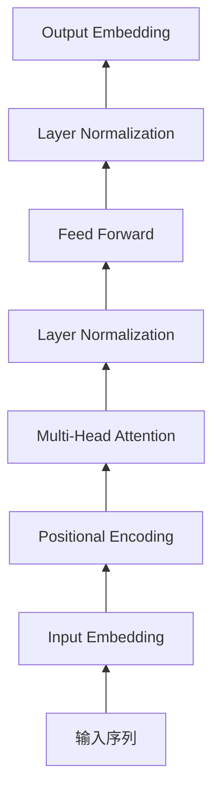

# AIGC从入门到实战：ChatGPT 提升程序员编写代码和设计算法的效率

## 1.背景介绍
### 1.1 AIGC的兴起
近年来,人工智能生成内容(AIGC)技术迅猛发展,从图像生成到自然语言处理,AIGC正在改变着各行各业。尤其是在软件开发领域,AIGC工具如ChatGPT的出现,为程序员编写代码和设计算法带来了新的可能性。

### 1.2 ChatGPT的优势
ChatGPT作为一款基于海量代码和自然语言训练的大型语言模型,具有惊人的代码生成和算法设计能力。它可以根据用户的需求,快速生成高质量的代码片段,提供算法思路,甚至优化现有代码。这为程序员提高开发效率,降低技术门槛提供了有力的工具支持。

### 1.3 本文的目的
本文将深入探讨ChatGPT在编程领域的应用,介绍其核心原理和使用方法,并通过实际案例演示如何利用ChatGPT辅助编码和算法设计。同时,也会讨论AIGC技术在软件开发中的局限性和未来发展方向。

## 2.核心概念与联系
### 2.1 AIGC的定义与分类
AIGC泛指利用人工智能技术自动生成各类内容的方法,主要包括文本、图像、音频、视频等。按照生成方式可分为:
- 基于规则的生成方法
- 基于检索的生成方法  
- 基于生成式模型的方法

### 2.2 ChatGPT的原理
ChatGPT属于基于生成式模型的AIGC,其核心是Transformer神经网络架构下的自回归语言模型。通过海量文本数据的预训练,ChatGPT学会了自然语言和编程语言的语法、语义和逻辑,从而具备了代码生成能力。

### 2.3 ChatGPT与传统编程的区别
传统编程依赖程序员掌握编程语言和算法知识,手动编写代码实现功能。而ChatGPT可以根据用户的自然语言描述,自动生成对应的代码。这种人机交互方式降低了编程门槛,提高了开发效率。但ChatGPT生成的代码仍需要人工审核和修改。

### 2.4 ChatGPT在编程中的应用场景
- 代码补全与生成
- 代码解释与文档生成
- 算法设计与优化
- 代码调试与错误修复
- 编程知识问答与学习

## 3.核心算法原理与操作步骤
### 3.1 Transformer 神经网络架构
ChatGPT基于Transformer架构,其特点是:
1. 使用自注意力机制处理输入序列
2. 抛弃了RNN/CNN等结构,计算并行度高
3. 引入位置编码表示序列中元素的位置信息

Transformer的基本结构如下:



### 3.2 预训练和微调
ChatGPT采用了预训练+微调的范式:
1. 在大规模文本语料上进行无监督预训练,学习通用语言知识
2. 在下游任务的标注数据上进行有监督微调,适应特定任务

预训练阶段一般使用自回归语言模型或掩码语言模型等目标函数,微调阶段根据任务不同可选择分类、生成等不同的目标函数和神经网络层。

### 3.3 ChatGPT的推理生成过程
ChatGPT根据输入的自然语言Query,通过以下步骤生成代码:
1. 对Query进行编码,生成初始隐向量
2. 重复执行Transformer的解码块,根据已生成的Token预测下一个Token
3. 选择概率最大的Token作为新生成的内容,加入到原有的序列中
4. 重复步骤2、3,直到生成结束标记或达到最大长度

生成过程伪代码如下:

```python
def generate(model, query, max_len):
    output = []
    hidden_state = encode(query)
    for i in range(max_len):
        probs = decode(hidden_state)
        new_token = sample(probs)
        if new_token == END_TOKEN:
            break
        output.append(new_token)
        hidden_state = update_hidden(hidden_state, new_token)
    return output
```

## 4.数学模型和公式详解
### 4.1 Transformer的数学表示
假设输入序列为 $\mathbf{x}=(x_1,\ldots,x_n)$,Transformer的编码器将其映射为隐向量序列 $\mathbf{z}=(z_1,\ldots,z_n)$:

$$
\mathbf{z} = \text{Encoder}(\mathbf{x})
$$

其中编码器可以表示为 $L$ 个相同的层堆叠:

$$
\text{Encoder}(\mathbf{x}) = \text{Encoder}_L(\ldots(\text{Encoder}_1(\mathbf{x})))
$$

每一层的计算过程为:

$$
\begin{aligned}
\mathbf{h} &= \text{LayerNorm}(\mathbf{x} + \text{MultiHead}(\mathbf{x}, \mathbf{x}, \mathbf{x})) \\
\mathbf{z} &= \text{LayerNorm}(\mathbf{h} + \text{FeedForward}(\mathbf{h}))
\end{aligned}
$$

其中 $\text{MultiHead}$ 为多头自注意力机制:

$$
\text{MultiHead}(\mathbf{q},\mathbf{k},\mathbf{v}) = \text{Concat}(\text{head}_1,\ldots,\text{head}_h)W^O
$$

每一个头 $\text{head}_i$ 的计算为:

$$
\text{head}_i = \text{Attention}(\mathbf{q}W_i^Q, \mathbf{k}W_i^K, \mathbf{v}W_i^V)
$$

$\text{Attention}$ 使用缩放点积注意力:

$$
\text{Attention}(\mathbf{q},\mathbf{k},\mathbf{v}) = \text{softmax}(\frac{\mathbf{q}\mathbf{k}^T}{\sqrt{d_k}})\mathbf{v}
$$

$\text{FeedForward}$ 由两层全连接网络组成:

$$
\text{FeedForward}(\mathbf{x}) = \text{ReLU}(\mathbf{x}W_1 + \mathbf{b}_1)W_2 + \mathbf{b}_2
$$

### 4.2 自回归语言模型
ChatGPT预训练阶段使用自回归语言模型,给定前 $t-1$ 个Token $\mathbf{x}_{<t}$,预测第 $t$ 个Token $x_t$ 的概率:

$$
p(x_t|\mathbf{x}_{<t}) = \text{softmax}(\text{Decoder}(\mathbf{x}_{<t}))
$$

模型参数 $\theta$ 通过最大化如下似然函数来训练:

$$
\mathcal{L}(\theta) = \sum_{t=1}^T \log p_\theta(x_t|\mathbf{x}_{<t})
$$

### 4.3 微调阶段的目标函数
微调阶段根据下游任务的不同,可以选择不同的目标函数。以代码生成任务为例,目标是最大化生成代码 $\mathbf{y}$ 的条件概率:

$$
p(\mathbf{y}|\mathbf{x}) = \prod_{t=1}^T p(y_t|\mathbf{y}_{<t},\mathbf{x})
$$

其中 $\mathbf{x}$ 为自然语言Query,$\mathbf{y}$ 为生成的代码序列。模型参数 $\theta$ 通过最小化以下交叉熵损失来微调:

$$
\mathcal{L}(\theta) = -\sum_{t=1}^T \log p_\theta(y_t|\mathbf{y}_{<t},\mathbf{x})
$$

## 5.项目实践:代码实例和详解
下面我们通过一个简单的Python项目,演示如何使用ChatGPT辅助编程。该项目实现了一个基本的Todo应用,具有添加、删除、查看待办事项等功能。

### 5.1 定义Todo类
首先,我们利用ChatGPT生成Todo类的代码。给ChatGPT输入如下Query:

> 请用Python定义一个Todo类,包含id、content、status三个属性,以及add_todo、remove_todo、list_todos三个方法。

ChatGPT生成的代码如下:

```python
class Todo:
    def __init__(self):
        self.todos = []

    def add_todo(self, todo_id, content):
        todo = {"id": todo_id, "content": content, "status": "incomplete"}
        self.todos.append(todo)
        print(f"Added todo: {todo}")

    def remove_todo(self, todo_id):
        for todo in self.todos:
            if todo["id"] == todo_id:
                self.todos.remove(todo)
                print(f"Removed todo: {todo}")
                return
        print(f"Todo with id {todo_id} not found.")

    def list_todos(self):
        print("Todo List:")
        for todo in self.todos:
            print(f"ID: {todo['id']}, Content: {todo['content']}, Status: {todo['status']}")
```

我们可以看到,ChatGPT准确地生成了符合要求的Todo类,包含了必要的属性和方法。但是这里的代码还比较简单,我们可以进一步优化。

### 5.2 优化Todo类
接下来我们请教ChatGPT如何改进上面的代码,让它更加健壮和灵活。我们输入Query:

> 上面的Todo类还比较简陋,请给出改进建议,让它支持更多操作,并优化数据结构。

ChatGPT给出了如下优化建议:

1. 使用字典而不是列表来存储todos,以便更高效地通过id查找和删除todo。
2. 添加更新todo状态的方法,如mark_complete和mark_incomplete。
3. 添加按状态过滤todos的方法,如list_completed_todos和list_incomplete_todos。
4. 在add_todo时检查id是否已存在,避免重复。
5. 添加从文件读取和保存todos的方法,实现数据持久化。

根据这些建议,我们完善后的Todo类如下:

```python
import json

class Todo:
    def __init__(self):
        self.todos = {}

    def add_todo(self, todo_id, content):
        if todo_id in self.todos:
            print(f"Todo with id {todo_id} already exists.")
        else:
            todo = {"id": todo_id, "content": content, "status": "incomplete"}
            self.todos[todo_id] = todo
            print(f"Added todo: {todo}")

    def remove_todo(self, todo_id):
        if todo_id in self.todos:
            removed_todo = self.todos.pop(todo_id)
            print(f"Removed todo: {removed_todo}")
        else:
            print(f"Todo with id {todo_id} not found.")

    def update_todo_status(self, todo_id, status):
        if todo_id in self.todos:
            self.todos[todo_id]["status"] = status
            print(f"Updated todo {todo_id} status to {status}")
        else:
            print(f"Todo with id {todo_id} not found.")

    def list_todos(self, status=None):
        print("Todo List:")
        for todo in self.todos.values():
            if status is None or todo["status"] == status:
                print(f"ID: {todo['id']}, Content: {todo['content']}, Status: {todo['status']}")

    def save_todos(self, filename):
        with open(filename, "w") as file:
            json.dump(self.todos, file)
        print(f"Saved todos to {filename}")

    def load_todos(self, filename):
        try:
            with open(filename, "r") as file:
                self.todos = json.load(file)
            print(f"Loaded todos from {filename}")
        except FileNotFoundError:
            print(f"File {filename} not found. Starting with empty todo list.")
```

可以看到,在ChatGPT的帮助下,我们显著改进了Todo类的功能和代码质量。

### 5.3 实现Todo应用
最后,我们利用完善后的Todo类,编写一个简单的交互式Todo应用。我们让ChatGPT生成主程序代码:

> 利用上面优化后的Todo类,编写一个交互式的命令行Todo应用,支持添加、删除、更新、查看待办事项,以及保存和加载数据。

ChatGPT生成的主程序代码如下:

```python
def main():
    todo_list = Todo()
    todo_list.load_todos("todos.json")

    while True:
        print("\nWhat would you like to do?")
        print("1. Add a new todo")
        print("2. Remove a todo")
        print("3. Update a todo status")
        print("4. List all todos")
        print("5. List completed todos")
        print("6. List incomplete todos")
        print("7. Save todos")
        print("8. Quit")

        choice = input("Enter your choice (1-