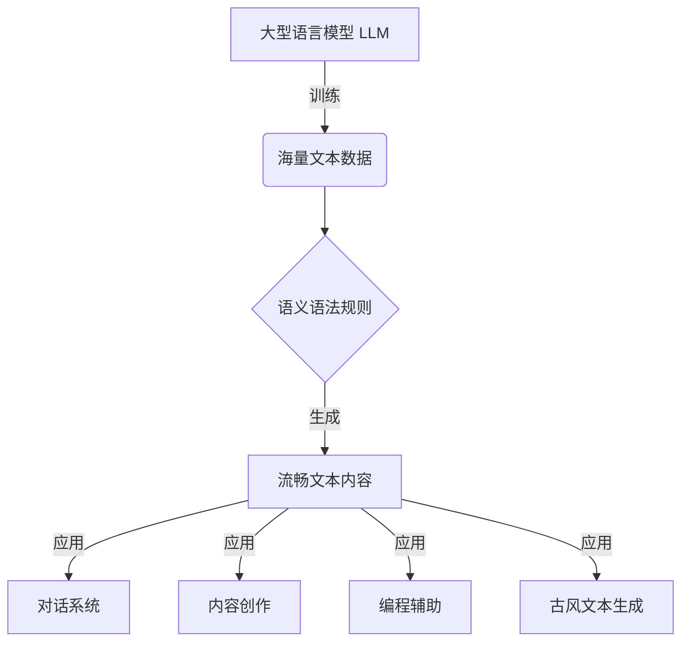
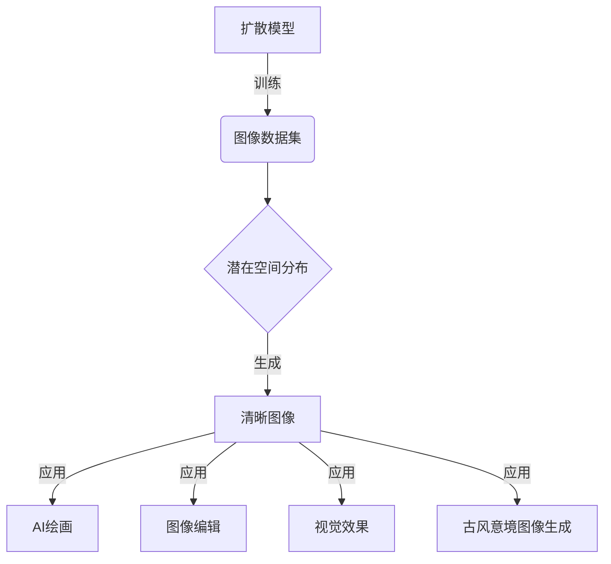

# AIGC从入门到实战：ChatGPT+Midjourney，绘出中国古风意境之美

## 1. 背景介绍

### 1.1 人工智能生成内容(AIGC)的兴起

近年来,人工智能生成内容(Artificial Intelligence Generated Content, AIGC)技术迅猛发展,引领了一场全新的创作革命。AIGC技术利用深度学习等人工智能算法,可以生成高质量的文本、图像、音频和视频等多种形式的内容。

在文本生成领域,OpenAI推出的ChatGPT大型语言模型掀起了一股热潮。它能够生成流畅自然的文本内容,在写作、问答、编程等多个领域展现出卓越的能力。同时,在图像生成领域,Midjourney等基于扩散模型的AI工具也日渐走红,能够根据文本描述生成逼真的图像,为创作者提供了强大的视觉辅助。

### 1.2 中国古风文化的魅力

中国古风文化源远流长,蕴含着丰富的历史底蕴和深刻的哲学智慧。古风意境不仅体现在诗词歌赋、书画篆刻等传统艺术形式中,也渗透到了建筑、服饰、生活方式等各个层面。这种独特的审美风格,以其细腻含蓄、意境优雅而备受推崇。

在当代,中国古风文化正经历着一次全新的文化复兴。越来越多的年轻人开始重新审视和热衷于这种传统文化。AIGC技术的兴起,为探索和再现中国古风意境提供了新的创作工具和表现形式。

### 1.3 AIGC与中国古风文化的融合

AIGC技术与中国古风文化的结合,孕育了无限的创作可能性。通过ChatGPT等语言模型,我们可以生成富有古风韵味的诗词歌赋;利用Midjourney等图像生成工具,可以将古典意象视觉化,重现古风景致。

这种融合不仅为传统文化注入了新的活力,也为AIGC技术提供了宝贵的创作素材。通过学习和模拟古典文本和艺术作品,AIGC模型能够更好地理解和生成富有古风气质的内容。

本文将探讨如何利用ChatGPT和Midjourney这两款AIGC工具,从入门到实战,绘制出富有中国古风意境之美的文本和图像作品,助力古风文化在新时代的传承和创新。

## 2. 核心概念与联系

在深入探讨AIGC技术与中国古风文化融合之前,我们需要了解一些核心概念及其内在联系。

### 2.1 大型语言模型(Large Language Model, LLM)

大型语言模型是一种基于深度学习的自然语言处理(NLP)模型,通过在海量文本数据上进行训练,学习语言的语义和语法规则。经过训练后,LLM能够生成流畅、连贯的文本内容,并具备一定的理解和推理能力。

ChatGPT就是一款基于GPT-3.5架构的大型语言模型,它能够根据给定的提示生成高质量的文本输出,包括但不限于对话、写作、编程等多种形式。在生成中国古风文本方面,LLM可以模拟古典文献的语言风格,创作出富有古韵的诗词歌赋等作品。



### 2.2 扩散模型(Diffusion Model)

扩散模型是一种用于生成图像的深度学习模型,它通过学习图像的潜在空间分布,逐步从噪声中"扩散"出清晰的图像。与基于GAN(生成对抗网络)的图像生成模型不同,扩散模型在训练过程中不需要对抗性训练,更加稳定且生成质量更高。

Midjourney就是一款基于扩散模型的AI绘画工具。用户只需输入文本描述,Midjourney就能生成相应的图像输出。在生成中国古风意境图像时,扩散模型能够捕捉文本描述中的关键词和语义,并将其转化为视觉元素,重现古典意境。



### 2.3 AIGC与中国古风文化的内在联系

AIGC技术与中国古风文化之间存在内在的联系:

1. **创作灵感**:古典文献和艺术作品蕴含着丰富的意境和情怀,可以为AIGC模型提供宝贵的创作素材和灵感来源。
2. **文化传承**:AIGC技术为古风文化注入了新的活力,使其能够以全新的形式呈现,助力文化传承与创新。
3. **审美追求**:中国古风文化追求意境优雅、含蓄内敛的审美风格,与AIGC技术生成的作品所追求的艺术性和创造力不谋而合。

通过将AIGC技术与中国古风文化相结合,我们可以实现创新与传统的完美融合,开拓全新的创作维度。

## 3. 核心算法原理具体操作步骤

### 3.1 ChatGPT:大型语言模型的原理

ChatGPT是一款基于GPT-3.5架构的大型语言模型,其核心算法原理可以概括为以下几个步骤:

1. **数据预处理**:首先对海量文本数据进行清洗和预处理,将其转换为模型可以识别的token序列。
2. **模型训练**:使用自监督学习方法(如掩码语言模型)在预处理后的数据上训练transformer模型,学习语言的语义和语法规则。
3. **上下文编码**:将输入的文本转换为token序列,并与模型的位置编码相结合,形成上下文表示。
4. **transformer解码**:上下文表示通过transformer的多头注意力机制和前馈神经网络进行解码,生成下一个token的概率分布。
5. **token生成**:根据概率分布采样或贪婪搜索生成下一个token,重复该过程直至生成完整的文本输出。

在生成中国古风文本时,ChatGPT会模拟古典文献的语言风格,生成富有古韵的诗词歌赋等作品。

### 3.2 Midjourney:扩散模型的原理

Midjourney是一款基于扩散模型的AI绘画工具,其核心算法原理可以概括为以下几个步骤:

1. **噪声注入**:首先将一张纯噪声图像作为起点,注入到潜在空间中。
2. **文本编码**:将用户输入的文本描述通过CLIP(对比语言图像预训练)模型编码为向量表示。
3. **扩散过程**:通过一系列的扩散步骤,将噪声图像逐渐"扩散"为清晰的图像,同时将文本编码作为条件,引导图像生成过程。
4. **反向扩散**:在扩散过程的基础上,进行反向扩散,从噪声中重建出清晰的图像。
5. **图像输出**:经过多次迭代后,模型输出满足文本描述的最终图像。

在生成中国古风意境图像时,Midjourney会捕捉文本描述中的关键词和语义,并将其转化为视觉元素,如古建筑、山水画卷、传统服饰等,重现古典意境。

## 4. 数学模型和公式详细讲解举例说明

### 4.1 大型语言模型:自注意力机制

自注意力机制是transformer模型中的核心组件,它允许模型在生成token时充分利用输入序列中的上下文信息。自注意力机制的数学表达式如下:

$$
\text{Attention}(Q, K, V) = \text{softmax}\left(\frac{QK^T}{\sqrt{d_k}}\right)V
$$

其中:

- $Q$表示查询(Query)向量
- $K$表示键(Key)向量
- $V$表示值(Value)向量
- $d_k$是缩放因子,用于防止点积过大导致梯度消失

自注意力机制首先计算查询向量与所有键向量的点积,经过缩放和softmax函数得到注意力分数。然后将注意力分数与值向量相乘,得到上下文表示。这种机制允许模型动态地关注输入序列中的不同部分,捕捉长距离依赖关系。

在生成中国古风文本时,自注意力机制可以帮助模型更好地理解和模拟古典文献中的语言特征,如词语的典雅用法、句式的对仗工整等。

### 4.2 扩散模型:扩散过程

扩散模型的核心是扩散过程,它将清晰的图像逐步"扩散"为纯噪声,再通过反向扩散重建出图像。扩散过程的数学表达式如下:

$$
q(\mathbf{x}_t|\mathbf{x}_0) = \mathcal{N}(\mathbf{x}_t; \sqrt{\bar{\alpha}_t}\mathbf{x}_0, (1-\bar{\alpha}_t)\mathbf{I})
$$

其中:

- $\mathbf{x}_0$是原始清晰图像
- $\mathbf{x}_t$是在时刻$t$扩散后的噪声图像
- $\alpha_t$是一个随时间变化的扩散系数,控制噪声的强度
- $\bar{\alpha}_t = \prod_{i=1}^t \alpha_i$表示从时刻0到时刻$t$的累积扩散系数

扩散过程通过不断添加高斯噪声,将清晰图像逐步"扩散"为纯噪声。在反向扩散阶段,模型需要从噪声中重建出原始图像,这是一个由条件概率密度$p_\theta(\mathbf{x}_{t-1}|\mathbf{x}_t)$描述的过程。

在生成中国古风意境图像时,扩散模型可以捕捉文本描述中的关键词和语义,并将其转化为视觉元素,如古建筑、山水画卷、传统服饰等,重现古典意境。通过调节扩散系数,模型可以控制图像的细节程度和噪声强度,实现风格迁移和图像编辑等效果。

## 5. 项目实践:代码实例和详细解释说明

### 5.1 使用ChatGPT生成中国古风诗词

我们可以通过提供一些关键词或主题,让ChatGPT生成富有古风韵味的诗词作品。以下是一个示例:

```python
import openai

# 设置API密钥
openai.api_key = "YOUR_API_KEY"

# 定义生成诗词的函数
def generate_poem(topic, style):
    prompt = f"请以{style}的风格,创作一首关于{topic}的古风诗词。"
    response = openai.Completion.create(
        engine="text-davinci-003",
        prompt=prompt,
        max_tokens=200,
        n=1,
        stop=None,
        temperature=0.7,
    )
    poem = response.choices[0].text.strip()
    return poem

# 生成一首关于春天的古风词牌
topic = "春天"
style = "词牌"
poem = generate_poem(topic, style)
print(poem)
```

在这个示例中,我们首先导入OpenAI的Python库,并设置API密钥。然后定义了一个`generate_poem`函数,它接受两个参数:`topic`(主题)和`style`(风格)。

函数内部,我们构建了一个提示(`prompt`)字符串,指定要生成的诗词主题和风格。接着,我们使用OpenAI的`Completion.create`方法调用ChatGPT模型,传入提示和一些参数,如最大token数、生成数量、停止条件和温度(控制输出的随机性)。

最后,模型生成的诗词作品被存储在`response.choices[0].text`中,我们将其打印出来。

通过调整提示和参数,我们可以生成各种风格的古风诗词作品,