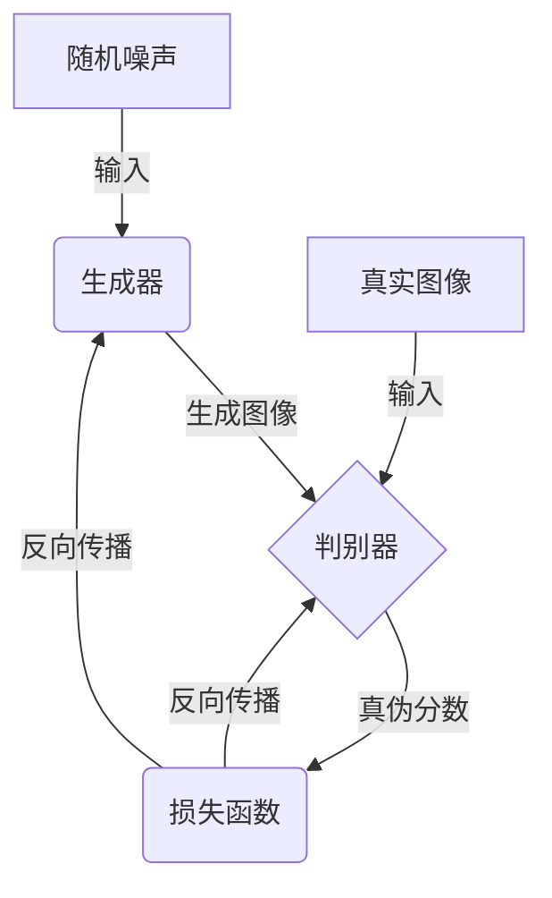
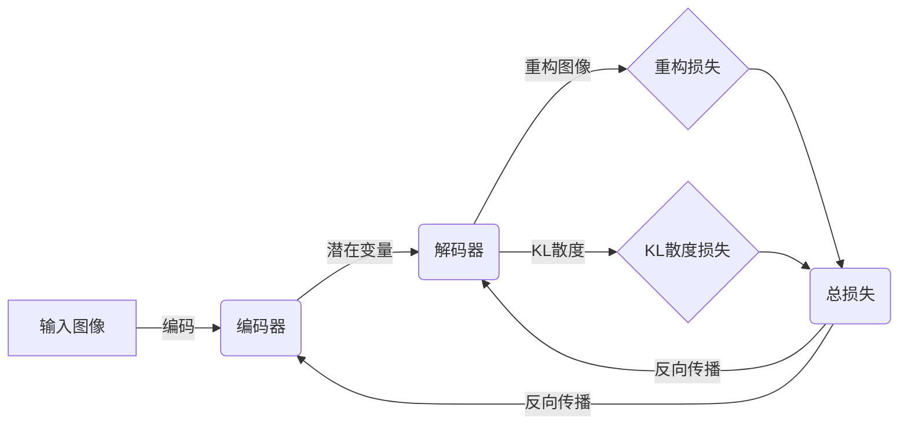
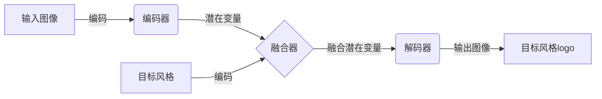
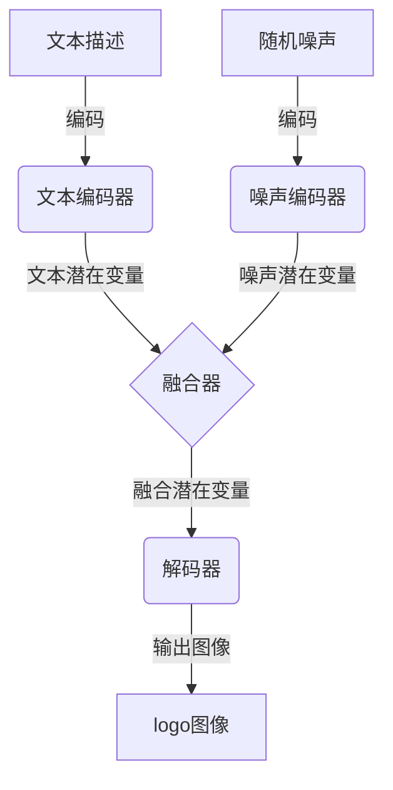

# AIGC从入门到实战：多快好省搞定各种风格的logo设计

## 1.背景介绍

### 1.1 logo设计的重要性

logo作为品牌的视觉标识,在企业营销和品牌推广中扮演着至关重要的角色。一个精心设计的logo不仅能够体现企业的理念和价值观,还能够增强品牌识别度,为企业树立专业形象。随着市场竞争的日趋白热化,拥有一个出色的logo设计已经成为企业赢得竞争优势的关键因素之一。

### 1.2 传统logo设计的挑战

传统的logo设计过程通常需要耗费大量的人力和时间成本。设计师需要不断地绘制草图、修改设计,并与客户进行多轮沟通和反馈,这个过程往往漫长而且效率低下。此外,传统logo设计也存在着创意枯竭、风格单一等问题,很难满足不同客户的个性化需求。

### 1.3 AIGC技术的兴起

近年来,人工智能生成式内容(AIGC)技术的快速发展为logo设计带来了全新的机遇。AIGC技术能够利用深度学习算法从海量数据中学习,生成高质量的图像、文本、音频等内容,大大提高了内容生产的效率和质量。在logo设计领域,AIGC技术可以帮助设计师快速生成多种风格的logo草案,缩短设计周期,激发创意灵感,从而满足不同客户的个性化需求。

## 2.核心概念与联系

### 2.1 生成对抗网络(GAN)

生成对抗网络(Generative Adversarial Networks, GAN)是AIGC技术中最核心的概念之一。GAN由两个神经网络组成:生成器(Generator)和判别器(Discriminator)。生成器的任务是从随机噪声中生成逼真的图像,而判别器的任务是区分生成器生成的图像和真实图像。通过不断地对抗训练,生成器和判别器相互促进,最终生成器能够生成高质量的图像。

### 2.2 变分自编码器(VAE)

变分自编码器(Variational Autoencoder, VAE)是另一种常用的生成模型。VAE由编码器(Encoder)和解码器(Decoder)两部分组成。编码器将输入图像编码为潜在变量,解码器则从潜在变量中重构出图像。通过最小化重构损失和KL散度损失,VAE能够学习数据的潜在分布,并从中生成新的图像。

### 2.3 图像到图像翻译

图像到图像翻译(Image-to-Image Translation)是AIGC技术在logo设计中的一种重要应用。它能够将一种风格的图像转换为另一种风格,例如将素描转换为彩色图像、将照片转换为油画风格等。在logo设计中,我们可以利用这一技术将草图或简单的图形转换为逼真的logo设计。

### 2.4 文本到图像生成

文本到图像生成(Text-to-Image Generation)则是另一种常见的AIGC应用,它能够根据文本描述生成相应的图像。在logo设计中,我们可以输入文本描述,例如"一个绿色的环形logo,中间有一棵树",然后生成对应的logo图像。这种方式能够大大提高logo设计的效率,激发设计师的创意灵感。

## 3.核心算法原理具体操作步骤

### 3.1 GAN训练过程

1. **初始化生成器和判别器网络**：首先需要定义生成器和判别器的网络架构,通常使用卷积神经网络。
2. **加载训练数据**：准备大量的真实logo图像作为训练数据。
3. **生成器生成假图像**：从随机噪声开始,生成器生成一批假的logo图像。
4. **判别器判别真伪**：将生成器生成的假图像和真实图像输入判别器,判别器输出每个图像为真实图像的概率分数。
5. **计算损失函数**：根据判别器的输出计算生成器和判别器的损失函数。
6. **反向传播更新参数**：使用优化算法(如Adam)对生成器和判别器的参数进行反向传播更新。
7. **重复训练**：重复执行步骤3-6,直到模型收敛。

### 3.2 VAE训练过程

1. **初始化编码器和解码器网络**：定义编码器和解码器的网络架构。
2. **加载训练数据**：准备大量的真实logo图像作为训练数据。
3. **编码器编码图像**：将输入图像输入编码器,获得潜在变量的均值和方差。
4. **采样潜在变量**：从编码器输出的均值和方差中采样潜在变量。
5. **解码器重构图像**：将采样的潜在变量输入解码器,重构出图像。
6. **计算重构损失和KL散度损失**：计算重构图像与原始图像的差异(重构损失),以及潜在变量与标准正态分布的KL散度损失。
7. **反向传播更新参数**：使用优化算法对编码器和解码器的参数进行反向传播更新。
8. **重复训练**：重复执行步骤3-7,直到模型收敛。

### 3.3 图像到图像翻译算法步骤

1. **初始化编码器、融合器和解码器网络**：定义编码器、融合器和解码器的网络架构。
2. **加载训练数据**：准备成对的输入图像和目标风格图像作为训练数据。
3. **编码器编码输入图像**：将输入图像输入编码器,获得输入图像的潜在变量。
4. **编码目标风格**：将目标风格图像也输入编码器,获得目标风格的潜在变量。
5. **融合器融合潜在变量**：将输入图像和目标风格的潜在变量在融合器中融合。
6. **解码器生成输出图像**：将融合后的潜在变量输入解码器,生成目标风格的输出图像。
7. **计算损失函数**：计算输出图像与目标图像的差异作为损失函数。
8. **反向传播更新参数**：使用优化算法对编码器、融合器和解码器的参数进行反向传播更新。
9. **重复训练**：重复执行步骤3-8,直到模型收敛。

### 3.4 文本到图像生成算法步骤  

1. **初始化文本编码器、噪声编码器和解码器网络**：定义文本编码器、噪声编码器和解码器的网络架构。
2. **加载训练数据**：准备成对的文本描述和对应图像作为训练数据。
3. **文本编码器编码文本**：将文本描述输入文本编码器,获得文本的潜在变量。
4. **噪声编码器编码噪声**：从随机噪声开始,输入噪声编码器,获得噪声的潜在变量。
5. **融合器融合潜在变量**：将文本潜在变量和噪声潜在变量在融合器中融合。
6. **解码器生成输出图像**：将融合后的潜在变量输入解码器,生成对应的图像。
7. **计算损失函数**：计算输出图像与目标图像的差异作为损失函数。
8. **反向传播更新参数**：使用优化算法对文本编码器、噪声编码器和解码器的参数进行反向传播更新。
9. **重复训练**：重复执行步骤3-8,直到模型收敛。

## 4.数学模型和公式详细讲解举例说明

### 4.1 生成对抗网络(GAN)

GAN由生成器G和判别器D组成,它们相互对抗地训练,目标是找到一个纳什均衡。生成器G试图生成逼真的图像来欺骗判别器D,而判别器D则试图区分生成器生成的图像和真实图像。

生成器G和判别器D的目标函数可以表示为:

$$\min_G \max_D V(D,G) = \mathbb{E}_{x\sim p_{data}(x)}[\log D(x)] + \mathbb{E}_{z\sim p_z(z)}[\log(1-D(G(z)))]$$

其中:
- $p_{data}(x)$是真实数据的分布
- $p_z(z)$是随机噪声的分布,通常是标准正态分布
- $G(z)$是生成器从噪声$z$生成的图像
- $D(x)$是判别器对图像$x$为真实图像的概率输出

在训练过程中,生成器G和判别器D交替优化,生成器G试图最小化$\log(1-D(G(z)))$,即让判别器D尽可能认为生成的图像是真实的;而判别器D则试图最大化$\log D(x)$和$\log(1-D(G(z)))$,即正确识别真实图像和生成图像。

### 4.2 变分自编码器(VAE)

VAE的目标是最大化数据$x$的边际对数似然$\log p(x)$,但由于后验分布$p(z|x)$难以计算,因此VAE引入了一个近似后验分布$q(z|x)$,并最小化重构损失和KL散度损失。

VAE的证据下界(Evidence Lower Bound, ELBO)定义为:

$$\mathcal{L}(\theta,\phi;x) = \mathbb{E}_{q_\phi(z|x)}[\log p_\theta(x|z)] - D_{KL}(q_\phi(z|x)||p(z))$$

其中:
- $p_\theta(x|z)$是解码器,表示给定潜在变量$z$生成数据$x$的概率
- $q_\phi(z|x)$是编码器,表示给定数据$x$的潜在变量$z$的近似后验分布
- $D_{KL}(q_\phi(z|x)||p(z))$是$q_\phi(z|x)$与先验分布$p(z)$之间的KL散度,用于约束潜在变量$z$的分布接近先验分布

在训练过程中,我们最大化ELBO,即最小化重构损失$-\mathbb{E}_{q_\phi(z|x)}[\log p_\theta(x|z)]$和KL散度损失$D_{KL}(q_\phi(z|x)||p(z))$。

### 4.3 图像到图像翻译

图像到图像翻译模型通常采用编码器-融合器-解码器的架构。给定输入图像$x$和目标风格图像$y$,我们希望生成一个具有目标风格$y$的输出图像$\hat{x}$。

编码器将输入图像$x$和目标风格图像$y$分别编码为潜在变量$z_x$和$z_y$:

$$z_x = E_x(x), z_y = E_y(y)$$

融合器将两个潜在变量融合为一个新的潜在变量$z$:

$$z = F(z_x, z_y)$$

解码器从融合后的潜在变量$z$生成输出图像$\hat{x}$:

$$\hat{x} = G(z)$$

模型的目标是最小化输出图像$\hat{x}$与目标图像$x$之间的差异,常用的损失函数包括均方误差、对adversarial损失等