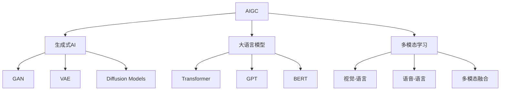

# AIGC从入门到实战：如何有效应对 AI 革命

## 1. 背景介绍

### 1.1 人工智能的发展历程
#### 1.1.1 早期人工智能的探索
#### 1.1.2 机器学习的兴起 
#### 1.1.3 深度学习的突破

### 1.2 AIGC的概念与特点
#### 1.2.1 AIGC的定义
#### 1.2.2 AIGC与传统AI的区别
#### 1.2.3 AIGC的应用前景

### 1.3 AIGC带来的机遇与挑战
#### 1.3.1 AIGC对各行业的影响
#### 1.3.2 AIGC对就业市场的冲击
#### 1.3.3 AIGC带来的伦理与安全问题

## 2. 核心概念与联系

### 2.1 生成式AI模型
#### 2.1.1 生成式对抗网络(GAN)
#### 2.1.2 变分自编码器(VAE)  
#### 2.1.3 扩散模型(Diffusion Models)

### 2.2 大语言模型(LLM)
#### 2.2.1 Transformer架构
#### 2.2.2 GPT系列模型
#### 2.2.3 BERT与其变体

### 2.3 多模态学习
#### 2.3.1 视觉-语言模型
#### 2.3.2 语音-语言模型 
#### 2.3.3 多模态融合技术

### 2.4 AIGC技术栈概览


## 3. 核心算法原理具体操作步骤

### 3.1 生成式对抗网络(GAN)
#### 3.1.1 GAN的基本原理
#### 3.1.2 生成器与判别器的训练过程
#### 3.1.3 GAN的训练技巧与改进

### 3.2 变分自编码器(VAE)
#### 3.2.1 VAE的基本原理
#### 3.2.2 编码器与解码器的设计
#### 3.2.3 VAE的训练与优化

### 3.3 扩散模型(Diffusion Models)  
#### 3.3.1 扩散过程与逆扩散过程
#### 3.3.2 噪声估计与去噪
#### 3.3.3 条件扩散模型的应用

### 3.4 Transformer与自注意力机制
#### 3.4.1 自注意力机制的原理
#### 3.4.2 多头注意力与位置编码
#### 3.4.3 Transformer的编码器-解码器结构

## 4. 数学模型和公式详细讲解举例说明

### 4.1 GAN的损失函数
$$ \min_G \max_D V(D,G) = \mathbb{E}_{x \sim p_{data}(x)}[\log D(x)] + \mathbb{E}_{z \sim p_z(z)}[\log (1 - D(G(z)))] $$

### 4.2 VAE的目标函数
$$ \mathcal{L}(\theta, \phi) = -\mathbb{E}_{z \sim q_{\phi}(z|x)}[\log p_{\theta}(x|z)] + D_{KL}(q_{\phi}(z|x) || p(z)) $$

### 4.3 Transformer的注意力计算
$$Attention(Q,K,V) = softmax(\frac{QK^T}{\sqrt{d_k}})V$$

### 4.4 扩散模型的前向过程
$$ q(x_t|x_{t-1}) = \mathcal{N}(x_t; \sqrt{1-\beta_t} x_{t-1}, \beta_t \mathbf{I}) $$

## 5. 项目实践：代码实例和详细解释说明

### 5.1 使用PyTorch实现GAN
```python
# 生成器
class Generator(nn.Module):
    def __init__(self, latent_dim, img_shape):
        super(Generator, self).__init__()
        # 生成器网络结构
        ...

    def forward(self, z):
        # 生成器前向传播
        ...

# 判别器        
class Discriminator(nn.Module):
    def __init__(self, img_shape):
        super(Discriminator, self).__init__()
        # 判别器网络结构
        ...
        
    def forward(self, img):
        # 判别器前向传播
        ...

# 训练循环
for epoch in range(num_epochs):
    for i, (imgs, _) in enumerate(dataloader):
        # 训练判别器
        ...
        
        # 训练生成器
        ...
```

### 5.2 使用TensorFlow实现VAE
```python
# 编码器
class Encoder(tf.keras.Model):
    def __init__(self, latent_dim):
        super(Encoder, self).__init__()
        # 编码器网络结构
        ...
        
    def call(self, x):
        # 编码器前向传播
        ...
        
# 解码器        
class Decoder(tf.keras.Model):
    def __init__(self, latent_dim):
        super(Decoder, self).__init__()
        # 解码器网络结构
        ...
        
    def call(self, z):
        # 解码器前向传播
        ...
        
# VAE模型        
class VAE(tf.keras.Model):
    def __init__(self, encoder, decoder, **kwargs):
        super(VAE, self).__init__(**kwargs)
        self.encoder = encoder
        self.decoder = decoder
        
    def train_step(self, data):
        # 训练步骤
        ...

# 训练VAE        
vae = VAE(encoder, decoder)
vae.compile(optimizer=keras.optimizers.Adam())
vae.fit(dataset, epochs=num_epochs, batch_size=batch_size)        
```

### 5.3 使用Hugging Face的Transformers库进行文本生成
```python
from transformers import GPT2LMHeadModel, GPT2Tokenizer

# 加载预训练的GPT-2模型和分词器
model = GPT2LMHeadModel.from_pretrained('gpt2')
tokenizer = GPT2Tokenizer.from_pretrained('gpt2')

# 生成文本
input_text = "Once upon a time"
input_ids = tokenizer.encode(input_text, return_tensors='pt')

output = model.generate(input_ids, 
                        max_length=100, 
                        num_return_sequences=1,
                        no_repeat_ngram_size=2,
                        early_stopping=True)

generated_text = tokenizer.decode(output[0], skip_special_tokens=True)
print(generated_text)
```

## 6. 实际应用场景

### 6.1 计算机视觉
#### 6.1.1 图像生成与编辑
#### 6.1.2 视频生成与预测
#### 6.1.3 3D场景生成

### 6.2 自然语言处理
#### 6.2.1 文本生成与改写
#### 6.2.2 对话系统与聊天机器人
#### 6.2.3 机器翻译与文本摘要

### 6.3 语音处理
#### 6.3.1 语音合成
#### 6.3.2 语音转换
#### 6.3.3 音乐生成

### 6.4 创意设计
#### 6.4.1 游戏内容生成
#### 6.4.2 时尚设计生成
#### 6.4.3 工业设计辅助

## 7. 工具和资源推荐

### 7.1 开源框架与库
#### 7.1.1 PyTorch与TorchVision
#### 7.1.2 TensorFlow与Keras
#### 7.1.3 Hugging Face Transformers

### 7.2 预训练模型
#### 7.2.1 GPT系列模型
#### 7.2.2 Stable Diffusion
#### 7.2.3 DALL-E与Midjourney

### 7.3 数据集资源
#### 7.3.1 ImageNet与CIFAR
#### 7.3.2 WMT与GLUE
#### 7.3.3 AudioSet与LibriSpeech

### 7.4 学习资料
#### 7.4.1 在线课程
#### 7.4.2 教程与博客
#### 7.4.3 论文与书籍

## 8. 总结：未来发展趋势与挑战

### 8.1 AIGC技术的发展趋势
#### 8.1.1 模型的进一步扩大与优化
#### 8.1.2 多模态融合与跨领域应用
#### 8.1.3 人机协作与交互式生成

### 8.2 AIGC面临的挑战
#### 8.2.1 数据质量与版权问题
#### 8.2.2 模型的可解释性与可控性
#### 8.2.3 伦理与安全考量

### 8.3 应对AI革命的策略
#### 8.3.1 加强AI素养教育
#### 8.3.2 促进人机协作与增强
#### 8.3.3 建立健全的法律法规体系

## 9. 附录：常见问题与解答

### 9.1 AIGC与传统内容创作的区别是什么？
### 9.2 AIGC是否会取代人类的创造力？
### 9.3 如何平衡AIGC的创新潜力与伦理风险？
### 9.4 个人如何学习和运用AIGC技术？
### 9.5 企业如何部署AIGC来提升生产力和创新能力？

作者：禅与计算机程序设计艺术 / Zen and the Art of Computer Programming