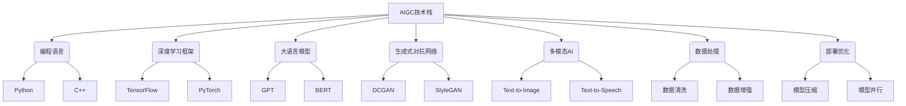

# AIGC从入门到实战：根据容错率来确定职业路径

## 1.背景介绍

### 1.1 AIGC时代的到来

人工智能生成内容(AIGC)是一种利用人工智能技术自动生成文本、图像、音频、视频等内容的技术。近年来,AIGC技术取得了长足进步,在各行各业引起广泛关注和应用。随着大语言模型、生成式对抗网络等技术的不断发展,AIGC的能力不断提升,生成内容的质量和多样性也在不断改善。

AIGC技术的兴起,标志着内容生产方式的根本性变革。传统的内容生产模式是由人力完成,效率低下、成本高昂。而AIGC技术可以极大提高内容生产效率,降低成本,为各行业带来革命性影响。

### 1.2 AIGC的应用前景

AIGC技术可以广泛应用于多个领域,包括但不限于:

- 内容创作:自动生成新闻、文案、小说、剧本等文字内容
- 视觉内容:生成图像、视频、动画等视觉内容 
- 语音内容:生成语音广播、有声读物等音频内容
- 营销广告:个性化定制广告文案、视觉内容等
- 客户服务:智能客服对话系统
- 教育培训:自动生成教学资料、练习题等

随着技术不断发展,AIGC的应用场景将越来越广泛,对传统内容生产行业带来深远影响。

## 2.核心概念与联系

### 2.1 AIGC的核心概念

要理解AIGC技术,需要掌握以下几个核心概念:

1. **大语言模型(Large Language Model,LLM)**: 通过训练海量文本数据,学习语言的语义和语法规则,能够生成自然、流畅的文本内容。常见的LLM有GPT、BERT等。

2. **生成式对抗网络(Generative Adversarial Network,GAN)**: 由生成网络和判别网络组成。生成网络生成假数据,判别网络判断数据真伪,两者互相对抗,促使生成网络生成更逼真的数据。常用于生成图像、视频等。

3. **文本到图像(Text-to-Image)**: 根据文本描述生成相应的图像。如DALL-E、Stable Diffusion等。

4. **文本到语音(Text-to-Speech)**: 根据文本生成自然语音。如谷歌的Tacotron等。

5. **语音到文本(Speech-to-Text)**: 将语音转录为文本,如语音输入法等。

这些概念相互关联,共同构建了AIGC技术的核心能力。

### 2.2 AIGC技术栈

要掌握AIGC技术,需要具备以下技能:



## 3.核心算法原理具体操作步骤

### 3.1 大语言模型原理

大语言模型的核心是基于自注意力机制的Transformer编码器-解码器结构。编码器将输入序列编码为向量表示,解码器根据编码向量生成输出序列。自注意力机制能够捕捉输入序列中任意两个位置之间的关系,从而更好地建模长距离依赖关系。

具体操作步骤如下:

1. **数据预处理**:构建训练语料库,进行分词、过滤、编码等预处理。

2. **模型结构**:搭建Transformer编码器-解码器模型结构,包括嵌入层、编码器层、解码器层等。

3. **模型训练**:基于掩码语言模型(MLM)和下一句预测(NSP)任务,对模型进行预训练,学习语言的语义和语法知识。

4. **微调训练**:针对特定任务(如文本生成、问答等),对预训练模型进行微调,提高在该任务上的性能。

5. **生成输出**:输入起始标记,模型根据上下文生成单词概率分布,根据概率采样或贪婪解码生成最终输出序列。

6. **结果后处理**:对生成结果进行去重、过滤、优化等后处理,提高输出质量。

### 3.2 生成式对抗网络原理

生成式对抗网络由生成网络G和判别网络D组成,两者相互对抗。生成网络G从噪声变量z中生成假数据G(z),判别网络D判断输入数据是真实数据还是生成数据,G和D相互对抗,促使G生成更逼真的数据。

具体操作步骤如下:

1. **数据准备**:收集真实数据样本,如图像、视频等,用于训练判别网络。

2. **生成网络G**:输入噪声变量z,通过上采样、卷积等操作生成假数据G(z)。

3. **判别网络D**:输入真实数据和G(z),通过卷积、下采样等操作,判断输入是真实数据还是假数据。

4. **对抗训练**:
   - G的目标是最小化log(1-D(G(z))),使D判别G(z)为真实数据
   - D的目标是最大化log(D(x))+log(1-D(G(z))),正确判别真实数据x和假数据G(z)
   - G和D相互对抗,交替优化

5. **生成输出**:训练收敛后,输入噪声z,G可生成逼真的假数据输出。

### 3.3 文本到图像算法

文本到图像算法的核心是将文本和图像映射到同一个潜在空间,学习文本和图像之间的语义对应关系。常见的算法有DALL-E、Stable Diffusion等。

具体步骤如下:

1. **数据准备**:构建文本-图像对数据集,如MS-COCO等。

2. **文本编码器**:使用BERT等大语言模型编码文本,获得文本的语义向量表示。

3. **图像编码器**:使用CNN等网络编码图像,获得图像的特征向量表示。 

4. **对应关系学习**:使用对比学习等方法,学习文本向量和图像向量之间的对应关系。

5. **图像生成器**:基于条件GAN等网络结构,输入文本向量,生成对应的图像数据。

6. **对抗训练**:生成器生成图像,判别器判断图像是否与文本语义相符,两者相互对抗优化。

7. **结果优化**:对生成结果进行上色、修补等后处理,提高图像质量。

整个过程需要大量的计算资源,并且对训练数据的质量和量都有较高要求。

## 4.数学模型和公式详细讲解举例说明

### 4.1 Transformer注意力机制

Transformer的核心是多头自注意力机制,能够捕捉输入序列中任意两个位置之间的关系。对于序列$X = (x_1, x_2, ..., x_n)$,注意力机制计算如下:

$$\begin{aligned}
Q &= X \cdot W_Q \\
K &= X \cdot W_K\\
V &= X \cdot W_V\\
\text{Attention}(Q, K, V) &= \text{softmax}(\frac{Q \cdot K^T}{\sqrt{d_k}}) \cdot V
\end{aligned}$$

其中$Q$为查询向量,$K$为键向量,$V$为值向量。$\sqrt{d_k}$是缩放因子,防止点积过大导致梯度消失。多头注意力机制可以关注不同的子空间,捕捉更多信息:

$$\text{MultiHead}(Q, K, V) = \text{Concat}(\text{head}_1, ..., \text{head}_h) \cdot W_O$$

其中$\text{head}_i = \text{Attention}(Q \cdot W_i^Q, K \cdot W_i^K, V \cdot W_i^V)$。

### 4.2 生成式对抗网络损失函数

生成网络G和判别网络D的损失函数如下:

$$\begin{aligned}
\min_G \max_D V(D,G) &= \mathbb{E}_{x \sim p_{\text{data}}(x)}[\log D(x)] + \mathbb{E}_{z \sim p_z(z)}[\log(1-D(G(z)))]\\
&= \mathbb{E}_{x \sim p_{\text{data}}(x)}[\log D(x)] + \mathbb{E}_{x \sim p_g}[\log(1-D(x))]
\end{aligned}$$

其中$p_{\text{data}}$为真实数据分布,$p_z$为噪声变量分布,$p_g$为生成数据分布。G的目标是最小化$\log(1-D(G(z)))$,使D判别$G(z)$为真实数据;D的目标是最大化$\log D(x) + \log(1-D(G(z)))$,正确判别真实数据和生成数据。

在实际训练中,通常采用如下策略:

1. 固定G,最大化$\log D(x) + \log(1-D(G(z)))$,更新D
2. 固定D,最小化$\log(1-D(G(z)))$,更新G

### 4.3 文本到图像对比学习

文本到图像模型需要学习文本语义向量和图像特征向量之间的对应关系。常用的是对比学习(Contrastive Learning)方法,其损失函数为:

$$\mathcal{L}_i = -\log \frac{\exp(\text{sim}(t_i, v_i) / \tau)}{\sum_{j=1}^{N} \exp(\text{sim}(t_i, v_j)/\tau)}$$

其中$t_i$为文本$i$的语义向量,$v_i$为图像$i$的特征向量,$\tau$为温度超参数,$N$为批次大小。$\text{sim}(t, v)$为文本向量和图像向量的相似度函数,如点积相似度、余弦相似度等。

对比学习的目标是最大化正例对$(t_i, v_i)$的相似度,最小化负例对的相似度,从而学习文本和图像的语义对应关系。

## 5.项目实践:代码实例和详细解释说明

这里以文本生成任务为例,使用PyTorch实现一个基于GPT的文本生成模型。完整代码可查看:https://github.com/pytorch/examples/tree/master/word_language_model

### 5.1 数据预处理

```python
import torch
from torchtext.data.utils import get_tokenizer

# 加载数据集
train_iter = torchtext.datasets.WikiText2(split='train')
tokenizer = get_tokenizer('basic_english')

# 构建词表
vocab = build_vocab_from_iterator(map(tokenizer, train_iter), specials=['<unk>'])
vocab.set_default_index(vocab['<unk>'])

# 数据迭代器
train_iter = WikiText2(split='train', vocab=vocab)
```

使用torchtext加载WikiText2数据集,构建词表vocab,并创建数据迭代器。

### 5.2 模型结构

```python
import torch.nn as nn

class TransformerModel(nn.Module):
    def __init__(self, ntoken, ninp, nhead, nhid, nlayers, dropout=0.5):
        ...
        self.encoder = nn.Transformer(nhead, nhid, nlayers, dropout)
        self.decoder = nn.Linear(ninp, ntoken)

    def forward(self, src, tgt):
        output = self.encoder(src)
        output = self.decoder(output)
        return output
```

使用PyTorch内置的nn.Transformer模块构建Transformer编码器模型,输出通过线性层解码为词典大小的logits。

### 5.3 训练

```python
import torch.optim as optim
from torch.nn import CrossEntropyLoss

model = TransformerModel(ntokens, ...).to(device)
criterion = CrossEntropyLoss()
optimizer = optim.SGD(model.parameters(), lr=1.0)

for epoch in range(epochs):
    for batch in train_iter:
        data, targets = batch.text.to(device), batch.target.to(device)
        
        output = model(data, targets)
        loss = criterion(output.view(-1, ntokens), targets.view(-1))
        
        optimizer.zero_grad()
        loss.backward()
        optimizer.step()
```

将模型移动到GPU设备,使用交叉熵损失函数和