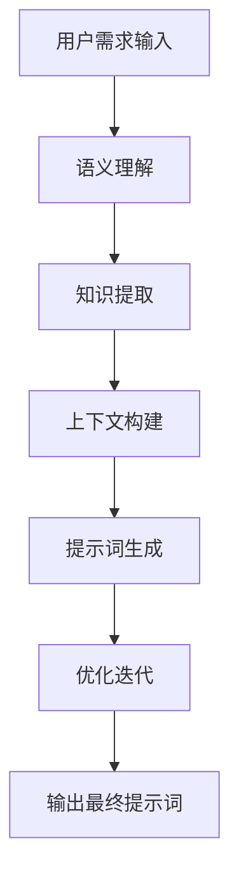

# AIGC从入门到实战：进阶：魔法打败魔法，让AI自动生成提示词

## 1. 背景介绍

### 1.1 AIGC的兴起与挑战

人工智能生成内容(AIGC)近年来迅猛发展,尤其是大语言模型的出现,使得AI可以生成高质量的文本、图像、视频等内容。然而,要充分发挥AIGC的潜力,仍面临着一些挑战,其中之一就是如何为AI提供高质量的提示词(Prompt)。

### 1.2 提示词的重要性

提示词是指导AI生成内容的文本指令。高质量的提示词可以大幅提高AI生成内容的质量和相关性,而低质量的提示词则会导致生成内容与预期相去甚远。因此,为AI设计高质量的提示词是AIGC发展的关键。

### 1.3 人工编写提示词的局限性

目前,提示词主要由人工编写。然而,这种方式存在以下局限性:

1. 效率低下:编写高质量提示词需要大量的人力和时间投入。
2. 缺乏一致性:不同人编写的提示词质量参差不齐。
3. 知识有限:人工难以涵盖所有领域的专业知识。

因此,有必要探索自动生成提示词的方法,以提高AIGC的效率和质量。

## 2. 核心概念与联系

### 2.1 提示词自动生成的概念

提示词自动生成是指利用AI技术自动生成高质量的提示词,从而指导大语言模型生成所需的内容。这一过程涉及以下关键概念:

1. **语义理解**:准确理解用户的需求,捕捉关键信息。
2. **知识库整合**:从广泛的知识库中提取相关信息。
3. **上下文构建**:根据需求构建合适的上下文环境。
4. **生成优化**:通过迭代优化生成高质量的提示词。

### 2.2 提示词自动生成与其他AI技术的联系

提示词自动生成技术与多个AI领域紧密相关,包括:

1. **自然语言处理(NLP)**: 用于语义理解和生成高质量文本。
2. **知识图谱**: 构建结构化知识库,支持信息提取和推理。
3. **机器学习**: 训练模型从数据中学习生成高质量提示词。
4. **对话系统**: 与用户进行自然语言交互,理解需求。

通过融合这些技术,可以实现高效、智能的提示词自动生成。

## 3. 核心算法原理具体操作步骤

提示词自动生成的核心算法可分为以下几个步骤:



### 3.1 语义理解

该步骤的目标是准确理解用户的需求,提取关键信息。常用的方法包括:

1. **命名实体识别(NER)**: 识别文本中的人名、地名、组织机构等实体。
2. **依存句法分析**: 分析句子的语法结构和词语之间的依存关系。
3. **意图识别**: 判断用户的语句意图,如查询、命令等。
4. **情感分析**: 分析用户语句中的情感倾向,如积极、消极等。

### 3.2 知识提取

根据语义理解的结果,从知识库中提取相关信息,常用方法包括:

1. **实体链接**: 将识别出的实体链接到知识库中的条目。
2. **关系抽取**: 从文本中抽取实体之间的语义关系。
3. **知识推理**: 基于已有知识,进行逻辑推理得到新知识。

知识库可以是结构化的知识图谱,也可以是非结构化的大规模语料库。

### 3.3 上下文构建

将提取的知识融合,构建与用户需求相关的上下文环境,主要包括:

1. **上下文表示**: 将知识表示为向量、图等形式,方便模型理解。
2. **上下文扩展**: 根据需求,从知识库中扩展相关的背景信息。
3. **上下文优化**: 对上下文进行优化,提高相关性和连贯性。

### 3.4 提示词生成

利用构建的上下文,生成高质量的提示词,指导大语言模型生成所需内容。常用的生成模型包括:

1. **序列到序列(Seq2Seq)**: 将上下文编码为向量,解码生成提示词。
2. **生成式对抗网络(GAN)**: 生成器生成提示词,判别器评估质量。
3. **自回归模型**: 基于上下文,自回归生成每个词的概率分布。

### 3.5 优化迭代

生成的初始提示词可能存在一定问题,需要进行优化迭代:

1. **人工评估反馈**: 人工评估提示词质量,提供反馈信息。
2. **自动评估**: 使用自动评估指标,如困惑度、流畅度等。
3. **优化模型**: 根据评估结果,优化生成模型的参数。

经过多轮迭代,可以获得质量更高的提示词。

## 4. 数学模型和公式详细讲解举例说明

在提示词自动生成过程中,涉及多个数学模型,下面分别介绍。

### 4.1 语义表示模型

语义表示模型的目标是将文本映射到一个连续的向量空间,使语义相似的文本在向量空间中距离较近。常用的模型有Word2Vec、BERT等。

以Word2Vec为例,其中的连续词袋(CBOW)模型可以用下式表示:

$$J = \frac{1}{T}\sum_{t=1}^{T}\log p(w_t|context(w_t))$$

其中$T$是语料库中的词数,$w_t$是第$t$个词,$context(w_t)$是$w_t$的上下文词。模型的目标是最大化上下文词预测中心词的概率。

### 4.2 知识图谱嵌入

知识图谱嵌入是将知识图谱中的实体和关系映射到低维连续向量空间的技术,可以捕捉实体和关系之间的语义信息。常用的模型有TransE、RotatE等。

以TransE为例,其目标函数为:

$$L = \sum_{(h,r,t)\in S}\sum_{(h',r',t')\in S'} [\gamma + d(h+r,t) - d(h'+r',t')]_+$$

其中$(h,r,t)$是知识图谱中的三元组(head,relation,tail),$S$是正例三元组集合,$S'$是负例三元组集合,$\gamma$是边距超参数,$d$是距离函数(如$L_1$或$L_2$范数),$[\cdot]_+$是正值函数。模型的目标是使正例三元组的头实体与尾实体在关系空间的映射距离最小化。

### 4.3 序列生成模型

序列生成模型是生成提示词的核心模型,目标是最大化生成序列的概率。常用的模型有序列到序列(Seq2Seq)、自回归语言模型等。

以Transformer的自回归语言模型为例,给定上下文$x=(x_1,x_2,...,x_n)$,生成词$y_t$的条件概率为:

$$P(y_t|x,y_{<t}) = \mathrm{softmax}(h_tW_o)$$

其中$h_t$是第$t$个位置的隐藏状态向量,由Transformer的自注意力机制计算得到,$W_o$是输出层的权重矩阵。模型的目标是最大化生成整个序列$y=(y_1,y_2,...,y_m)$的条件概率:

$$\max_\theta \prod_{t=1}^m P(y_t|x,y_{<t};\theta)$$

其中$\theta$是模型参数。

通过上述数学模型的融合应用,可以实现高质量的提示词自动生成。

## 5. 项目实践:代码实例和详细解释说明

为了更好地理解提示词自动生成的实现过程,我们将通过一个实际项目案例进行讲解。该项目旨在生成一个提示词,指导大语言模型生成一篇关于"气候变化"的文章。

### 5.1 项目概述

该项目包括以下几个主要步骤:

1. 语义理解:理解用户的需求"生成关于气候变化的文章"。
2. 知识提取:从知识库中提取与"气候变化"相关的知识。
3. 上下文构建:将提取的知识构建成合适的上下文环境。
4. 提示词生成:基于构建的上下文,生成高质量的提示词。
5. 优化迭代:根据人工评估和自动评估,优化生成的提示词。

### 5.2 代码实现

我们将使用Python和相关库(如NLTK、Gensim、PyTorch等)来实现该项目。下面是一些关键代码片段:

#### 1. 语义理解

```python
import nltk

# 分词和词性标注
tokens = nltk.word_tokenize(user_input)
pos_tags = nltk.pos_tag(tokens)

# 命名实体识别
entities = nltk.ne_chunk(pos_tags)

# 意图识别
intent = classify_intent(user_input)
```

#### 2. 知识提取

```python
from gensim.models import Word2Vec
from py2neo import Graph

# 加载知识图谱
graph = Graph("bolt://localhost:7687", auth=("neo4j", "password"))

# 实体链接
entity_vectors = Word2Vec.load("word2vec.model")
linked_entities = link_entities(entities, entity_vectors, graph)

# 关系抽取
relations = extract_relations(user_input, linked_entities, graph)
```

#### 3. 上下文构建

```python
import torch

# 上下文表示
context = build_context(linked_entities, relations)
context_tensor = torch.tensor(context, dtype=torch.float32)

# 上下文扩展
extended_context = extend_context(context_tensor, graph)
```

#### 4. 提示词生成

```python
from transformers import T5ForConditionalGeneration, T5Tokenizer

# 加载T5模型
tokenizer = T5Tokenizer.from_pretrained("t5-base")
model = T5ForConditionalGeneration.from_pretrained("t5-base")

# 生成提示词
input_ids = tokenizer.encode(extended_context, return_tensors="pt")
output_ids = model.generate(input_ids, max_length=100, num_beams=4, early_stopping=True)
prompt = tokenizer.decode(output_ids[0], skip_special_tokens=True)
```

#### 5. 优化迭代

```python
# 人工评估
human_score = get_human_rating(prompt)

# 自动评估
auto_scores = evaluate_prompt(prompt, metrics=["bleu", "rouge"])

# 优化模型
if human_score < 4 or auto_scores["bleu"] < 0.5:
    optimize_model(model, prompt, extended_context)
```

通过上述代码实现,我们可以自动生成高质量的提示词,指导大语言模型生成关于"气候变化"的文章。当然,实际项目中还需要进一步优化和调试。

## 6. 实际应用场景

提示词自动生成技术在多个领域都有广泛的应用前景:

### 6.1 内容创作

利用提示词自动生成技术,可以为作家、内容创作者等提供高质量的写作提示,提高内容创作的效率和质量。

### 6.2 智能问答系统

在智能问答系统中,可以自动生成合适的提示词,指导大语言模型生成准确、详细的答复内容。

### 6.3 个性化推荐系统

根据用户的兴趣和历史数据,自动生成个性化的提示词,为用户推荐感兴趣的内容。

### 6.4 教育辅助

在教育领域,可以生成适合不同学生水平的提示词,辅助学生学习和提高。

### 6.5 医疗健康

在医疗健康领域,可以根据病人症状和病史自动生成提示词,为医生诊断和治疗提供参考。

### 6.6 新闻报道

新闻媒体可以利用该技术,根据新闻事件自动生成提示词,辅助记者撰写新闻报道。

总之,提示词自动生成技术可以广泛应用于需要生成高质量文本内容的各个领域,大幅提高内容生产的效率和质量。

## 7. 工具和资源推荐

在实现提示词自动生成系统时,可以使用以下工具和资源:

### 