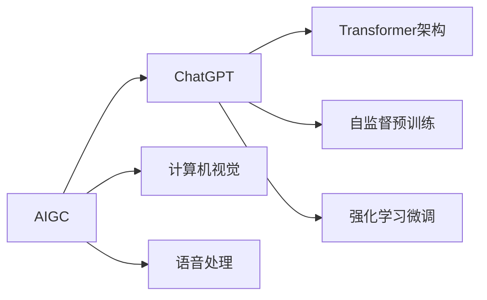

# AIGC从入门到实战：量化说明 ChatGPT 可能带来的效率提升

## 1. 背景介绍
### 1.1 人工智能生成内容(AIGC)的兴起
近年来,人工智能技术的飞速发展,尤其是自然语言处理(NLP)和机器学习(ML)领域的突破,催生了一种新的内容生产方式——人工智能生成内容(Artificial Intelligence Generated Content, AIGC)。AIGC 利用人工智能算法,通过学习和分析海量的文本、图像、音频、视频等数据,自动生成符合特定需求的内容。

### 1.2 ChatGPT 的出现对 AIGC 领域的影响
2022年11月,OpenAI 推出了一个名为 ChatGPT 的大型语言模型,它在 AIGC 领域掀起了一场革命。ChatGPT 展示了惊人的自然语言理解和生成能力,可以与人进行流畅的对话,完成写作、编程、数据分析等各种任务。ChatGPT 的出现,让更多人看到了 AIGC 技术的巨大潜力,对未来工作和生活的方方面面产生深远影响。

### 1.3 探讨 ChatGPT 对生产效率提升的意义
ChatGPT 等 AIGC 工具在提高生产效率方面有着广阔的应用前景。本文将从技术原理入手,结合实际应用案例,定量分析 ChatGPT 对各行各业效率提升的潜力。通过探讨 ChatGPT 的工作机制和局限性,展望 AIGC 技术的未来发展方向,为企业和个人应用 AIGC 提供参考和指引。

## 2. 核心概念与联系
### 2.1 AIGC 的定义和特点
AIGC 是利用人工智能技术,通过算法模型自动生成各种内容(文本、图像、音频、视频等)的过程。它的特点包括:
1. 海量数据训练:通过机器学习算法,从海量数据中总结规律,具备较强的内容生成能力。
2. 多样化输出:可以根据不同需求,生成多种风格和主题的内容。 
3. 实时交互性:支持人机交互,根据用户输入实时生成相关内容。

### 2.2 ChatGPT 的技术原理
ChatGPT 是一种基于 Transformer 架构的大型语言模型,通过自监督学习和强化学习训练而成。它的核心技术原理包括:

1. Transformer 架构:使用自注意力机制,建模文本序列中的长距离依赖关系。
2. 自监督预训练:在大规模无标注语料上进行预训练,学习语言的通用表征。 
3. 强化学习微调:引入人类反馈,对模型进行针对性微调,提高对话质量。

### 2.3 AIGC 与 ChatGPT 的关系
ChatGPT 是 AIGC 领域的代表性产品之一,体现了 AIGC 技术的最新进展和应用潜力。ChatGPT 专注于自然语言交互和内容生成,是 AIGC 在 NLP 方向的集大成者。同时,ChatGPT 的成功也为其他 AIGC 领域(如计算机视觉、语音处理)的发展提供了宝贵经验和启示。



## 3. 核心算法原理具体操作步骤
### 3.1 Transformer 编码器-解码器架构
Transformer 是一种基于自注意力机制的神经网络架构,广泛应用于自然语言处理任务。其核心是编码器-解码器结构:

1. 编码器:由多个自注意力层和前馈神经网络组成,将输入文本转化为隐向量表示。
2. 解码器:同样由多个自注意力层和前馈神经网络组成,根据编码器输出和之前生成的内容,预测下一个词。
3. 自注意力机制:通过计算 query、key、value 三个矩阵,建模文本不同位置之间的相关性。

### 3.2 自监督预训练策略
ChatGPT 采用自监督学习方法在大规模无标注语料上进行预训练,主要策略包括:

1. 掩码语言模型(Masked Language Model,MLM):随机掩盖部分词,让模型根据上下文预测被掩盖的词。
2. 下一句预测(Next Sentence Prediction,NSP):给定两个句子,让模型判断它们是否前后相接。
3. 排列语言模型(Permutation Language Model,PLM):随机打乱句子中词的顺序,让模型恢复原始顺序。

通过这些任务,模型可以学习到语言的通用表征和规律,为下游任务提供良好的初始化参数。

### 3.3 强化学习微调方法
为了进一步提高ChatGPT的对话质量,OpenAI引入了强化学习技术对模型进行微调。主要步骤如下:

1. 收集人类反馈数据:让人类对模型生成的回复进行评分,或提供更好的参考答案。
2. 定义奖励函数:根据人类反馈设计奖励函数,引导模型生成更符合期望的回复。
3. 策略优化:通过近端策略优化(Proximal Policy Optimization,PPO)算法更新模型参数,最大化预期奖励。

强化学习使ChatGPT能够更好地理解人类意图,生成更自然、贴切的对话内容。

## 4. 数学模型和公式详细讲解举例说明
### 4.1 Transformer 的自注意力机制
Transformer 的核心是自注意力机制,可以捕捉文本序列中不同位置之间的依赖关系。对于输入序列 $X=(x_1,\cdots,x_n)$,自注意力的计算过程如下:

1. 计算 query、key、value 矩阵:
$$
\begin{aligned}
Q &= X W^Q \\
K &= X W^K \\
V &= X W^V
\end{aligned}
$$
其中 $W^Q, W^K, W^V$ 是可学习的参数矩阵。

2. 计算注意力分数:
$$
\text{Attention}(Q,K,V) = \text{softmax}(\frac{QK^T}{\sqrt{d_k}})V
$$
其中 $d_k$ 是 key 向量的维度,用于缩放点积结果。

3. 计算自注意力输出:
$$
\text{head}_i = \text{Attention}(QW_i^Q, KW_i^K, VW_i^V)
$$
$$
\text{MultiHead}(Q,K,V) = \text{Concat}(\text{head}_1,\cdots,\text{head}_h)W^O
$$
其中 $W_i^Q, W_i^K, W_i^V, W^O$ 是可学习的参数矩阵,$h$ 是注意力头的数量。

通过自注意力机制,Transformer 可以在编码和解码过程中动态地关注输入序列的不同部分,提取丰富的语义信息。

### 4.2 自监督预训练的损失函数
以掩码语言模型(MLM)任务为例,其损失函数定义为:
$$
\mathcal{L}_{\text{MLM}}(\theta) = -\sum_{i=1}^N m_i \log p(x_i|\hat{x}_{\backslash i};\theta)
$$
其中 $\theta$ 是模型参数,$N$ 是序列长度,$m_i$ 是掩码指示变量(被掩盖为1,否则为0),$\hat{x}_{\backslash i}$ 表示 $x_i$ 以外的所有词,$p(x_i|\hat{x}_{\backslash i};\theta)$ 是模型预测 $x_i$ 的概率。

最小化该损失函数,可以让模型学会根据上下文预测被掩盖的词,捕捉语言的统计规律。

### 4.3 强化学习中的策略梯度算法
ChatGPT 使用近端策略优化(PPO)算法进行强化学习。PPO 的核心思想是通过限制策略更新的幅度,避免策略剧烈变化导致的性能崩溃。其策略梯度定义为:
$$
g=\mathbb{E}_t\left[\nabla_\theta \log \pi_\theta(a_t|s_t)\hat{A}_t\right]
$$
其中 $\pi_\theta$ 是参数化策略,$a_t$ 是在状态 $s_t$ 下采取的动作,$\hat{A}_t$ 是优势函数的估计。

PPO 通过以下损失函数来更新策略:
$$
\mathcal{L}^{\text{CLIP}}(\theta) = \mathbb{E}_t\left[\min(r_t(\theta)\hat{A}_t, \text{clip}(r_t(\theta), 1-\epsilon, 1+\epsilon)\hat{A}_t)\right]
$$
其中 $r_t(\theta)=\frac{\pi_\theta(a_t|s_t)}{\pi_{\theta_{\text{old}}}(a_t|s_t)}$ 是概率比,$\epsilon$ 是超参数,用于限制概率比的变化范围。

通过 PPO 算法,ChatGPT 可以在保证策略稳定性的同时,不断优化其对话生成策略,提高对话质量。

## 5. 项目实践：代码实例和详细解释说明
下面我们通过一个简单的 PyTorch 代码实例,演示如何使用 Transformer 编码器对文本进行特征提取:

```python
import torch
import torch.nn as nn

class TransformerEncoder(nn.Module):
    def __init__(self, vocab_size, embed_dim, num_heads, hidden_dim, num_layers, dropout=0.1):
        super(TransformerEncoder, self).__init__()
        self.embedding = nn.Embedding(vocab_size, embed_dim)
        self.pos_encoding = PositionalEncoding(embed_dim)
        self.layers = nn.ModuleList([
            TransformerEncoderLayer(embed_dim, num_heads, hidden_dim, dropout) 
            for _ in range(num_layers)
        ])
    
    def forward(self, x):
        x = self.embedding(x)
        x = self.pos_encoding(x)
        for layer in self.layers:
            x = layer(x)
        return x

class TransformerEncoderLayer(nn.Module):
    def __init__(self, embed_dim, num_heads, hidden_dim, dropout=0.1):
        super(TransformerEncoderLayer, self).__init__()
        self.self_attn = nn.MultiheadAttention(embed_dim, num_heads, dropout=dropout)
        self.fc1 = nn.Linear(embed_dim, hidden_dim)
        self.fc2 = nn.Linear(hidden_dim, embed_dim)
        self.norm1 = nn.LayerNorm(embed_dim)
        self.norm2 = nn.LayerNorm(embed_dim)
        self.dropout = nn.Dropout(dropout)
        
    def forward(self, x):
        residual = x
        x, _ = self.self_attn(x, x, x)
        x = self.norm1(residual + self.dropout(x))
        residual = x
        x = self.fc2(self.dropout(torch.relu(self.fc1(x))))
        x = self.norm2(residual + self.dropout(x))
        return x

class PositionalEncoding(nn.Module):
    def __init__(self, embed_dim, max_len=5000):
        super(PositionalEncoding, self).__init__()
        pe = torch.zeros(max_len, embed_dim)
        position = torch.arange(0, max_len, dtype=torch.float).unsqueeze(1)
        div_term = torch.exp(torch.arange(0, embed_dim, 2).float() * (-math.log(10000.0) / embed_dim))
        pe[:, 0::2] = torch.sin(position * div_term)
        pe[:, 1::2] = torch.cos(position * div_term)
        pe = pe.unsqueeze(0).transpose(0, 1)
        self.register_buffer('pe', pe)

    def forward(self, x):
        x = x + self.pe[:x.size(0), :]
        return x
```

这段代码定义了一个 Transformer 编码器模型,主要组成部分包括:

1. `TransformerEncoder`: 编码器主体,由词嵌入层、位置编码层和若干个编码器层组成。
2. `TransformerEncoderLayer`: 编码器层,包含多头自注意力机制和前馈神经网络。
3. `PositionalEncoding`: 位置编码层,为输入序列引入位置信息。

模型的前向传播过程如下:

1. 将输入序列 `x` 通过词嵌入层映射为连续向量表示。
2. 将位置编码与词嵌入相加,引入位置信息。
3. 将结果依次通过若干个编码器层,每个编码器层包括:
   - 多头自注意力机制:建模序列内部的依赖关系。
   - 残差连接和层归一化: