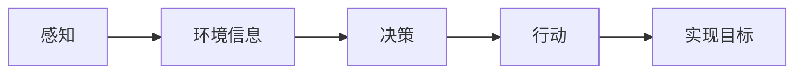

## 1.背景介绍

在过去的十年里，人工智能（AI）的发展已经达到了前所未有的高度。其中，AI Agent 是这个领域的核心组成部分。AI Agent 是一个可以感知环境并采取行动以实现其目标的实体。这一概念在自动驾驶汽车、推荐系统、智能助手等许多应用中都有所体现。

## 2.核心概念与联系

AI Agent 的核心概念包括感知、行动、目标和环境。感知是指 AI Agent 能够收集其所在环境的信息。行动是指 AI Agent 根据所收集的信息做出决策并采取行动。目标是 AI Agent 所要实现的目标，而环境则是 AI Agent 所在的环境。

这四个概念之间存在密切的联系。AI Agent 通过感知环境，获取有关环境的信息，然后根据这些信息和其目标，做出决策并采取行动，以实现其目标。



## 3.核心算法原理具体操作步骤

AI Agent 的核心算法原理包括决策树、强化学习和深度学习等。决策树是一种基于树结构的决策模型，它通过构建一棵决策树来进行决策。强化学习是一种通过试错学习和延迟奖励来进行决策的方法。深度学习则是一种基于神经网络的学习方法，它可以处理大量的数据，并从中学习到复杂的模式。

## 4.数学模型和公式详细讲解举例说明

以强化学习为例，其核心是 Q-learning 算法。Q-learning 是一种值迭代算法，其基本思想是通过迭代更新每个状态-动作对的 Q 值，以达到最优策略。

Q 值的更新公式如下：

$$
Q(s, a) = Q(s, a) + \alpha [r + \gamma \max_{a'}Q(s', a') - Q(s, a)]
$$

其中，$s$ 和 $a$ 分别表示当前的状态和动作，$r$ 是即时奖励，$\gamma$ 是折扣因子，$\alpha$ 是学习率，$s'$ 和 $a'$ 分别表示下一个状态和动作。

## 5.项目实践：代码实例和详细解释说明

以下是一个简单的 Q-learning 的代码实例：

```python
import numpy as np

# 初始化 Q 表
Q = np.zeros([state_space, action_space])

# 学习过程
for episode in range(episodes):
    s = env.reset()
    done = False

    while not done:
        # 选择动作
        a = np.argmax(Q[s, :] + np.random.randn(1, action_space) * (1. / (episode + 1)))
        # 执行动作，获取奖励和新的状态
        s_, r, done, _ = env.step(a)
        # 更新 Q 值
        Q[s, a] = Q[s, a] + lr * (r + y * np.max(Q[s_, :]) - Q[s, a])
        s = s_
```

## 6.实际应用场景

AI Agent 在许多实际应用场景中都有应用，例如：

- 自动驾驶：AI Agent 能够感知周围的环境，做出判断并控制汽车的行驶。
- 推荐系统：AI Agent 根据用户的行为和喜好，推荐符合用户口味的内容。
- 智能助手：AI Agent 能够理解用户的需求，并提供相应的服务。

## 7.工具和资源推荐

以下是一些推荐的工具和资源：

- OpenAI Gym：一个用于开发和比较强化学习算法的工具包。
- TensorFlow：一个强大的深度学习框架。
- PyTorch：另一个强大的深度学习框架。
- AI Hub：一个提供各种 AI 资源的平台。

## 8.总结：未来发展趋势与挑战

AI Agent 的发展趋势是更加智能和自主。然而，这也带来了一些挑战，例如如何保证 AI Agent 的行为符合人类的道德和法律，如何处理 AI Agent 和人类的交互问题，如何保证 AI Agent 的安全性等。

## 9.附录：常见问题与解答

1. 问：AI Agent 和普通的程序有什么区别？
答：AI Agent 不仅可以执行预定的任务，还可以根据环境的变化和自身的学习，自主地做出决策和行动。

2. 问：AI Agent 如何做出决策？
答：AI Agent 通过感知环境，获取环境的信息，然后根据这些信息和其目标，使用决策算法做出决策。

3. 问：AI Agent 可以用在哪些领域？
答：AI Agent 可以用在许多领域，例如自动驾驶、推荐系统、智能助手等。

作者：禅与计算机程序设计艺术 / Zen and the Art of Computer Programming