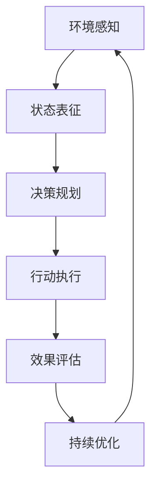

# AI人工智能代理工作流AI Agent WorkFlow：在电子商务中应用AI代理的策略

## 1.背景介绍

### 1.1 电子商务的快速发展

随着互联网技术的不断进步和移动设备的普及,电子商务在过去几年中经历了爆炸式增长。根据统计数据,2022年全球电子商务销售额达到5.7万亿美元,较上一年增长14.3%。电子商务已经成为人们日常生活中不可或缺的一部分,给传统商业模式带来了巨大冲击。

### 1.2 AI技术在电子商务中的应用

为了提高用户体验、优化运营效率和降低成本,电子商务企业纷纷开始引入人工智能(AI)技术。AI代理作为一种新兴的AI应用模式,正在为电子商务带来全新的发展机遇。

### 1.3 AI代理的概念

AI代理是一种自主的软件实体,能够根据预定的目标和环境状态做出合理决策并执行相应操作。AI代理通过感知环境、学习经验、规划行动和持续优化,可以代替人工完成各种复杂任务。

## 2.核心概念与联系  

### 2.1 AI代理的工作流程

AI代理在电子商务中的工作流程可以概括为:



1. **环境感知**:AI代理需要感知电子商务系统的各种数据,如用户行为、商品信息、订单状态等。
2. **状态表征**:将感知到的原始数据转化为AI代理可以理解的状态表示。
3. **决策规划**:根据当前状态和预定目标,规划出合理的决策序列。
4. **行动执行**:执行规划出的决策行动,如个性化推荐、智能定价等。
5. **效果评估**:评估行动执行的效果,获得反馈信号。
6. **持续优化**:基于反馈信号,持续优化决策规划模型。

### 2.2 AI代理的关键技术

实现高效的AI代理工作流程需要多种AI技术的支持:

- **机器学习**:用于从海量数据中学习模式,构建决策模型。
- **自然语言处理**:处理用户查询和反馈的自然语言。
- **计算机视觉**:分析图像和视频数据,如商品图片识别。
- **规划与优化**:生成高效的决策序列并持续优化。
- **多智能体系统**:协调多个AI代理之间的交互和协作。

## 3.核心算法原理具体操作步骤

### 3.1 强化学习算法

强化学习是训练AI代理决策模型的核心算法,其核心思想是通过代理与环境的互动,最大化预期的长期累积奖励。

#### 3.1.1 马尔可夫决策过程(MDP)

强化学习问题通常建模为马尔可夫决策过程(MDP),由以下5个要素组成:

- 状态集合 $\mathcal{S}$
- 行动集合 $\mathcal{A}$  
- 转移概率 $\mathcal{P}_{ss'}^a = \Pr(s_{t+1}=s'|s_t=s,a_t=a)$
- 奖励函数 $\mathcal{R}_s^a = \mathbb{E}[r_{t+1}|s_t=s,a_t=a]$
- 折扣因子 $\gamma \in [0,1]$

目标是找到一个策略 $\pi: \mathcal{S} \rightarrow \mathcal{A}$,使得期望的累积折扣奖励最大:

$$\max_\pi \mathbb{E}_\pi \left[ \sum_{t=0}^\infty \gamma^t r_t \right]$$

#### 3.1.2 Q-Learning算法

Q-Learning是一种经典的无模型强化学习算法,通过估计状态-行动对的长期奖励Q值,逐步更新策略:

$$Q(s_t,a_t) \leftarrow Q(s_t,a_t) + \alpha \left[ r_t + \gamma \max_{a'} Q(s_{t+1},a') - Q(s_t,a_t) \right]$$

其中 $\alpha$ 为学习率。

#### 3.1.3 深度Q网络(DQN)

传统Q-Learning在处理高维状态时效率低下。深度Q网络(DQN)将Q函数用神经网络来拟合,通过经验回放和目标网络稳定训练,显著提高了学习效率。

```python
import random
from collections import deque

class DQN:
    def __init__(self, state_dim, action_dim):
        self.memory = deque(maxlen=MEMORY_SIZE)
        self.q_network = build_q_network(state_dim, action_dim)
        self.target_network = build_q_network(state_dim, action_dim)

    def train(self, batch_size):
        states, actions, rewards, next_states, dones = sample_from_memory(batch_size)
        
        # 计算目标Q值
        next_q_values = self.target_network.predict(next_states)
        max_next_q_values = np.max(next_q_values, axis=-1)
        targets = rewards + GAMMA * (1 - dones) * max_next_q_values
        
        # 更新Q网络
        self.q_network.train_on_batch(states, targets)
        
        # 更新目标网络
        if episode % TARGET_UPDATE_FREQ == 0:
            self.target_network.set_weights(self.q_network.get_weights())
```

### 3.2 策略梯度算法

策略梯度算法直接优化策略函数,常用于连续行动空间的强化学习问题。

#### 3.2.1 REINFORCE算法

REINFORCE是一种基于策略梯度的蒙特卡罗策略优化算法:

$$\nabla_\theta J(\theta) = \mathbb{E}_{\pi_\theta}[\nabla_\theta \log \pi_\theta(a|s)R(s,a)]$$

其中 $R(s,a)$ 为状态-行动对的累积奖励。

```python
import torch
import torch.nn as nn

class PolicyNetwork(nn.Module):
    def __init__(self, state_dim, action_dim):
        super().__init__()
        self.fc1 = nn.Linear(state_dim, 64)
        self.fc2 = nn.Linear(64, action_dim)
        
    def forward(self, state):
        x = torch.relu(self.fc1(state))
        action_probs = torch.softmax(self.fc2(x), dim=-1)
        return action_probs
    
def train_reinforce(policy, optimizer, states, actions, rewards):
    optimizer.zero_grad()
    
    action_probs = policy(states)
    action_log_probs = torch.log(action_probs.gather(1, actions.unsqueeze(1)))
    loss = -(action_log_probs * rewards).mean()
    
    loss.backward()
    optimizer.step()
```

#### 3.2.2 Actor-Critic算法

Actor-Critic算法将策略函数(Actor)和值函数(Critic)分开训练,可以显著提高收敛速度。

```python
class Actor(nn.Module):
    # Actor网络
    
class Critic(nn.Module):
    # Critic网络
    
def train_actor_critic(actor, critic, actor_opt, critic_opt):
    states, actions, rewards, next_states, dones = sample_from_memory()
    
    # 更新Critic
    next_values = critic(next_states)
    targets = rewards + GAMMA * (1 - dones) * next_values
    critic_loss = F.mse_loss(critic(states), targets)
    critic_opt.zero_grad()
    critic_loss.backward()
    critic_opt.step()
    
    # 更新Actor
    action_probs = actor(states)
    values = critic(states)
    actor_loss = -(action_probs.log() * (rewards - values)).mean()
    actor_opt.zero_grad()
    actor_loss.backward()
    actor_opt.step()
```

## 4.数学模型和公式详细讲解举例说明

### 4.1 马尔可夫决策过程(MDP)

马尔可夫决策过程是强化学习问题的数学模型,由以下5个要素组成:

- 状态集合 $\mathcal{S}$: 代理所处的环境状态的集合。
- 行动集合 $\mathcal{A}$: 代理可执行的行动集合。
- 转移概率 $\mathcal{P}_{ss'}^a = \Pr(s_{t+1}=s'|s_t=s,a_t=a)$: 在状态 $s$ 执行行动 $a$ 后,转移到状态 $s'$ 的概率。
- 奖励函数 $\mathcal{R}_s^a = \mathbb{E}[r_{t+1}|s_t=s,a_t=a]$: 在状态 $s$ 执行行动 $a$ 后,获得的期望奖励。
- 折扣因子 $\gamma \in [0,1]$: 用于权衡即时奖励和长期奖励的重要性。

在电子商务中,状态可以表示为用户画像、商品特征等;行动可以表示为推荐、定价等决策;奖励可以表示为订单转化率、客户留存率等指标。

目标是找到一个策略 $\pi: \mathcal{S} \rightarrow \mathcal{A}$,使得期望的累积折扣奖励最大:

$$\max_\pi \mathbb{E}_\pi \left[ \sum_{t=0}^\infty \gamma^t r_t \right]$$

这个最优化问题可以通过强化学习算法来求解。

### 4.2 Q-Learning算法

Q-Learning是一种基于时间差分的强化学习算法,通过估计状态-行动对的长期奖励Q值,逐步更新策略。

Q值的更新规则为:

$$Q(s_t,a_t) \leftarrow Q(s_t,a_t) + \alpha \left[ r_t + \gamma \max_{a'} Q(s_{t+1},a') - Q(s_t,a_t) \right]$$

其中:

- $\alpha$ 为学习率,控制更新幅度。
- $r_t$ 为立即奖励。
- $\gamma$ 为折扣因子。
- $\max_{a'} Q(s_{t+1},a')$ 为下一状态的最大Q值,作为长期奖励的估计。

Q-Learning算法通过不断更新Q值,最终可以收敛到最优策略。

例如,在商品推荐场景中,状态可以表示为用户画像和浏览历史,行动为推荐某个商品。如果用户购买了推荐的商品,则获得正奖励;否则获得负奖励或0奖励。通过Q-Learning,AI代理可以学习到最优的推荐策略。

### 4.3 策略梯度算法

策略梯度算法直接对策略函数 $\pi_\theta(a|s)$ 进行优化,常用于连续行动空间的强化学习问题。

REINFORCE算法是一种基于策略梯度的蒙特卡罗策略优化算法,其目标函数为:

$$J(\theta) = \mathbb{E}_{\pi_\theta}[R(s,a)]$$

其中 $R(s,a)$ 为状态-行动对的累积奖励。

通过策略梯度上升,可以得到参数更新规则:

$$\nabla_\theta J(\theta) = \mathbb{E}_{\pi_\theta}[\nabla_\theta \log \pi_\theta(a|s)R(s,a)]$$

例如,在定价场景中,状态可以表示为商品特征和市场需求,行动为设置商品价格。通过REINFORCE算法,AI代理可以学习到最优的定价策略,最大化预期收益。

## 5.项目实践:代码实例和详细解释说明

以下是一个使用PyTorch实现的深度Q网络(DQN)代理在电子商务推荐场景中的应用示例:

```python
import torch
import torch.nn as nn
import torch.optim as optim
import numpy as np

# 定义DQN网络
class DQN(nn.Module):
    def __init__(self, state_dim, action_dim):
        super(DQN, self).__init__()
        self.fc1 = nn.Linear(state_dim, 128)
        self.fc2 = nn.Linear(128, 64)
        self.fc3 = nn.Linear(64, action_dim)

    def forward(self, state):
        x = torch.relu(self.fc1(state))
        x = torch.relu(self.fc2(x))
        q_values = self.fc3(x)
        return q_values

# 定义经验回放池
class ReplayBuffer:
    def __init__(self, capacity):
        self.buffer = []
        self.capacity = capacity

    def push(self, transition):
        self.buffer.append(transition)
        if len(self.buffer) > self.capacity:
            self.buffer.pop(0)

    def sample(self, batch_size):
        transitions = random.sample(self.buffer, batch_size)
        state, action, reward, next_state, done = zip(*transitions)
        return (
            torch.tensor(state, dtype=torch.float),
            torch.tensor(action{"msg_type":"generate_answer_finish","data":"","from_module":null,"from_unit":null}