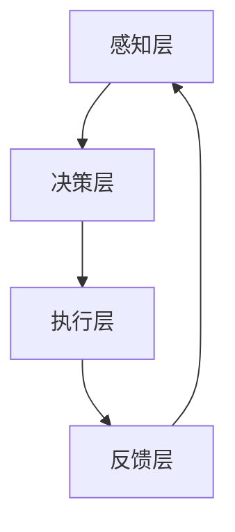

# AI人工智能代理工作流AI Agent WorkFlow：智能代理在智能家居中的实践

## 1. 背景介绍
### 1.1 人工智能在智能家居中的应用现状
随着人工智能技术的快速发展,智能家居领域也迎来了新的机遇和挑战。越来越多的智能家居产品开始集成人工智能技术,以提供更加智能化、个性化的服务。智能音箱、智能安防、智能照明等产品层出不穷,极大地改变了人们的生活方式。
### 1.2 智能代理在智能家居中的重要性
在智能家居场景中,智能代理扮演着至关重要的角色。智能代理可以作为用户与各种智能设备之间的桥梁,通过自然语言交互、语音控制等方式,让用户更加便捷地管理和控制家中的智能设备。同时,智能代理还可以通过数据分析和机器学习,不断优化服务,提供更加个性化的体验。
### 1.3 AI Agent Workflow的提出背景
尽管智能代理在智能家居中已经得到了广泛应用,但目前还缺乏一套标准化、系统化的工作流程。不同厂商的智能代理之间缺乏互通性,数据孤岛问题严重。为了解决这些问题,我们提出了AI Agent Workflow的概念,旨在为智能代理在智能家居中的应用提供一套标准化的工作流程和架构。

## 2. 核心概念与联系
### 2.1 AI Agent的定义与特点
AI Agent,即人工智能代理,是一种能够感知环境、自主决策并采取行动的智能实体。它具有以下特点:
- 自主性:能够独立地完成任务,无需人工干预。
- 社交能力:能够与用户、其他AI Agent以及环境进行交互。
- 反应能力:能够根据环境的变化做出实时反应。
- 主动性:能够主动地完成任务,而不是被动地等待命令。
- 连续性:能够持续运行,不间断地提供服务。
### 2.2 Workflow的定义与作用
Workflow,即工作流,是一系列有序的、相互关联的活动或任务,用于实现特定的业务目标。工作流可以帮助我们:
- 梳理业务流程,提高工作效率。
- 优化资源配置,减少人力成本。
- 规范操作流程,提高工作质量。
- 实现自动化,减少人为错误。
### 2.3 AI Agent Workflow的定义
AI Agent Workflow是将AI Agent的特点与Workflow的优势相结合,为智能代理在智能家居中的应用提供一套标准化的工作流程和架构。它包括以下几个关键要素:
- 感知层:负责采集用户需求和环境数据。
- 决策层:负责根据感知数据进行分析和决策。
- 执行层:负责根据决策结果采取相应的行动。
- 反馈层:负责收集用户反馈,优化工作流程。

下图是AI Agent Workflow的核心架构示意图:


## 3. 核心算法原理与具体操作步骤
### 3.1 感知层算法原理
感知层主要采用自然语言处理(NLP)和计算机视觉(CV)等技术,实现对用户需求和环境信息的采集和理解。
#### 3.1.1 自然语言处理
自然语言处理可以分为以下几个步骤:
1. 语音识别:将用户的语音指令转换为文本。
2. 分词和词性标注:将文本切分成有意义的词语,并标注每个词语的词性。
3. 句法分析:分析句子的语法结构,生成句法树。
4. 语义分析:理解句子的意思,抽取关键信息。
5. 指令生成:根据语义信息生成标准化的指令。

#### 3.1.2 计算机视觉
计算机视觉主要应用于图像识别和视频分析,具体步骤如下:
1. 图像预处理:对图像进行去噪、增强等预处理操作。
2. 特征提取:提取图像的特征,如SIFT、SURF等。
3. 目标检测:检测图像中的目标物体,如人脸、家具等。
4. 目标跟踪:跟踪视频中的移动目标。
5. 行为识别:识别目标的行为,如跌倒、闯入等。

### 3.2 决策层算法原理
决策层主要采用规则引擎和深度学习等技术,根据感知数据进行分析和决策。
#### 3.2.1 规则引擎
规则引擎通过预先设定的规则,对感知数据进行过滤和匹配,生成相应的决策结果。规则引擎的优点是可解释性强,缺点是灵活性差。
#### 3.2.2 深度学习
深度学习通过构建深度神经网络,自动提取数据中的特征,生成决策结果。深度学习的优点是可以处理海量非结构化数据,缺点是可解释性差。常见的深度学习算法包括:
- 卷积神经网络(CNN):主要用于图像识别和分类。
- 循环神经网络(RNN):主要用于序列数据的处理,如自然语言理解。
- 强化学习:通过奖惩机制,让AI Agent学习最优策略。

### 3.3 执行层算法原理
执行层主要采用智能控制算法,根据决策结果控制各种智能设备,实现自动化操作。常见的智能控制算法包括:
- PID控制:根据偏差的比例、积分、微分来调节控制量。
- 模糊控制:利用模糊集合论,将经验知识转化为控制策略。
- 自适应控制:根据系统参数的变化,自动调整控制器参数。

### 3.4 反馈层算法原理
反馈层主要采用用户行为分析和评价等技术,收集用户反馈,优化工作流程。
#### 3.4.1 用户行为分析
通过分析用户的操作日志、使用频率等数据,挖掘用户的使用习惯和偏好,为个性化服务提供依据。常见的用户行为分析方法包括:
- 关联规则挖掘:发现用户行为之间的关联关系。
- 聚类分析:将相似的用户划分到同一个群组。
- 序列模式挖掘:发现用户行为的时序模式。

#### 3.4.2 用户评价分析
通过收集用户的评价和反馈,分析用户的满意度和需求,不断改进服务质量。常见的评价分析方法包括:
- 情感分析:分析用户评价的情感倾向,如正面、负面、中性。
- 主题模型:从大量评价中提取隐含的主题和关键词。
- 评分预测:根据用户的历史评价,预测其对新服务的评分。

## 4. 数学模型和公式详细讲解举例说明
### 4.1 卷积神经网络(CNN)
卷积神经网络是一种常用的深度学习模型,特别适用于图像识别和分类任务。其数学模型可以表示为:

$$
x^{(l+1)}=f(W^{(l)}*x^{(l)}+b^{(l)})
$$

其中:
- $x^{(l)}$表示第$l$层的输入。
- $W^{(l)}$表示第$l$层的卷积核。
- $*$表示卷积操作。
- $b^{(l)}$表示第$l$层的偏置项。
- $f$表示激活函数,如ReLU、Sigmoid等。

举例来说,假设我们要识别一张$28\times28$的手写数字图像,可以设计如下的CNN模型:
```
Input(28x28x1) -> Conv(5x5x32) -> MaxPool(2x2) -> Conv(5x5x64) -> MaxPool(2x2) -> FC(1024) -> Output(10)
```
其中,Input表示输入层,Conv表示卷积层,MaxPool表示池化层,FC表示全连接层,Output表示输出层。每层的参数表示卷积核大小、卷积核数量或神经元数量。

### 4.2 强化学习
强化学习是一种通过奖惩机制让AI Agent学习最优策略的算法。其数学模型可以表示为:

$$
Q(s,a)=r+\gamma\max_{a'}Q(s',a')
$$

其中:
- $Q(s,a)$表示在状态$s$下采取行动$a$的价值。
- $r$表示采取行动$a$后获得的即时奖励。
- $\gamma$表示折扣因子,用于平衡即时奖励和未来奖励。
- $\max_{a'}Q(s',a')$表示在下一个状态$s'$下采取最优行动$a'$的最大价值。

举例来说,假设我们要训练一个智能体玩Atari游戏,可以将游戏画面作为状态$s$,将智能体的操作(如上、下、左、右)作为行动$a$,将游戏得分作为奖励$r$。智能体的目标就是通过不断尝试和学习,找到最优的操作策略,最大化累积奖励。

## 5. 项目实践：代码实例和详细解释说明
下面我们以一个智能家居场景为例,演示如何应用AI Agent Workflow进行项目实践。
### 5.1 场景描述
假设我们要开发一个智能音箱,具有语音控制、家电控制、音乐播放等功能。用户可以通过语音指令控制家中的灯光、空调、电视等设备,也可以让音箱播放音乐或回答问题。
### 5.2 感知层实现
在感知层,我们主要利用麦克风采集用户的语音指令,然后通过语音识别和自然语言处理技术,将语音转换为文本指令。以下是一个简单的语音识别代码示例(基于Python的SpeechRecognition库):

```python
import speech_recognition as sr

r = sr.Recognizer()
with sr.Microphone() as source:
    print("Please say something...")
    audio = r.listen(source)

try:
    text = r.recognize_google(audio, language='en-US')
    print("You said: " + text)
except sr.UnknownValueError:
    print("Could not understand audio")
except sr.RequestError as e:
    print("Could not request results; {0}".format(e))
```

### 5.3 决策层实现
在决策层,我们主要利用规则引擎和深度学习技术,根据用户指令进行语义理解和任务规划。以下是一个简单的规则引擎代码示例(基于Python的pyKnow库):

```python
from pyknow import *

class Light(Fact):
    pass

class LightControl(KnowledgeEngine):
    @Rule(Light(status='on'))
    def light_on(self):
        print("Light is on")
        
    @Rule(Light(status='off'))
    def light_off(self):
        print("Light is off")
        
    @Rule(AS.f << Light(status=L('on') | L('off')))
    def light_status(self, f):
        print("Light status is", f.status)

engine = LightControl()
engine.reset()
engine.declare(Light(status='on'))
engine.run()
```

### 5.4 执行层实现
在执行层,我们主要利用家电控制协议(如红外、射频等),根据决策结果控制各种智能家电。以下是一个使用红外控制空调的代码示例(基于Python的LIRC库):

```python
import lirc

sockid = lirc.init("aircon", blocking=False)
lirc.send_once("aircon", "on")
lirc.deinit()
```

### 5.5 反馈层实现
在反馈层,我们主要通过日志分析和用户反馈等方式,评估系统的性能和用户体验,并不断优化工作流程。以下是一个简单的日志分析代码示例(基于Python的Pandas库):

```python
import pandas as pd

df = pd.read_csv('user_log.csv')
print(df.describe())
print(df.groupby('action').size())
```

## 6. 实际应用场景
AI Agent Workflow可以应用于智能家居的各个场景,例如:
- 智能照明:通过语音控制或手机APP控制家中的灯光。
- 智能安防:通过摄像头和人脸识别技术,实现门禁控制和异常报警。
- 智能影音:通过语音控制或手势控制电视、音响等设备。
- 智能厨电:通过菜谱推荐和语音控制,实现烹饪自动化。
- 智能家电:通过手机APP或语音控制,实现空调、洗衣机等家电的远程操控。