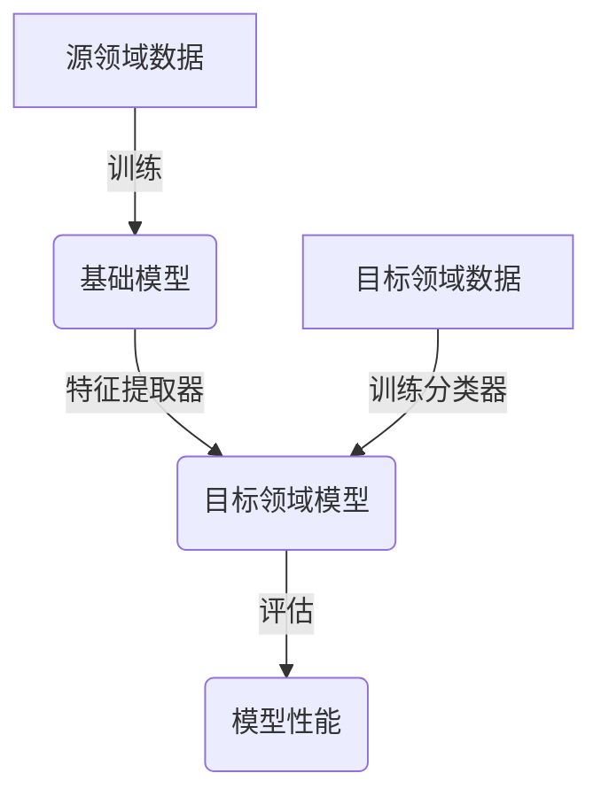
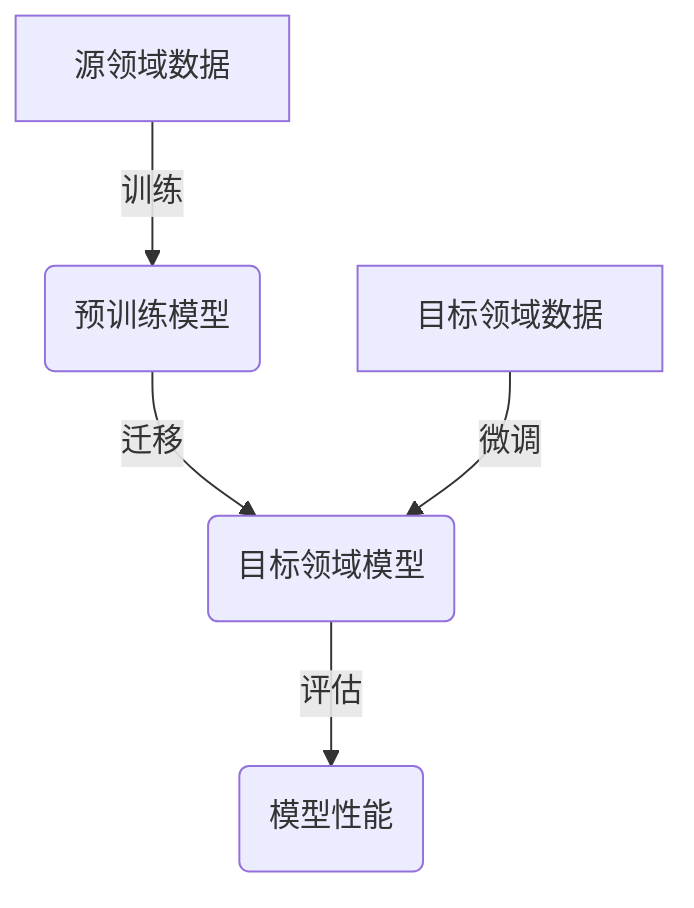
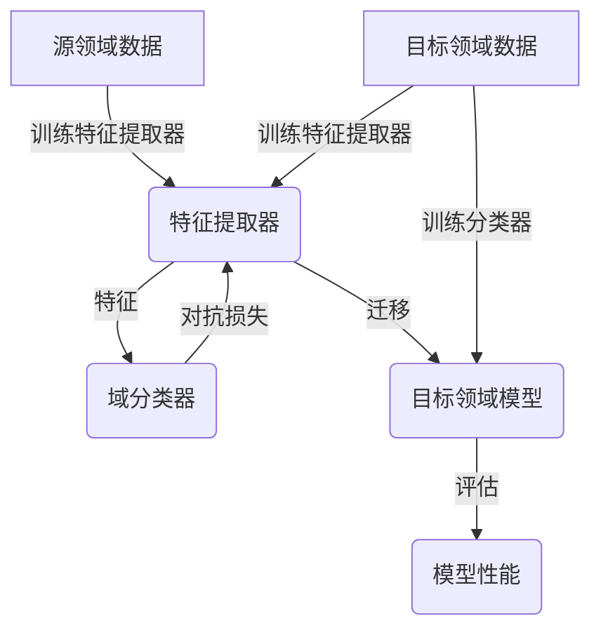

# AI人工智能核心算法原理与代码实例讲解：迁移学习

## 1.背景介绍

### 1.1 人工智能发展现状

人工智能(Artificial Intelligence, AI)是当代科技发展的前沿领域,近年来受到了前所未有的关注和投入。随着算力的不断提升、数据的爆炸式增长以及算法的创新,AI技术在诸多领域展现出了令人惊叹的能力,如计算机视觉、自然语言处理、决策系统等,正在深刻改变着人类的生产和生活方式。

然而,传统的AI系统需要大量高质量的标注数据进行训练,这使得AI系统的开发和应用受到了一定的限制。为了解决这一问题,迁移学习(Transfer Learning)应运而生,它利用已有的知识来帮助解决新的问题,从而减少了对大量标注数据的需求,极大地提高了AI系统的泛化能力和适用范围。

### 1.2 迁移学习的重要性

在现实世界中,我们常常会利用已有的知识和经验来解决新的问题。例如,一个人学会了打篮球,在学习网球时就会更快上手,因为两者都涉及到对运动球的把控。同样,在AI领域,如果一个模型已经学会了识别狗,那么当它需要识别猫时,就可以利用识别狗时学到的知识,从而加快训练过程。

迁移学习正是基于这一思路,它通过将在源领域学习到的知识迁移到目标领域,从而减少了目标领域的数据需求,提高了模型的泛化能力。由于标注高质量数据的成本极高,迁移学习为AI系统的开发和应用提供了一条捷径,因此被视为AI发展的重要方向之一。

## 2.核心概念与联系

### 2.1 迁移学习的定义

迁移学习是一种机器学习技术,它允许将在一个领域(源领域)学习到的知识应用到另一个领域(目标领域)。通过利用源领域的知识,模型在目标领域只需要较少的训练数据就可以获得良好的性能。

### 2.2 迁移学习的分类

根据源领域和目标领域的任务是否相同,迁移学习可以分为以下几种类型:

1. **域内迁移(Intra-Domain Transfer)**:源领域和目标领域的任务相同,但数据分布不同。例如,将在一个医院训练的癌症检测模型应用到另一个医院。

2. **域间迁移(Inter-Domain Transfer)**:源领域和目标领域的任务不同,但存在某种相关性。例如,将识别狗的模型迁移到识别猫的任务中。

3. **交叉域迁移(Cross-Domain Transfer)**:源领域和目标领域的任务完全不同,需要找到两个领域之间的隐式关系。例如,将自然语言处理模型迁移到计算机视觉任务中。

### 2.3 迁移学习的挑战

尽管迁移学习带来了诸多好处,但它也面临着一些挑战:

1. **域差异(Domain Shift)**:源领域和目标领域的数据分布存在差异,可能会导致模型在目标领域的性能下降。

2. **负迁移(Negative Transfer)**:源领域的知识对目标领域的任务反而产生了负面影响,降低了模型的性能。

3. **任务关联性(Task Relevance)**:源领域和目标领域之间的相关性越弱,迁移学习的效果就越差。

4. **计算复杂度(Computational Complexity)**:迁移学习往往需要对预训练模型进行微调,这增加了计算开销。

## 3.核心算法原理具体操作步骤

迁移学习的核心思想是利用源领域学习到的知识来帮助目标领域的学习,从而减少目标领域所需的训练数据。具体来说,迁移学习的步骤如下:

1. **预训练(Pre-training)**:在源领域的大量数据上训练一个基础模型,学习通用的特征表示。

2. **微调(Fine-tuning)**:将预训练模型迁移到目标领域,在目标领域的少量数据上进行进一步训练,使模型适应目标任务。

3. **评估(Evaluation)**:在目标领域的测试集上评估微调后模型的性能。

下面将详细介绍迁移学习的几种主要算法原理和具体操作步骤。

### 3.1 特征表示迁移

特征表示迁移是迁移学习中最简单也是最常见的方法。它的思路是:首先在源领域训练一个基础模型,学习通用的特征表示;然后将这个基础模型的特征提取部分迁移到目标领域,在目标领域的数据上训练一个新的分类器。具体步骤如下:

1. 在源领域的大量数据上训练一个基础模型(如卷积神经网络),获得通用的特征提取器。

2. 将基础模型的特征提取部分(如卷积层)迁移到目标领域的模型中,并冻结其权重。

3. 在目标领域的少量数据上,训练一个新的分类器(如全连接层),将特征映射到目标类别。

4. 在目标领域的测试集上评估模型性能。

特征表示迁移的优点是简单高效,但它假设源领域和目标领域的特征分布相似,否则性能可能会受到影响。

### 3.2 微调(Fine-tuning)

微调是一种常用的迁移学习方法,它在特征表示迁移的基础上,进一步对预训练模型的所有层(包括特征提取层和分类层)进行微调,以适应目标领域的任务。具体步骤如下:

1. 在源领域的大量数据上训练一个基础模型,获得通用的特征表示。

2. 将预训练模型(包括特征提取层和分类层)迁移到目标领域的模型中。

3. 在目标领域的少量数据上,对整个模型(包括所有层)进行微调训练,使其适应目标任务。

4. 在目标领域的测试集上评估微调后模型的性能。

微调的优点是可以充分利用源领域学习到的知识,并针对目标任务进行调整,通常能获得比特征表示迁移更好的性能。但它也需要更多的计算资源和目标领域的训练数据。

### 3.3 对抗迁移学习

对抗迁移学习(Adversarial Transfer Learning)是一种用于解决域差异问题的迁移学习方法。它的核心思想是:通过对抗训练,学习一个域不变的特征表示,使得源领域和目标领域的数据在这个特征空间中具有相似的分布,从而减小域差异对迁移的影响。具体步骤如下:

1. 在源领域的数据上训练一个特征提取器(如卷积神经网络的卷积层)。

2. 构建一个域分类器(Domain Classifier),其目标是根据特征能够区分源领域和目标领域的数据。

3. 构建一个对抗损失函数,使特征提取器学习到的特征能够最大化域分类器的损失(即使域分类器无法区分源领域和目标领域的数据)。

4. 在源领域和目标领域的数据上,同时优化特征提取器和域分类器,使特征提取器学习到域不变的特征表示。

5. 将学习到的特征提取器迁移到目标领域的任务模型中,在目标领域的数据上训练分类器。

6. 在目标领域的测试集上评估模型性能。

对抗迁移学习的优点是能够有效减小源领域和目标领域的域差异,提高迁移性能。但它需要同时训练特征提取器和域分类器,计算开销较大。

## 4.数学模型和公式详细讲解举例说明

### 4.1 特征表示迁移的损失函数

在特征表示迁移中,我们需要在目标领域的数据上训练一个新的分类器。假设我们有目标领域的训练数据 $\{(x_i, y_i)\}_{i=1}^N$,其中 $x_i$ 是输入特征,由预训练模型的特征提取器提取; $y_i$ 是对应的标签。我们希望学习一个分类器 $f(x; \theta)$,使得它能够很好地预测目标领域的标签。

我们可以使用交叉熵损失函数来优化分类器的参数 $\theta$:

$$
\mathcal{L}(\theta) = -\frac{1}{N}\sum_{i=1}^N \sum_{c=1}^C y_{i,c} \log f(x_i; \theta)_c
$$

其中 $C$ 是目标任务的类别数,  $y_{i,c}$ 是一个one-hot编码向量,表示样本 $x_i$ 的真实标签。 $f(x_i; \theta)_c$ 是模型预测的第 $c$ 类的概率。

通过最小化这个损失函数,我们可以学习到一个能够很好地预测目标领域标签的分类器。

### 4.2 微调的损失函数

在微调中,我们需要在目标领域的数据上对整个预训练模型(包括特征提取器和分类器)进行进一步训练。假设预训练模型的参数为 $\theta_0$,我们希望学习一个新的参数 $\theta$,使得模型在目标领域的性能最优。

我们可以使用和特征表示迁移相同的交叉熵损失函数:

$$
\mathcal{L}(\theta) = -\frac{1}{N}\sum_{i=1}^N \sum_{c=1}^C y_{i,c} \log f(x_i; \theta)_c
$$

其中 $f(x_i; \theta)$ 是整个模型(包括特征提取器和分类器)的输出。

在优化过程中,我们从预训练模型的参数 $\theta_0$ 开始,通过梯度下降等优化算法,不断更新参数 $\theta$,使得损失函数 $\mathcal{L}(\theta)$ 最小化。这样,我们就可以获得一个在目标领域表现良好的模型。

### 4.3 对抗迁移学习的损失函数

在对抗迁移学习中,我们需要同时优化特征提取器和域分类器,使得特征提取器学习到域不变的特征表示。假设特征提取器的参数为 $\theta_f$,域分类器的参数为 $\theta_d$,我们可以构建如下的对抗损失函数:

$$
\begin{aligned}
\min_{\theta_f} \max_{\theta_d} \quad & \mathcal{L}_{adv}(\theta_f, \theta_d) \\
= & \mathbb{E}_{x_s \sim P_s}[\log D(f(x_s; \theta_f); \theta_d)] \\
  & + \mathbb{E}_{x_t \sim P_t}[\log(1 - D(f(x_t; \theta_f); \theta_d))]
\end{aligned}
$$

其中 $P_s$ 和 $P_t$ 分别表示源领域和目标领域的数据分布, $f(x; \theta_f)$ 是特征提取器的输出, $D(f(x; \theta_f); \theta_d)$ 是域分类器预测输入特征来自源领域的概率。

这个损失函数的目标是:最大化域分类器正确分类源领域数据的概率,同时最小化它正确分类目标领域数据的概率。通过这种对抗训练,特征提取器就能够学习到域不变的特征表示,从而减小源领域和目标领域的域差异。

在实际优化中,我们通常采用梯度反转层(Gradient Reversal Layer)的技巧,将对抗