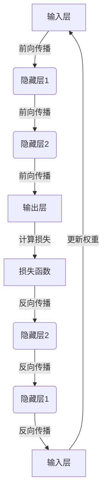

以下是标题为《AI人工智能深度学习算法：反向传播与优化方法》的技术博客文章正文内容：

# AI人工智能深度学习算法：反向传播与优化方法

## 1.背景介绍

### 1.1 深度学习的兴起

近年来，人工智能领域取得了长足的进步,尤其是深度学习技术的兴起,推动了计算机视觉、自然语言处理、语音识别等领域的飞速发展。深度学习是机器学习的一个新的研究热点,它模仿人脑神经网络结构,通过构建多层神经网络来自动学习数据特征,并用于分类、预测等任务。

### 1.2 反向传播算法的重要性

在深度学习的众多算法中,反向传播(Back Propagation)算法是最关键和最核心的算法之一。它是一种按照误差反向传播的方式,逐层迭代调整神经网络权重和偏置参数的算法,使得输出结果不断逼近期望值。反向传播算法的提出,解决了神经网络训练过程中如何有效调整网络参数的问题,是深度学习能够成功应用的关键所在。

### 1.3 优化方法的作用

在反向传播算法的基础上,研究人员还提出了多种优化方法,旨在加快训练收敛速度、提高泛化能力、避免陷入局部最优等。常见的优化方法包括动量优化、RMSProp、Adam等。选择合适的优化方法对于训练出高质量的深度学习模型至关重要。

## 2.核心概念与联系

### 2.1 神经网络结构



神经网络一般由输入层、隐藏层和输出层组成。在前向传播过程中,输入数据经过隐藏层的非线性变换,最终得到输出结果。通过将输出与真实标签计算损失函数,然后利用反向传播算法,从输出层向输入层逐层传播误差,并更新每层的权重和偏置参数,使损失函数值不断减小。

### 2.2 反向传播算法

反向传播算法的核心思想是:利用链式法则计算损失函数对每个权重的梯度,并沿着梯度的反方向更新权重,从而最小化损失函数。具体来说,包括以下几个步骤:

1. 前向传播,计算输出
2. 计算输出层损失
3. 反向传播,计算每层权重梯度
4. 根据梯度更新权重

通过不断迭代上述步骤,神经网络的权重会不断优化,输出结果逐渐逼近期望值。

### 2.3 优化方法

常见的优化方法主要有以下几种:

1. 动量优化: 在梯度更新时加入一个"动量"项,使得权重更新有一定的"惯性"。
2. RMSProp: 通过自适应调整每个参数的学习率,加快收敛。
3. Adam: 结合动量和RMSProp的优点,是目前较为常用的优化算法。

不同的优化方法对于不同的问题有不同的效果,需要根据具体情况选择合适的方法。

## 3.核心算法原理具体操作步骤

### 3.1 前向传播

对于一个单层神经网络,前向传播的计算过程如下:

1) 输入层到隐藏层:
$$z = W^Tx + b$$

2) 隐藏层激活函数(如Sigmoid):
$$a = \sigma(z) = \frac{1}{1+e^{-z}}$$  

3) 隐藏层到输出层: 
$$\hat{y} = W_2^Ta + b_2$$

其中$x$为输入数据,$W$和$b$为隐藏层的权重和偏置,$W_2$和$b_2$为输出层的权重和偏置,$\hat{y}$为输出结果。

对于多层神经网络,每层的输出作为下一层的输入,以此类推传播到输出层。

### 3.2 计算损失

常用的损失函数有均方误差损失函数(用于回归问题)和交叉熵损失函数(用于分类问题)。

对于均方误差损失函数:
$$J(\theta) = \frac{1}{2m}\sum_{i=1}^m(y^{(i)}-\hat{y}^{(i)})^2$$

对于交叉熵损失函数:
$$J(\theta) = -\frac{1}{m}\sum_{i=1}^m\left[y^{(i)}\log\hat{y}^{(i)}+(1-y^{(i)})\log(1-\hat{y}^{(i)})\right]$$

其中$m$为样本数量,$y$为真实标签,$\hat{y}$为输出结果,$\theta$为所有权重和偏置参数的集合。

### 3.3 反向传播

反向传播的核心是利用链式法则计算损失函数对每个权重的梯度。以单层神经网络为例:

1) 计算输出层梯度:
$$\delta^{(2)} = \hat{y} - y$$

2) 计算隐藏层梯度:
$$\delta^{(1)} = (W_2^T\delta^{(2)})\odot\sigma'(z)$$

3) 计算输出层权重梯度:
$$\frac{\partial J}{\partial W_2} = \delta^{(2)}a^T$$

4) 计算隐藏层权重梯度: 
$$\frac{\partial J}{\partial W} = \delta^{(1)}x^T$$

5) 计算偏置梯度:
$$\frac{\partial J}{\partial b_2} = \delta^{(2)}$$
$$\frac{\partial J}{\partial b} = \delta^{(1)}$$

对于多层神经网络,需要从输出层开始,逐层反向计算每层的梯度。

### 3.4 权重更新

计算出每个权重的梯度后,可以使用优化方法如梯度下降法对权重进行更新:

$$W \leftarrow W - \alpha\frac{\partial J}{\partial W}$$
$$b \leftarrow b - \alpha\frac{\partial J}{\partial b}$$

其中$\alpha$为学习率,控制每次更新的步长。不同的优化方法对权重的更新策略有所不同。

通过不断迭代上述反向传播和权重更新过程,神经网络的参数会不断优化,输出结果会逐渐逼近期望值。

## 4.数学模型和公式详细讲解举例说明

### 4.1 激活函数

激活函数引入了神经网络的非线性,是神经网络能够拟合复杂函数的关键。常见的激活函数有:

1. Sigmoid函数:
   $$\sigma(z) = \frac{1}{1+e^{-z}}$$

   Sigmoid函数的值域为(0,1),常用于二分类问题的输出层。但由于存在梯度消失问题,现在较少使用。

2. Tanh函数: 
   $$\tanh(z) = \frac{e^z-e^{-z}}{e^z+e^{-z}}$$

   Tanh函数的值域为(-1,1),相比Sigmoid函数收敛速度更快。

3. ReLU函数:
   $$\text{ReLU}(z) = \max(0, z)$$

   ReLU函数在正区间线性,负区间为0,计算简单且不存在梯度消失问题,是目前使用较多的激活函数。

   
例如,对于一个两层神经网络,其中隐藏层使用ReLU激活函数,输出层使用Sigmoid激活函数(二分类问题),前向传播过程为:

$$
\begin{aligned}
z^{[1]} &= W^{[1]}x+b^{[1]}\\  
a^{[1]} &= \text{ReLU}(z^{[1]})\\
z^{[2]} &= W^{[2]}a^{[1]}+b^{[2]}\\
\hat{y} &= \sigma(z^{[2]})
\end{aligned}
$$

### 4.2 损失函数

以二分类交叉熵损失函数为例,设有$m$个样本,每个样本的真实标签为$y^{(i)}\in\{0,1\}$,预测输出为$\hat{y}^{(i)}$,则损失函数为:

$$J(\theta) = -\frac{1}{m}\sum_{i=1}^m\left[y^{(i)}\log\hat{y}^{(i)}+(1-y^{(i)})\log(1-\hat{y}^{(i)})\right]$$

其中$\theta$为所有权重和偏置参数的集合。

交叉熵损失函数可以理解为:对于每个样本,如果$y=1$,则希望$\hat{y}$尽可能接近1,因此损失为$-\log\hat{y}$;如果$y=0$,则希望$\hat{y}$尽可能接近0,因此损失为$-\log(1-\hat{y})$。对所有样本的损失求平均,即为最终的损失函数值。

在训练过程中,目标是通过不断调整权重参数$\theta$,使得损失函数$J(\theta)$的值不断减小,从而使模型的输出结果$\hat{y}$逐渐逼近真实标签$y$。

### 4.3 梯度下降

梯度下降是神经网络训练中最常用的优化算法之一。以单变量函数$J(\theta)$为例,梯度下降法的更新规则为:

$$\theta \leftarrow \theta - \alpha\frac{\partial J(\theta)}{\partial\theta}$$

其中$\alpha$为学习率,控制每次更新的步长。$\frac{\partial J(\theta)}{\partial\theta}$为损失函数关于$\theta$的梯度,指示了$\theta$应该向哪个方向更新。

通过不断迭代上述更新规则,$\theta$会不断朝着损失函数下降的方向更新,最终收敛到(局部)最小值处。

对于神经网络中的每个权重$W$和偏置$b$,其梯度由反向传播算法计算得到,然后根据梯度下降法进行更新。

例如,对于单层神经网络,输出层权重$W_2$的梯度为:

$$\frac{\partial J}{\partial W_2} = \delta^{(2)}a^T$$

其中$\delta^{(2)}$为输出层梯度,由损失函数对输出的偏导数计算得到;$a$为隐藏层的激活值。

则$W_2$的更新规则为:

$$W_2 \leftarrow W_2 - \alpha\frac{\partial J}{\partial W_2}$$

通过类似的方式,可以计算并更新每层的权重和偏置参数。

### 4.4 其他优化方法

除了基本的梯度下降法,还有许多改进的优化算法,如动量优化、RMSProp、Adam等,能够进一步加快收敛速度。

以动量优化为例,其更新规则为:

$$
\begin{aligned}
v_t &= \gamma v_{t-1} + \eta\nabla_\theta J(\theta) \\
\theta &= \theta - v_t
\end{aligned}
$$

其中$v_t$为当前时刻的"动量",是之前所有梯度的指数加权平均;$\gamma$为动量衰减系数,控制"惯性"大小;$\eta$为学习率。

动量项$\gamma v_{t-1}$相当于给当前梯度增加了一个"惯性"方向,有助于加快收敛并且避免陷入局部最优。

Adam算法则结合了动量优化和RMSProp的优点,是一种常用的自适应学习率优化算法。

## 5.项目实践:代码实例和详细解释说明

以Python中的Pytorch框架为例,实现一个简单的全连接神经网络进行手写数字识别:

```python
import torch
import torch.nn as nn
import torchvision
import torchvision.transforms as transforms

# 加载MNIST数据集
train_dataset = torchvision.datasets.MNIST(root='./data', train=True, transform=transforms.ToTensor(), download=True)
test_dataset = torchvision.datasets.MNIST(root='./data', train=False, transform=transforms.ToTensor())

train_loader = torch.utils.data.DataLoader(dataset=train_dataset, batch_size=64, shuffle=True)
test_loader = torch.utils.data.DataLoader(dataset=test_dataset, batch_size=64, shuffle=False)

# 定义全连接神经网络
class Net(nn.Module):
    def __init__(self):
        super(Net, self).__init__()
        self.fc1 = nn.Linear(28 * 28, 512```python
        self.fc2 = nn.Linear(512, 256)
        self.fc3 = nn.Linear(256, 10)
        self.relu = nn.ReLU()

    def forward(self, x):
        x = x.view(-1, 28 * 28)  # 展平图像
        x = self.relu(self.fc1(x))
        x = self.relu(self.fc2(x))
        x = self.fc3(x)
        return x

# 实例化模型、定义损失函数和优化器
model = Net()
criterion = nn.CrossEntropyLoss()
optimizer = torch.optim.Adam(model.parameters(), lr=0.001)

# 训练模型
num_epochs = 5
for epoch in range(num_epochs):
    for i, (images, labels) in enumerate(train_loader):
        # 前向传播
        outputs = model(images)
        loss = criterion(outputs, labels)
        
        # 反向传播和优化
        optimizer.zero_grad()
        loss.backward()
        optimizer.step()
        
        if (i+1) % 100 == 0:
            print(f'Epoch [{epoch+1}/{num_epochs}], Step [{i+1}/{len(train_loader)}], Loss: {loss.item():.4f}')

# 测试模型
model.eval()  # 将模型设置为评估模式
with torch.no_grad():
    correct = 0
    total = 0
    for images, labels in test_loader:
        outputs = model(images)
        _, predicted = torch.max(outputs.data, 1)
        total += labels.size(0)
        correct += (predicted == labels).sum().item()

    print(f'Accuracy of the model on the 10000 test images: {100 * correct / total} %')
```

### 5.1 代码解释

1. **加载MNIST数据集**：使用 `torchvision.datasets` 加载MNIST数据集，并将其转换为张量。
2. **定义全连接神经网络**：创建一个简单的三层全连接神经网络，每层之间使用ReLU激活函数。
3. **实例化模型、定义损失函数和优化器**：使用交叉熵损失函数和Adam优化器。
4. **训练模型**：在训练过程中，通过前向传播计算损失，通过反向传播计算梯度，并使用优化器更新模型参数。
5. **测试模型**：在测试数据上评估模型的准确性。

### 6. 实际应用场景

#### 6.1 图像分类

全连接神经网络可以用于图像分类任务，如手写数字识别、物体识别等。通过训练模型，可以自动识别图像中的目标对象。

#### 6.2 语音识别

全连接神经网络也可以用于语音识别任务，将语音信号转换为文本。通过训练模型，可以识别语音中的单词和句子。

#### 6.3 自然语言处理

全连接神经网络在自然语言处理任务中也有广泛应用，如文本分类、情感分析等。通过训练模型，可以自动分析和处理自然语言文本。

### 7. 工具和资源推荐

#### 7.1 官方文档

PyTorch 官方文档：[https://pytorch.org/docs/stable/index.html](https://pytorch.org/docs/stable/index.html)

#### 7.2 开源项目

- MNIST 数据集：[http://yann.lecun.com/exdb/mnist/](http://yann.lecun.com/exdb/mnist/)
- PyTorch 示例：[https://github.com/pytorch/examples](https://github.com/pytorch/examples)

#### 7.3 在线课程

- Coursera 深度学习课程：[https://www.coursera.org/specializations/deep-learning](https://www.coursera.org/specializations/deep-learning)
- Udacity 深度学习课程：[https://www.udacity.com/course/deep-learning-nanodegree--nd101](https://www.udacity.com/course/deep-learning-nanodegree--nd101)

### 8. 总结：未来发展趋势与挑战

深度学习算法在各个领域中展现了强大的能力，但也面临一些挑战：

- **数据依赖性**：深度学习模型通常需要大量的数据进行训练，数据的质量和数量直接影响模型的性能。
- **计算资源需求**：训练深度学习模型需要大量的计算资源，特别是在处理高维数据和复杂模型时。
- **模型解释性**：深度学习模型通常被视为“黑箱”，缺乏对内部机制的透明性和解释性。
- **泛化能力**：模型在训练数据上的表现不一定能很好地泛化到未见过的数据，存在过拟合的风险。

未来，深度学习的发展将继续在以下几个方向上取得进展：

- **自监督学习**：通过自监督学习方法，减少对标注数据的依赖，提高模型的泛化能力。
- **模型压缩与加速**：通过模型压缩和加速技术，降低模型的计算和存储需求，使其在资源受限的环境中也能高效运行。
- **解释性与可解释AI**：提高深度学习模型的可解释性，使其在实际应用中更加透明和可信。
- **跨领域应用**：将深度学习技术应用到更多领域，如医疗、金融、自动驾驶等，解决实际问题。

### 9. 附录：常见问题与解答

#### 9.1 为什么我的模型训练过程中损失不下降？

- **学习率过高或过低**：调整学习率，尝试不同的学习率值。
- **数据预处理问题**：检查数据是否正确预处理，如标准化、归一化等。
- **模型过于复杂或过于简单**：根据任务需求调整模型的复杂度。
- **梯度消失或爆炸**：使用适当的初始化方法和正则化技术，如批归一化、梯度裁剪等。

#### 9.2 如何选择合适的优化器？

- **Adam**：适用于大多数任务，具有自适应学习率的优点。
- **SGD**：适用于大规模数据集，结合动量项效果更佳。
- **RMSprop**：适用于处理非平稳目标函数。

#### 9.3 如何避免模型过拟合？

- **正则化**：使用L2正则化、Dropout等技术。
- **数据增强**：通过数据增强技术生成更多样本，提高模型的泛化能力。
- **早停**：在验证集上监控模型性能，当性能不再提升时停止训练。

---

**作者：禅与计算机程序设计艺术 / Zen and the Art of Computer Programming**