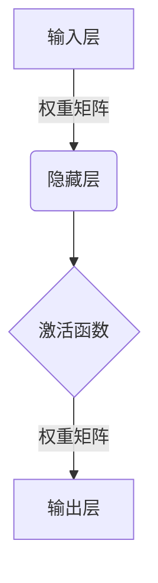
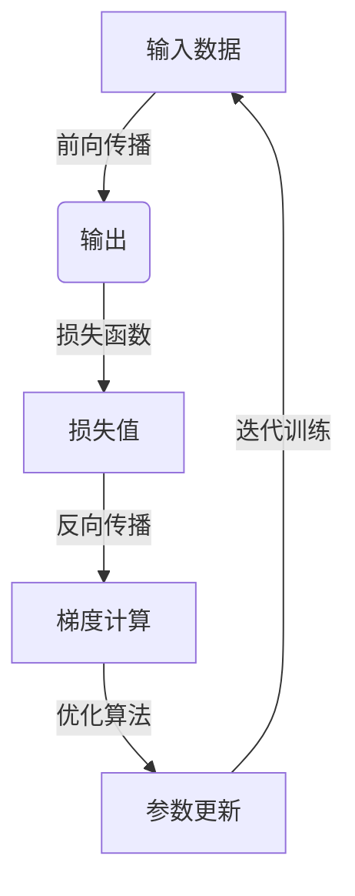

# AI人工智能深度学习算法：深度学习软件框架的掌握与应用

## 1.背景介绍

### 1.1 人工智能的兴起

人工智能(Artificial Intelligence, AI)是当代科技发展的重要领域,近年来受到了前所未有的关注和投资。AI技术的快速发展,为解决复杂问题提供了新的思路和方法,在众多领域展现出巨大的应用潜力。

### 1.2 深度学习的重要性

深度学习(Deep Learning)作为AI的核心技术之一,是机器学习研究的前沿方向。它通过对数据进行建模,能够自主学习数据特征,并用于分类、预测等任务。深度学习在计算机视觉、自然语言处理、推荐系统等领域取得了突破性进展。

### 1.3 软件框架的作用

深度学习算法的实现需要大量的数据、算力和编程工作,软件框架为开发者提供了高效的工具和环境支持。优秀的深度学习框架能够简化模型构建、训练、部署等流程,提高开发效率,促进AI技术的普及和应用。

## 2.核心概念与联系

### 2.1 神经网络

神经网络是深度学习的核心模型,它模拟了生物神经系统的工作原理。神经网络由多层神经元组成,每个神经元接收输入信号,经过激活函数处理后输出结果。通过训练调整网络参数,神经网络能够学习数据特征并完成各种任务。



### 2.2 深度学习模型

深度学习模型是在神经网络基础上发展而来的各种网络结构,常见的有:

- 卷积神经网络(CNN):擅长处理图像等高维数据
- 循环神经网络(RNN):适用于序列数据建模
- 生成对抗网络(GAN):可用于数据生成和转换
- transformer:自注意力机制在NLP等领域表现优异

不同模型针对不同任务而设计,开发者需要根据具体问题选择合适的模型。

### 2.3 训练策略

训练是深度学习模型学习数据特征的过程,包括:

- 数据预处理:清洗、标注、增强等步骤
- 损失函数:衡量模型输出与真实值的差异
- 优化算法:如梯度下降,用于更新模型参数
- 超参数调优:如学习率、批量大小等参数的选择

合理的训练策略对模型性能至关重要。

## 3.核心算法原理具体操作步骤  

### 3.1 前向传播

前向传播是神经网络的基本计算过程,输入数据经过多层神经元的加权求和和激活函数运算,最终得到输出结果。具体步骤如下:

1. 将输入数据 $x$ 与权重矩阵 $W$ 相乘,得到 $z=Wx$
2. 将 $z$ 输入激活函数 $f$,得到激活值 $a=f(z)$
3. 重复上述步骤直到输出层,得到最终输出 $y$

$$y=f(W_2(f(W_1x)))$$

其中 $W_1,W_2$ 分别为各层的权重矩阵, $f$ 为激活函数。

### 3.2 反向传播

反向传播用于根据损失函数计算每层参数的梯度,并通过优化算法如梯度下降更新网络参数,从而减小损失,提高模型精度。步骤如下:

1. 计算输出层损失函数关于输出的偏导数
2. 根据链式法则,计算损失对每层权重和偏置的梯度
3. 使用优化算法如SGD更新每层参数
4. 重复上述过程,直至模型收敛或达到最大迭代次数



### 3.3 正则化

为防止过拟合,常采用正则化技术,主要有:

- 权重衰减:对权重加L1或L2范数惩罚项
- Dropout:在训练时随机丢弃部分神经元
- 批量归一化:对每层输入进行归一化

### 3.4 模型集成

单一模型存在局限性,模型集成可提高泛化性能:

- averaging:对多个模型输出取平均
- boosting:依次训练弱模型,聚焦误差较大样本
- bagging:从原始数据中采样,训练多个模型

## 4.数学模型和公式详细讲解举例说明

### 4.1 线性模型

线性模型是最基础的机器学习模型,其数学表达式为:

$$y = w_1x_1 + w_2x_2 + ... + w_nx_n + b$$

其中 $x_i$ 为输入特征, $w_i$ 为对应权重, $b$ 为偏置项。线性模型简单直观,但只能拟合线性数据。

### 4.2 逻辑回归

对于二分类问题,常使用逻辑回归模型,其通过sigmoid函数将线性模型的输出映射到(0,1)区间内:

$$y = \sigma(w_1x_1 + w_2x_2 + ... + w_nx_n + b)$$
$$\sigma(x) = \frac{1}{1+e^{-x}}$$

sigmoid函数的导数易于计算,便于使用梯度下降法训练模型参数。

### 4.3 交叉熵损失函数

对于分类问题,常使用交叉熵作为损失函数:

$$J(\theta) = -\frac{1}{m}\sum_{i=1}^m[y^{(i)}\log(h_\theta(x^{(i)})) + (1-y^{(i)})\log(1-h_\theta(x^{(i)}))]$$

其中 $y$ 为真实标签, $h_\theta(x)$ 为模型输出, $m$ 为样本数。交叉熵可直观衡量预测值与真实值的差异。

### 4.4 梯度下降

梯度下降是最常用的优化算法,用于最小化目标函数。对于参数 $\theta$,其梯度为:

$$\nabla_\theta J(\theta) = \frac{\partial J(\theta)}{\partial\theta_1},\frac{\partial J(\theta)}{\partial\theta_2},...,\frac{\partial J(\theta)}{\partial\theta_n}$$

每次迭代更新参数:

$$\theta = \theta - \alpha\nabla_\theta J(\theta)$$

其中 $\alpha$ 为学习率,控制更新步长。

## 5.项目实践：代码实例和详细解释说明

以下是使用Python和PyTorch框架实现一个简单的前馈神经网络分类器的示例:

```python
import torch
import torch.nn as nn

# 定义网络结构
class FeedforwardNet(nn.Module):
    def __init__(self, input_size, hidden_size, output_size):
        super(FeedforwardNet, self).__init__()
        self.fc1 = nn.Linear(input_size, hidden_size) 
        self.relu = nn.ReLU()
        self.fc2 = nn.Linear(hidden_size, output_size)  
    
    def forward(self, x):
        out = self.fc1(x)
        out = self.relu(out)
        out = self.fc2(out)
        return out

# 实例化网络
net = FeedforwardNet(input_size=64, hidden_size=16, output_size=10)

# 定义损失函数和优化器
criterion = nn.CrossEntropyLoss() 
optimizer = torch.optim.SGD(net.parameters(), lr=0.01)

# 模型训练
for epoch in range(100):
    inputs = torch.randn(32, 64) # 批量输入数据
    labels = torch.randint(0, 10, (32,)) # 批量标签
    
    outputs = net(inputs) # 前向传播
    loss = criterion(outputs, labels) # 计算损失
    
    optimizer.zero_grad() # 梯度清零
    loss.backward() # 反向传播
    optimizer.step() # 更新参数
    
    # 打印损失
    if (epoch+1) % 10 == 0:
        print(f'Epoch: {epoch+1}, Loss: {loss.item():.4f}')
```

上述代码定义了一个包含输入层、隐藏层和输出层的前馈神经网络。在训练过程中,我们首先实例化网络,并定义交叉熵损失函数和SGD优化器。然后通过循环迭代,执行以下步骤:

1. 生成一批输入数据和标签
2. 通过网络的 `forward` 函数进行前向传播计算输出
3. 计算输出与标签之间的损失值
4. 调用 `backward` 执行反向传播计算梯度
5. 调用优化器的 `step` 函数更新网络参数
6. 打印当前迭代的损失值

通过上述代码示例,你可以了解到如何使用PyTorch框架定义神经网络结构、设置损失函数和优化器,以及执行前向传播、反向传播和参数更新的基本流程。

## 6.实际应用场景

深度学习在诸多领域展现出卓越的性能,下面介绍一些典型的应用场景:

### 6.1 计算机视觉

- 图像分类:识别图像中的物体类别
- 目标检测:定位图像中感兴趣的目标
- 语义分割:对图像像素级别进行分类
- 视频分析:行为识别、目标跟踪等

常用的模型包括卷积神经网络(CNN)及其变种,如VGGNet、ResNet、Faster R-CNN等。

### 6.2 自然语言处理

- 机器翻译:实现不同语言之间的自动翻译
- 文本分类:根据文本内容进行分类
- 文本生成:自动生成文本内容
- 问答系统:回答用户提出的自然语言问题

主要模型有循环神经网络(RNN)、transformer等,如LSTM、Bert等。

### 6.3 推荐系统

- 个性化推荐:根据用户历史行为推荐感兴趣的项目
- 协同过滤:利用多个用户的偏好进行推荐
- 序列推荐:预测用户下一步可能的行为

常用的模型包括矩阵分解、深度神经网络等。

### 6.4 其他领域

- 语音识别:将语音信号转录为文本
- 生成对抗网络:图像生成、图像转换等
- 强化学习:训练智能体与环境进行交互
- 医疗保健:辅助诊断、药物开发等

深度学习的应用领域正在不断扩展,展现出巨大的潜力。

## 7.工具和资源推荐

深度学习框架和工具的选择对实际开发至关重要,以下是一些推荐的资源:

### 7.1 深度学习框架

- **PyTorch**:动态计算图、Python先行编程范式
- **TensorFlow**:静态计算图、跨平台部署友好
- **Keras**:高层次API,简化模型构建流程
- **MXNet**:分布式训练、内存优化
- **PaddlePaddle**:产业级深度学习平台

### 7.2 硬件加速

- **GPU**:通过并行计算大幅提升训练速度
- **TPU**:Google开发的专用AI加速器
- **NPU**:华为Ascend AI处理器

### 7.3 开源社区

- **GitHub**:代码托管和协作平台
- **Papers with Code**:论文、代码和数据集汇总
- **OpenAI**:人工智能研究公司
- **fast.ai**:深度学习实战课程

### 7.4 教程和资源

- **深度学习理论与实战:提高篇**:人民邮电出版社
- **斯坦福深度学习课程**:吴恩达公开课
- **深度学习与计算机视觉实战**:Coursera专项课程
- **DeepLearning.AI**:吴恩达深度学习教育网站

合理利用这些优秀的框架、工具和资源,可以极大提升深度学习应用的开发效率。

## 8.总结:未来发展趋势与挑战

### 8.1 未来发展趋势

深度学习技术仍在快速发展中,未来可期的趋势包括:

- **模型自动化设计**:通过神经架构搜索等技术自动设计网络结构
- **少样本学习**:利用少量标注样本进行训练
- **多模态学习**:融合多种模态数据