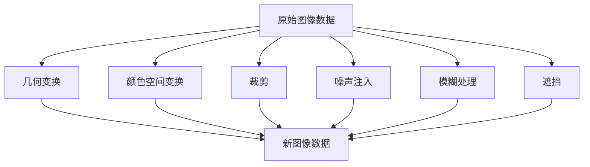
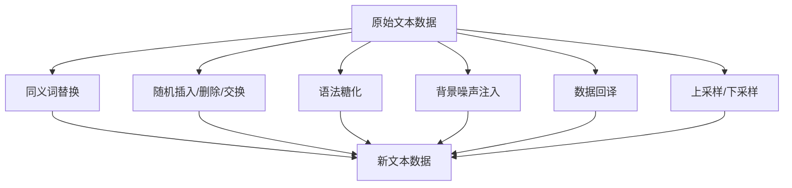
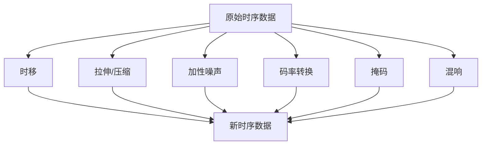

# AI数据增强之：数据增强的未来趋势与发展方向

## 1.背景介绍

数据是推动人工智能发展的关键燃料。高质量的数据集对于训练精确和高效的人工智能模型至关重要。然而,在许多应用场景中,获取足够的高质量数据通常是一个巨大的挑战。这就产生了数据增强(Data Augmentation)的概念和技术。

数据增强是一种通过对现有数据应用一系列转换操作(如旋转、平移、缩放等)来人为创建新数据样本的过程,从而扩充训练数据集的规模。这种技术最初在计算机视觉领域得到广泛应用,用于增加图像数据集的多样性,提高模型的泛化能力。随后,数据增强也逐渐扩展到自然语言处理、语音识别等其他领域。

### 数据增强的重要性

- **缓解数据稀缺问题**: 在某些领域,获取大量高质量数据的成本极高或者根本不可行,数据增强可以有效扩充数据集规模。
- **提高模型泛化能力**: 通过引入更多的数据变化,可以增强模型对噪声和扰动的鲁棒性,从而提高模型在真实环境中的泛化能力。
- **防止过拟合**: 数据增强可以为模型引入一定程度的噪声,有助于模型避免过度拟合训练数据。

## 2.核心概念与联系

数据增强的核心思想是通过对原始数据进行一系列的转换操作,生成新的、具有一定变化但仍保留原始语义的数据样本,从而扩充训练数据集的规模和多样性。

### 基本概念

- **标签保持不变**: 数据增强的前提是,转换操作不会改变数据的语义标签。
- **域内变换**: 转换操作应该保持在特定领域内,生成的新数据样本仍然属于同一个领域。
- **无监督/半监督**: 除了利用带标签的数据进行监督增强外,还可以利用大量无标签数据进行无监督或半监督的增强。

### 与其他技术的联系

- **数据清洗**: 数据增强与数据清洗是两个互补的过程,前者侧重于扩充数据量,后者则关注提高数据质量。
- **迁移学习**: 数据增强可以为迁移学习提供更加丰富的源域数据,从而提高模型在目标域的泛化能力。
- **元学习**: 数据增强可以被视为一种元学习策略,旨在提高模型对未见数据的适应能力。

## 3.核心算法原理具体操作步骤

数据增强算法的核心在于设计合理的转换操作,使生成的新数据样本能够保留原始语义,同时引入适当的变化以提高模型的泛化能力。不同的数据类型和应用场景需要采用不同的增强策略。

### 图像数据增强

图像数据增强是最早也是最广泛应用的一种形式,常见的操作包括:

1. **几何变换**: 旋转、平移、缩放、翻转等。
2. **颜色空间变换**: 亮度调整、对比度调整、色彩抖动等。
3. **裁剪**: 随机裁剪图像的一部分。
4. **噪声注入**: 高斯噪声、椒盐噪声等。
5. **模糊处理**: 高斯模糊、运动模糊等。
6. **遮挡**: 在图像上随机添加矩形或其他形状的遮挡块。

这些操作可以单独使用,也可以组合使用,形成复杂的增强流水线。



### 文本数据增强

对于文本数据,常见的增强操作包括:

1. **同义词替换**: 使用同义词替换部分单词。
2. **随机插入/删除/交换**: 随机插入、删除或交换文本中的单词或字符。
3. **语法糖化**: 将缩略语、缩写等展开为完整形式。
4. **背景噪声注入**: 在文本中注入一些无关的背景噪声。
5. **数据回译**: 将文本先翻译成其他语言,再翻译回原语言。
6. **上采样/下采样**: 对长文本进行截断或对短文本进行填充。

这些操作也可以组合使用,形成复杂的增强流水线。



### 语音/时序数据增强

对于语音、时序等数据,常见的增强操作包括:

1. **时移**: 沿时间轴平移数据。
2. **拉伸/压缩**: 沿时间轴拉伸或压缩数据。
3. **加性噪声**: 添加背景噪声或其他干扰。
4. **码率转换**: 改变数据的采样率。
5. **掩码**: 在时间或频率维度上对数据进行掩码。
6. **混响**: 模拟不同声学环境的混响效果。

同样,这些操作可以组合使用,形成复杂的增强流水线。



需要注意的是,不同类型的数据需要采用不同的增强策略,并且在具体实现时还需要考虑数据的特点和应用场景,合理设计和调整增强操作的参数。

## 4.数学模型和公式详细讲解举例说明

在数据增强过程中,一些常见的数学模型和公式可以为我们提供理论支持和指导。

### 图像几何变换

图像几何变换是图像数据增强中最常见的一类操作。它通过对图像进行平移、旋转、缩放等变换,生成新的图像样本。

几何变换可以用下面的公式来表示:

$$
\begin{bmatrix}
x' \\
y' \\
1
\end{bmatrix}
=
\begin{bmatrix}
a_{11} & a_{12} & a_{13} \\
a_{21} & a_{22} & a_{23} \\
0 & 0 & 1
\end{bmatrix}
\begin{bmatrix}
x \\
y \\
1
\end{bmatrix}
$$

其中$(x, y)$是原始图像上的像素坐标,$(x', y')$是变换后的像素坐标,$\begin{bmatrix}a_{11} & a_{12} & a_{13} \\ a_{21} & a_{22} & a_{23} \\ 0 & 0 & 1\end{bmatrix}$是$3\times 3$的变换矩阵。

通过设置不同的变换矩阵,我们可以实现不同的几何变换:

- **平移变换**:
  $$
  \begin{bmatrix}
  1 & 0 & t_x \\
  0 & 1 & t_y \\
  0 & 0 & 1
  \end{bmatrix}
  $$
  其中$t_x$和$t_y$分别表示沿x轴和y轴的平移量。

- **旋转变换**:
  $$
  \begin{bmatrix}
  \cos\theta & -\sin\theta & 0 \\
  \sin\theta & \cos\theta & 0 \\
  0 & 0 & 1
  \end{bmatrix}
  $$
  其中$\theta$表示旋转角度。

- **缩放变换**:
  $$
  \begin{bmatrix}
  s_x & 0 & 0 \\
  0 & s_y & 0 \\
  0 & 0 & 1
  \end{bmatrix}
  $$
  其中$s_x$和$s_y$分别表示沿x轴和y轴的缩放比例。

通过组合这些基本变换,我们可以实现更加复杂的几何变换。

### 图像颜色空间变换

另一类常见的图像数据增强操作是颜色空间变换,它通过改变图像的亮度、对比度、色彩等属性来生成新的样本。

一种常见的颜色空间变换是亮度调整,可以用下面的公式表示:

$$
I'(x, y) = \alpha I(x, y) + \beta
$$

其中$I(x, y)$是原始图像在$(x, y)$处的像素值,$I'(x, y)$是变换后的像素值,$\alpha$是亮度缩放系数,$\beta$是亮度偏移量。

对比度调整可以用下面的公式表示:

$$
I'(x, y) = \alpha(I(x, y) - \mu) + \mu
$$

其中$\mu$是图像的均值,控制对比度的缩放系数$\alpha$通常取值范围在$[0.5, 1.5]$之间。

此外,还可以对图像进行色彩抖动、色彩平衡等操作,以引入更多的颜色变化。

### 文本数据增强中的语言模型

在文本数据增强中,同义词替换是一种常见的操作。它通过使用同义词替换原文中的某些单词,生成新的文本样本。

同义词替换的关键在于如何找到合适的同义词。一种常见的方法是利用预训练的语言模型,根据上下文计算每个单词的语义向量,然后在词库中查找与之最相似的词作为替换。

具体来说,我们可以使用下面的公式计算两个单词$w_i$和$w_j$的语义相似度:

$$
\text{sim}(w_i, w_j) = \frac{\vec{v}_i \cdot \vec{v}_j}{\|\vec{v}_i\| \|\vec{v}_j\|}
$$

其中$\vec{v}_i$和$\vec{v}_j$分别表示$w_i$和$w_j$在语言模型中的词向量表示。

通过设置一个相似度阈值,我们可以找到所有与目标单词足够相似的同义词候选,并从中随机选择一个进行替换。

除了同义词替换,语言模型还可以用于其他文本数据增强操作,如语法糖化、背景噪声注入等。

### 语音数据增强中的时频分析

在语音数据增强中,常常需要对语音信号进行时域和频域上的变换,以引入适当的扰动。

时域变换包括时移、拉伸/压缩等操作。例如,时移操作可以用下面的公式表示:

$$
y'(t) = y(t - \tau)
$$

其中$y(t)$是原始语音信号,$y'(t)$是时移后的信号,$\tau$是时移量。

频域变换包括码率转换、掩码等操作。例如,码率转换可以用下面的公式表示:

$$
Y'(f) = Y\left(\frac{f}{r}\right)
$$

其中$Y(f)$是原始语音信号的频谱,$Y'(f)$是码率转换后的频谱,$r$是码率转换比例。

另外,语音数据增强中常常需要添加背景噪声或模拟混响效果。这些操作可以在时域或频域进行,具体取决于噪声或混响的性质。

## 5.项目实践:代码实例和详细解释说明

为了更好地理解数据增强的实现细节,我们以图像数据增强为例,介绍一个基于Python和OpenCV的代码实例。

```python
import cv2
import numpy as np

# 读取原始图像
img = cv2.imread('example.jpg')

# 几何变换
rows, cols = img.shape[:2]
M = cv2.getRotationMatrix2D((cols / 2, rows / 2), 30, 1)
img_rotated = cv2.warpAffine(img, M, (cols, rows))

# 颜色空间变换
img_bright = np.clip(1.5 * img + 30, 0, 255).astype(np.uint8)
img_contrast = np.