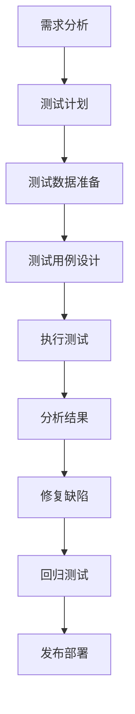

# AI测试与质量保证原理与代码实战案例讲解

## 1.背景介绍

随着人工智能(AI)系统在各行各业的广泛应用,确保这些系统的质量和可靠性变得至关重要。AI测试和质量保证已经成为软件开发生命周期中不可或缺的一个环节。本文将探讨AI测试和质量保证的核心原理,并通过实际案例讲解相关的代码实现。

### 1.1 AI系统的挑战

与传统软件系统相比,AI系统面临着一些独特的挑战:

1. **黑箱特性**: 许多AI模型(如深度神经网络)是黑箱,其内部决策过程难以解释和理解。
2. **数据驱动**: AI系统高度依赖于训练数据的质量和多样性。
3. **不确定性**: AI系统的输出具有一定的不确定性和随机性。
4. **环境敏感性**: AI系统的表现可能会受到运行环境(如硬件、操作系统等)的影响。

### 1.2 AI测试和质量保证的重要性

为了确保AI系统的可靠性和安全性,必须进行全面的测试和质量保证。这不仅有助于发现和修复错误,还可以增强系统的透明度和可解释性。AI测试和质量保证的主要目标包括:

1. **功能正确性**: 验证AI系统的输出是否符合预期。
2. **健壮性**: 测试AI系统在各种异常情况下的表现。
3. **公平性**: 确保AI系统不存在潜在的偏差或歧视。
4. **安全性**: 评估AI系统在各种攻击情况下的安全性。
5. **可解释性**: 提高AI系统决策过程的透明度和可解释性。

## 2.核心概念与联系

### 2.1 AI测试的类型

AI测试可以分为以下几种类型:

1. **单元测试**: 测试单个AI模型或组件的正确性。
2. **集成测试**: 测试多个AI模型或组件之间的集成和交互。
3. **系统测试**: 测试整个AI系统在真实或模拟环境中的表现。
4. **非功能性测试**: 测试AI系统的性能、安全性、可用性等非功能性需求。

### 2.2 AI质量属性

AI质量属性是评估AI系统质量的关键指标,包括:

1. **准确性**: AI系统输出的正确程度。
2. **鲁棒性**: AI系统在异常情况下的表现。
3. **公平性**: AI系统决策过程中是否存在偏差或歧视。
4. **安全性**: AI系统抵御攻击和误用的能力。
5. **可解释性**: AI系统决策过程的透明度和可理解性。
6. **可重复性**: AI系统在相同条件下产生一致结果的能力。
7. **隐私性**: AI系统对个人数据的保护程度。

### 2.3 AI测试工具

AI测试和质量保证过程中常用的工具包括:

1. **测试数据生成器**: 生成用于测试的数据集。
2. **模型监控工具**: 监控AI模型的性能和行为。
3. **模型解释工具**: 提高AI模型决策过程的可解释性。
4. **模糊测试工具**: 通过输入无效或异常数据来测试AI系统的鲁棒性。
5. **对抗性测试工具**: 评估AI系统对对抗性攻击的鲁棒性。

### 2.4 AI测试流程

AI测试流程通常包括以下步骤:



## 3.核心算法原理具体操作步骤

### 3.1 测试数据生成

生成高质量的测试数据对于AI测试至关重要。常用的测试数据生成技术包括:

1. **随机数据生成**: 基于预定义的分布随机生成测试数据。
2. **基于约束的生成**: 根据预定义的约束条件生成满足特定要求的测试数据。
3. **基于模型的生成**: 利用已有的AI模型生成新的测试数据。
4. **基于覆盖率的生成**: 生成能够最大化代码覆盖率的测试数据。

### 3.2 测试用例设计

设计高质量的测试用例对于全面测试AI系统至关重要。常用的测试用例设计技术包括:

1. **等价类划分**: 将输入数据划分为等价类,为每个等价类设计测试用例。
2. **边界值分析**: 测试输入数据的边界值情况。
3. **决策表测试**: 基于决策表生成测试用例。
4. **状态转移测试**: 测试系统在不同状态下的行为。
5. **场景测试**: 模拟真实场景,测试系统在复杂环境下的表现。

### 3.3 模型监控

持续监控AI模型的性能和行为对于确保系统质量至关重要。常用的模型监控技术包括:

1. **数据漂移检测**: 检测输入数据分布的变化,评估对模型性能的影响。
2. **概念漂移检测**: 检测模型在不同环境或时间点上的性能变化。
3. **异常检测**: 识别模型输出中的异常值或异常模式。
4. **性能基线建立**: 建立模型性能的基线,用于持续监控和比较。

### 3.4 模型解释

提高AI模型的可解释性对于建立信任和透明度至关重要。常用的模型解释技术包括:

1. **特征重要性分析**: 评估输入特征对模型预测的贡献程度。
2. **局部解释**: 解释模型对于特定输入实例的决策过程。
3. **全局解释**: 解释模型的整体决策逻辑和行为模式。
4. **可视化技术**: 使用图形和可视化方式呈现模型的内部结构和决策过程。

### 3.5 模糊测试

模糊测试是评估AI系统鲁棒性的有效方法。常用的模糊测试技术包括:

1. **数据变异**: 对输入数据进行小幅度的变异,观察系统的反应。
2. **语法模糊测试**: 生成语法上无效的输入数据,测试系统的容错能力。
3. **协议模糊测试**: 测试系统对于违反协议规范的输入数据的反应。
4. **并发模糊测试**: 模拟并发访问情况,测试系统的并发处理能力。

### 3.6 对抗性测试

对抗性测试旨在评估AI系统对于对抗性攻击的鲁棒性。常用的对抗性测试技术包括:

1. **对抗性样本生成**: 生成对抗性样本,测试模型对于微小扰动的鲁棒性。
2. **对抗性训练**: 在训练过程中引入对抗性样本,提高模型的鲁棒性。
3. **模型修复**: 通过对抗性训练或其他技术修复模型中的漏洞。
4. **防御评估**: 评估不同防御机制对于对抗性攻击的有效性。

## 4.数学模型和公式详细讲解举例说明

### 4.1 测试覆盖率指标

测试覆盖率是衡量测试质量的重要指标。常用的覆盖率指标包括:

1. **语句覆盖率 (Statement Coverage)**: 测试用例执行过的代码语句占总语句数的比例。

$$
C_s = \frac{N_s}{T_s}
$$

其中 $C_s$ 表示语句覆盖率, $N_s$ 表示执行过的语句数, $T_s$ 表示总语句数。

2. **分支覆盖率 (Branch Coverage)**: 测试用例执行过的代码分支占总分支数的比例。

$$
C_b = \frac{N_b}{T_b}
$$

其中 $C_b$ 表示分支覆盖率, $N_b$ 表示执行过的分支数, $T_b$ 表示总分支数。

3. **条件覆盖率 (Condition Coverage)**: 测试用例执行过的条件取值占总条件取值数的比例。

$$
C_c = \frac{N_c}{T_c \times 2^k}
$$

其中 $C_c$ 表示条件覆盖率, $N_c$ 表示执行过的条件取值数, $T_c$ 表示总条件数, $k$ 表示条件中的子条件数。

### 4.2 模型性能评估指标

评估AI模型性能的常用指标包括:

1. **准确率 (Accuracy)**: 正确预测的样本数占总样本数的比例。

$$
\text{Accuracy} = \frac{TP + TN}{TP + TN + FP + FN}
$$

其中 $TP$ 表示真正例数, $TN$ 表示真负例数, $FP$ 表示假正例数, $FN$ 表示假负例数。

2. **精确率 (Precision)**: 正确预测的正例数占预测为正例的总数的比例。

$$
\text{Precision} = \frac{TP}{TP + FP}
$$

3. **召回率 (Recall)**: 正确预测的正例数占实际正例总数的比例。

$$
\text{Recall} = \frac{TP}{TP + FN}
$$

4. **F1分数 (F1 Score)**: 精确率和召回率的加权调和平均值。

$$
\text{F1} = 2 \times \frac{\text{Precision} \times \text{Recall}}{\text{Precision} + \text{Recall}}
$$

### 4.3 对抗性攻击示例

对抗性攻击旨在生成对抗性样本,欺骗AI模型做出错误预测。一种常见的对抗性攻击方法是快速梯度符号法 (Fast Gradient Sign Method, FGSM)。

给定一个输入样本 $x$ 和其对应的标签 $y$,以及一个机器学习模型 $f$,FGSM生成对抗性样本 $x'$ 的过程如下:

$$
x' = x + \epsilon \cdot \text{sign}(\nabla_x J(x, y))
$$

其中 $J(x, y)$ 表示模型对于输入 $x$ 和标签 $y$ 的损失函数, $\nabla_x J(x, y)$ 表示损失函数关于输入 $x$ 的梯度, $\epsilon$ 是一个小的扰动系数, $\text{sign}(\cdot)$ 是符号函数。

通过添加微小的扰动,FGSM可以生成对抗性样本 $x'$,使得模型 $f$ 对其做出错误预测。

## 5.项目实践:代码实例和详细解释说明

在本节中,我们将通过一个实际项目案例,演示如何进行AI测试和质量保证。我们将使用Python编程语言和流行的机器学习库TensorFlow和Keras。

### 5.1 项目概述

我们将构建一个图像分类系统,用于识别手写数字。我们将使用MNIST数据集进行训练和测试。该项目包括以下几个主要部分:

1. 数据预处理
2. 模型构建和训练
3. 测试数据生成
4. 单元测试
5. 集成测试
6. 系统测试
7. 模型监控
8. 模型解释
9. 模糊测试
10. 对抗性测试

### 5.2 数据预处理

```python
import tensorflow as tf
from tensorflow import keras

# 加载MNIST数据集
(x_train, y_train), (x_test, y_test) = keras.datasets.mnist.load_data()

# 数据预处理
x_train = x_train.astype('float32') / 255.0
x_test = x_test.astype('float32') / 255.0

# 将标签转换为one-hot编码
y_train = keras.utils.to_categorical(y_train, num_classes=10)
y_test = keras.utils.to_categorical(y_test, num_classes=10)
```

在这个步骤中,我们加载MNIST数据集,并对数据进行预处理。我们将像素值缩放到0到1之间,并将标签转换为one-hot编码。

### 5.3 模型构建和训练

```python
# 构建模型
model = keras.Sequential([
    keras.layers.Flatten(input_shape=(28, 28)),
    keras.layers.Dense(128, activation='relu'),
    keras.layers.Dense(10, activation='softmax')
])

# 编译模型
model.compile(optimizer='adam',
              loss='categorical_crossentropy',
              metrics=['accuracy'])

# 训