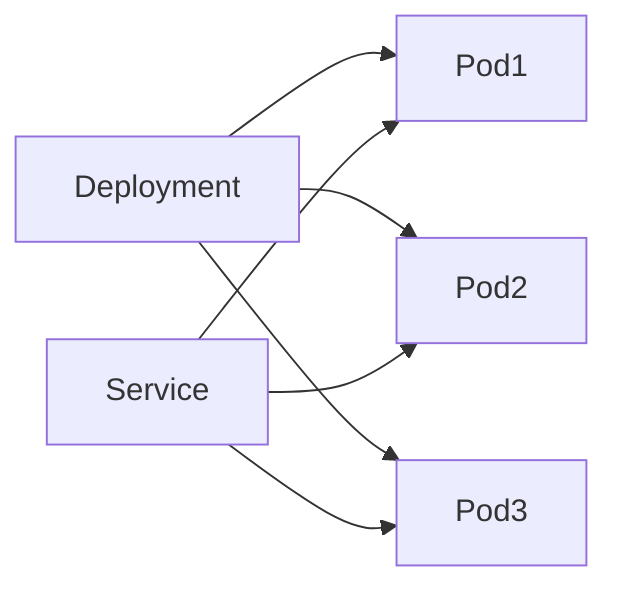

# AI系统Kubernetes原理与代码实战案例讲解

## 1.背景介绍

### 1.1 AI系统发展现状
近年来,人工智能(AI)技术取得了突飞猛进的发展。从计算机视觉、自然语言处理到强化学习,AI正在深刻影响和改变着各行各业。但是,随着AI模型和算法日益复杂,对计算资源和存储的需求也在不断增长。如何高效地管理和调度AI系统的资源,成为了一个亟待解决的问题。

### 1.2 Kubernetes在AI系统中的应用
Kubernetes(K8s)是一个开源的容器编排平台,最初由Google开发,现已成为事实上的容器编排标准。它提供了一个可扩展、高可用的分布式系统,能够自动化地部署、扩展和管理容器化应用。近年来,越来越多的AI系统开始采用Kubernetes来管理和调度资源,借助其强大的功能来提高AI系统的开发和运维效率。

### 1.3 本文的主要内容
本文将深入探讨Kubernetes在AI系统中的应用原理和实践。我们将从Kubernetes的核心概念入手,介绍其架构设计和关键组件。然后,我们将重点讲解如何利用Kubernetes来构建和部署AI应用,包括如何打包AI模型、如何设计AI工作流、如何进行资源调度和弹性伸缩等。同时,我们还将结合实际的代码案例,演示如何使用Kubernetes的API和工具来管理AI应用的生命周期。最后,我们将展望Kubernetes在AI领域的发展趋势和面临的挑战。

## 2.核心概念与联系

### 2.1 Pod
Pod是Kubernetes中最小的调度单元,由一个或多个容器组成。Pod中的容器共享存储和网络资源,并且可以通过localhost通信。在AI系统中,我们通常会将AI模型和相关的依赖库打包到一个Pod中,从而实现AI应用的封装和隔离。

### 2.2 Deployment
Deployment是Kubernetes中用于管理Pod的高层抽象,它描述了一组Pod的期望状态,包括副本数、更新策略等。通过Deployment,我们可以方便地实现AI应用的滚动更新、回滚等操作。

### 2.3 Service
Service是Kubernetes中用于实现服务发现和负载均衡的组件。它为一组Pod提供了一个固定的IP地址和DNS名称,使得其他Pod可以通过Service访问到这组Pod。在AI系统中,我们可以使用Service将AI模型服务化,提供稳定的访问入口。

### 2.4 核心概念之间的关系

下面是一个简单的Mermaid流程图,展示了Pod、Deployment和Service之间的关系:



Deployment负责管理和调度一组Pod,而Service则为这组Pod提供了统一的访问接口。

## 3.核心算法原理具体操作步骤

### 3.1 打包AI模型
要在Kubernetes中部署AI应用,首先需要将AI模型和相关依赖打包成Docker镜像。以下是具体步骤:

1. 准备AI模型文件和依赖库
2. 编写Dockerfile,描述如何构建Docker镜像
3. 使用docker build命令构建Docker镜像
4. 将Docker镜像推送到镜像仓库

### 3.2 创建Deployment
有了AI模型的Docker镜像后,我们就可以创建Deployment来部署AI应用了。以下是具体步骤:

1. 编写Deployment的YAML文件,描述Pod的配置信息
2. 使用kubectl apply命令创建Deployment
3. 使用kubectl get命令查看Deployment的状态
4. 使用kubectl scale命令实现Deployment的扩缩容

### 3.3 创建Service
为了让其他Pod能够访问到AI模型服务,我们还需要创建Service。以下是具体步骤:

1. 编写Service的YAML文件,描述Service的配置信息
2. 使用kubectl apply命令创建Service 
3. 使用kubectl get命令查看Service的状态
4. 在其他Pod中通过Service的DNS名称访问AI模型服务

## 4.数学模型和公式详细讲解举例说明

### 4.1 资源调度模型
Kubernetes中的资源调度问题可以抽象为一个多维背包问题。假设有n个Pod和m台机器,每个Pod有cpu和memory两种资源需求,每台机器有cpu_capacity和memory_capacity两种资源容量。我们的目标是找到一种Pod到机器的映射方案,使得所有Pod的资源需求得到满足,同时尽可能提高机器的资源利用率。

我们可以定义如下的数学模型:

$$
\begin{aligned}
&\text{maximize} \quad \sum_{i=1}^n \sum_{j=1}^m x_{ij} \\
&\text{subject to} \quad \sum_{i=1}^n cpu_i \cdot x_{ij} \leq cpu\_capacity_j, \forall j=1,2,\dots,m \\
&\phantom{\text{subject to} \quad} \sum_{i=1}^n memory_i \cdot x_{ij} \leq memory\_capacity_j, \forall j=1,2,\dots,m \\
&\phantom{\text{subject to} \quad} \sum_{j=1}^m x_{ij} = 1, \forall i=1,2,\dots,n \\
&\phantom{\text{subject to} \quad} x_{ij} \in \{0, 1\}, \forall i=1,2,\dots,n, \forall j=1,2,\dots,m
\end{aligned}
$$

其中,$x_{ij}$是一个二元变量,表示是否将第i个Pod调度到第j台机器上。$cpu_i$和$memory_i$分别表示第i个Pod的cpu和memory需求,$cpu\_capacity_j$和$memory\_capacity_j$分别表示第j台机器的cpu和memory容量。

### 4.2 弹性伸缩模型
在Kubernetes中,我们可以根据AI应用的负载情况动态调整Pod的数量,实现弹性伸缩。假设当前有n个Pod,每个Pod的cpu利用率为$u_i$,我们希望将所有Pod的平均cpu利用率控制在目标值$t$附近。

我们可以定义如下的数学模型:

$$
\begin{aligned}
&\text{minimize} \quad \left| \frac{\sum_{i=1}^n u_i}{n} - t \right| \\
&\text{subject to} \quad n_{min} \leq n \leq n_{max} \\
&\phantom{\text{subject to} \quad} n \in \mathbb{Z}^+
\end{aligned}
$$

其中,$n$表示Pod的数量,$n_{min}$和$n_{max}$分别表示Pod数量的下界和上界。我们的目标是找到最优的$n$值,使得平均cpu利用率尽可能接近目标值$t$。

在实际应用中,我们可以周期性地监测Pod的cpu利用率,并根据上述模型计算出最优的Pod数量,然后通过Kubernetes的Horizontal Pod Autoscaler(HPA)组件来自动调整Pod的数量。

## 5.项目实践：代码实例和详细解释说明

下面我们通过一个具体的代码实例,演示如何使用Kubernetes的Python客户端库来管理AI应用。

### 5.1 安装Kubernetes Python客户端库

首先,我们需要安装Kubernetes的Python客户端库:

```bash
pip install kubernetes
```

### 5.2 创建Deployment

```python
from kubernetes import client, config

# 加载Kubernetes配置
config.load_kube_config()

# 创建API客户端
api_client = client.ApiClient()
apps_v1 = client.AppsV1Api(api_client)

# 定义Deployment
deployment = client.V1Deployment(
    api_version="apps/v1",
    kind="Deployment",
    metadata=client.V1ObjectMeta(name="ai-deployment"),
    spec=client.V1DeploymentSpec(
        replicas=3,
        selector=client.V1LabelSelector(
            match_labels={"app": "ai-model"}
        ),
        template=client.V1PodTemplateSpec(
            metadata=client.V1ObjectMeta(
                labels={"app": "ai-model"}
            ),
            spec=client.V1PodSpec(
                containers=[
                    client.V1Container(
                        name="ai-container",
                        image="ai-model:v1",
                        ports=[client.V1ContainerPort(container_port=80)]
                    )
                ]
            )
        )
    )
)

# 创建Deployment
apps_v1.create_namespaced_deployment(
    namespace="default",
    body=deployment
)
```

在上面的代码中,我们首先加载Kubernetes配置并创建API客户端。然后,我们定义了一个Deployment对象,指定了副本数、标签选择器、Pod模板等信息。最后,我们调用create_namespaced_deployment方法来创建Deployment。

### 5.3 创建Service

```python
from kubernetes import client, config

# 加载Kubernetes配置  
config.load_kube_config()

# 创建API客户端
api_client = client.ApiClient()
core_v1 = client.CoreV1Api(api_client)

# 定义Service
service = client.V1Service(
    api_version="v1",
    kind="Service",
    metadata=client.V1ObjectMeta(name="ai-service"),
    spec=client.V1ServiceSpec(
        selector={"app": "ai-model"},
        ports=[client.V1ServicePort(port=80, target_port=80)]
    )
)

# 创建Service
core_v1.create_namespaced_service(
    namespace="default",
    body=service
)
```

在上面的代码中,我们定义了一个Service对象,指定了标签选择器和端口映射信息。然后,我们调用create_namespaced_service方法来创建Service。

### 5.4 实现弹性伸缩

```python
from kubernetes import client, config

# 加载Kubernetes配置
config.load_kube_config()

# 创建API客户端  
api_client = client.ApiClient()
auto_scaling_v1 = client.AutoscalingV1Api(api_client)

# 定义HPA
hpa = client.V1HorizontalPodAutoscaler(
    api_version="autoscaling/v1",
    kind="HorizontalPodAutoscaler",
    metadata=client.V1ObjectMeta(name="ai-hpa"),
    spec=client.V1HorizontalPodAutoscalerSpec(
        max_replicas=10,
        min_replicas=1,
        target_cpu_utilization_percentage=50,
        scale_target_ref=client.V1CrossVersionObjectReference(
            api_version="apps/v1",
            kind="Deployment",
            name="ai-deployment"
        )
    )
)

# 创建HPA
auto_scaling_v1.create_namespaced_horizontal_pod_autoscaler(
    namespace="default",
    body=hpa
)
```

在上面的代码中,我们定义了一个HPA对象,指定了最大/最小副本数、目标cpu利用率等信息。然后,我们调用create_namespaced_horizontal_pod_autoscaler方法来创建HPA。

通过上述代码示例,我们演示了如何使用Kubernetes的Python客户端库来管理AI应用的生命周期。在实际项目中,我们还可以进一步封装这些操作,提供更高层次的AI平台和工作流管理功能。

## 6.实际应用场景

Kubernetes在AI系统中有广泛的应用场景,下面列举几个典型的例子:

### 6.1 机器学习平台
很多企业和组织都在构建自己的机器学习平台,提供数据处理、模型训练、模型服务等功能。Kubernetes可以作为这些平台的基础设施,提供容器编排和资源管理能力。例如,Kubeflow就是一个基于Kubernetes的机器学习平台,提供了Jupyter Notebook、TensorFlow Training、模型服务等组件。

### 6.2 深度学习训练
深度学习模型的训练需要大量的计算资源和分布式并行处理。Kubernetes可以帮助我们管理和调度这些训练任务,动态分配GPU等资源。例如,腾讯的Angel系统就是一个基于Kubernetes的大规模机器学习和深度学习平台,支持了众多内部和外部的AI应用。

### 6.3 推理服务
训练好的AI模型需要部署成在线服务,响应实时的请求。Kubernetes可以帮助我们管理和扩展这些推理服务,提供负载均衡和自动扩缩容能力。例如,Nvidia的Triton Inference Server就支持基于Kubernetes的部署,可以方便地将AI模型部署成高可用、高性能的推理服务。

### 6.4 数据处理和分析
AI系统离不开数据的支撑,需要进行大规模的数据处理、特征工程等工作。Kubernetes可以方便地编排和调度这些数据处理工作流,实现数据到模型的自动化过程。例如,Airbnb的Bighead平台就是一个基于Kubernetes的机器学习特征生成和管理平台。

## 7.工具和资源推荐

### 7.1 官方文档
- [Kubernetes官方文档](https://kubernetes.io/docs/home/)
- [Kubernetes API参考文档](https://kubernetes.io/docs/reference/generated/kubernetes-api/v1.21/)