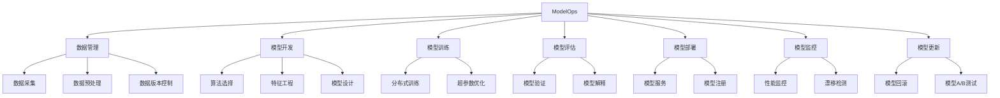

# AI系统ModelOps原理与代码实战案例讲解

## 1.背景介绍

随着人工智能(AI)和机器学习(ML)技术的快速发展,越来越多的企业和组织开始将AI系统应用于各种场景,如计算机视觉、自然语言处理、推荐系统等。然而,AI系统的开发和部署过程往往是复杂和具有挑战性的。ModelOps(Model Operations)应运而生,旨在简化和优化AI系统的整个生命周期管理。

ModelOps是DevOps(开发运维一体化)实践在AI/ML领域的延伸,它将软件工程的最佳实践引入到AI系统的开发、部署和管理中。通过ModelOps,组织可以更高效、更可靠地交付AI解决方案,加快AI投资回报,并确保AI模型在生产环境中的持续性能和可靠性。

## 2.核心概念与联系

ModelOps涵盖了AI系统生命周期的各个阶段,包括数据管理、模型开发、模型训练、模型评估、模型部署、模型监控和模型更新等。它与DevOps、MLOps(机器学习操作)和AIOps(AI操作)等概念密切相关,但又有所区别。

### 2.1 DevOps与ModelOps

DevOps是一种软件开发实践,旨在加快软件交付过程,确保软件的高质量和可靠性。它强调开发人员和运维人员之间的协作,以及自动化和持续集成/持续交付(CI/CD)实践。

ModelOps则专注于AI/ML系统的生命周期管理。它借鉴了DevOps的许多实践,如版本控制、自动化测试、持续集成和持续部署等。但是,ModelOps还需要处理AI/ML系统独有的挑战,如数据管理、模型评估、模型监控和模型更新等。

### 2.2 MLOps与ModelOps

MLOps是ModelOps的一个子集,主要关注机器学习模型的开发、部署和管理。它涵盖了ModelOps中与模型相关的阶段,如模型开发、模型训练、模型评估、模型部署和模型监控等。

ModelOps则是一个更广泛的概念,不仅包括MLOps,还包括数据管理、模型更新和其他与AI系统相关的操作。

### 2.3 AIOps与ModelOps

AIOps(AI for IT Operations)是将AI/ML技术应用于IT运维领域,旨在提高IT运维的效率和自动化程度。它可以用于事件监控、故障预测、性能优化等场景。

ModelOps与AIOps有一定的重叠,因为ModelOps中的模型监控和模型更新等阶段可以借助AIOps技术来实现。但是,ModelOps的范围更广,涵盖了AI系统整个生命周期的管理。

## 3.核心算法原理具体操作步骤

ModelOps的核心算法原理主要体现在以下几个方面:

### 3.1 模型版本控制

模型版本控制是ModelOps中一个关键的实践。它确保模型的可追溯性和可重复性,并支持模型的回滚和A/B测试等操作。

常见的模型版本控制步骤如下:

1. **建立模型存储库**: 使用版本控制系统(如Git)建立一个中央模型存储库,用于存储模型代码、配置文件、元数据等。
2. **模型打包**: 将模型及其依赖项打包成一个可部署的artifact(如Docker镜像或conda环境)。
3. **模型注册**: 在模型注册表中注册模型artifact,并为其分配唯一的版本号。
4. **模型部署**: 从模型注册表中检出特定版本的模型,并将其部署到生产环境中。
5. **模型回滚**: 如果发现问题,可以将模型回滚到之前的版本。
6. **模型A/B测试**: 在生产环境中并行运行多个模型版本,并比较它们的性能。

### 3.2 模型监控

模型监控是ModelOps中另一个关键实践,它确保模型在生产环境中的持续性能和可靠性。

常见的模型监控步骤如下:

1. **定义监控指标**: 确定需要监控的关键指标,如准确率、精确率、召回率、延迟等。
2. **建立监控基线**: 在模型部署前,建立监控指标的基线值。
3. **实时监控**: 在模型运行时,持续监控指标值,并与基线值进行比较。
4. **异常检测**: 当指标值偏离基线值超过预设阈值时,触发异常警报。
5. **漂移检测**: 监控输入数据分布和模型输出分布,检测是否发生了数据漂移或概念漂移。
6. **根因分析**: 对异常和漂移进行根因分析,确定是否需要重新训练或更新模型。

### 3.3 模型更新

模型更新是ModelOps中的另一个重要环节,它确保模型能够随着时间的推移而保持最新和高效。

常见的模型更新步骤如下:

1. **确定更新需求**: 基于模型监控结果和业务需求,确定是否需要更新模型。
2. **数据收集**: 收集新的训练数据,并进行数据预处理和特征工程。
3. **模型重训练**: 使用新数据重新训练模型,并进行模型评估和验证。
4. **模型测试**: 在测试环境中对新模型进行全面测试,包括功能测试、性能测试和集成测试等。
5. **模型部署**: 如果新模型通过测试,则将其部署到生产环境中。
6. **模型监控**: 对新模型进行持续监控,确保其性能和可靠性。

### 3.4 自动化和持续集成/持续交付(CI/CD)

为了提高ModelOps的效率和可靠性,自动化和CI/CD实践是必不可少的。

常见的自动化和CI/CD步骤如下:

1. **构建自动化**: 自动化模型构建过程,包括数据预处理、特征工程、模型训练和模型评估等步骤。
2. **测试自动化**: 自动化模型测试过程,包括单元测试、集成测试和端到端测试等。
3. **部署自动化**: 自动化模型部署过程,包括模型打包、模型注册和模型部署等步骤。
4. **监控自动化**: 自动化模型监控过程,包括指标收集、异常检测和漂移检测等步骤。
5. **CI/CD管道**: 建立端到端的CI/CD管道,将上述自动化步骤串联起来,实现从代码提交到模型部署的自动化流程。

## 4.数学模型和公式详细讲解举例说明

在ModelOps中,数学模型和公式扮演着重要的角色,尤其在模型开发和模型评估阶段。以下是一些常见的数学模型和公式:

### 4.1 监督学习模型

监督学习是机器学习中最常见的任务之一,它旨在从标记数据中学习一个映射函数,以预测新数据的标签或目标值。常见的监督学习模型包括线性回归、逻辑回归、决策树、随机森林、支持向量机(SVM)和神经网络等。

#### 4.1.1 线性回归

线性回归是一种简单但有效的监督学习算法,用于预测连续目标变量。它假设目标变量y和特征向量x之间存在线性关系,可以用以下公式表示:

$$y = \theta_0 + \theta_1x_1 + \theta_2x_2 + ... + \theta_nx_n$$

其中$\theta_0$是偏置项,$\theta_1, \theta_2, ..., \theta_n$是特征权重。线性回归的目标是找到最小化均方误差的$\theta$值:

$$\min_\theta \sum_{i=1}^{m}(y_i - \hat{y}_i)^2$$

其中$m$是训练样本数,$y_i$是真实目标值,$\hat{y}_i$是预测值。

#### 4.1.2 逻辑回归

逻辑回归是一种用于分类任务的监督学习算法。它使用logistic函数(也称为sigmoid函数)将线性模型的输出映射到(0,1)范围内,从而预测实例属于某个类别的概率。

对于二分类问题,逻辑回归模型可以表示为:

$$P(y=1|x) = \frac{1}{1 + e^{-(\theta_0 + \theta_1x_1 + \theta_2x_2 + ... + \theta_nx_n)}}$$

其中$y=1$表示正例,$y=0$表示负例。模型的目标是最大化训练数据的对数似然函数:

$$\max_\theta \sum_{i=1}^{m}[y_i\log P(y_i=1|x_i) + (1-y_i)\log(1-P(y_i=1|x_i))]$$

对于多分类问题,可以使用Softmax回归或一对其余(One-vs-Rest)策略。

### 4.2 无监督学习模型

无监督学习旨在从未标记的数据中发现隐藏的模式或结构。常见的无监督学习模型包括聚类算法(如K-Means、层次聚类)和降维算法(如主成分分析、t-SNE)等。

#### 4.2.1 K-Means聚类

K-Means是一种常用的聚类算法,它将数据划分为K个簇,使得每个数据点都属于离它最近的簇的质心。算法的目标是最小化所有数据点到其所属簇质心的平方距离之和:

$$\min_{\mu_1, \mu_2, ..., \mu_K} \sum_{i=1}^{m}\sum_{k=1}^{K}r_{ik}||x_i - \mu_k||^2$$

其中$m$是数据点数,$K$是簇数,$\mu_k$是第$k$个簇的质心,$r_{ik}$是指示函数,如果$x_i$属于第$k$个簇,则$r_{ik}=1$,否则$r_{ik}=0$。

K-Means算法通过迭代的方式优化目标函数,直到簇分配不再发生变化。

#### 4.2.2 主成分分析(PCA)

主成分分析(PCA)是一种常用的降维技术,它通过线性变换将高维数据投影到一个低维子空间,同时尽可能保留数据的方差。

PCA的基本思想是找到一组正交基向量$u_1, u_2, ..., u_d$,使得投影到这些基向量上的数据方差最大。这些基向量称为主成分,可以通过求解协方差矩阵的特征值和特征向量得到。

设$X$是$m \times n$的数据矩阵,其中$m$是样本数,$n$是特征数。PCA的步骤如下:

1. 中心化数据:$\tilde{X} = X - \bar{X}$,其中$\bar{X}$是数据的均值向量。
2. 计算协方差矩阵:$\Sigma = \frac{1}{m}\tilde{X}^T\tilde{X}$
3. 求解协方差矩阵的特征值和特征向量:$\Sigma u_i = \lambda_i u_i$
4. 选取前$d$个最大特征值对应的特征向量$u_1, u_2, ..., u_d$作为主成分。
5. 将原始数据投影到主成分子空间:$Y = \tilde{X}U$,其中$U = [u_1, u_2, ..., u_d]$。

通过PCA,原始$n$维数据被降维到$d$维($d < n$),同时保留了最大的方差。

### 4.3 评估指标

在ModelOps中,评估指标对于衡量模型性能和监控模型漂移至关重要。常见的评估指标包括准确率、精确率、召回率、F1分数、均方根误差(RM