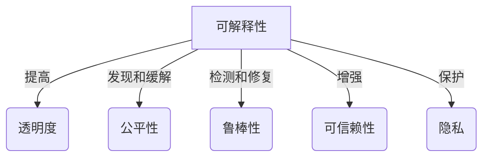
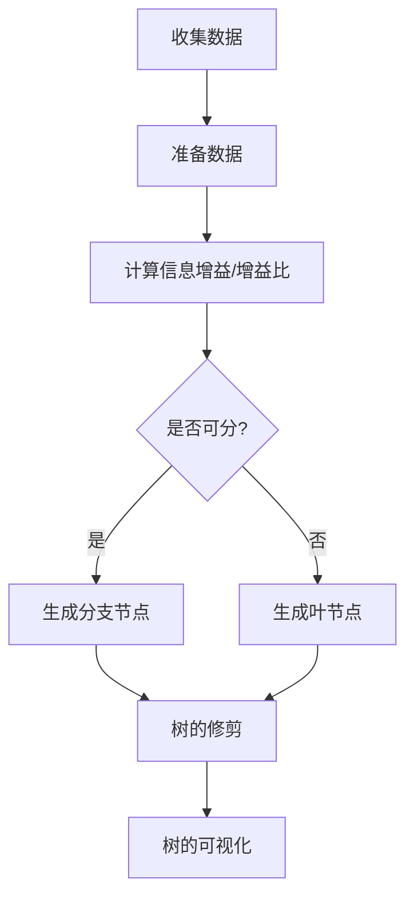
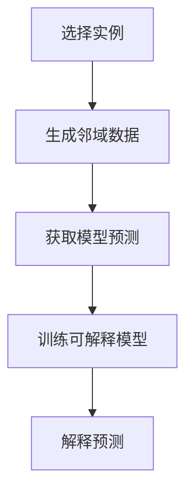

好的,我会严格按照您提供的要求和约束条件,为您撰写一篇题为《AI系统可解释性原理与代码实战案例讲解》的专业技术博客文章。文章将力求逻辑严谨、内容丰富、实例生动,并遵循Markdown格式和LaTeX公式表达。以下是正文:

# AI系统可解释性原理与代码实战案例讲解

## 1.背景介绍

### 1.1 AI系统不可解释性的挑战

人工智能(AI)系统在诸多领域展现出卓越的性能,但其内在工作机理往往是一个"黑箱",很难被人类理解和解释。这种不可解释性给AI系统的可信赖性、安全性和可控性带来了巨大挑战。

### 1.2 可解释性的重要性  

AI系统的可解释性对于提高系统的透明度、问责性和公平性至关重要。可解释的AI不仅能让人类更好地理解和信任系统,还有助于发现潜在的偏差和错误,从而提高系统的鲁棒性。此外,在一些高风险领域(如医疗、金融等),可解释性也是一个法律和监管要求。

### 1.3 本文主旨

本文将全面介绍AI系统可解释性的核心概念、算法原理、数学模型,并通过实战案例讲解如何在实践中应用可解释性技术,提高AI系统的透明度和可信赖性。

## 2.核心概念与联系

### 2.1 可解释性的定义

AI系统可解释性是指AI系统能够以人类可理解的方式解释其内部决策过程和推理逻辑。一个高度可解释的AI系统应当回答"为什么"和"怎么做"这两个关键问题。

### 2.2 可解释性的层次

可解释性可分为以下几个层次:

- **可解释输出(Output Explainability)**: 解释单个预测或决策的原因。
- **模型可解释性(Model Explainability)**: 解释整个模型的内在机理。
- **可解释过程(Process Explainability)**: 解释AI系统的整个决策过程。

### 2.3 可解释性与其他AI属性的关系

可解释性与AI系统的其他重要属性密切相关:

- **透明度(Transparency)**: 可解释性提高了AI系统的透明度。
- **公平性(Fairness)**: 可解释性有助于发现和缓解模型中的偏差和不公平。
- **鲁棒性(Robustness)**: 可解释性有助于检测和修复模型中的错误和缺陷。
- **可信赖性(Trustworthiness)**: 可解释性增强了人类对AI系统的信任和接受度。
- **隐私保护(Privacy Protection)**: 一些可解释性方法可以在不泄露个人隐私的前提下提供解释。

## 3.核心算法原理具体操作步骤  

### 3.1 基于模型的可解释性方法

这些方法通过限制模型的复杂性或引入先验知识来提高可解释性,常见算法包括:

1. **决策树(Decision Trees)**: 决策树本质上是可解释的,因为它们的决策过程可以用一系列的if-then规则来表示。

2. **规则集合(Rule Ensembles)**: 通过组合一系列简单的if-then规则来构建模型,如RIPPER算法。

3. **贝叶斯模型(Bayesian Models)**: 贝叶斯模型利用概率推理,可以提供每个预测的置信度和原因。

4. **深度神经网络(Deep Neural Networks)**: 
    - **知识蒸馏(Knowledge Distillation)**: 将一个复杂模型的行为蒸馏到一个简单可解释的模型中。
    - **注意力机制(Attention Mechanism)**: 通过注意力权重来解释神经网络关注的特征。

#### 3.1.1 决策树算法步骤

决策树是一种常用的基于树形结构的监督学习算法,具有很好的可解释性。以下是构建决策树的一般步骤:

1. **收集数据**: 收集并准备好训练数据集。
2. **准备数据**: 对数据进行预处理,如处理缺失值、标准化等。
3. **计算信息增益或信息增益比**: 根据特征的信息增益或信息增益比来选择最优特征作为决策节点。
4. **生成决策树**: 递归构建决策树,对于每个节点:
    - 如果所有实例属于同一类别,则将该节点标记为叶节点。
    - 否则,基于最优特征划分数据集,创建分支节点。
5. **树的修剪**: 根据验证集的性能,决定是否对树进行修剪以防止过拟合。
6. **树的可视化**: 将生成的决策树以树形结构可视化,方便人类解释。

#### 3.1.2 贝叶斯模型示例 - 朴素贝叶斯

朴素贝叶斯是一种简单而有效的概率分类器,它基于贝叶斯定理和特征独立性假设。以文本分类为例:

1. 计算每个类别 $C_k$ 的先验概率 $P(C_k)$。
2. 计算每个词 $w_i$ 在给定类别 $C_k$ 下的条件概率 $P(w_i|C_k)$。
3. 对于一个新文本 $X = (w_1, w_2, ..., w_n)$,应用贝叶斯公式计算后验概率:

$$P(C_k|X) = \frac{P(C_k)P(X|C_k)}{P(X)} \propto P(C_k)\prod_{i=1}^{n}P(w_i|C_k)$$

4. 选择后验概率最大的类别作为预测结果。

朴素贝叶斯的优点是简单、高效,而且具有很好的可解释性,因为我们可以解释每个特征对预测结果的影响。

### 3.2 基于模型无关的可解释性方法

这些方法将可解释性视为一个独立于模型的任务,常见算法包括:

1. **LIME(Local Interpretable Model-Agnostic Explanations)**: 通过训练一个局部的可解释模型来逼近复杂模型在特定实例周围的行为。

2. **SHAP(SHapley Additive exPlanations)**: 基于合作游戏理论中的夏普利值,计算每个特征对模型预测的贡献。

3. **对抗性攻击(Adversarial Attacks)**: 通过对输入数据进行细微扰动,观察模型预测的变化,从而解释模型的行为。

#### 3.2.1 LIME算法步骤

LIME是一种模型无关的局部可解释性方法,适用于任何机器学习模型。以图像分类为例,LIME的工作步骤如下:

1. **选择实例**: 选择一个需要解释的实例图像。
2. **生成邻域数据**: 通过对实例图像进行扰动(如添加噪声、遮挡部分区域等)生成一组相似的邻域数据。
3. **获取模型预测**: 将邻域数据输入到黑盒模型,获取模型对每个邻域实例的预测结果。
4. **训练可解释模型**: 使用加权最小二乘法,训练一个简单的线性模型(如LASSO回归)来拟合黑盒模型在局部邻域的行为。
5. **解释预测**: 使用训练好的线性模型解释目标实例的预测,特征权重反映了每个超像素对预测的贡献程度。

LIME的优点是模型无关性和局部解释性,缺点是解释的一致性和稳定性较差。

### 3.3 其他可解释性方法

除了上述主流方法外,还有一些其他技术也可以提高AI系统的可解释性,例如:

- **原型(Prototypes)**: 通过学习数据的原型来解释模型的决策。
- **概念激活向量(Concept Activation Vectors)**: 将人类可理解的概念嵌入到模型中,用概念激活程度来解释预测。
- **影响力函数(Influence Functions)**: 通过检查训练实例对模型预测的影响,解释模型行为。

## 4.数学模型和公式详细讲解举例说明

### 4.1 SHAP值的计算

SHAP是一种基于合作游戏理论中的夏普利值的可解释性方法。对于一个预测模型 $f$ 和输入实例 $x$,SHAP值 $\phi_i$ 表示第 $i$ 个特征对模型预测的贡献,满足以下性质:

1. **局部准确性(Local Accuracy)**: $\sum_i \phi_i = f(x)$
2. **虚无特征(Dummy)**: 如果一个特征对模型没有影响,那么它的 SHAP 值为 0。
3. **一致性(Consistency)**: 如果一个模型 $f'$ 比 $f$ 对所有输入更加赋予某个特征更大的贡献,那么该特征的 SHAP 值也应该更大。

SHAP值可以通过以下公式计算:

$$\phi_i = \sum_{S \subseteq N \backslash \{i\}} \frac{|S|!(|N|-|S|-1)!}{|N|!}[f_{x}(S \cup \{i\}) - f_{x}(S)]$$

其中 $N$ 是所有特征的集合, $S$ 是 $N$ 的一个子集, $f_x(S)$ 是模型在只考虑特征子集 $S$ 时的预测值。

这个公式本质上是在计算移除或添加某个特征时,模型预测值的平均变化量,作为该特征的 SHAP 值。

#### 4.1.1 SHAP值示例

考虑一个线性回归模型 $y = 3x_1 + 2x_2 + 4$,输入实例为 $x = (2, 1)$。我们计算每个特征的 SHAP 值:

$$
\begin{aligned}
\phi_0 &= \frac{1}{2!0!}[f(2, 1) - f(0, 0)] + \frac{1}{1!1!}[f(2, 0) - f(0, 0)] \\
      &= \frac{1}{2}[10 - 4] + \frac{1}{2}[6 - 4] = 4 \\
\phi_1 &= \frac{1}{1!1!}[f(2, 1) - f(2, 0)] + \frac{1}{0!2!}[f(0, 1) - f(0, 0)] \\
      &= \frac{1}{2}[10 - 6] + \frac{1}{2}[2 - 4] = 1
\end{aligned}
$$

可以看出,SHAP值准确地解释了每个特征对最终预测值的贡献。

### 4.2 LIME的加权最小二乘

LIME通过训练一个加权最小二乻模型来逼近黑盒模型在局部邻域的行为。具体来说,对于实例 $x_0$,我们希望找到一个线性模型 $g$ 使得:

$$g = \arg\min_{g \in G} \sum_{x \in X} \pi_x(x_0)(f(x) - g(x))^2$$

其中 $X$ 是邻域实例集合, $\pi_x(x_0)$ 是一个距离加权核函数,用于给予靠近 $x_0$ 的实例更大的权重。$G$ 是一个简单模型家族,如线性模型或决策树等。

通过求解上述最小化问题,我们可以得到一个局部可解释模型 $g$,它在 $x_0$ 附近很好地逼近了复杂模型 $f$ 的行为。特征的权重或系数反映了它们对预测的贡献程度,从而提供了解释。

#### 4.2.1 LIME加权最小二乘示例

假设我们有一个黑