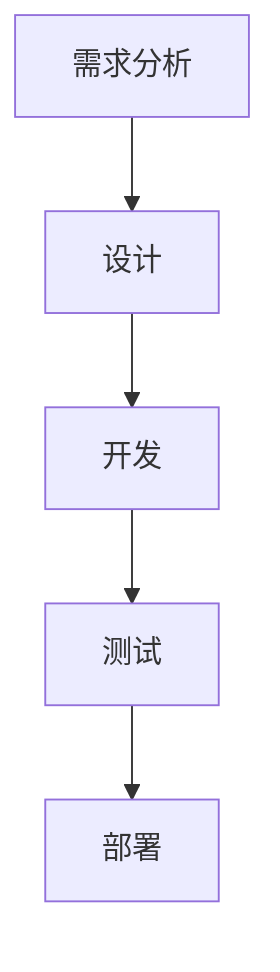

## 背景介绍

随着人工智能技术的不断发展，AI项目的规模和复杂性不断扩大。为了有效地管理AI项目，并提高团队协作效率，理解AI项目管理与团队协作的原理和方法至关重要。本文将从核心概念与联系、核心算法原理具体操作步骤、数学模型和公式详细讲解举例说明、项目实践：代码实例和详细解释说明、实际应用场景、工具和资源推荐、总结：未来发展趋势与挑战以及附录：常见问题与解答等方面入手，深入探讨AI项目管理与团队协作的原理与代码实战案例。

## 核心概念与联系

人工智能项目管理涉及多个环节，如需求分析、设计、开发、测试、部署等。团队协作则涉及到项目成员之间的沟通、协作、分工等问题。核心概念包括：

1. **需求分析**：确定项目的目标、范围、预期结果等。
2. **设计**：规划项目的结构、架构、模块等。
3. **开发**：编写代码、实现功能等。
4. **测试**：验证项目的正确性、可用性等。
5. **部署**：将项目上线、运行等。
6. **团队协作**：项目成员之间的沟通、协作、分工等。

这些概念之间相互联系，相互影响，共同构成了人工智能项目管理与团队协作的全局框架。

## 核心算法原理具体操作步骤

为了更好地理解AI项目管理与团队协作的原理，我们需要深入探讨核心算法原理具体操作步骤。以下是一个简化的AI项目管理流程图：



1. **需求分析**：首先，我们需要明确项目的目标、范围、预期结果等。需求分析过程可以分为以下步骤：

a. 收集需求：与客户、项目相关方进行沟通，收集需求信息。

b. 分析需求：将收集到的需求信息进行分析，确定项目的目标、范围、预期结果等。

c. 形成需求文档：根据分析结果，形成详细的需求文档。

1. **设计**：在确定了需求之后，我们需要根据需求文档进行项目设计。设计过程可以分为以下步骤：

a. 制定项目计划：根据需求文档，制定项目的时间计划、预算等。

b. 设计架构：根据项目需求，确定项目的整体架构、模块结构等。

c. 设计模块：根据架构，设计各个模块的功能、数据结构等。

1. **开发**：在完成了设计之后，我们需要根据设计结果进行项目开发。开发过程可以分为以下步骤：

a. 编写代码：根据设计结果，编写项目的代码。

b. 实现功能：根据代码，实现项目的功能。

c. 单元测试：对项目的单个模块进行测试，确保其功能正确。

1. **测试**：在完成了开发之后，我们需要对项目进行测试。测试过程可以分为以下步骤：

a. 集成测试：将项目的各个模块进行集成测试，确保它们可以正常工作。

b. 系统测试：对整个项目进行系统测试，确保其满足需求。

c. 性能测试：对项目进行性能测试，确保其能够满足性能要求。

1. **部署**：在完成了测试之后，我们需要将项目部署上线。部署过程可以分为以下步骤：

a. 选择部署平台：根据项目需求，选择合适的部署平台。

b. 部署项目：将项目部署到选择的部署平台上。

c. 上线测试：对部署后的项目进行上线测试，确保其能够正常运行。

通过以上流程，我们可以有效地管理AI项目，并提高团队协作效率。

## 数学模型和公式详细讲解举例说明

在实际应用中，我们需要建立数学模型和公式来描述项目管理与团队协作的原理。以下是一个简单的项目进度模型：

$$
进度 = \frac{完成工作量}{总工作量} \times 100\%
$$

例如，如果一个项目的总工作量为100个工时，而已经完成了50个工时，那么项目的进度为：

$$
进度 = \frac{50}{100} \times 100\% = 50\%
$$

通过这种方式，我们可以对项目进度进行实时监控，确保项目按时完成。

## 项目实践：代码实例和详细解释说明

为了更好地理解AI项目管理与团队协作的原理，我们需要通过实际代码实例进行讲解。以下是一个简单的Python代码示例，用于实现项目进度监控：

```python
class Project:
    def __init__(self, total_workload):
        self.total_workload = total_workload
        self.completed_workload = 0

    def add_workload(self, workload):
        self.completed_workload += workload

    def get_progress(self):
        return (self.completed_workload / self.total_workload) * 100

# 创建一个项目实例
project = Project(total_workload=100)

# 添加工作量
project.add_workload(50)

# 获取项目进度
progress = project.get_progress()
print(f"项目进度：{progress}%")
```

通过这种方式，我们可以实现项目进度的监控和管理。

## 实际应用场景

AI项目管理与团队协作的原理和方法可以应用于各种场景，如医疗健康、金融、教育等行业。以下是一些实际应用案例：

1. **医疗健康**：通过AI项目管理与团队协作，可以提高医疗健康领域的诊断准确率、治疗效果等。
2. **金融**：通过AI项目管理与团队协作，可以提高金融领域的风险管理、投资决策等。
3. **教育**：通过AI项目管理与团队协作，可以提高教育领域的个性化教学、智能评估等。

## 工具和资源推荐

为了更好地进行AI项目管理与团队协作，我们需要使用各种工具和资源。以下是一些推荐的工具和资源：

1. **项目管理工具**：如Trello、Asana、Microsoft Project等，可以帮助我们更好地进行项目管理。
2. **代码协作工具**：如GitHub、GitLab、Bitbucket等，可以帮助我们更好地进行代码协作。
3. **沟通工具**：如Slack、Microsoft Teams、Zoom等，可以帮助我们更好地进行沟通和协作。

## 总结：未来发展趋势与挑战

AI项目管理与团队协作的未来发展趋势和挑战如下：

1. **自动化**：随着AI技术的不断发展，项目管理和团队协作将越来越自动化，减轻人类的负担。
2. **智能化**：AI技术将使项目管理和团队协作更加智能化，提高效率和质量。
3. **跨界合作**：AI项目管理与团队协作将越来越跨界，涉及多个领域和专业，需要跨界合作。
4. **数据驱动**：AI项目管理与团队协作将越来越依赖数据，需要利用数据进行决策。

## 附录：常见问题与解答

以下是一些常见的问题及解答：

1. **如何选择合适的项目管理工具？**
选择合适的项目管理工具需要根据项目的特点和团队的需求进行综合考虑。可以根据团队的规模、项目的复杂性、预算等因素进行选择。
2. **如何提高团队的协作效率？**
提高团队的协作效率需要从多个方面进行提升，如明确目标、分工明确、沟通有效、工具充分利用等。
3. **如何管理AI项目的风险？**
管理AI项目的风险需要进行全面风险评估，并制定相应的风险控制措施，如技术风险、项目风险、团队风险等。