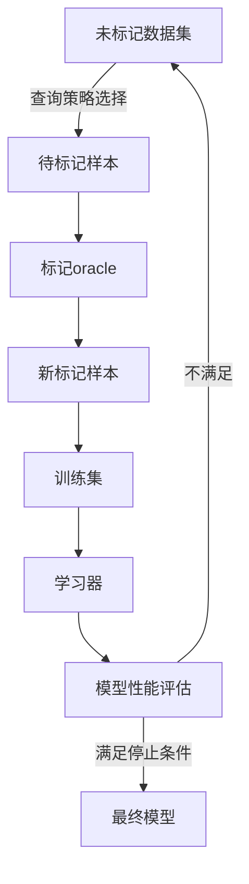

# ActiveLearning算法原理与代码实现

## 1.背景介绍

在机器学习领域中,有监督学习算法需要大量高质量的标记数据集来训练模型。然而,获取这种标记数据通常是一项耗时、昂贵且劳动密集型的任务。主动学习(Active Learning)作为一种有效的解决方案应运而生,它可以通过主动选择最有价值的未标记数据进行标记,从而最大限度地减少标记数据的需求量,降低数据标注的成本。

主动学习算法的核心思想是,在训练过程中,算法会根据特定的策略从未标记的数据集中选择最有价值的数据样本,并请求人工标注。经过标注后,这些新的标记样本将被添加到训练集中,用于重新训练模型。该过程将重复进行,直到满足特定的停止条件(如达到预期性能或耗尽预算)。与传统的被动学习相比,主动学习可以显著减少标记数据的需求量,从而降低数据标注的成本和工作量。

主动学习广泛应用于各种领域,如文本分类、图像识别、自然语言处理等,尤其在数据标注成本高昂或数据量巨大的情况下,主动学习展现出了巨大的优势和潜力。

## 2.核心概念与联系

主动学习算法涉及以下几个核心概念:

1. **查询策略(Query Strategy)**: 用于从未标记数据集中选择最有价值的样本进行标记的策略。常见的查询策略包括不确定性采样(Uncertainty Sampling)、查询按类别(Query by Committee)、期望误差减小(Expected Error Reduction)等。

2. **学习器(Learner)**: 指被用于训练的机器学习模型或算法,如支持向量机(SVM)、决策树、神经网络等。

3. **标记oracle(Labeling Oracle)**: 指能够为选定的未标记样本提供正确标签的实体,通常是人工标注者或基于已有知识的自动标注系统。

4. **停止条件(Stopping Criteria)**: 用于确定何时停止主动学习循环的条件,如达到预期性能水平、耗尽标注预算或达到最大迭代次数等。

这些概念之间的关系如下所示:



查询策略从未标记数据集中选择最有价值的样本,标记oracle对这些样本进行标注,新的标记样本被添加到训练集中重新训练学习器。基于新模型的性能评估结果,算法决定是否满足停止条件,如果不满足则重复上述过程。

## 3.核心算法原理具体操作步骤

主动学习算法的一般流程如下:

1. **初始化**:从未标记数据集中随机选择一小部分样本进行标注,构建初始的标记训练集。使用该训练集训练初始模型。

2. **查询循环**:
    a. 使用当前模型对未标记数据集进行预测,并根据预先设定的查询策略计算每个样本的"价值分数"。
    b. 从未标记数据集中选择具有最高价值分数的样本。
    c. 将选定的样本提交给标记oracle进行标注。
    d. 将新标记的样本添加到训练集中。
    e. 使用扩充后的训练集重新训练模型。
    f. 评估新模型的性能,如果满足停止条件则终止,否则返回步骤a继续下一轮迭代。

3. **输出**:返回最终训练得到的模型。

不同的查询策略对应不同的"价值分数"计算方式,是主动学习算法的核心部分。下面介绍几种常见的查询策略:

### 3.1 不确定性采样(Uncertainty Sampling)

这是最简单也是最常用的查询策略。其基本思想是,对于当前模型在预测时较不确定的样本,标记后有助于最大程度地减小模型的不确定性,从而提高模型的泛化性能。

对于二分类问题,可以使用模型预测的概率值来衡量不确定性,价值分数可定义为:

$$
价值分数 = 1 - P(y=1|x) \quad 或 \quad 1 - P(y=0|x)
$$

其中$P(y=1|x)$和$P(y=0|x)$分别表示模型对样本$x$预测为正类和负类的概率。价值分数越接近0.5,表明模型对该样本的预测越不确定,应优先选择进行标注。

对于多分类问题,可以使用模型预测概率值的熵来衡量不确定性:

$$
价值分数 = -\sum_{c=1}^{C}P(y=c|x)\log P(y=c|x)
$$

其中$C$是类别数量。熵值越大,表明模型对该样本的预测越不确定,应优先选择进行标注。

### 3.2 查询按类别(Query by Committee)

该策略使用一组不同的学习器(称为委员会)对未标记样本进行预测,并根据这些学习器之间的"投票分歧"程度来确定样本的价值分数。具体来说,对于每个未标记样本$x$:

1. 让委员会中的每个学习器对$x$进行预测,得到预测标签$y_1, y_2, ..., y_m$。
2. 计算"投票分歧"的程度,即有多少学习器与最多数学习器的预测不一致。
3. 将"投票分歧"的值作为该样本的价值分数。

"投票分歧"越大,表明委员会对该样本的预测存在较大分歧,标记后有助于减小这种分歧,因此应优先选择进行标注。

### 3.3 期望误差减小(Expected Error Reduction)

该策略旨在选择那些标记后能最大程度降低模型期望泛化误差的样本进行标注。具体来说,对于每个未标记样本$x$:

1. 对每个可能的标签$y$,估计在将$(x,y)$添加到训练集后重新训练模型所能获得的期望泛化误差减小量$\Delta E(x,y)$。
2. 计算所有可能标签的期望误差减小量的加权平均,作为该样本的价值分数:

$$
价值分数(x) = \sum_y P(y|x)\Delta E(x,y)
$$

其中$P(y|x)$是模型对样本$x$预测为标签$y$的概率。

价值分数越大,表明标记该样本后能够更有效地降低模型的期望泛化误差,因此应优先选择进行标注。

需要注意的是,计算期望误差减小量是一个计算量很大的过程,因为它需要对每个可能的标签训练一个新的模型,并估计其泛化误差。因此,该策略通常只适用于小型数据集。

## 4.数学模型和公式详细讲解举例说明

在主动学习算法中,常常需要估计模型在未标记数据上的预测概率或不确定性,这对于计算样本的价值分数至关重要。以下是一些常用的数学模型和公式:

### 4.1 二值分类问题

对于二值分类问题,我们通常使用Logistic回归或其他生成式模型来估计样本属于正类的概率$P(y=1|x)$。Logistic回归模型的数学表达式为:

$$
P(y=1|x) = \sigma(w^Tx + b) = \frac{1}{1 + e^{-(w^Tx+b)}}
$$

其中$w$是模型权重向量,$b$是偏置项,$\sigma$是Sigmoid函数。

在不确定性采样策略中,我们可以使用$1 - P(y=1|x)$或$1 - P(y=0|x)$作为样本的价值分数,其中较接近0.5的分数表示模型对该样本的预测较不确定。

### 4.2 多值分类问题

对于多值分类问题,我们可以使用Softmax回归或其他生成式模型来估计样本属于每个类别的概率$P(y=c|x)$。Softmax回归模型的数学表达式为:

$$
P(y=c|x) = \frac{e^{w_c^Tx + b_c}}{\sum_{j=1}^C e^{w_j^Tx + b_j}}
$$

其中$C$是类别数量,$w_c$和$b_c$分别是第$c$类的权重向量和偏置项。

在不确定性采样策略中,我们可以使用预测概率的熵作为样本的价值分数:

$$
价值分数 = -\sum_{c=1}^{C}P(y=c|x)\log P(y=c|x)
$$

熵值越大,表明模型对该样本的预测越不确定。

### 4.3 期望误差减小量估计

在期望误差减小策略中,我们需要估计在将样本$(x,y)$添加到训练集后重新训练模型所能获得的期望泛化误差减小量$\Delta E(x,y)$。一种常用的估计方法是:

1. 从当前训练集$D$中通过Bootstrap抽样得到$m$个新的训练集$D_1, D_2, ..., D_m$。
2. 对每个新训练集$D_i$,训练一个新模型$f_i$。
3. 使用这$m$个新模型在验证集上评估它们的平均泛化误差$\overline{E}$。
4. 对每个可能的标签$y$,将$(x,y)$添加到每个新训练集$D_i$中,得到$D_i^{(x,y)}$,并使用$D_i^{(x,y)}$训练一个新模型$f_i^{(x,y)}$。
5. 使用这$m$个新模型$f_i^{(x,y)}$在验证集上评估它们的平均泛化误差$\overline{E}^{(x,y)}$。
6. 估计的期望误差减小量为$\Delta E(x,y) = \overline{E} - \overline{E}^{(x,y)}$。

最后,我们可以根据公式$价值分数(x) = \sum_y P(y|x)\Delta E(x,y)$计算样本$x$的价值分数。

需要注意的是,这种估计方法计算量很大,因为它需要训练$m(C+1)$个新模型,其中$C$是类别数量。因此,该策略通常只适用于小型数据集。

## 5.项目实践:代码实例和详细解释说明

以下是一个使用Python和scikit-learn库实现不确定性采样策略的示例代码:

```python
from sklearn.datasets import make_blobs
from sklearn.linear_model import LogisticRegression
from sklearn.metrics import accuracy_score
import numpy as np

# 生成示例数据
X, y = make_blobs(n_samples=1000, centers=2, n_features=2, random_state=1)

# 初始化标记和未标记数据集
initial_label_rate = 0.1
rng = np.random.RandomState(1)
random_indices = rng.permutation(X.shape[0])
initial_label_indices = random_indices[:int(initial_label_rate * X.shape[0])]

X_labeled = X[initial_label_indices]
y_labeled = y[initial_label_indices]
X_unlabeled = np.delete(X, initial_label_indices, axis=0)

# 主动学习循环
n_queries = 20
model = LogisticRegression()

for iter in range(n_queries):
    # 训练模型
    model.fit(X_labeled, y_labeled)
    
    # 对未标记数据进行预测,计算不确定性分数
    probs = model.predict_proba(X_unlabeled)
    uncertainty = 1 - np.max(probs, axis=1)
    
    # 选择最不确定的样本进行标记
    idx = np.argmax(uncertainty)
    X_labeled = np.vstack((X_labeled, X_unlabeled[idx].reshape(1, -1)))
    y_labeled = np.append(y_labeled, y_unlabeled[idx])
    X_unlabeled = np.delete(X_unlabeled, idx, axis=0)
    y_unlabeled = np.delete(y_unlabeled, idx)
    
    # 评估模型性能
    train_acc = accuracy_score(y_labeled, model.predict(X_labeled))
    print(f"Iteration {iter+1}: Train Accuracy = {train_acc:.3f}")

# 在全部数据上评估最终模型
model.fit(X_labeled, y_labeled)
final_acc = accuracy_score(y, model.predict(X))
print(f"Final Accuracy on Full Dataset = {final_acc:.3f}")
```

代码解释:

1. 使用`make_blobs`函数