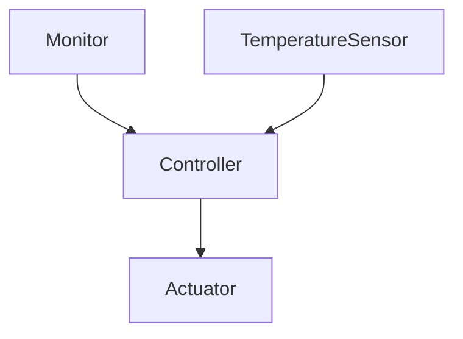

# ActorModel与物联网设备的集成与优化

## 1.背景介绍

随着物联网(IoT)设备的快速发展和广泛应用,如何高效地管理和协调大量异构设备之间的通信和数据交换成为一个巨大的挑战。传统的集中式架构难以应对海量设备的实时响应需求,而分布式系统架构则面临着并发控制、故障容错等复杂问题。在这种背景下,Actor模型(ActorModel)作为一种基于消息传递的并发计算模型,为物联网设备的集成和优化提供了一种全新的解决方案。

## 2.核心概念与联系

### 2.1 Actor模型概述

Actor模型最早由卡尔·休伊特(Carl Hewitt)等人在20世纪70年代提出,是一种将系统建模为许多独立的、并发执行的对象(Actor)的计算模型。每个Actor都有自己的状态和行为,通过发送和接收消息与其他Actor进行交互和协作。Actor模型具有以下核心特征:

- **并发性(Concurrency)**: 每个Actor都是一个独立的执行单元,可以与其他Actor并发运行。
- **无共享状态(No Shared State)**: Actor之间不存在共享内存,只能通过发送消息进行通信和状态传递。
- **位置透明性(Location Transparency)**: Actor之间的通信是透明的,不需要关注对方的物理位置。
- **容错性(Fault Tolerance)**: Actor模型天生具备容错能力,单个Actor的失败不会影响整个系统的运行。

Actor模型的这些特性使其非常适合构建高度并发、分布式、容错的系统,正好契合了物联网设备的需求。

### 2.2 物联网设备与Actor模型的契合

物联网设备通常具有以下特点:

- **大量异构设备**: 物联网系统由成千上万种类型的设备组成,包括传感器、执行器、网关等,它们具有不同的硬件、软件和通信协议。
- **分布式部署**: 物联网设备分布在不同的地理位置,需要进行远程管理和协调。
- **实时响应需求**: 许多物联网应用场景(如工业控制、智能家居等)对设备的响应时间有严格要求。
- **容错和可靠性**: 物联网系统需要具备高度的容错能力和可靠性,以确保关键任务的连续执行。

Actor模型的并发性、无共享状态、位置透明性和容错性等特征,恰好能够满足物联网设备的上述需求,使其成为一种理想的集成和优化方案。

## 3.核心算法原理具体操作步骤

Actor模型的核心算法原理可以概括为以下几个步骤:

1. **Actor创建**: 系统中的每个Actor都是一个独立的执行单元,可以通过创建新的Actor来扩展系统功能。

2. **消息发送**: Actor之间通过发送消息进行通信和协作。消息是异步的,发送者不需要等待接收者处理完消息才能继续执行。

3. **消息接收和处理**: 每个Actor都有一个消息队列,用于存储接收到的消息。Actor按照消息到达的顺序依次处理队列中的消息,处理过程中可能会修改Actor的内部状态或向其他Actor发送新的消息。

4. **Actor监督(Supervision)**: Actor模型采用"让它崩溃(Let it crash)"的理念,当Actor发生错误时,它会直接崩溃退出。但是,Actor还可以创建子Actor,并对它们进行监督。当子Actor崩溃时,父Actor可以选择重启、恢复或终止它们,从而实现容错和自我修复。

5. **位置透明性**: Actor之间的通信是透明的,不需要关注对方的物理位置。这使得Actor模型非常适合构建分布式系统,例如将Actor部署在不同的物联网设备或云端服务器上。

下面是一个使用Akka框架(一种流行的Actor模型实现)创建和管理Actor的示例代码:

```scala
import akka.actor.{Actor, ActorSystem, Props}

// 定义一个简单的Actor
class MyActor extends Actor {
  def receive = {
    case "hello" => println("Hello from MyActor")
    case _ => println("Unknown message")
  }
}

object Main extends App {
  // 创建ActorSystem
  val system = ActorSystem("mySystem")

  // 创建Actor
  val myActor = system.actorOf(Props[MyActor], "myActor")

  // 向Actor发送消息
  myActor ! "hello"
  myActor ! "world"

  // 终止ActorSystem
  system.terminate()
}
```

在这个示例中,我们首先定义了一个简单的Actor `MyActor`,它可以响应"hello"消息并打印相应的信息。然后,我们在`Main`对象中创建了一个`ActorSystem`和一个`MyActor`实例。接着,我们向`MyActor`发送了两条消息"hello"和"world",并最终终止了`ActorSystem`。

通过这个简单的示例,我们可以看到Actor模型的核心思想:创建Actor、发送消息、处理消息,以及Actor之间的通信和协作。在实际的物联网系统中,我们可以将不同的物联网设备建模为Actor,它们通过发送和接收消息来协调工作,实现分布式控制和数据交换。

## 4.数学模型和公式详细讲解举例说明

在Actor模型中,我们可以使用一些数学模型和公式来描述和分析系统的行为,例如消息传递延迟、吞吐量和可靠性等。下面是一些常见的数学模型和公式:

### 4.1 小世界网络模型

物联网系统中的Actor之间通常存在着复杂的通信关系,我们可以使用小世界网络模型来描述和分析这种关系。小世界网络模型是一种描述复杂网络拓扑结构的数学模型,它具有以下两个重要特征:

1. **高聚集系数(High Clustering Coefficient)**: 网络中的节点倾向于形成紧密的簇或社区。
2. **短平均路径长度(Short Average Path Length)**: 任意两个节点之间的平均路径长度都很短,即存在"小世界"现象。

在物联网系统中,我们可以将Actor视为网络中的节点,而消息传递则对应着节点之间的边。由于物联网设备通常会根据地理位置或功能特征形成簇,因此整个网络具有高聚集系数的特点。同时,由于Actor之间的通信是透明的,任意两个Actor之间的平均路径长度也会较短,体现了"小世界"现象。

利用小世界网络模型,我们可以分析和优化物联网系统中的消息传递路径,提高通信效率和可靠性。例如,我们可以根据网络拓扑结构选择合适的路由算法,或者在关键节点部署缓存机制来减少消息传递延迟。

### 4.2 消息队列模型

在Actor模型中,每个Actor都有一个消息队列,用于存储接收到的消息。我们可以使用队列理论中的一些公式来描述和分析消息队列的行为。

假设Actor的消息处理服务时间服从某种概率分布(如指数分布或均匀分布),并且消息到达也服从某种概率分布(如泊松分布),那么我们可以使用下面的公式计算队列长度和等待时间的期望值:

$$
E[N] = \frac{\rho}{1-\rho}
$$

$$
E[W] = \frac{E[N]}{\lambda}
$$

其中:

- $E[N]$是队列长度的期望值
- $\rho$是系统利用率,等于到达率与服务率的比值
- $E[W]$是等待时间的期望值
- $\lambda$是消息到达率

利用这些公式,我们可以估计Actor的消息队列长度和响应延迟,从而评估系统的性能和实时响应能力。如果队列长度或响应延迟过高,我们可以考虑增加Actor的数量、优化消息处理算法或调整硬件资源配置等措施。

### 4.3 可靠性模型

由于Actor模型具有天生的容错能力,我们可以使用可靠性理论中的一些模型和公式来分析系统的可靠性。

假设系统中有$n$个Actor,每个Actor的失效率为$\lambda$,并且Actor之间是独立失效的,那么整个系统的可靠性函数可以表示为:

$$
R(t) = e^{-n\lambda t}
$$

其中$R(t)$表示在时间$t$内系统正常运行的概率。

如果我们引入Actor监督机制,允许父Actor重启失效的子Actor,那么系统的可靠性将会进一步提高。假设重启一个失效的Actor需要时间$T_r$,那么系统的可靠性函数可以表示为:

$$
R(t) = \sum_{k=0}^{\infty} \frac{(n\lambda t)^k}{k!} e^{-n\lambda t} \sum_{j=0}^{k} \binom{k}{j} (-1)^j e^{-j\lambda T_r}
$$

利用这些可靠性模型和公式,我们可以评估物联网系统的可靠性水平,并采取相应的措施(如增加冗余Actor、优化监督策略等)来提高系统的容错能力和可用性。

需要注意的是,上述数学模型和公式只是对Actor模型和物联网系统进行简化描述和近似分析,在实际应用中还需要结合具体的系统架构、工作负载和环境因素进行调整和优化。

## 5.项目实践:代码实例和详细解释说明

为了更好地理解Actor模型在物联网设备集成和优化中的应用,我们将通过一个具体的项目实践来演示。在这个项目中,我们将使用Akka框架构建一个简单的物联网系统,包括温度传感器、执行器和控制器等组件。

### 5.1 系统架构

我们的物联网系统由以下几个主要组件组成:

1. **温度传感器(TemperatureSensor)**: 用于采集环境温度数据,并将数据发送给控制器。
2. **执行器(Actuator)**: 根据控制器的指令执行相应的操作,如打开/关闭空调等。
3. **控制器(Controller)**: 接收温度传感器的数据,并根据预设的温度范围向执行器发送控制指令。
4. **监视器(Monitor)**: 监视整个系统的运行状态,并在发生故障时采取相应的措施(如重启失效的组件)。

下面是系统架构的Mermaid流程图:



### 5.2 代码实现

我们将使用Scala语言和Akka框架来实现上述系统组件。

首先,我们定义一个trait `Sensor`,用于表示温度传感器的基本行为:

```scala
trait Sensor {
  def read(): Double
}
```

然后,我们实现一个具体的温度传感器`TemperatureSensor`:

```scala
class TemperatureSensor(val id: String) extends Sensor with Actor {
  import context.dispatcher
  val scheduler = context.system.scheduler

  def receive = {
    case ReadTemperature =>
      val temperature = read()
      sender() ! TemperatureReading(id, temperature)
  }

  override def read(): Double = // 实现温度采集逻辑

  // 每隔一段时间向控制器发送温度数据
  scheduler.schedule(Duration.Zero, Duration(5, TimeUnit.SECONDS), self, ReadTemperature)
}
```

`TemperatureSensor`是一个Actor,它定期向自身发送`ReadTemperature`消息,以触发温度采集和发送逻辑。当收到`ReadTemperature`消息时,它会调用`read()`方法采集当前温度,并将结果封装为`TemperatureReading`消息发送给控制器。

接下来,我们实现控制器`Controller`:

```scala
class Controller(val temperatureSensors: Set[ActorRef],
                 val actuator: ActorRef,
                 val targetTemperature: Double,
                 val tolerance: Double) extends Actor {

  def receive = {
    case TemperatureReading(sensorId, temperature) =>
      if (temperature > targetTemperature + tolerance) {
        actuator ! TurnOn
      } else if (temperature < targetTemperature - tolerance) {
        actuator ! TurnOff
      }
  }
}
```

`Controller`接收来自温度传感器的`TemperatureReading`消息,并根据目标温度和容差范围向执行器发送`TurnOn`或`TurnOff`指令。

最后,我们实现执行器`Actuator`:

```scala
class Actuator extends Actor {
  def receive = {
    case TurnOn =>
      println("Turning on air conditioner")
      // 执行打开空调的操作
    case TurnOff =>
      println("Turning off air conditioner")
      // 执行关闭空