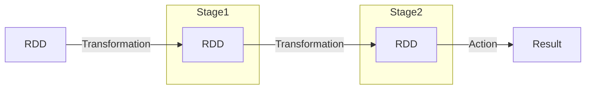

# Apache Spark 原理与代码实战

## 1. 背景介绍

Apache Spark 是一种快速、通用、可扩展的大数据分析引擎。它最初由加州大学伯克利分校的AMPLab开发,后来捐赠给Apache软件基金会,成为Apache的一个顶级项目。Spark 被广泛应用于机器学习、流式计算、图计算等领域,成为大数据处理的核心工具之一。

Spark 的核心设计理念是将中间数据存储在内存中,而不是像 Hadoop MapReduce 那样将中间数据写入磁盘。这种设计使得 Spark 在处理迭代运算和交互式查询时,性能比 Hadoop MapReduce 快一个数量级。此外,Spark 提供了丰富的高级API,支持多种编程语言(如 Scala、Java、Python 和 R),使得开发人员可以更高效地编写分布式应用程序。

### 1.1 Spark 生态系统

Spark 生态系统包括了多个紧密集成的组件,涵盖了大数据处理的方方面面:

- **Spark Core**: Spark 的核心引擎,提供了分布式任务调度和内存计算等基础功能。
- **Spark SQL**: 用于结构化数据的处理,支持 SQL 查询以及 Hive 集成。
- **Spark Streaming**: 用于实时流数据的处理和分析。
- **MLlib**: Spark 提供的机器学习算法库。
- **GraphX**: 用于图形计算和并行图算法的库。

### 1.2 Spark 优势

相比传统的 Hadoop MapReduce,Spark 具有以下优势:

1. **内存计算**:Spark 利用集群内存进行数据处理,避免了磁盘 I/O 的开销,从而提高了计算性能。
2. **通用性**:Spark 不仅支持批处理,还支持交互式查询、流式计算和机器学习等多种工作负载。
3. **易用性**:Spark 提供了丰富的高级 API,支持多种编程语言,降低了开发难度。
4. **容错性**:Spark 采用了基于 RDD(Resilient Distributed Dataset)的容错机制,可以自动恢复丢失的数据分区。
5. **可扩展性**:Spark 可以在数千台服务器上运行,并且能够动态地分配计算资源。

## 2. 核心概念与联系

### 2.1 RDD (Resilient Distributed Dataset)

RDD 是 Spark 编程中最基本的数据抽象,它是一个不可变、分区的记录集合。RDD 可以从 HDFS、HBase 或者本地文件系统等数据源创建,也可以通过现有 RDD 转换而来。

RDD 具有以下特点:

- **不可变性**:RDD 中的数据在创建后就不能被修改,这使得 RDD 具有良好的容错性。
- **分区性**:RDD 被划分为多个分区,分布在集群的不同节点上,便于并行计算。
- **延迟计算**:RDD 支持延迟计算,即 RDD 的转换操作不会立即执行,而是记录下来,等到需要计算结果时才会触发实际的计算。
- **容错性**:RDD 通过血统(lineage)记录了它是如何从其他 RDD 衍生而来的,从而可以在部分分区数据丢失时重新计算而不是从头开始。

### 2.2 RDD 操作

RDD 提供了两种操作:转换(Transformation)和动作(Action)。

**转换操作**会从现有的 RDD 创建一个新的 RDD,常见的转换操作包括 `map`、`filter`、`flatMap`、`union` 等。转换操作是延迟计算的,只有在执行动作操作时,才会触发实际的计算。

**动作操作**会对 RDD 进行计算并返回结果,常见的动作操作包括 `reduce`、`collect`、`count` 等。动作操作会触发实际的计算,并可能将结果返回到驱动程序或者写入外部存储系统。

### 2.3 Spark 执行模型

Spark 采用了基于阶段(Stage)的执行模型。当一个动作操作被调用时,Spark 会根据 RDD 的血统关系构建出一个有向无环图(DAG),将计算任务划分为多个阶段。每个阶段包含一系列的任务,这些任务会并行执行,最终将计算结果返回给驱动程序或者写入外部存储系统。



上图展示了 Spark 的执行模型。当执行一个动作操作时,Spark 会根据 RDD 的血统关系构建出一个 DAG,并将计算任务划分为多个阶段(Stage)。每个阶段包含一系列并行执行的任务,最终将结果返回给驱动程序或者写入外部存储系统。

## 3. 核心算法原理具体操作步骤

### 3.1 RDD 创建

RDD 可以通过两种方式创建:从外部数据源创建或者从现有 RDD 转换而来。

**从外部数据源创建 RDD**

Spark 提供了多种方式从外部数据源创建 RDD,例如:

- `SparkContext.textFile(path)`: 从文本文件创建 RDD。
- `SparkContext.wholeTextFiles(path)`: 从目录下的多个文本文件创建 RDD,RDD 的元素为 (filePath, content) 对。
- `SparkContext.parallelize(list)`: 从集合(list)创建 RDD。

```scala
// 从文本文件创建 RDD
val textFile = sc.textFile("path/to/file.txt")

// 从目录下的多个文本文件创建 RDD
val wholeTextFiles = sc.wholeTextFiles("path/to/directory")

// 从集合创建 RDD
val parallelizedRDD = sc.parallelize(List(1, 2, 3, 4, 5))
```

**从现有 RDD 转换**

利用 RDD 的转换操作,可以从现有的 RDD 创建新的 RDD。常见的转换操作包括:

- `map`: 对 RDD 中的每个元素应用一个函数,返回一个新的 RDD。
- `filter`: 返回一个新的 RDD,其中只包含满足给定条件的元素。
- `flatMap`: 对 RDD 中的每个元素应用一个函数,并将返回的迭代器的内容合并到一个新的 RDD 中。
- `union`: 返回一个新的 RDD,它是两个 RDD 的并集。

```scala
// 从现有 RDD 创建新的 RDD
val rdd1 = sc.parallelize(List(1, 2, 3))
val rdd2 = rdd1.map(x => x * 2) // rdd2: [2, 4, 6]
val rdd3 = rdd2.filter(x => x > 3) // rdd3: [4, 6]
```

### 3.2 RDD 转换操作

RDD 提供了丰富的转换操作,用于从现有的 RDD 创建新的 RDD。常见的转换操作包括:

- **map(func)**: 对 RDD 中的每个元素应用一个函数,返回一个新的 RDD。
- **filter(func)**: 返回一个新的 RDD,其中只包含满足给定条件的元素。
- **flatMap(func)**: 对 RDD 中的每个元素应用一个函数,并将返回的迭代器的内容合并到一个新的 RDD 中。
- **union(otherRDD)**: 返回一个新的 RDD,它是两个 RDD 的并集。
- **intersection(otherRDD)**: 返回一个新的 RDD,它是两个 RDD 的交集。
- **distinct()**: 返回一个新的 RDD,其中只包含原 RDD 中不重复的元素。
- **groupByKey()**: 对于 (K, V) 形式的 RDD,返回一个 (K, Iterable<V>) 形式的新 RDD。
- **reduceByKey(func)**: 对于 (K, V) 形式的 RDD,使用给定的函数对相同 Key 的值进行聚合,返回一个 (K, V) 形式的新 RDD。
- **sortByKey()**: 对于 (K, V) 形式的 RDD,返回一个按 Key 排序的新 RDD。

```scala
// map 示例
val rdd1 = sc.parallelize(List(1, 2, 3))
val rdd2 = rdd1.map(x => x * 2) // rdd2: [2, 4, 6]

// filter 示例
val rdd3 = rdd2.filter(x => x > 3) // rdd3: [4, 6]

// flatMap 示例
val rdd4 = sc.parallelize(List(List(1, 2), List(3, 4)))
val rdd5 = rdd4.flatMap(x => x) // rdd5: [1, 2, 3, 4]

// union 示例
val rdd6 = sc.parallelize(List(1, 2, 3))
val rdd7 = sc.parallelize(List(4, 5, 6))
val rdd8 = rdd6.union(rdd7) // rdd8: [1, 2, 3, 4, 5, 6]
```

### 3.3 RDD 动作操作

动作操作会对 RDD 进行计算并返回结果。常见的动作操作包括:

- **reduce(func)**: 使用给定的函数对 RDD 中的元素进行聚合,返回聚合后的结果。
- **collect()**: 将 RDD 中的所有元素以数组的形式返回到驱动程序。
- **count()**: 返回 RDD 中元素的个数。
- **take(n)**: 返回 RDD 中的前 n 个元素。
- **saveAsTextFile(path)**: 将 RDD 中的元素以文本文件的形式保存到指定目录。
- **foreach(func)**: 对 RDD 中的每个元素应用给定的函数。

```scala
// reduce 示例
val rdd1 = sc.parallelize(List(1, 2, 3, 4, 5))
val sum = rdd1.reduce((x, y) => x + y) // sum: 15

// collect 示例
val rdd2 = sc.parallelize(List(1, 2, 3))
val collectedRDD = rdd2.collect() // collectedRDD: Array[Int] = Array(1, 2, 3)

// count 示例
val rdd3 = sc.parallelize(List(1, 2, 3, 4, 5))
val count = rdd3.count() // count: 5

// take 示例
val rdd4 = sc.parallelize(List(1, 2, 3, 4, 5))
val first3 = rdd4.take(3) // first3: Array[Int] = Array(1, 2, 3)
```

### 3.4 键值对 RDD 操作

对于 (K, V) 形式的 RDD,Spark 提供了一些特殊的转换和动作操作,用于处理键值对数据。

**键值对 RDD 转换操作**:

- **groupByKey()**: 返回一个 (K, Iterable<V>) 形式的新 RDD。
- **reduceByKey(func)**: 使用给定的函数对相同 Key 的值进行聚合,返回一个 (K, V) 形式的新 RDD。
- **sortByKey()**: 返回一个按 Key 排序的新 RDD。
- **mapValues(func)**: 对每个 (K, V) 对中的值应用给定的函数,返回一个新的 (K, V) 形式的 RDD。
- **flatMapValues(func)**: 对每个 (K, V) 对中的值应用给定的函数,并将返回的迭代器的内容合并到一个新的 (K, V) 形式的 RDD 中。

**键值对 RDD 动作操作**:

- **countByKey()**: 对每个 Key 计数,返回一个 (K, Int) 形式的不可变映射集合。
- **collectAsMap()**: 将 RDD 中的元素以 (K, V) 形式收集到一个映射集合中。

```scala
// groupByKey 示例
val rdd1 = sc.parallelize(List((1, 2), (3, 4), (3, 6)))
val rdd2 = rdd1.groupByKey() // rdd2: [(1, [2]), (3, [4, 6])]

// reduceByKey 示例
val rdd3 = sc.parallelize(List((1, 2), (3, 4), (3, 6)))
val rdd4 = rdd3.reduceByKey((x, y) => x + y) // rdd4: [(1, 2), (3, 10)]

// countByKey 示例
val rdd5 = sc.parallelize(List((1, 2), (3, 4), (3, 6)))
val countByKey = rdd5.countByKey() // countByKey: scala.collection.Map[Int,Long] = Map(1 -> 1, 3 -> 2)
```


## Apache Spark 原理与代码实践

### 4. 数学模型和公式详细讲解举例说明

Apache Spark 是一个基于内存的分布式计算框架，旨在提供快速的集群计算能力。其核心思想是通过将数据分块存储在内存中，减少磁盘 I/O 操作，从而提高计算效率。Spark 的核心抽象是弹性分布式数据集（RDD），它是一个不可变的分布式对象集合，可以并行操作。RDD 的操作分为两类：转换（Transformation）和动作（Action）。

#### 4.1 RDD 转换

RDD 的转换操作是惰性执行的，即转换操作不会立即执行，只有在遇到动作操作时才会触发计算。常见的转换操作包括 `map`、`filter`、`flatMap`、`groupByKey` 等。

例如，`map` 操作的数学表示如下：
$$
RDD_{new} = RDD_{old}.map(f)
$$
其中，$f$ 是一个函数，将 RDD 中的每个元素转换为新的元素。

#### 4.2 RDD 动作

RDD 的动作操作会触发实际的计算，并返回结果到驱动程序。常见的动作操作包括 `reduce`、`collect`、`count`、`first` 等。

例如，`reduce` 操作的数学表示如下：
$$
result = RDD.reduce(f)
$$
其中，$f$ 是一个函数，将 RDD 中的元素两两合并，直到处理完所有元素。

#### 4.3 DAG（有向无环图）

Spark 使用有向无环图（DAG）来表示 RDD 的转换操作和依赖关系。在执行动作操作时，Spark 会根据 DAG 生成任务执行计划，并将任务分配到集群中的各个节点执行。

DAG 的数学表示如下：
$$
DAG = (V, E)
$$
其中，$V$ 是顶点集合，表示 RDD 的转换操作；$E$ 是边集合，表示 RDD 之间的依赖关系。

### 5. 项目实践：代码实例和详细解释说明

以下是一个使用 Apache Spark 进行词频统计的示例代码：

```python
from pyspark import SparkConf, SparkContext

# 初始化 Spark 上下文
conf = SparkConf().setAppName("WordCount").setMaster("local")
sc = SparkContext(conf=conf)

# 读取输入文件
input_file = "hdfs://path/to/input.txt"
text_file = sc.textFile(input_file)

# 词频统计
word_counts = text_file.flatMap(lambda line: line.split(" ")) \
                       .map(lambda word: (word, 1)) \
                       .reduceByKey(lambda a, b: a + b)

# 保存结果到 HDFS
output_file = "hdfs://path/to/output"
word_counts.saveAsTextFile(output_file)

# 停止 Spark 上下文
sc.stop()
```

#### 5.1 代码解释

1. **初始化 Spark 上下文**：通过 `SparkConf` 和 `SparkContext` 初始化 Spark 上下文，设置应用程序名称和运行模式。
2. **读取输入文件**：使用 `textFile` 方法读取 HDFS 上的输入文件，生成一个 RDD。
3. **词频统计**：通过 `flatMap` 方法将每一行文本拆分为单词列表，通过 `map` 方法将每个单词转换为 (word, 1) 的键值对，通过 `reduceByKey` 方法按照单词进行聚合，计算词频。
4. **保存结果到 HDFS**：使用 `saveAsTextFile` 方法将词频统计结果保存到 HDFS。
5. **停止 Spark 上下文**：调用 `stop` 方法停止 Spark 上下文，释放资源。

### 6. 实际应用场景

Apache Spark 在多个实际应用场景中展现出了强大的计算能力和灵活性，包括但不限于：

#### 6.1 大数据处理

Spark 可以处理大规模数据集，适用于日志分析、数据清洗、ETL（抽取、转换、加载）等任务。其内存计算能力和分布式架构使其在大数据处理领域具有显著优势。

#### 6.2 机器学习

Spark 提供了 MLlib 库，支持常见的机器学习算法，如线性回归、决策树、聚类等。MLlib 利用 Spark 的分布式计算能力，可以高效地处理大规模数据集，进行模型训练和预测。

#### 6.3 实时流处理

Spark Streaming 是 Spark 的流处理组件，支持实时数据流的处理和分析。通过将数据流分割成微批次，Spark Streaming 可以实现高吞吐量和低延迟的流处理。

#### 6.4 图计算

GraphX 是 Spark 的图计算组件，支持图数据的表示和操作。GraphX 提供了丰富的图算法，如 PageRank、连通分量、最短路径等，适用于社交网络分析、推荐系统等应用场景。

### 7. 工具和资源推荐

在进行 Apache Spark 的研究和应用时，有许多优秀的工具和资源可以使用：

#### 7.1 官方文档

Spark 官方文档提供了详细的安装、配置、使用指南和 API 文档，是学习和使用 Spark 的重要资源。

- Spark 官方文档：[https://spark.apache.org/docs/latest/](https://spark.apache.org/docs/latest/)

#### 7.2 Databricks

Databricks 是一个基于 Spark 的云平台，提供了强大的数据分析和机器学习工具。Databricks 提供了丰富的教程和示例，帮助用户快速上手 Spark。

- Databricks 官方网站：[https://databricks.com/](https://databricks.com/)

#### 7.3 Spark Summit

Spark Summit 是 Spark 社区的年度会议，汇集了大量的技术分享和案例分析。通过参加 Spark Summit，可以了解 Spark 的最新发展动态和应用实践。

- Spark Summit 官方网站：[https://sparksummit.org/](https://sparksummit.org/)

#### 7.4 GitHub

GitHub 上有大量的开源 Spark 项目和资源，用户可以学习、贡献和分享代码。GitHub 提供了强大的代码托管和版本控制功能，适合团队协作和项目管理。

- GitHub 官方网站：[https://github.com/](https://github.com/)

#### 7.5 Coursera 和 Udacity

Coursera 和 Udacity 提供了多个 Spark 的在线课程，涵盖从基础到高级的内容。通过这些课程，用户可以系统地学习 Spark 的原理和应用。

- Coursera：[https://www.coursera.org/](https://www.coursera.org/)
- Udacity：[https://www.udacity.com/](https://www.udacity.com/)

### 8. 总结：未来发展趋势与挑战

Apache Spark 作为一个强大的分布式计算框架，已经在大数据处理、机器学习、实时流处理和图计算等领域取得了广泛应用。然而，Spark 仍然面临一些挑战和未来发展方向：

#### 8.1 挑战

- **资源管理**：在大规模集群中，如何高效地管理和调度资源，仍然是一个重要的研究问题。
- **性能优化**：尽管 Spark 提供了高效的内存计算能力，但在某些场景下，仍然需要进一步优化性能，以应对更高的计算需求。
- **易用性**：提高 Spark 的易用性，使其更加友好和易于学习，是未来发展的一个重要方向。

#### 8.2 未来发展趋势

- **深度集成**：Spark 将进一步与其他大数据工具和平台（如 Hadoop、Kafka、Flink 等）深度集成，形成更加综合和强大的解决方案。
- **智能调度**：通过引入机器学习和智能调度算法，Spark 可以实现更加高效的资源管理和任务调度，提高整体计算效率。
- **边缘计算**：随着物联网和边缘计算的发展，Spark 将逐渐扩展到边缘计算场景，提供分布式计算能力。

### 9. 附录：常见问题与解答

#### 9.1 Spark 与 Hadoop 有何区别？

Spark 和 Hadoop 都是分布式计算框架，但它们在设计理念和实现方式上有一些不同。Hadoop 主要依赖于磁盘 I/O 进行计算，而 Spark 主要依赖于内存计算，因此 Spark 在处理速度上通常比 Hadoop 更快。Spark 还提供了更加丰富的高级 API 和组件，如 Spark SQL、MLlib、GraphX、Spark Streaming 等。

#### 9.2 如何优化 Spark 应用程序的性能？

优化 Spark 应用程序的性能可以从以下几个方面入手：

- **合理分区**：通过合理设置 RDD 的分区数，可以提高任务的并行度，减少数据倾斜。
- **缓存数据**：对于需要多次使用的数据，可以使用 `persist` 或 `cache` 方法将数据缓存到内存中，减少重复计算。
- **调整并行度**：通过设置 `spark.default.parallelism` 参数，可以调整任务的并行度
 

- **广播变量**：对于需要在多个任务中使用的大型只读数据，可以使用广播变量（Broadcast Variables）来减少数据传输的开销。
- **避免数据倾斜**：通过合理的分区策略和数据预处理，尽量避免数据倾斜问题，保证任务的负载均衡。
- **使用合适的序列化机制**：选择高效的序列化机制（如 Kryo 序列化）可以减少数据序列化和反序列化的开销，提高性能。
- **调优内存管理**：通过调整 `spark.executor.memory` 和 `spark.driver.memory` 等参数，合理分配内存资源，避免内存溢出和频繁的垃圾回收。
- **监控和调试**：使用 Spark 提供的 Web UI 和日志工具，监控任务执行情况，发现和解决性能瓶颈。

#### 9.3 如何处理数据倾斜问题？

数据倾斜是指在分布式计算中，某些任务处理的数据量远大于其他任务，导致负载不均衡，从而影响整体性能。处理数据倾斜问题可以采取以下措施：

- **预处理数据**：在数据加载和分区之前，进行数据预处理，尽量均匀分布数据。
- **自定义分区器**：通过实现自定义分区器（Partitioner），根据数据特点进行合理分区，避免数据倾斜。
- **增加并行度**：通过增加任务的并行度，减少单个任务的负载。
- **数据采样**：对数据进行采样分析，发现和处理倾斜数据。
- **使用随机键**：在数据倾斜严重的情况下，可以通过引入随机键来打散数据，减少倾斜。

#### 9.4 如何处理内存溢出问题？

内存溢出是指在任务执行过程中，内存不足导致程序崩溃或性能下降。处理内存溢出问题可以采取以下措施：

- **增加内存分配**：通过调整 `spark.executor.memory` 和 `spark.driver.memory` 参数，增加内存分配。
- **优化内存使用**：通过合理的缓存策略和数据分区，减少内存占用。
- **调整垃圾回收策略**：通过调整 JVM 的垃圾回收参数，减少垃圾回收的频率和开销。
- **使用磁盘存储**：对于内存不足的数据，可以使用磁盘存储（如 `persist(StorageLevel.DISK_ONLY)`）来减少内存压力。

#### 9.5 如何监控和调试 Spark 应用程序？

监控和调试 Spark 应用程序可以使用以下工具和方法：

- **Spark Web UI**：Spark 提供了一个 Web UI，可以实时监控应用程序的执行情况，包括任务状态、资源使用、执行时间等。
- **日志工具**：通过查看 Spark 的日志文件，可以发现和解决应用程序中的问题。可以使用 `log4j` 或 `slf4j` 等日志工具进行日志管理。
- **Spark History Server**：Spark 提供了 History Server，可以查看历史应用程序的执行情况，进行性能分析和调优。
- **调试工具**：可以使用常见的调试工具（如 IntelliJ IDEA、Eclipse 等）对 Spark 应用程序进行调试，发现和解决代码中的问题。


### 如何通过调整内存管理来处理内存溢出问题？

内存溢出是指任务执行过程中，内存不足导致程序崩溃或性能下降。在 Apache Spark 中，合理的内存管理是确保任务高效执行的重要环节。通过调整内存管理，可以有效地处理内存溢出问题。以下是一些具体的方法和建议：

#### 1. 增加内存分配

通过调整 Spark 的内存配置参数，可以增加内存分配，减少内存溢出的可能性。主要参数包括：

- **spark.executor.memory**：设置每个 Executor 的内存大小。例如：
  ```python
  conf = SparkConf().set("spark.executor.memory", "4g")
  ```

- **spark.driver.memory**：设置 Driver 的内存大小。例如：
  ```python
  conf = SparkConf().set("spark.driver.memory", "4g")
  ```

#### 2. 优化内存使用

通过合理的缓存策略和数据分区，可以优化内存使用，减少内存占用：

- **缓存数据**：对于需要多次使用的数据，可以使用 `persist` 或 `cache` 方法将数据缓存到内存中，但需要注意缓存的数据量不能超过内存容量。例如：
  ```python
  rdd.persist(StorageLevel.MEMORY_ONLY)
  ```

- **合理分区**：通过合理设置 RDD 的分区数，可以提高任务的并行度，减少单个分区的数据量。例如：
  ```python
  rdd.repartition(100)
  ```

#### 3. 调整垃圾回收策略

通过调整 JVM 的垃圾回收参数，可以减少垃圾回收的频率和开销，提高内存利用率。常用的垃圾回收参数包括：

- **-XX:+UseG1GC**：使用 G1 垃圾收集器，适用于大内存应用。
- **-XX:InitiatingHeapOccupancyPercent**：设置 G1 垃圾收集器在多少内存占用率时开始垃圾回收。
- **-XX:MaxGCPauseMillis**：设置 G1 垃圾收集器的最大暂停时间。

例如：
```python
conf = SparkConf().set("spark.executor.extraJavaOptions", "-XX:+UseG1GC -XX:InitiatingHeapOccupancyPercent=35 -XX:MaxGCPauseMillis=200")
```

#### 4. 使用磁盘存储

对于内存不足的数据，可以使用磁盘存储来减少内存压力。Spark 提供了多种存储级别（StorageLevel），可以选择适合的存储级别进行数据持久化。例如：
```python
rdd.persist(StorageLevel.DISK_ONLY)
```

#### 5. 调整内存分配比例

Spark 的内存分配可以分为三部分：执行内存（Execution Memory）、存储内存（Storage Memory）和其他内存（Other Memory）。通过调整内存分配比例，可以优化内存使用：

- **spark.memory.fraction**：设置执行和存储内存总和占 Executor 内存的比例，默认值为 0.6。
- **spark.memory.storageFraction**：设置存储内存占总内存的比例，默认值为 0.5。

例如：
```python
conf = SparkConf().set("spark.memory.fraction", "0.8").set("spark.memory.storageFraction", "0.4")
```

#### 6. 使用 Kryo 序列化

Kryo 序列化是一种高效的序列化机制，可以减少数据序列化和反序列化的开销，提高内存利用率。可以通过以下配置启用 Kryo 序列化：

```python
conf = SparkConf().set("spark.serializer", "org.apache.spark.serializer.KryoSerializer")
```

#### 7. 数据预处理

在数据加载和处理之前，对数据进行预处理，减少数据量和内存占用。例如，可以在数据加载时进行过滤，去除不必要的数据。

#### 8. 监控和调优

使用 Spark 提供的 Web UI 和日志工具，监控任务执行情况，发现和解决内存溢出问题。通过不断的监控和调优，可以逐步优化内存管理，提高任务的稳定性和性能。

---

**作者：禅与计算机程序设计艺术 / Zen and the Art of Computer Programming**

 
