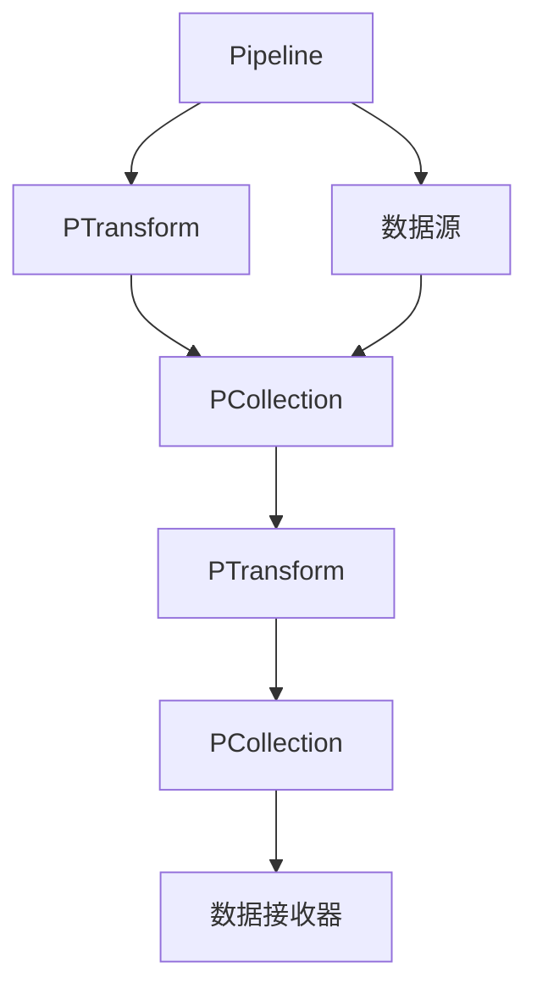

# ApacheBeam的数据源和数据接收器：内置数据源和自定义数据接收器

## 1.背景介绍

### 1.1 Apache Beam 概述

Apache Beam 是一个统一的编程模型,用于定义批处理和流式并行数据处理管道。它支持多种执行引擎,包括 Apache Flink、Apache Spark、Google Cloud Dataflow 等。Beam 提供了一种高级别的编程抽象,允许您以统一的方式编写批处理和流式处理管道,而无需了解底层执行引擎的细节。

### 1.2 数据源和数据接收器的重要性

在构建数据处理管道时,数据源和数据接收器扮演着关键角色。数据源负责从各种来源(如文件、数据库、消息队列等)读取输入数据,而数据接收器则负责将处理后的数据写入到各种目标位置(如文件、数据库、消息队列等)。Apache Beam 提供了多种内置的数据源和数据接收器,同时也支持自定义数据源和数据接收器,以满足不同的需求。

## 2.核心概念与联系

### 2.1 PTransform

PTransform 是 Apache Beam 中的核心概念,代表了对输入 PCollection 执行的并行操作。PTransform 可以是内置的转换(如 ParDo、GroupByKey、Combine 等),也可以是自定义的转换。数据源和数据接收器实际上也是特殊的 PTransform。

### 2.2 PCollection

PCollection 代表了管道中的分布式数据集合,可以看作是一个逻辑上的不可变数据集。PCollection 中的每个元素都是一个 KV 对,其中 K 表示键,V 表示值。

### 2.3 Pipeline I/O

Pipeline I/O 是 Apache Beam 中处理输入和输出的抽象层。它定义了一组通用的读写接口,用于与各种数据源和数据接收器进行交互。Pipeline I/O 提供了一种统一的方式来处理不同类型的数据,同时也支持自定义数据源和数据接收器。



上图展示了 Apache Beam 中数据源、数据接收器、PTransform 和 PCollection 之间的关系。数据源负责将数据读入 PCollection,PTransform 对 PCollection 执行转换操作,最终将结果写入数据接收器。

## 3.核心算法原理具体操作步骤

### 3.1 内置数据源

Apache Beam 提供了多种内置的数据源,可以方便地从不同的数据源读取数据。以下是一些常见的内置数据源:

#### 3.1.1 TextIO

TextIO 用于从文本文件(如 .txt、.csv 等)中读取数据。它支持读取本地文件系统、Google Cloud Storage、Apache Hadoop 文件系统等多种文件系统。

```python
import apache_beam as beam

# 从文本文件读取数据
lines = pipeline | 'ReadFromText' >> beam.io.ReadFromText('path/to/input.txt')
```

#### 3.1.2 AvroIO

AvroIO 用于从 Avro 文件中读取数据。Avro 是一种二进制数据序列化格式,常用于大数据处理场景。

```python
import apache_beam as beam

# 从 Avro 文件读取数据
records = pipeline | 'ReadFromAvro' >> beam.io.ReadFromAvro('path/to/input.avro')
```

#### 3.1.3 BigQueryIO

BigQueryIO 用于从 Google BigQuery 中读取数据。BigQuery 是 Google 提供的全托管数据仓库服务。

```python
import apache_beam as beam

# 从 BigQuery 表读取数据
rows = pipeline | 'ReadFromBigQuery' >> beam.io.ReadFromBigQuery(
    'project_id:dataset_id.table_id')
```

#### 3.1.4 KafkaIO

KafkaIO 用于从 Apache Kafka 中读取数据。Kafka 是一种分布式流处理平台,常用于构建实时数据管道。

```python
import apache_beam as beam

# 从 Kafka 主题读取数据
messages = pipeline | 'ReadFromKafka' >> beam.io.ReadFromKafka(
    consumer_config={'bootstrap.servers': 'kafka_broker_url'},
    topics=['topic_name'])
```

### 3.2 自定义数据源

虽然 Apache Beam 提供了多种内置的数据源,但在某些情况下,您可能需要从特定的数据源读取数据,或者需要自定义读取逻辑。在这种情况下,您可以创建自定义的数据源。

自定义数据源需要实现 `apache_beam.io.iobase.BoundedSource` 或 `apache_beam.io.iobase.UnboundedSource` 接口。`BoundedSource` 用于有界数据源(如文件),而 `UnboundedSource` 用于无界数据源(如流式数据)。

以下是一个自定义数据源的示例,用于从 MongoDB 数据库中读取数据:

```python
import apache_beam as beam
from apache_beam.io import iobase

class MongoDBSource(iobase.BoundedSource):
    def __init__(self, uri, database, collection):
        self.uri = uri
        self.database = database
        self.collection = collection

    def estimate_size(self):
        # 估计数据源的大小
        pass

    def split(self, desired_bundle_size, start_position=None, stop_position=None):
        # 将数据源划分为多个分片
        pass

    def get_range_tracker(self, start_position, stop_position):
        # 创建范围跟踪器
        pass

    def read(self, range_tracker):
        # 读取数据
        pass

# 在管道中使用自定义数据源
documents = pipeline | 'ReadFromMongoDB' >> beam.io.Read(
    MongoDBSource('mongodb://localhost:27017', 'database', 'collection'))
```

在上面的示例中,我们定义了一个 `MongoDBSource` 类,它继承自 `apache_beam.io.iobase.BoundedSource`。该类需要实现几个关键方法,如 `estimate_size`、`split`、`get_range_tracker` 和 `read`。这些方法定义了如何估计数据源的大小、将数据源划分为多个分片、创建范围跟踪器以及读取数据。

在管道中,我们使用 `beam.io.Read` 转换和自定义的 `MongoDBSource` 实例来从 MongoDB 数据库中读取数据。

### 3.3 内置数据接收器

与数据源类似,Apache Beam 也提供了多种内置的数据接收器,用于将处理后的数据写入到不同的目标位置。以下是一些常见的内置数据接收器:

#### 3.3.1 TextIO

TextIO 用于将数据写入文本文件(如 .txt、.csv 等)。它支持写入本地文件系统、Google Cloud Storage、Apache Hadoop 文件系统等多种文件系统。

```python
import apache_beam as beam

# 将数据写入文本文件
lines = ... # PCollection 代表输入数据
result = lines | 'WriteToText' >> beam.io.WriteToText('path/to/output.txt')
```

#### 3.3.2 AvroIO

AvroIO 用于将数据写入 Avro 文件。

```python
import apache_beam as beam

# 将数据写入 Avro 文件
records = ... # PCollection 代表输入数据
result = records | 'WriteToAvro' >> beam.io.WriteToAvro('path/to/output.avro')
```

#### 3.3.3 BigQueryIO

BigQueryIO 用于将数据写入 Google BigQuery。

```python
import apache_beam as beam

# 将数据写入 BigQuery 表
rows = ... # PCollection 代表输入数据
result = rows | 'WriteToBigQuery' >> beam.io.WriteToBigQuery(
    'project_id:dataset_id.table_id',
    write_disposition=beam.io.BigQueryDisposition.WRITE_TRUNCATE)
```

#### 3.3.4 KafkaIO

KafkaIO 用于将数据写入 Apache Kafka。

```python
import apache_beam as beam

# 将数据写入 Kafka 主题
messages = ... # PCollection 代表输入数据
result = messages | 'WriteToKafka' >> beam.io.WriteToKafka(
    producer_config={'bootstrap.servers': 'kafka_broker_url'},
    topic='topic_name')
```

### 3.4 自定义数据接收器

与自定义数据源类似,您也可以创建自定义的数据接收器来将数据写入特定的目标位置或实现自定义的写入逻辑。

自定义数据接收器需要实现 `apache_beam.io.iobase.Sink` 接口。以下是一个自定义数据接收器的示例,用于将数据写入 MongoDB 数据库:

```python
import apache_beam as beam
from apache_beam.io import iobase

class MongoDBSink(iobase.Sink):
    def __init__(self, uri, database, collection):
        self.uri = uri
        self.database = database
        self.collection = collection

    def initialize_write(self):
        # 初始化写入操作
        pass

    def write(self, value):
        # 写入数据
        pass

    def finalize_write(self, last_bundle=False):
        # 完成写入操作
        pass

# 在管道中使用自定义数据接收器
documents = ... # PCollection 代表输入数据
result = documents | 'WriteToMongoDB' >> beam.io.Write(
    MongoDBSink('mongodb://localhost:27017', 'database', 'collection'))
```

在上面的示例中,我们定义了一个 `MongoDBSink` 类,它继承自 `apache_beam.io.iobase.Sink`。该类需要实现几个关键方法,如 `initialize_write`、`write` 和 `finalize_write`。这些方法定义了如何初始化写入操作、写入数据以及完成写入操作。

在管道中,我们使用 `beam.io.Write` 转换和自定义的 `MongoDBSink` 实例来将数据写入 MongoDB 数据库。

## 4.数学模型和公式详细讲解举例说明

在数据处理领域,我们经常需要使用一些数学模型和公式来处理和分析数据。Apache Beam 提供了一些内置的转换,如 `CombineGlobally` 和 `CombinePerKey`,可以用于实现一些常见的数学运算,如求和、求平均值等。

### 4.1 求和

假设我们有一个 PCollection,其中每个元素都是一个数字,我们想计算所有数字的总和。我们可以使用 `CombineGlobally` 转换和 `sum` 函数来实现:

$$
\text{sum} = \sum_{i=1}^{n} x_i
$$

其中 $n$ 是元素的个数,而 $x_i$ 是第 $i$ 个元素的值。

```python
import apache_beam as beam

# 计算所有数字的总和
numbers = ... # PCollection 代表输入数据
total = numbers | beam.CombineGlobally(sum)
```

### 4.2 求平均值

如果我们想计算所有数字的平均值,我们可以使用 `CombineGlobally` 转换和一个自定义的组合函数:

$$
\text{mean} = \frac{1}{n} \sum_{i=1}^{n} x_i
$$

其中 $n$ 是元素的个数,而 $x_i$ 是第 $i$ 个元素的值。

```python
import apache_beam as beam

def mean(numbers):
    total = sum(numbers)
    count = len(numbers)
    return total / count if count > 0 else 0

# 计算所有数字的平均值
numbers = ... # PCollection 代表输入数据
average = numbers | beam.CombineGlobally(mean)
```

在上面的示例中,我们定义了一个自定义的 `mean` 函数,它首先计算所有数字的总和,然后除以元素的个数来获得平均值。

### 4.3 分组求和

如果我们有一个 PCollection,其中每个元素都是一个键值对 `(key, value)`,我们想计算每个键对应的值的总和,我们可以使用 `CombinePerKey` 转换和 `sum` 函数:

$$
\text{sum}_k = \sum_{i=1}^{n_k} v_i
$$

其中 $n_k$ 是属于键 $k$ 的元素的个数,而 $v_i$ 是第 $i$ 个元素的值。

```python
import apache_beam as beam

# 计算每个键对应的值的总和
pairs = ... # PCollection 代表输入数据
sums = pairs | beam.CombinePerKey(sum)
```

在上面的示例中,`beam.CombinePerKey(sum)` 会对每个键对应的值进行求和操作,最终得到一个新的 PCollection,其中每个元素都是一个键值对 `(key, sum)`。

### 4.4 分组求平均值

如果我们想计算每个键对应的值的平均值,我们可以使用 `CombinePerKey` 转换和一个自定义的组合函数:

$$
\text{mean}_k = \frac{1}{n_k} \sum_{i=1