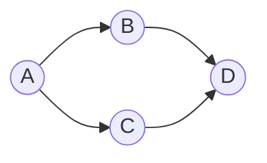
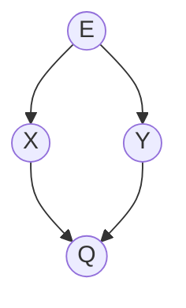
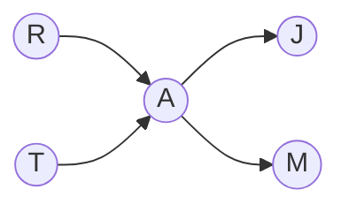

# BaysNet的优化策略

## 1.背景介绍
### 1.1 贝叶斯网络的起源与发展
贝叶斯网络(Bayesian Network,简称BN)是一种基于概率图模型的有向无环图,由贝叶斯(Thomas Bayes)在18世纪提出。它可以用于表示随机变量之间的条件依赖关系,并根据已知变量推断未知变量的后验概率分布。20世纪80年代,Judea Pearl等人将贝叶斯方法与图模型相结合,形成了现代意义上的贝叶斯网络理论体系。

### 1.2 贝叶斯网络的应用领域
贝叶斯网络在人工智能、机器学习、数据挖掘、决策分析、故障诊断、风险评估等诸多领域有广泛应用。一些经典的应用包括:
- 微软的Office助手
- 谷歌的垃圾邮件过滤器
- 医学诊断专家系统
- 自然语言处理中的语义消歧
- 基因调控网络分析

### 1.3 贝叶斯网络面临的挑战
尽管贝叶斯网络是一个强大的建模工具,但在实际应用中仍面临诸多挑战:
- 网络结构学习:从数据中学习最优的网络拓扑结构是NP难问题
- 参数学习:需要从样本数据中估计节点的条件概率表
- 推理计算:对于复杂网络,精确推理的计算复杂度很高
- 数据的不完整性:现实数据往往有缺失值,需要专门处理
- 模型的可解释性:如何让非专业人士理解复杂的概率图模型

因此,优化贝叶斯网络的学习、推理与应用性能,成为了研究者们的重要课题。本文将重点探讨几种优化贝叶斯网络的策略。

## 2.核心概念与联系
### 2.1 有向无环图(DAG)
有向无环图是贝叶斯网络的骨架,表示变量之间的依赖关系。若X→Y,则称X是Y的父节点,Y是X的子节点。DAG需满足两个条件:
1. 有向性:边有方向,表示依赖关系的方向 
2. 无环性:不能存在有向环路,即变量不能间接地依赖自己

### 2.2 条件概率表(CPT)
条件概率表定量描述了每个节点的局部概率分布,即在父节点取不同值时,该节点取各个值的概率。对于没有父节点的节点,CPT就是它的先验概率分布。

### 2.3 联合概率分布
贝叶斯网络实际上表示了所有变量的联合概率分布,根据乘法法则,联合概率可分解为:
$P(X_1, ..., X_n) = \prod_{i=1}^n P(X_i | Parents(X_i))$

其中$Parents(X_i)$表示$X_i$的父节点集合。这个分解式减少了指数级别的参数,是贝叶斯网络的核心。

### 2.4 推理
贝叶斯网络的推理就是在已知部分变量取值的条件下,计算其他变量的后验概率分布。常见的推理算法有:
- 精确推理:变量消除、团树等 
- 近似推理:重要性采样、吉布斯采样、循环信念传播等

## 3.核心算法原理具体操作步骤
### 3.1 结构学习
贝叶斯网络的结构学习就是从数据中找出最能解释数据的DAG结构。常用的结构学习算法有:
1. 基于约束的方法:通过条件独立性检验,得到变量间的依赖关系约束,再构建满足约束的DAG。
2. 基于评分的方法:定义一个评分函数(如BIC、MDL),衡量一个DAG与数据的拟合程度,在DAG空间中搜索评分最高的结构。常用的搜索策略有贪婪爬山、模拟退火、遗传算法等。
3. 混合方法:将约束和评分结合,先通过独立性检验得到候选结构,再基于评分搜索最优结构。

结构学习的一般步骤如下:
1. 数据预处理:对缺失数据插补,将连续变量离散化等
2. 定义评分函数或独立性检验方法
3. 搜索空间:定义候选结构集合,如n个变量的所有可能DAG
4. 搜索策略:采用合适的优化算法搜索最优结构  
5. 后处理:去除弱边,平均多个模型等

### 3.2 参数学习
参数学习就是在已知网络结构的情况下,从数据中估计每个节点的CPT。常用的参数学习方法有:
1. 最大似然估计(MLE):频率派方法,假设数据完整,用样本频率估计参数。
2. 贝叶斯估计:引入参数的先验分布(如Dirichlet分布),用后验均值估计参数。能缓解数据稀疏问题。
3. EM算法:当存在隐变量或缺失数据时,通过迭代的E步(求期望)和M步(最大化)估计参数。

参数学习的一般步骤如下:  
1. 定义参数先验分布(贝叶斯估计)
2. 根据样本统计充分统计量
3. 计算MLE或后验估计
4. 迭代EM算法直到收敛(若需要)

### 3.3 精确推理
变量消除(Variable Elimination)是一种常用的精确推理算法,适用于中小型网络。其基本思想是通过边缘化和条件独立性,不断消除无关变量,直到只剩下查询变量。

假设查询变量为X,证据变量为E,变量消除的步骤如下:
1. 根据贝叶斯网络分解式,写出联合概率P(X,E)的因子积 
2. 确定一个消除顺序,如X以外的变量的一个序列Y1,Y2,...,Yn
3. 对于i=1,2,...,n:
   - 找出所有含Yi的因子,构成一个因子集
   - 对该因子集求和,消除Yi,得到一个新因子
   - 用新因子替换原有的所有含Yi的因子
4. 结果中的因子只包含X,对其归一化得到P(X|E)  

变量消除的复杂度正比于最大团的大小。优化变量消元的关键是选择最优消除顺序,如最小填充、最小度等启发式方法。

### 3.4 近似推理  
对于大型复杂网络,精确推理往往不可行。近似推理通过抽样或信息传递等方法,在牺牲一定精度的情况下估计后验概率。

重要性采样(Importance Sampling)是一种常用的蒙特卡洛抽样方法。其基本思想是从一个易采样的建议分布q(x)抽样,然后用权重w(x)=p(x)/q(x)修正样本,以无偏估计目标分布p(x)。

假设查询变量为X,证据变量为E,重要性采样的步骤如下:
1. 选择一个建议分布q(x),使其在p(x)大的地方也大 
2. 从q(x)独立抽取N个样本x1,x2,...,xN
3. 对每个样本xi,计算权重wi=p(xi)/q(xi) 
4. 估计P(X|E)为:
$\hat{P}(X|E) = \frac{\sum_{i=1}^N w_i I(x_i=X)}{\sum_{i=1}^N w_i}$

其中I(·)为指示函数。重要性采样的关键是选择合适的建议分布q(x),如何选择q(x)是一个值得研究的问题。

## 4.数学模型和公式详细讲解举例说明
### 4.1 贝叶斯网络的数学定义
一个贝叶斯网络B由两部分组成:
1. 一个DAG结构G,节点表示随机变量,边表示变量间的依赖关系。
2. 每个节点Xi的条件概率表CPT(Xi|Pa(Xi)),表示在父节点Pa(Xi)取值下节点Xi的局部概率分布。

因此,一个贝叶斯网络B定义了所有变量的联合概率分布:

$$P_B(X_1,...,X_n) = \prod_{i=1}^n P(X_i|Pa(X_i))$$

例如,考虑如下的贝叶斯网络:

其联合概率分布为:
$$P(A,B,C,D) = P(A)P(B|A)P(C|A)P(D|B,C)$$

### 4.2 变量消除算法详解
以一个简单的贝叶斯网络为例,说明变量消除算法的具体步骤。考虑如下查询:
- 查询变量:Q
- 证据变量:E
- 中间变量:X,Y

联合概率分解为:
$$P(Q,E) = \sum_{X,Y} P(Q|X,Y)P(X|E)P(Y|E)P(E)$$

变量消除步骤如下:
1. 初始因子为:f1(Q,X,Y)=P(Q|X,Y),f2(X,E)=P(X|E),f3(Y,E)=P(Y|E),f4(E)=P(E)
2. 选择消除顺序:Y,X
3. 消除Y:
   - 含Y的因子为f1,f3
   - 对f1和f3求和消除Y,得到新因子f5(Q,X,E)=∑Y P(Q|X,Y)P(Y|E)
   - 用f5替换f1和f3
4. 消除X:
   - 含X的因子为f2,f5  
   - 对f2和f5求和消除X,得到新因子f6(Q,E)=∑X P(X|E)f5(Q,X,E)
   - 用f6替换f2和f5
5. 结果中只含Q和E,归一化得到P(Q|E)=f6(Q,E)/∑Q f6(Q,E)

可见,变量消除避免了对整个联合概率表的计算,而是利用条件独立性,通过局部计算实现推理。

### 4.3 重要性采样的数学推导
假设我们要估计目标函数f(x)在分布p(x)下的期望Ep[f(x)],但p(x)难以直接采样。重要性采样引入一个建议分布q(x),利用如下恒等式:

$$E_p[f(x)] = \int f(x)p(x)dx = \int f(x)\frac{p(x)}{q(x)}q(x)dx = E_q[f(x)w(x)]$$

其中权重$w(x)=\frac{p(x)}{q(x)}$。因此,我们可以从q(x)采样,然后用加权样本估计Ep[f(x)]:

$$\hat{E}_p[f(x)] = \frac{1}{N}\sum_{i=1}^N f(x_i)w(x_i), \quad x_i \sim q(x)$$

以贝叶斯网络推理为例,目标函数f(x)是查询变量的指示函数,p(x)是后验分布P(X|E),建议分布q(x)可以选为联合概率P(X,E)或先验概率P(X)。重要性采样得到一组加权样本,然后用加权平均估计后验概率:

$$\hat{P}(x|E) = \frac{\sum_{i=1}^N w_i I(x_i=x)}{\sum_{i=1}^N w_i}, \quad w_i = \frac{P(x_i,E)}{q(x_i)}$$

重要性采样的优点是不需要知道归一化常数,缺点是方差可能很大。一些改进方法包括:
- 选择与p(x)接近的q(x),如MCMC方法 
- 顺序重要性采样,即每次根据已有样本调整q(x)
- 退火重要性采样,引入退火因子平滑p(x)和q(x)

## 5.项目实践:代码实例和详细解释说明
下面用Python实现一个简单的贝叶斯网络,并演示变量消除算法。考虑如下的贝叶斯网络:

其中R表