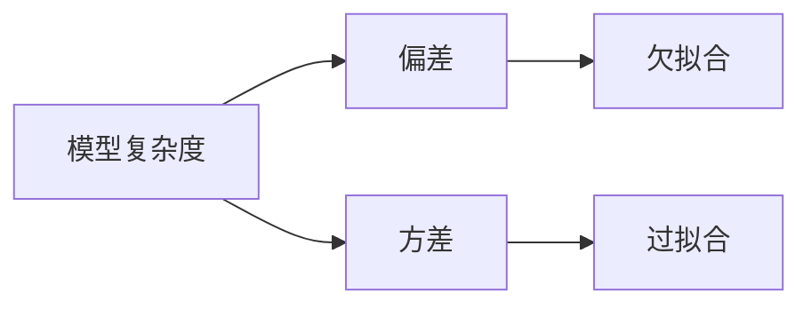

## 1.背景介绍

在机器学习领域，我们经常会遇到一个问题，那就是如何选择一个最优的模型。在这个过程中，我们需要平衡模型的偏差（Bias）和方差（Variance）。这就是我们今天要讨论的主题——偏差与方差的权衡（Bias-Variance Tradeoff）。

## 2.核心概念与联系

在深入了解偏差与方差的权衡之前，我们首先需要理解偏差和方差的定义以及它们之间的关系。

### 2.1 偏差

偏差描述的是预测值（估计值）的期望与真实值之间的差距。偏差越大，说明模型在拟合数据时的误差越大，也就是说模型的预测能力越差。高偏差可能会导致模型出现欠拟合。

### 2.2 方差

方差描述的是预测值的变化范围，或者说离散程度，也就是预测值与预测值的期望之间的差距。方差越大，数据的分布越分散。高方差可能会导致模型出现过拟合。

### 2.3 偏差与方差的权衡

偏差与方差的权衡描述的是在模型复杂度增加的情况下，模型的偏差会减小，但方差会增大。我们的目标是找到一个最优点，使得偏差和方差的和最小。



## 3.核心算法原理具体操作步骤

为了理解偏差与方差的权衡，我们可以通过以下步骤进行模拟：

1. 生成一个数据集，包含真实值和噪声。
2. 创建多个不同复杂度的模型，如线性回归模型、多项式回归模型等。
3. 使用交叉验证法，计算每个模型的偏差和方差。
4. 绘制偏差与方差的曲线，找到最优点。

## 4.数学模型和公式详细讲解举例说明

在理解偏差与方差的权衡时，我们需要用到一些数学公式。以下是一些基本的公式：

1. 偏差（Bias）的计算公式：

$$
Bias = E[\hat{f}(x) - f(x)]
$$

其中，$\hat{f}(x)$ 是预测值，$f(x)$ 是真实值。

2. 方差（Variance）的计算公式：

$$
Variance = E[(\hat{f}(x) - E[\hat{f}(x)])^2]
$$

其中，$\hat{f}(x)$ 是预测值，$E[\hat{f}(x)]$ 是预测值的期望。

3. 总误差（Total error）的计算公式：

$$
Total Error = Bias^2 + Variance + Irreducible Error
$$

其中，Irreducible Error 是不可避免的误差，通常由数据的噪声引起。

## 5.项目实践：代码实例和详细解释说明

为了更好地理解偏差与方差的权衡，我们使用 Python 进行一个简单的实战。以下是具体的代码实例：

```python
# 导入相关库
import numpy as np
import matplotlib.pyplot as plt
from sklearn.linear_model import LinearRegression
from sklearn.preprocessing import PolynomialFeatures
from sklearn.pipeline import make_pipeline
from sklearn.model_selection import cross_val_score

# 生成数据
np.random.seed(0)
x = np.random.rand(100, 1) * 2 - 1
y = x ** 2 + x + 2 + np.random.randn(100, 1)

# 创建模型
models = [LinearRegression(),
          make_pipeline(PolynomialFeatures(2), LinearRegression()),
          make_pipeline(PolynomialFeatures(10), LinearRegression())]

# 计算偏差和方差
biases = []
variances = []
for model in models:
    scores = cross_val_score(model, x, y, cv=5)
    biases.append(scores.mean())
    variances.append(scores.var())

# 绘制偏差与方差的曲线
plt.plot(range(1, len(models) + 1), biases, label='Bias')
plt.plot(range(1, len(models) + 1), variances, label='Variance')
plt.legend()
plt.show()
```

## 6.实际应用场景

偏差与方差的权衡在机器学习的各个领域都有广泛的应用，包括但不限于：

1. 回归分析：在选择回归模型时，我们需要考虑模型的复杂度，以找到一个偏差和方差都较小的模型。
2. 分类任务：在选择分类模型时，我们同样需要考虑模型的复杂度，以避免过拟合或欠拟合的问题。
3. 特征选择：在选择特征时，我们需要考虑特征的数量和质量，以避免模型的复杂度过高导致的过拟合问题。

## 7.工具和资源推荐

以下是一些在理解和应用偏差与方差的权衡时可能会用到的工具和资源：

1. Python：Python 是一种广泛用于数据分析和机器学习的编程语言。
2. Scikit-learn：Scikit-learn 是一个用于机器学习的 Python 库，提供了大量的算法和工具。
3. Matplotlib：Matplotlib 是一个用于绘制图表的 Python 库，可以帮助我们更好地理解数据和模型。

## 8.总结：未来发展趋势与挑战

偏差与方差的权衡是机器学习中一个重要的概念，它帮助我们理解模型复杂度如何影响模型的性能。然而，找到一个最优的模型仍然是一个挑战，需要我们不断地尝试和改进。

随着深度学习技术的发展，我们有了更多的工具和方法来处理这个问题。例如，使用神经网络可以自动地调整模型的复杂度，使得我们可以更容易地找到一个最优的模型。然而，这也带来了新的挑战，例如如何解释模型的决策过程。

## 9.附录：常见问题与解答

1. 问：偏差与方差的权衡是如何影响模型的性能的？
   答：偏差与方差的权衡描述的是模型复杂度如何影响模型的性能。模型复杂度过低会导致高偏差，也就是模型的预测能力差；模型复杂度过高会导致高方差，也就是模型对数据的拟合过于敏感，容易出现过拟合。

2. 问：如何选择一个最优的模型？
   答：选择一个最优的模型需要我们考虑模型的偏差和方差。我们的目标是找到一个偏差和方差的和最小的模型。这通常需要我们尝试不同的模型和参数。

作者：禅与计算机程序设计艺术 / Zen and the Art of Computer Programming
