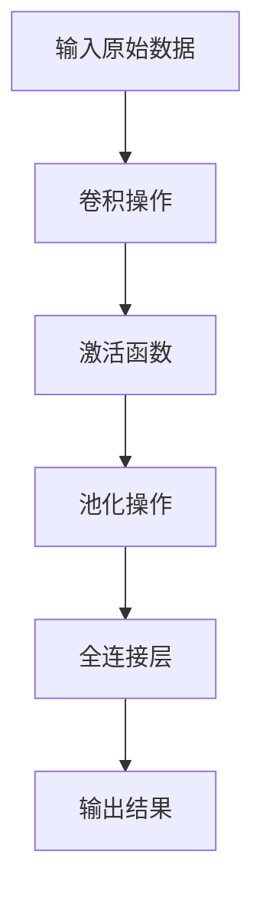

## 背景介绍

卷积神经网络（Convolutional Neural Network, CNN）是目前深度学习领域中最为流行的技术之一。它的出现使得图像分类、语音识别、自然语言处理等领域取得了突破性的进展。CNN的核心特点是卷积操作，这一操作可以将原始数据（如图像）中的局部特征抽取出来，以此提高模型的性能和效率。

## 核心概念与联系

CNN的核心概念有以下几个：

1. 卷积层：卷积层是CNN的核心部分，主要负责对原始数据进行局部特征提取。卷积层使用卷积核（filter）与原始数据进行相乘运算，并对其进行滑动求和，以此得到新的特征映射。

2. 池化层：池化层是CNN中一个重要的下采样操作，它可以将卷积层的特征映射进行降维处理，以此减少参数量和计算量。常见的池化操作有最大池化和平均池化。

3. 全连接层：全连接层是CNN中的一种后处理操作，它将卷积层和池化层的特征映射进行线性变换，以此完成对原始数据的分类任务。

## 核心算法原理具体操作步骤

CNN的算法原理可以分为以下几个步骤：

1. 输入原始数据：CNN的输入数据通常是灰度图像或彩色图像，数据维度为（height, width, channels）。

2. 卷积操作：卷积核与原始数据进行相乘运算，并对其进行滑动求和，以此得到新的特征映射。

3. 激活函数：激活函数可以将卷积层的线性组合转换为非线性组合，从而提高模型的表现能力。常见的激活函数有ReLU和sigmoid。

4. 池化操作：池化层对卷积层的特征映射进行降维处理，以此减少参数量和计算量。

5. 全连接层：全连接层对卷积层和池化层的特征映射进行线性变换，以此完成对原始数据的分类任务。

6. 输出结果：CNN的输出结果通常是一组概率分布，表示输入数据属于不同类别的可能性。

## 数学模型和公式详细讲解举例说明

CNN的数学模型可以用以下公式表示：

$$
y = f(x; W, b) = \sigma(W \cdot x + b)
$$

其中，$y$是输出结果，$x$是输入数据，$W$是权重参数，$b$是偏置参数，$\sigma$是激活函数。这里的$W \cdot x$表示卷积操作，$W$是卷积核。

## 项目实践：代码实例和详细解释说明

CNN的代码实例可以使用以下流程图表示：

## 实际应用场景

CNN的实际应用场景有以下几个：

1. 图像分类：CNN可以用于识别图像中的物体、人物等，并进行分类。

2. 语音识别：CNN可以用于将语音信号转换为文本，并进行识别。

3. 自然语言处理：CNN可以用于对文本进行分词、句子生成等操作。

## 工具和资源推荐

对于想要学习CNN的读者，以下是一些建议：

1. 学习经典的CNN论文，如LeCun等人的“Gradient-based learning applied to document recognition”和Krizhevsky等人的“ImageNet Classification with Deep Convolutional Neural Networks”。

2. 学习开源的CNN实现，如TensorFlow和PyTorch。

3. 参加相关的在线课程，如Coursera的“Deep Learning”和“Convolutional Neural Networks for Visual Recognition”。

## 总结：未来发展趋势与挑战

CNN的未来发展趋势主要有以下几个：

1. 更深的网络：随着计算能力的提升，人们开始尝试构建更深的CNN网络，以此提高模型的表现能力。

2. 更广的应用场景：CNN不仅局限于图像和语音领域，还可以扩展到其他领域，如医疗、金融等。

3. 更好的优化算法：人们开始研究如何使用更好的优化算法来训练CNN，以此提高模型的效率。

CNN的挑战主要有以下几个：

1. 模型复杂度：深度CNN网络具有大量的参数和计算量，这使得模型训练和部署变得非常困难。

2. 数据不足：CNN的性能取决于训练数据的质量和数量，如果训练数据不足，模型的表现可能会受到影响。

3. 过拟合：CNN容易陷入过拟合现象，即在训练数据上表现良好，但在测试数据上表现不佳。

## 附录：常见问题与解答

1. **如何选择卷积核的大小？** 一般来说，卷积核的大小选择与输入数据的特征尺寸有关，通常选择为2或3。

2. **如何选择池化层的大小？** 池化层的大小选择通常与卷积核的大小成正比，常见的选择为2或3。

3. **如何选择激活函数？** 通常选择非线性激活函数，如ReLU，因为它可以提高模型的表现能力。