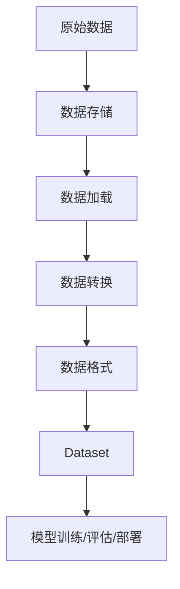

# DataSet原理与代码实例讲解

## 1.背景介绍

在数据科学和机器学习领域中,数据是一切的基础。无论是训练模型、评估模型性能,还是在生产环境中部署模型,都需要高质量、结构化的数据集。然而,获取和处理原始数据通常是一个耗时且容易出错的过程。因此,出现了 Dataset 这一抽象概念,旨在简化数据处理流程,提高数据质量和可重复使用性。

Dataset 是一种用于表示数据集合的数据结构,通常包含以下几个核心组件:数据存储、数据格式、数据转换和数据加载。它为用户提供了一种统一的接口来访问和操作数据,从而减少了重复的数据处理逻辑。

随着深度学习和大数据技术的快速发展,Dataset 的概念和实现也在不断演进。许多流行的机器学习框架和库,如 TensorFlow、PyTorch、Hugging Face 等,都提供了内置的 Dataset 模块或相关功能。本文将深入探讨 Dataset 的原理和实现细节,并通过实际代码示例帮助读者更好地理解和运用这一强大的工具。

## 2.核心概念与联系

在深入探讨 Dataset 的具体实现之前,我们需要先了解一些核心概念及其相互关系。

### 2.1 数据存储

数据存储指的是将原始数据持久化到某种介质(如硬盘、内存等)的过程。常见的数据存储格式包括文本文件(如 CSV、JSON)、二进制文件(如 HDF5、Parquet)和数据库等。不同的存储格式具有不同的优缺点,如读写性能、压缩率、可扩展性等。选择合适的存储格式对于高效地访问和操作数据至关重要。

### 2.2 数据格式

数据格式描述了数据的组织结构和类型信息。常见的数据格式包括张量(Tensor)、NumPy 数组、Python 列表等。在机器学习中,张量是最常用的数据格式,因为它能够高效地表示多维数据,并支持硬件加速(如 GPU)。

### 2.3 数据转换

数据转换是指将原始数据从一种格式转换为另一种格式的过程。这通常包括数据清洗、特征工程、数据增强等步骤。数据转换对于提高数据质量和模型性能至关重要。

### 2.4 数据加载

数据加载是指从存储介质中读取数据,并将其转换为所需的数据格式(通常是张量或 NumPy 数组)的过程。高效的数据加载对于快速训练和评估模型至关重要,尤其是在处理大型数据集时。

### 2.5 Dataset 抽象

Dataset 是一种将上述核心概念统一起来的抽象,它提供了一种高效、可重用的方式来访问和操作数据。通常,Dataset 会封装数据存储、数据格式、数据转换和数据加载等功能,为用户提供一致的接口。



上图展示了 Dataset 在数据处理流程中的位置。原始数据首先被存储在某种介质中,然后通过数据加载和数据转换步骤转换为所需的数据格式,最终被封装为 Dataset 对象,供模型训练、评估或部署使用。

## 3.核心算法原理具体操作步骤

虽然不同的机器学习框架和库在实现细节上可能有所不同,但它们在 Dataset 的核心算法原理上存在一些共同点。本节将介绍 Dataset 的核心算法原理和具体操作步骤。

### 3.1 数据读取

数据读取是 Dataset 的第一步,它从存储介质中加载原始数据。根据数据存储格式的不同,读取方式也有所区别。例如,对于文本文件,可以使用内置的文件读取函数;对于二进制文件,可以使用专门的库(如 HDF5 库)进行读取;对于数据库,可以使用相应的数据库客户端进行查询。

无论使用何种方式读取数据,最终目标都是将原始数据加载到内存中,以便进行后续的处理。

### 3.2 数据解码

在某些情况下,原始数据可能需要进行解码。例如,图像数据通常以二进制格式存储,需要解码为像素矩阵;文本数据可能需要解码为字符序列。数据解码的目的是将原始数据转换为更加易于处理的格式。

### 3.3 数据转换

数据转换是 Dataset 的核心步骤之一。在这一步骤中,原始数据将经过一系列转换,以满足模型训练或评估的需求。常见的数据转换操作包括:

1. **数据清洗**: 处理缺失值、异常值等数据质量问题。
2. **特征工程**: 从原始数据中提取有用的特征,或构造新的特征。
3. **数据归一化**: 将数据缩放到特定范围,以提高模型的收敛速度和性能。
4. **数据增强**: 通过一些转换(如旋转、翻转等)来增加数据的多样性,从而提高模型的泛化能力。
5. **数据编码**: 将分类数据(如文本)转换为数值表示,以便输入到模型中。

这些转换操作通常由用户自定义,并被封装在 Dataset 的转换函数中。转换函数的输入是原始数据,输出是转换后的数据。

### 3.4 批处理

在深度学习中,通常会将数据划分为多个批次(batch)进行训练或评估,而不是一次性将整个数据集加载到内存中。这不仅有助于节省内存,还可以提高计算效率。

Dataset 通常会提供一种机制来对数据进行批处理。具体来说,它会维护一个指向当前批次的指针,每次调用时返回下一个批次的数据。当所有批次都被遍历完毕时,指针会重新指向数据集的开头,以便进行下一轮迭代。

### 3.5 数据预取

为了进一步提高数据加载的效率,Dataset 通常会采用数据预取(data prefetching)的技术。具体来说,它会在当前批次的数据被消费时,异步地预取下一个批次的数据。这样可以充分利用 CPU 和 GPU 之间的并行计算能力,从而减少数据加载的延迟。

数据预取通常是通过多线程或多进程的方式实现的。每个线程或进程负责预取一个批次的数据,并将其存储在内存缓冲区中。当模型需要新的批次时,只需从缓冲区中读取数据,而无需等待数据加载。

### 3.6 内存缓存

对于一些小型数据集,Dataset 可能会选择将整个数据集缓存在内存中,以进一步提高数据访问的效率。内存缓存通常在数据加载完成后进行,并且只需执行一次。

内存缓存的优点是可以极大地减少数据加载的延迟,因为后续的数据访问只需从内存中读取。但是,它也存在一些限制,例如内存占用可能过高,无法处理大型数据集。因此,内存缓存通常只适用于小型数据集或需要频繁访问的数据集。

### 3.7 并行处理

为了充分利用现代硬件的并行计算能力,Dataset 通常会支持并行处理。具体来说,它可以将数据划分为多个分区(shard),并在多个线程或进程中并行地处理这些分区。

并行处理不仅可以加速数据转换和预取等操作,还可以用于数据采样、数据分割等任务。例如,在训练集和验证集的划分过程中,可以并行地处理多个分区,从而提高效率。

### 3.8 可重复性

在机器学习中,确保实验的可重复性是非常重要的。Dataset 通常会提供一种机制来确保在不同的运行中,数据的顺序和划分是一致的。这通常是通过设置随机种子(random seed)来实现的。

通过设置相同的随机种子,Dataset 可以保证在每次运行时,数据的顺序和划分都是相同的。这不仅有助于调试和重现实验结果,还可以确保模型在不同的运行中得到相同的初始化,从而提高实验的可靠性。

## 4.数学模型和公式详细讲解举例说明

在数据处理过程中,常常需要对数据进行一些数学转换,以满足模型的输入要求或提高模型的性能。本节将介绍一些常见的数学模型和公式,并通过具体示例说明它们在 Dataset 中的应用。

### 4.1 数据归一化

数据归一化是一种常见的数据预处理技术,它将数据缩放到特定的范围,通常是 [0, 1] 或 [-1, 1]。归一化可以加快模型的收敛速度,并提高模型的性能。

最常见的归一化方法是 Min-Max 归一化,其公式如下:

$$
x_{norm} = \frac{x - x_{min}}{x_{max} - x_{min}}
$$

其中,$ x $ 是原始数据,$ x_{min} $ 和 $ x_{max} $ 分别是数据的最小值和最大值,$ x_{norm} $ 是归一化后的数据。

例如,假设我们有一个包含身高数据的数据集,身高范围在 150cm 到 190cm 之间。我们可以使用 Min-Max 归一化将身高数据缩放到 [0, 1] 范围内:

```python
import numpy as np

heights = np.array([165, 175, 180, 170, 185])
heights_min = 150
heights_max = 190

heights_norm = (heights - heights_min) / (heights_max - heights_min)
print(heights_norm)
# Output: [0.5        0.83333333 1.         0.66666667 1.16666667]
```

另一种常见的归一化方法是 Z-Score 归一化,它将数据转换为标准正态分布,即均值为 0,标准差为 1。Z-Score 归一化的公式如下:

$$
x_{norm} = \frac{x - \mu}{\sigma}
$$

其中,$ \mu $ 是数据的均值,$ \sigma $ 是数据的标准差。

例如,对于同一个身高数据集,我们可以使用 Z-Score 归一化:

```python
import numpy as np

heights = np.array([165, 175, 180, 170, 185])
heights_mean = np.mean(heights)
heights_std = np.std(heights)

heights_norm = (heights - heights_mean) / heights_std
print(heights_norm)
# Output: [-1.11803399  0.          0.89442719 -0.44721359  1.67082438]
```

### 4.2 one-hot 编码

在处理分类数据时,我们通常需要将分类标签转换为数值表示,以便输入到模型中。一种常见的编码方法是 one-hot 编码,它将每个分类标签表示为一个二进制向量,其中只有一个元素为 1,其余元素为 0。

假设我们有一个包含颜色标签的数据集,颜色包括 "红色"、"绿色" 和 "蓝色"。我们可以使用 one-hot 编码将颜色标签转换为二进制向量:

```python
import numpy as np

colors = ['red', 'green', 'blue', 'red', 'green']

# 创建一个字典,将颜色映射到整数
color_to_int = {'red': 0, 'green': 1, 'blue': 2}

# 将颜色标签转换为整数
color_ints = [color_to_int[color] for color in colors]

# 使用 NumPy 的 eye 函数进行 one-hot 编码
color_one_hot = np.eye(3)[color_ints]

print(color_one_hot)
# Output:
# [[1. 0. 0.]
#  [0. 1. 0.]
#  [0. 0. 1.]
#  [1. 0. 0.]
#  [0. 1. 0.]]
```

在上面的示例中,我们首先创建一个字典,将颜色映射到整数。然后,我们将颜色标签转换为整数,并使用 NumPy 的 `eye` 函数进行 one-hot 编码。最终,我们得到了一个二进制矩阵,每一行表示一个颜色标签的 one-hot 编码。

### 4.3 词嵌入

在自然语言处理任务中,我们通常需要将文本数据转换为