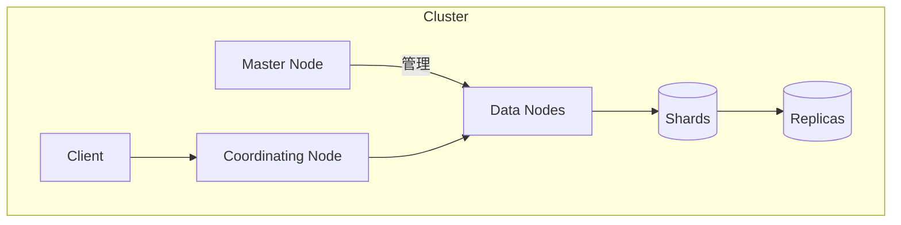

# ES高可用性与故障恢复

## 1.背景介绍

在当今数据驱动的世界中,Elasticsearch(ES)作为一种分布式、RESTful 风格的搜索和数据分析引擎,已经广泛应用于各种场景,如日志分析、全文搜索、安全分析等。由于ES通常需要处理大量数据,因此高可用性和故障恢复机制对于确保系统的稳定性和数据安全至关重要。

### 1.1 什么是高可用性?

高可用性(High Availability,HA)是指系统能够在一定时间内无中断地提供服务的能力。对于ES集群而言,高可用性意味着即使某些节点发生故障,整个集群仍然能够继续运行并提供服务,从而最大限度地减少系统中断时间。

### 1.2 故障恢复的重要性

任何系统都有可能发生故障,ES集群也不例外。故障可能由硬件故障、软件错误、人为操作失误或其他原因引起。当发生故障时,及时有效的故障恢复机制对于恢复系统运行、防止数据丢失至关重要。

## 2.核心概念与联系

为了实现ES的高可用性和故障恢复,需要理解一些核心概念及其相互关系。

### 2.1 集群(Cluster)

ES是一个分布式系统,由一个或多个节点(Node)组成集群。每个集群都有一个唯一的集群名称,用于识别和加入集群。集群中的节点通过内部传输层(Transport Layer)进行通信和协作。

### 2.2 节点类型

ES集群中的节点可以分为以下几种类型:

- 主节点(Master Node): 负责集群的管理操作,如创建或删除索引、跟踪集群中的节点等。
- 数据节点(Data Node): 用于存储数据的节点,负责数据相关的操作,如CRUD、搜索和聚合。
- 协调节点(Coordinating Node): 处理来自客户端的请求,将请求转发到相应的数据节点,并将结果返回给客户端。
- 机器学习节点(Machine Learning Node): 专门用于机器学习任务的节点。

### 2.3 分片(Shard)

为了实现水平扩展和高可用性,ES将索引划分为多个分片(Shard)。每个分片都是一个底层的Lucene实例,可以分布在集群中的不同节点上。分片分为主分片(Primary Shard)和副本分片(Replica Shard)。

### 2.4 副本(Replica)

副本是主分片的精确副本,用于提供数据冗余和高可用性。当主分片发生故障时,其中一个副本可以接管成为新的主分片,从而保证数据的可用性。副本也可以用于提高搜索性能,因为搜索请求可以在主分片和副本之间进行负载均衡。



上图展示了ES集群的核心概念及其关系。客户端通过协调节点向集群发送请求,协调节点将请求转发给相应的数据节点。数据节点管理着分片和副本,主节点负责集群的管理操作。

## 3.核心算法原理具体操作步骤

为了实现高可用性和故障恢复,ES采用了多种算法和机制,包括主节点选举、分片分配、副本同步等。

### 3.1 主节点选举

ES集群中始终只有一个主节点(Master Node)负责集群的管理操作。当主节点发生故障时,集群需要选举出一个新的主节点。主节点选举过程如下:

1. 每个候选主节点将自己的节点信息(如节点ID、集群状态版本号等)写入临时文件。
2. 候选主节点尝试从大多数(即`(候选主节点数量/2)+1`个)候选主节点处获取同意投票。
3. 获得大多数同意投票的候选主节点将成为新的主节点。
4. 新主节点将更新集群状态,并通知其他节点。

该算法确保了只有一个主节点被选举出来,从而避免"脑裂"(Split Brain)问题。

### 3.2 分片分配

当创建新索引时,ES会根据配置的主分片数量将索引划分为多个主分片。主分片会均匀地分布在集群中的数据节点上。同时,ES会为每个主分片创建指定数量的副本分片,并将它们分布在不同的数据节点上,以实现数据冗余和高可用性。

分片分配过程遵循以下原则:

1. 尽量将主分片和副本分片分布在不同的节点上,以提高可用性。
2. 尽量均匀地分布分片,避免数据节点负载不均。
3. 考虑节点的可用磁盘空间、内存等资源,确保分片能够正常运行。
4. 根据集群的状态和节点的加入或离开动态调整分片分布。

### 3.3 副本同步

为了确保主分片和副本分片之间的数据一致性,ES采用了异步副本同步机制。当主分片接收到写入请求时,会先在本地执行写入操作,然后将写入操作异步复制到副本分片。

副本同步过程如下:

1. 主分片将写入操作记录在事务日志(Translog)中。
2. 主分片将事务日志中的操作异步复制到副本分片。
3. 副本分片执行相同的写入操作,并将操作记录在自己的事务日志中。
4. 主分片和副本分片定期执行刷新(Refresh)操作,将内存中的数据刷新到磁盘上的分段(Segment)文件中。

通过异步复制和定期刷新,ES可以在保证数据最终一致性的同时,提高写入性能。

### 3.4 故障恢复

当主分片发生故障时,ES会自动将其中一个副本分片提升为新的主分片,以确保数据的可用性。故障恢复过程如下:

1. 主节点检测到主分片发生故障。
2. 主节点选择一个副本分片作为新的主分片。
3. 新主分片开始接收写入请求,并将操作复制到其他副本分片。
4. 当故障分片恢复后,它将成为新的副本分片,并从新主分片复制数据以保持同步。

通过这种机制,ES可以在分片发生故障时快速恢复,最大限度地减少服务中断时间。

## 4.数学模型和公式详细讲解举例说明

在ES的高可用性和故障恢复机制中,有一些重要的数学模型和公式需要了解。

### 4.1 主分片数量计算

ES中,每个索引都需要指定主分片的数量。主分片数量的选择对集群的性能和可扩展性有重大影响。一般来说,主分片数量应该根据数据量和查询吞吐量进行设置。

主分片数量的计算公式如下:

$$
n = \left(\frac{总数据量}{每个分片的数据量}\right) \times \left(1 + 副本分片数\right)
$$

其中:

- $n$ 表示主分片的数量
- 总数据量是预计的索引数据量
- 每个分片的数据量是根据硬件资源和查询吞吐量要求设置的目标值,通常为16GB~32GB
- 副本分片数是为了提高可用性和查询性能而设置的副本数量,通常为1或2

例如,假设我们预计索引的总数据量为1TB,每个分片的数据量目标为32GB,副本分片数为1,则主分片数量计算如下:

$$
n = \left(\frac{1TB}{32GB}\right) \times (1 + 1) = 64
$$

因此,我们应该为该索引设置64个主分片。

### 4.2 集群状态版本号

在主节点选举过程中,ES使用集群状态版本号(Cluster State Version)来确保选举的正确性和一致性。集群状态版本号是一个递增的序列号,用于标识集群状态的版本。

当节点加入或离开集群、索引被创建或删除等操作发生时,主节点会将集群状态版本号加1,并将新的集群状态广播给其他节点。每个节点都会记录自己看到的最新集群状态版本号。

在主节点选举过程中,候选主节点需要获取其他候选主节点的集群状态版本号,并选择版本号最大的那个作为新的主节点。这样可以确保新主节点拥有最新的集群状态信息,从而避免数据不一致的情况发生。

### 4.3 分片分配算法

ES采用了一种基于权重的分片分配算法,用于均匀地将分片分布在集群中的数据节点上。该算法的目标是最小化节点之间的负载差异,同时考虑节点的资源限制(如磁盘空间、内存等)。

分片分配算法的核心思想是为每个节点分配一个权重值,然后根据权重值将分片分配给节点。节点的权重值计算公式如下:

$$
w_i = \frac{1}{u_i^2 + \sum\limits_{j=1}^{n}\frac{s_{ij}}{d_i}},\quad i=1,2,\dots,m
$$

其中:

- $w_i$ 表示第 $i$ 个节点的权重值
- $u_i$ 表示第 $i$ 个节点的资源利用率,取值范围为 $[0,1]$
- $s_{ij}$ 表示第 $i$ 个节点上的第 $j$ 个分片的大小
- $d_i$ 表示第 $i$ 个节点的可用磁盘空间
- $n$ 表示第 $i$ 个节点上分片的总数
- $m$ 表示集群中节点的总数

根据上述公式,节点的权重值与资源利用率成反比,与分片大小和可用磁盘空间成正比。ES会优先将分片分配给权重值较高的节点,从而实现负载均衡。

## 5.项目实践:代码实例和详细解释说明

为了更好地理解ES的高可用性和故障恢复机制,我们将通过一个实际项目来进行演示和说明。

### 5.1 环境准备

我们将使用Docker来快速搭建一个3节点的ES集群。首先,创建一个`docker-compose.yml`文件,内容如下:

```yaml
version: '3'
services:
  es01:
    image: docker.elastic.co/elasticsearch/elasticsearch:7.17.3
    container_name: es01
    environment:
      - node.name=es01
      - cluster.name=es-cluster
      - discovery.seed_hosts=es02,es03
      - cluster.initial_master_nodes=es01,es02,es03
      - "ES_JAVA_OPTS=-Xms512m -Xmx512m"
    ulimits:
      memlock:
        soft: -1
        hard: -1
    volumes:
      - data01:/usr/share/elasticsearch/data
    ports:
      - 9200:9200
    networks:
      - elastic

  es02:
    image: docker.elastic.co/elasticsearch/elasticsearch:7.17.3
    container_name: es02
    environment:
      - node.name=es02
      - cluster.name=es-cluster
      - discovery.seed_hosts=es01,es03
      - cluster.initial_master_nodes=es01,es02,es03
      - "ES_JAVA_OPTS=-Xms512m -Xmx512m"
    ulimits:
      memlock:
        soft: -1
        hard: -1
    volumes:
      - data02:/usr/share/elasticsearch/data
    networks:
      - elastic

  es03:
    image: docker.elastic.co/elasticsearch/elasticsearch:7.17.3
    container_name: es03
    environment:
      - node.name=es03
      - cluster.name=es-cluster
      - discovery.seed_hosts=es01,es02
      - cluster.initial_master_nodes=es01,es02,es03
      - "ES_JAVA_OPTS=-Xms512m -Xmx512m"
    ulimits:
      memlock:
        soft: -1
        hard: -1
    volumes:
      - data03:/usr/share/elasticsearch/data
    networks:
      - elastic

volumes:
  data01:
    driver: local
  data02:
    driver: local
  data03:
    driver: local

networks:
  elastic:
    driver: bridge
```

在上面的配置中,我们定义了3个ES节点,每个节点都配置了512MB的堆内存。`cluster.initial_master_nodes`参数指定了初始主节点的候选节点列表。

接下来,使用以下命令启动ES集群:

```bash
docker-compose up -d
```

### 5.2 集群状态查看

等待几分钟后,ES