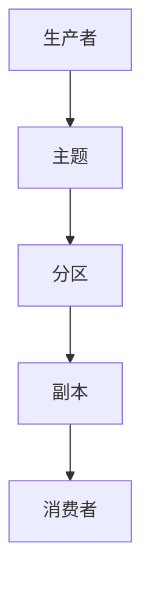

## 背景介绍

Apache Kafka 是一个分布式的事件驱动数据平台，最初由 LinkedIn 开发，后来成为 Apache 基金会的一个开源项目。Kafka 是一个高吞吐量、可扩展、可靠的流处理系统，可以处理大量数据流，并在大规模系统中提供实时数据流处理能力。Kafka 的主要特点是高吞吐量、高可用性、持久性和可扩展性。

## 核心概念与联系

Kafka 的核心概念包括以下几个方面：

1. **主题（Topic）：** Kafka 中的数据分为多个主题，每个主题下面包含多个分区。主题是生产者和消费者之间的通道，生产者将数据发送到主题，消费者从主题中读取数据。
2. **分区（Partition）：** Kafka 中的分区是主题中的一个单元，它包含了一组有序的消息。分区是由多个副本组成的，可以分布在多个服务器上，提高数据的可用性和可靠性。
3. **生产者（Producer）：** 生产者是向 Kafka 主题发送消息的应用程序，它可以选择一个或多个主题来发送消息。
4. **消费者（Consumer）：** 消费者是从 Kafka 主题中读取消息的应用程序，它可以订阅一个或多个主题并处理消息。

Kafka 的核心架构如下：



## 核心算法原理具体操作步骤

Kafka 的核心算法原理包括以下几个方面：

1. **数据生产：** 生产者将数据发送到 Kafka 主题的分区，Kafka 集群中的多个服务器负责存储和管理这些分区。
2. **数据存储：** Kafka 使用磁盘存储数据，每个分区的数据都存储在多个副本上，以提高数据的可用性和可靠性。
3. **数据消费：** 消费者从 Kafka 主题的分区中读取数据并处理它们，这可以在实时或批量的方式进行。

## 数学模型和公式详细讲解举例说明

Kafka 的数学模型和公式主要涉及到数据处理和流处理的相关概念。例如，Kafka 中的数据处理可以使用数据流模型来描述，数据流模型可以用来表示数据的生产、传输和消费过程。Kafka 的数据流模型可以使用以下公式来表示：

$$
\text{Data} = f(\text{Producer}, \text{Topic}, \text{Partition}, \text{Consumer})
$$

## 项目实践：代码实例和详细解释说明

下面是一个简单的 Kafka 项目实例，使用 Python 的 `kafka-python` 库来发送和接收消息：

```python
from kafka import KafkaProducer, KafkaConsumer

# 创建生产者
producer = KafkaProducer(bootstrap_servers='localhost:9092')

# 创建消费者
consumer = KafkaConsumer('test', group_id='group1', bootstrap_servers='localhost:9092')

# 发送消息
producer.send('test', b'Hello, Kafka!')

# 消费消息
for message in consumer:
    print(message.value.decode('utf-8'))
```

## 实际应用场景

Kafka 的实际应用场景包括以下几个方面：

1. **实时数据处理：** Kafka 可以用于实时处理大量数据，如实时数据流分析、实时数据报表等。
2. **日志收集和存储：** Kafka 可以用于收集和存储应用程序的日志信息，方便进行日志分析和故障诊断。
3. **事件驱动架构：** Kafka 可以用于实现事件驱动架构，实现各种业务流程和数据处理任务。

## 工具和资源推荐

为了学习和使用 Kafka，以下是一些建议的工具和资源：

1. **Kafka 文档：** 官方文档是学习 Kafka 的最佳资源，包含了详细的介绍和示例代码。
2. **Kafka 教程：** 有许多在线的 Kafka 教程，可以帮助你快速上手 Kafka。
3. **Kafka 源代码：** 如果你想深入了解 Kafka 的内部实现，可以查看其开源代码。
4. **Kafka 工具：** 有许多 Kafka 相关的工具可以帮助你更方便地使用 Kafka，如 `kafka-python` 等。

## 总结：未来发展趋势与挑战

Kafka 作为一个流行的分布式事件驱动数据平台，在未来会继续发展和演进。Kafka 的未来发展趋势包括以下几个方面：

1. **更高的性能：** Kafka 将继续优化性能，提高吞吐量和可靠性，以满足不断增长的数据处理需求。
2. **更丰富的功能：** Kafka 将继续扩展功能，提供更丰富的数据处理和流处理能力，以满足各种业务需求。
3. **更广泛的应用：** Kafka 将继续在各种行业和场景中得到广泛应用，成为一个重要的数据处理平台。

## 附录：常见问题与解答

以下是一些常见的问题和解答：

1. **Q：Kafka 如何保证数据的可靠性？** A：Kafka 使用多个副本和数据复制来保证数据的可靠性，确保即使发生故障，也可以从其他副本中恢复数据。
2. **Q：Kafka 如何保证数据的有序性？** A：Kafka 使用分区和分区器来保证数据的有序性，确保同一个分区内的消息按顺序处理。
3. **Q：Kafka 的数据持久性如何？** A：Kafka 使用磁盘存储数据，并且支持数据持久性配置，以确保数据在发生故障时不会丢失。