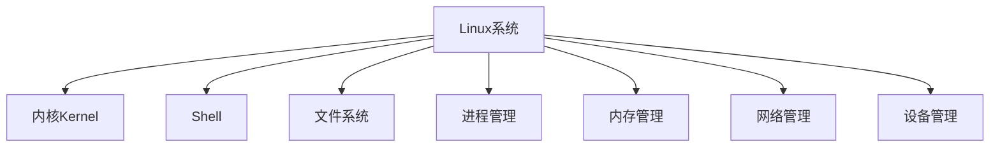

以下是关于《Linux系统基础与高级编程》的技术博客文章:

# Linux系统基础与高级编程

## 1.背景介绍

Linux是一种基于UNIX的开源操作系统,由芬兰计算机科学家Linus Torvalds于1991年创建。它具有稳定、高效、安全和免费等优点,被广泛应用于服务器、嵌入式系统、云计算、大数据等领域。Linux系统不仅是开发人员必备的技能,也是计算机专业学生必修的课程。

## 2.核心概念与联系

Linux系统主要由以下几个核心部分组成:

1. **内核(Kernel)**: 操作系统的核心部分,负责管理系统资源、处理硬件操作、调度任务等。
2. **Shell**: 用户与内核交互的命令解释器,如Bash、Zsh等。
3. **文件系统**: 组织和存储文件的方式,如Ext4、XFS等。
4. **进程管理**: 创建、调度和管理进程的机制。
5. **内存管理**: 管理和分配系统内存的策略。
6. **网络管理**: 管理网络连接、协议栈等。
7. **设备管理**: 管理硬件设备驱动程序。

这些核心概念相互关联,共同构建了Linux系统的整体架构。



## 3.核心算法原理具体操作步骤

### 3.1 进程调度算法

Linux采用了多种进程调度算法,如完全公平调度器(CFS)、实时调度器等。CFS算法的核心思想是为每个进程分配相等的CPU时间片,并根据进程的优先级动态调整时间片长度。具体步骤如下:

1. 创建进程时,CFS为其分配一个虚拟运行时间(vruntime)和时间片长度。
2. 进程在时间片内运行,vruntime递增。
3. 时间片用完或进程阻塞时,CFS选择vruntime最小的进程运行。
4. 根据进程优先级动态调整时间片长度。

### 3.2 内存管理算法

Linux采用了多种内存管理算法,如伙伴系统算法、页面置换算法等。伙伴系统算法用于分配和释放物理内存,具体步骤如下:

1. 将可用内存块按大小划分为多个空闲链表。
2. 分配内存时,从最合适的空闲链表中取出一个内存块。
3. 释放内存时,将内存块归还到对应的空闲链表中。
4. 如果空闲链表中没有足够大小的内存块,则合并相邻的小内存块。

## 4.数学模型和公式详细讲解举例说明

### 4.1 进程调度公式

在CFS算法中,进程的虚拟运行时间(vruntime)计算公式如下:

$$vruntime = vruntime_{old} + \frac{执行时间}{进程权重}$$

其中,进程权重反映了进程的优先级,权重越大,优先级越高。

例如,假设进程A的vruntime为100,权重为2,执行时间为10ms,则新的vruntime为:

$$vruntime_{new} = 100 + \frac{10}{2} = 105$$

### 4.2 内存分配公式

在伙伴系统算法中,分配内存块的大小需要满足以下公式:

$$内存块大小 = 2^n \times 基本单元大小$$

其中,n是非负整数,基本单元大小通常为4KB。

例如,如果需要分配32KB内存,则n=3,基本单元大小为4KB,内存块大小为:

$$内存块大小 = 2^3 \times 4KB = 32KB$$

## 5.项目实践:代码实例和详细解释说明

以下是一个简单的C程序,演示了Linux系统中的进程创建和进程间通信。

```c
#include <stdio.h>
#include <stdlib.h>
#include <unistd.h>
#include <sys/wait.h>

int main() {
    int pipefds[2];
    char buffer[25];

    // 创建管道
    if (pipe(pipefds) == -1) {
        perror("pipe");
        exit(EXIT_FAILURE);
    }

    // 创建子进程
    pid_t pid = fork();

    if (pid == -1) {
        perror("fork");
        exit(EXIT_FAILURE);
    } else if (pid == 0) { // 子进程
        close(pipefds[1]); // 关闭写端
        read(pipefds[0], buffer, sizeof(buffer)); // 从管道读取数据
        printf("Child received: %s\n", buffer);
        close(pipefds[0]); // 关闭读端
        exit(EXIT_SUCCESS);
    } else { // 父进程
        close(pipefds[0]); // 关闭读端
        write(pipefds[1], "Hello from parent", 18); // 向管道写入数据
        close(pipefds[1]); // 关闭写端
        wait(NULL); // 等待子进程结束
        printf("Parent finished\n");
    }

    return 0;
}
```

解释:

1. 程序创建一个管道`pipefds`用于进程间通信。
2. 使用`fork()`创建一个子进程。
3. 在子进程中,关闭管道的写端,从管道读端读取数据并打印出来。
4. 在父进程中,关闭管道的读端,向管道写端写入数据。
5. 父进程等待子进程结束后,打印"Parent finished"。

运行结果:

```
Child received: Hello from parent
Parent finished
```

## 6.实际应用场景

Linux系统广泛应用于以下场景:

1. **Web服务器**: 如Apache、Nginx等基于Linux的Web服务器。
2. **云计算**: 云计算平台如AWS、Azure、阿里云等大量使用Linux系统。
3. **嵌入式系统**: 如智能家居、物联网设备等嵌入式系统通常基于Linux。
4. **大数据处理**: Hadoop、Spark等大数据框架主要运行在Linux环境。
5. **科学计算**: 超级计算机和科学计算领域广泛使用Linux系统。
6. **个人桌面**: Linux发行版如Ubuntu、Fedora等也可用于个人桌面环境。

## 7.工具和资源推荐

以下是一些常用的Linux工具和学习资源:

1. **Bash脚本**: 用于自动化任务和系统管理。
2. **Vim/Emacs**: 强大的文本编辑器,适合编写和编辑代码。
3. **Git**: 版本控制系统,方便协作开发。
4. **GCC/G++**: GNU编译器集合,用于编译C/C++程序。
5. **Valgrind**: 内存泄漏检测和性能分析工具。
6. **Linux内核文档**: 官方内核文档,详细介绍内核架构和实现。
7. **Linux命令手册**: 如`man`命令,查看命令用法和选项。
8. **在线课程**: 如edX、Coursera等提供优质的Linux课程。

## 8.总结:未来发展趋势与挑战

Linux系统在未来将继续扮演重要角色,主要趋势和挑战包括:

1. **云原生技术**: Kubernetes、容器化等云原生技术与Linux系统深度融合。
2. **人工智能**: 人工智能算法和框架对Linux系统的性能和安全性提出更高要求。
3. **物联网和边缘计算**: 物联网设备和边缘计算节点将更多采用Linux系统。
4. **安全性**: 随着系统复杂度增加,确保Linux系统的安全性将是一大挑战。
5. **硬件支持**: 适配新硬件设备和架构,保持Linux系统的兼容性。
6. **开源社区**: 维护活跃的开源社区,吸引更多贡献者参与Linux系统的开发和改进。

## 9.附录:常见问题与解答

1. **什么是Linux内核?**

Linux内核是操作系统的核心部分,负责管理系统资源、处理硬件操作、调度任务等。它是Linux系统的基础,决定了系统的性能和稳定性。

2. **什么是Shell?**

Shell是用户与内核交互的命令解释器,如Bash、Zsh等。它接收用户输入的命令,并将其传递给内核执行。Shell还提供了脚本编程功能,用于自动化任务。

3. **什么是文件系统?**

文件系统是组织和存储文件的方式,如Ext4、XFS等。它定义了文件的存储结构、目录层次、权限管理等。不同的文件系统具有不同的特点,适用于不同的应用场景。

4. **什么是进程管理?**

进程管理是创建、调度和管理进程的机制。它包括进程调度算法、进程间通信、信号处理等。良好的进程管理可以提高系统的响应速度和资源利用率。

5. **什么是内存管理?**

内存管理是管理和分配系统内存的策略。它包括物理内存分配、虚拟内存管理、内存缓存等。合理的内存管理可以提高系统的性能和稳定性。

作者: 禅与计算机程序设计艺术 / Zen and the Art of Computer Programming