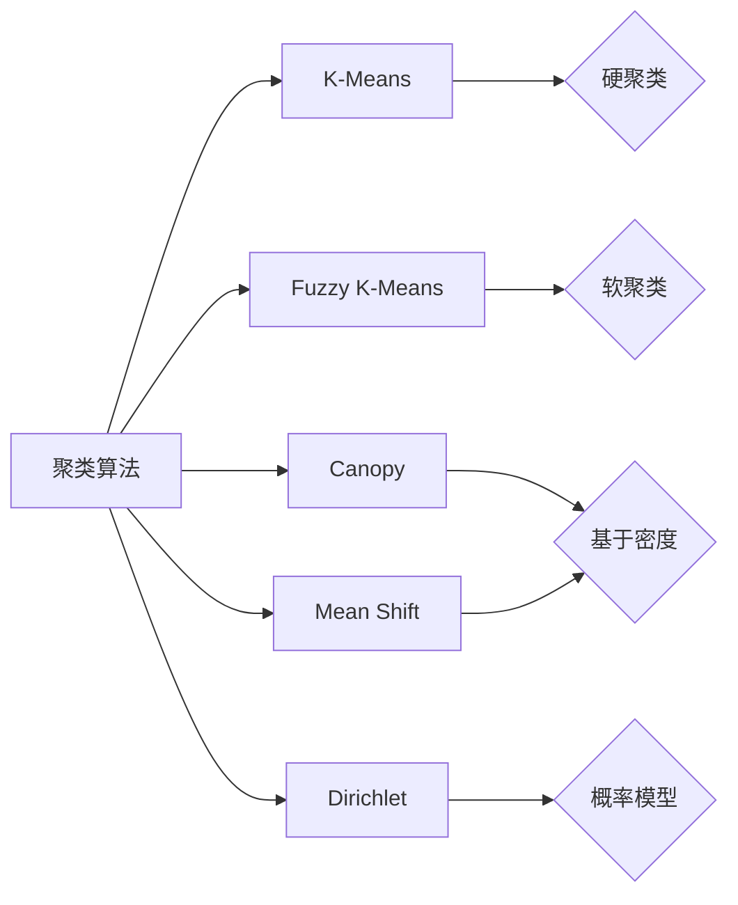

# Mahout聚类算法原理与代码实例讲解

## 1.背景介绍
在当今大数据时代,海量数据的分析和挖掘是一个巨大的挑战。聚类作为一种重要的无监督学习方法,在数据挖掘、模式识别等领域有着广泛的应用。Apache Mahout是一个强大的分布式机器学习库,提供了多种聚类算法的实现。本文将深入探讨Mahout中几种主要聚类算法的原理,并给出具体的代码实例,帮助读者更好地理解和应用这些算法。

### 1.1 聚类的基本概念
聚类是一种无监督学习方法,旨在将相似的对象归为一组,不同组之间的对象差异较大。聚类可以帮助我们发现数据内在的结构和关系,在数据压缩、异常检测等方面有重要应用。

### 1.2 Mahout简介
Apache Mahout是Apache软件基金会的一个开源项目,提供了可扩展的机器学习领域经典算法的实现,且主要侧重于聚类、分类、推荐等。Mahout使用Hadoop实现,可以有效处理海量数据集。

### 1.3 Mahout聚类算法概览
Mahout提供了多种聚类算法的实现,主要包括:
- K-Means聚类
- Fuzzy K-Means聚类 
- Canopy聚类
- Mean Shift聚类
- Dirichlet聚类
下面将逐一介绍这些算法的原理。

## 2.核心概念与联系

### 2.1 距离度量
聚类的核心是计算对象之间的相似性,而相似性通常用距离来度量。Mahout中主要使用以下几种距离度量:

- 欧氏距离:两点之间的直线距离。
- 曼哈顿距离:两点在各坐标轴上的距离之和。
- 余弦相似度:向量夹角的余弦值。

### 2.2 聚类评估指标  
为了评估聚类结果的质量,需要使用一些评估指标:

- 紧密性:簇内样本的距离越小越好。
- 分离性:簇间距离越大越好。
- 轮廓系数:综合考虑紧密性和分离性。
- SSE/SSB:簇内/簇间距离平方和。

### 2.3 算法联系与区别

下图展示了Mahout中几种聚类算法的联系与区别:



## 3.核心算法原理具体操作步骤

### 3.1 K-Means算法

K-Means是最经典的聚类算法之一,其基本步骤如下:

1. 随机选择K个初始聚类中心
2. 重复下列步骤直到收敛:
   - 计算每个样本到各个中心的距离
   - 将每个样本划分到距离最近的簇   
   - 更新每个簇的中心为簇内样本的均值
3. 输出最终的K个簇

### 3.2 Fuzzy K-Means算法

Fuzzy K-Means是K-Means的模糊化版本,每个样本可以属于多个簇,步骤如下:

1. 随机初始化隶属度矩阵U
2. 重复下列步骤直到收敛:
   - 根据U计算各个簇的中心
   - 根据中心更新U
3. 输出最终的隶属度矩阵U  

### 3.3 Canopy算法

Canopy算法先使用一个简单、计算快的距离度量将样本粗聚类,然后在每个Canopy内运行K-Means。步骤如下:

1. 随机选择一个样本点作为Canopy中心
2. 对每个样本:
   - 若到中心距离<T1,加入该Canopy
   - 若到中心距离<T2,从样本集中移除
3. 重复1-2直到样本集为空
4. 在每个Canopy内运行K-Means
5. 输出最终聚类结果

### 3.4 Mean Shift算法

Mean Shift基于核密度估计,将样本点沿着密度梯度方向移动。步骤如下:

1. 选择一个带宽参数h
2. 对每个样本点x:
   - 在x半径h范围内计算均值 
   - 将x移动到该均值
   - 重复直到收敛
3. 将收敛位置相同的样本合并为一个簇
4. 输出最终聚类结果

### 3.5 Dirichlet聚类

Dirichlet聚类基于狄利克雷过程混合模型(DPMM),可以自适应地确定聚类数。步骤如下:

1. 随机初始化模型参数
2. 重复下列步骤直到收敛:
   - 抽样更新聚类指示变量
   - 抽样更新模型参数
3. 输出最终聚类结果

## 4.数学模型和公式详细讲解举例说明

### 4.1 K-Means目标函数

K-Means的目标是最小化所有样本到其所属簇中心的距离平方和,目标函数为:

$$J=\sum_{i=1}^K\sum_{x\in C_i} ||x-\mu_i||^2$$

其中$\mu_i$是第$i$个簇的中心,$C_i$是属于第$i$个簇的样本集合。

在迭代优化过程中,簇的划分$C_i$和中心$\mu_i$交替更新:

- 固定$\mu_i$,更新$C_i$:
$$C_i=\{x:||x-\mu_i||^2\leq ||x-\mu_j||^2,\forall j\neq i\}$$
- 固定$C_i$,更新$\mu_i$:
$$\mu_i=\frac{1}{|C_i|}\sum_{x\in C_i}x$$

### 4.2 Fuzzy K-Means隶属度更新

Fuzzy K-Means引入了样本$x_j$对第$i$个簇的隶属度$u_{ij}$,满足:

$$0\leq u_{ij}\leq 1,\quad \sum_{i=1}^K u_{ij}=1$$

目标函数为:

$$J=\sum_{i=1}^K\sum_{j=1}^N u_{ij}^m||x_j-\mu_i||^2$$

其中$m>1$是一个控制聚类软硬程度的参数。

隶属度$u_{ij}$的更新公式为:

$$u_{ij}=\frac{1}{\sum_{k=1}^K(\frac{||x_j-\mu_i||}{||x_j-\mu_k||})^{\frac{2}{m-1}}}$$

### 4.3 Mean Shift的核密度估计

Mean Shift中使用核密度估计来估计样本点$x$处的概率密度:

$$\hat{f}(x)=\frac{1}{nh^d}\sum_{i=1}^n K(\frac{x-x_i}{h})$$

其中$K$是核函数,$h$是带宽参数。常用的核函数包括高斯核、Epanechnikov核等。

Mean Shift向量就是密度梯度的估计:

$$m(x)=\frac{\sum_{i=1}^n x_i K(\frac{x-x_i}{h})}{\sum_{i=1}^n K(\frac{x-x_i}{h})}-x$$

### 4.4 Dirichlet过程混合模型

DPMM假设数据由无限个高斯混合成分生成,混合权重服从狄利克雷过程。样本$x_i$的生成过程为:

$$\begin{aligned}
G &\sim DP(\alpha,G_0)\\
\theta_i &\sim G\\
x_i &\sim F(\theta_i)
\end{aligned}$$

其中$G$是狄利克雷过程生成的随机概率测度,$\theta_i$是第$i$个样本的参数,服从$G$的分布。$F$通常选择为高斯分布。

聚类指示变量$z_i$的抽样公式为:

$$p(z_i=k|z_{-i},x)=\left\{
\begin{aligned}
\frac{n_{-i,k}}{n-1+\alpha}f(x_i|\theta_k^*) & k\leq K^+\\
\frac{\alpha}{n-1+\alpha}\int f(x_i|\theta)dG_0(\theta) & k=K^++1
\end{aligned}
\right.$$

其中$n_{-i,k}$是第$k$个簇中除$x_i$外的样本数,$\theta_k^*$是第$k$个簇的参数,$K^+$是当前的聚类数。

## 5.项目实践：代码实例和详细解释说明

下面给出Mahout中几种聚类算法的示例代码。

### 5.1 K-Means示例

```java
// 加载数据
List<Vector> sampleData = new ArrayList<>();
// ...
// 创建K-Means聚类器
KMeansClusterer clusterer = new KMeansClusterer();
clusterer.setK(K); // 设置聚类数
clusterer.setMaxIterations(maxIterations); // 设置最大迭代次数
clusterer.setDistanceMeasure(new EuclideanDistanceMeasure()); // 设置距离度量
// 运行聚类
List<List<Vector>> clusters = clusterer.cluster(sampleData);
// 打印结果
for (int i = 0; i < clusters.size(); i++) {
    System.out.println("Cluster " + i + ": " + clusters.get(i).size() + " points");
}
```

这里首先加载数据到`sampleData`中,然后创建`KMeansClusterer`,设置聚类数、最大迭代次数和距离度量,调用`cluster`方法运行聚类,最后打印每个簇的样本数。

### 5.2 Fuzzy K-Means示例

```java
// 加载数据
List<Vector> sampleData = new ArrayList<>();
// ...  
// 创建Fuzzy K-Means聚类器
FuzzyKMeansClusterer clusterer = new FuzzyKMeansClusterer();
clusterer.setK(K); // 设置聚类数
clusterer.setMaxIterations(maxIterations); // 设置最大迭代次数
clusterer.setFuzziness(fuzziness); // 设置模糊度参数
// 运行聚类
List<SoftCluster> clusters = clusterer.cluster(sampleData);
// 打印结果
for (int i = 0; i < clusters.size(); i++) {
    System.out.println("Cluster " + i);
    for (Vector v : sampleData) {
        System.out.println(v + ": " + clusters.get(i).getProbability(v));
    }
}
```

与K-Means类似,这里创建`FuzzyKMeansClusterer`,额外设置了模糊度参数。聚类结果为`SoftCluster`的列表,可以获取每个样本属于某个簇的概率。

### 5.3 Canopy+K-Means示例

```java
// 加载数据
List<Vector> sampleData = new ArrayList<>();
// ...
// 创建Canopy聚类器  
CanopyClusterer canopyClusterer = new CanopyClusterer(new EuclideanDistanceMeasure(), T1, T2);
// 运行Canopy聚类
List<Canopy> canopies = canopyClusterer.cluster(sampleData);
// 创建K-Means聚类器
KMeansClusterer kmeansClusterer = new KMeansClusterer();  
kmeansClusterer.setK(K);
kmeansClusterer.setMaxIterations(maxIterations);
// 在每个Canopy内运行K-Means  
List<List<Vector>> clusters = new ArrayList<>();
for (Canopy canopy : canopies) {
    clusters.addAll(kmeansClusterer.cluster(canopy.getPoints()));
}
// 打印结果
for (int i = 0; i < clusters.size(); i++) {
    System.out.println("Cluster " + i + ": " + clusters.get(i).size() + " points");  
}
```

这里先创建`CanopyClusterer`,设置距离阈值`T1`和`T2`,运行Canopy聚类得到若干Canopy。然后在每个Canopy内运行K-Means聚类,将结果汇总到`clusters`中。

### 5.4 Mean Shift示例

```java
// 加载数据
List<Vector> sampleData = new ArrayList<>();
// ...
// 创建Mean Shift聚类器
MeanShiftCanopyClusterer clusterer = new MeanShiftCanopyClusterer(new EuclideanDistanceMeasure(), bandwidth);
// 运行聚类
List<MeanShiftCanopy> canopies = clusterer.cluster(sampleData);
// 打印结果  
for (int i = 0; i < canopies.size(); i++) {
    System.out.println("Cluster " + i + ": " + canopies.get(i).getNumPoints() + " points");
    System.out.println("Center: " + canopies.get(i).getCenter