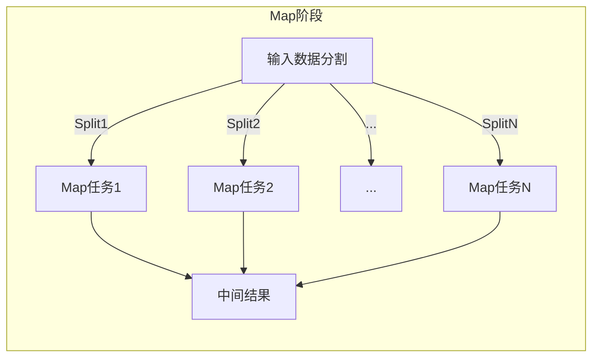
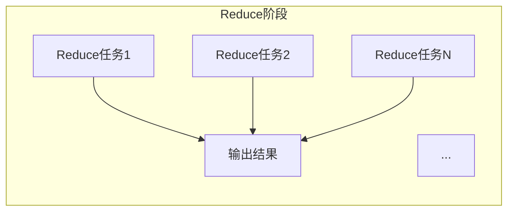

# MapReduce 原理与代码实例讲解

## 1. 背景介绍

在大数据时代，海量的数据已经成为许多企业和组织的宝贵资源。然而，传统的数据处理方式往往无法满足对大规模数据集的高效处理需求。为了解决这一问题,Google于2004年提出了MapReduce编程模型,它是一种用于大规模数据集并行处理的编程范式。

MapReduce的核心思想是将计算过程分为两个阶段:Map阶段和Reduce阶段。Map阶段将输入数据划分为多个小块,并行处理这些小块数据;Reduce阶段则对Map阶段的输出结果进行合并,得到最终结果。通过这种方式,MapReduce可以充分利用大规模集群的计算能力,高效地处理海量数据。

## 2. 核心概念与联系

### 2.1 Map阶段

Map阶段的主要作用是对输入数据进行过滤和转换。在这个阶段,输入数据被划分为多个小块(称为splits),每个splits由一个独立的Map任务处理。Map任务会对splits中的每条记录执行用户自定义的Map函数,生成一系列键值对作为中间结果。



### 2.2 Shuffle阶段

Shuffle阶段是Map阶段和Reduce阶段之间的一个过渡阶段。在这个阶段,MapReduce框架会对Map阶段产生的中间结果进行洗牌(Shuffle)操作,将具有相同键的键值对分组,并将每个分组的键值对传递给对应的Reduce任务。

```mermaid
graph LR
    subgraph Shuffle阶段
    中间结果 --> |<k1,v1>...| 分组
    中间结果 --> |<k2,v2>...| 分组
    分组 --> |<k1,list(v1)>| Reduce任务1
    分组 --> |<k2,list(v2)>| Reduce任务2
    ...
    分组 --> |<kN,list(vN)>| Reduce任务N
    end
```

### 2.3 Reduce阶段

Reduce阶段的主要作用是对Shuffle阶段的输出结果进行合并和处理。每个Reduce任务会对一个键及其对应的值列表执行用户自定义的Reduce函数,生成最终的输出结果。



## 3. 核心算法原理具体操作步骤

MapReduce算法的核心原理可以概括为以下几个步骤:

1. **输入数据划分**: 将输入数据划分为多个splits,每个splits由一个Map任务处理。

2. **Map阶段**: 对每个splits执行Map函数,生成键值对作为中间结果。

   ```python
   def map(key, value):
       # 处理输入数据,生成中间结果
       ...
       emit(中间键, 中间值)
   ```

3. **Shuffle阶段**: 对Map阶段的输出结果进行洗牌操作,将具有相同键的键值对分组,并将每个分组传递给对应的Reduce任务。

4. **Reduce阶段**: 对每个分组执行Reduce函数,生成最终的输出结果。

   ```python
   def reduce(key, values):
       # 合并values列表,生成最终结果
       result = ...
       emit(key, result)
   ```

5. **输出结果**: 将Reduce阶段的输出结果写入文件或其他存储系统。

在实际应用中,MapReduce算法通常会被多次执行,每次执行都会处理一部分输入数据。最终的输出结果是所有执行实例输出结果的合并。

## 4. 数学模型和公式详细讲解举例说明

在MapReduce中,我们可以将Map和Reduce函数看作是两个数学函数,它们分别对应着数据转换和数据聚合操作。

### 4.1 Map函数

Map函数可以表示为:

$$
\text{Map}(k_1, v_1) \rightarrow \text{list}(k_2, v_2)
$$

其中,$k_1$和$v_1$分别表示输入数据的键和值,$k_2$和$v_2$表示Map函数生成的中间结果的键和值。Map函数将输入数据转换为一系列键值对,这些键值对将被传递给Reduce阶段进行进一步处理。

例如,在单词计数应用中,Map函数可以将文本文件中的每个单词转换为一个键值对,其中键是单词本身,值是1,表示该单词出现了一次。

### 4.2 Reduce函数

Reduce函数可以表示为:

$$
\text{Reduce}(k_2, \text{list}(v_2)) \rightarrow \text{list}(v_3)
$$

其中,$k_2$表示Shuffle阶段输出的键,$\text{list}(v_2)$表示与该键对应的值列表。Reduce函数将这些值列表合并,生成一个新的值列表作为最终结果。

在单词计数应用中,Reduce函数会将具有相同键(即相同单词)的值列表相加,得到该单词在整个文本文件中出现的总次数。

### 4.3 数学模型

我们可以将MapReduce算法建模为两个高阶函数的组合:

$$
\text{Reduce} \circ \text{group} \circ \text{Map}
$$

其中,$\text{group}$是一个中间操作,它将Map阶段的输出结果按照键进行分组,生成$(k_2, \text{list}(v_2))$对作为Reduce函数的输入。

通过这种建模方式,我们可以更好地理解MapReduce算法的本质:它将大规模数据集的处理过程分解为两个阶段,首先对输入数据进行转换,然后对转换后的数据进行聚合,最终得到期望的结果。

## 5. 项目实践:代码实例和详细解释说明

为了更好地理解MapReduce的工作原理,我们将通过一个实际的代码示例来演示如何使用MapReduce进行单词计数。在这个示例中,我们将使用Python编程语言和Apache Hadoop生态系统中的MapReduce组件。

### 5.1 准备工作

首先,我们需要安装Apache Hadoop并配置好运行环境。详细的安装和配置步骤请参考官方文档。

接下来,我们需要准备一个文本文件作为输入数据。在本示例中,我们将使用一个名为`input.txt`的文本文件,其内容如下:

```
Hello World
Hello Hadoop
Hadoop MapReduce
```

### 5.2 Map函数

我们定义一个Map函数,用于将输入数据转换为单词和计数的键值对。

```python
import sys

def map_function(line):
    """
    Map函数,将输入数据转换为单词和计数的键值对
    """
    words = line.split()
    for word in words:
        print(f"{word}\t1")

# 读取标准输入
for line in sys.stdin:
    map_function(line)
```

在这个Map函数中,我们首先将每一行输入数据拆分为单词列表。然后,对于每个单词,我们输出一个键值对,其中键是单词本身,值是1,表示该单词出现了一次。

我们可以使用以下命令运行Map函数:

```
cat input.txt | python mapper.py
```

输出结果如下:

```
Hello    1
World    1
Hello    1
Hadoop    1
Hadoop    1
MapReduce    1
```

### 5.3 Reduce函数

接下来,我们定义一个Reduce函数,用于将具有相同键的值列表相加,得到每个单词的总计数。

```python
import sys

def reduce_function(word, counts):
    """
    Reduce函数,将具有相同键的值列表相加,得到每个单词的总计数
    """
    total_count = sum(map(int, counts))
    print(f"{word}\t{total_count}")

# 读取标准输入
current_word = None
current_counts = []

for line in sys.stdin:
    word, count = line.strip().split("\t", 1)
    if current_word != word:
        if current_word:
            reduce_function(current_word, current_counts)
        current_word = word
        current_counts = []
    current_counts.append(count)

if current_word:
    reduce_function(current_word, current_counts)
```

在这个Reduce函数中,我们首先读取标准输入,将具有相同键的值列表收集到`current_counts`列表中。当遇到新的键时,我们调用`reduce_function`函数,将`current_counts`列表中的值相加,得到该单词的总计数,并输出结果。

我们可以使用以下命令运行Reduce函数:

```
cat input.txt | python mapper.py | sort | python reducer.py
```

输出结果如下:

```
Hadoop    2
Hello    2
MapReduce    1
World    1
```

通过这个示例,我们可以清楚地看到MapReduce算法是如何工作的:Map函数将输入数据转换为中间结果,Reduce函数则对这些中间结果进行聚合,得到最终的输出结果。

## 6. 实际应用场景

MapReduce编程模型在许多领域都有广泛的应用,包括但不限于:

1. **网页链接分析**: 用于计算网页的PageRank值,评估网页的重要性和权威性。

2. **日志分析**: 分析网站访问日志、服务器日志等,了解用户行为模式和系统运行状况。

3. **机器学习**: 在大规模数据集上训练机器学习模型,如逻辑回归、决策树等。

4. **基因组学**: 对基因组数据进行处理和分析,发现基因模式和突变。

5. **自然语言处理**: 对大量文本数据进行分词、词频统计、主题建模等处理。

6. **推荐系统**: 分析用户行为数据,为用户推荐感兴趣的商品或内容。

7. **数据去重**: 在海量数据集中快速找出重复数据,实现数据去重。

8. **数据转换**: 将数据从一种格式转换为另一种格式,以满足不同系统的需求。

9. **数据挖掘**: 从大规模数据集中发现隐藏的模式、关联规则和趋势。

总的来说,MapReduce编程模型擅长处理大规模数据集,尤其适用于需要并行计算的数据密集型应用场景。

## 7. 工具和资源推荐

虽然MapReduce编程模型提供了一种强大的大数据处理方式,但实现和运行MapReduce程序并不是一件容易的事情。幸运的是,现有的一些工具和框架可以帮助我们更高效地开发和部署MapReduce应用程序。

### 7.1 Apache Hadoop

Apache Hadoop是一个开源的分布式计算框架,它提供了MapReduce编程模型的实现,以及分布式文件系统HDFS。Hadoop可以在大规模集群上运行MapReduce作业,并提供了容错和可扩展性。

Hadoop生态系统包括许多其他有用的组件,如Hive、Pig、Spark等,它们可以简化MapReduce编程或提供替代方案。

### 7.2 Apache Spark

Apache Spark是一个快速、通用的大数据处理引擎,它提供了比Hadoop MapReduce更高效的内存计算模型。Spark支持多种编程语言,如Scala、Java、Python和R,并且具有丰富的库,如SparkSQL、MLlib和GraphX,可用于结构化数据处理、机器学习和图计算等任务。

Spark还提供了一种类似于MapReduce的编程模型,称为RDD(Resilient Distributed Datasets),但它更加灵活和高效。

### 7.3 云服务

除了自行部署和管理Hadoop或Spark集群,我们还可以利用云服务提供商提供的大数据服务,如Amazon EMR、Google Cloud Dataproc和Microsoft Azure HDInsight。这些服务可以快速启动和扩展Hadoop或Spark集群,并提供了管理和监控工具,大大简化了大数据处理的复杂性。

### 7.4 其他资源

- Apache Hadoop官方网站: https://hadoop.apache.org/
- Apache Spark官方网站: https://spark.apache.org/
- MapReduce设计模式: https://book.douban.com/subject/25829528/
- 大数