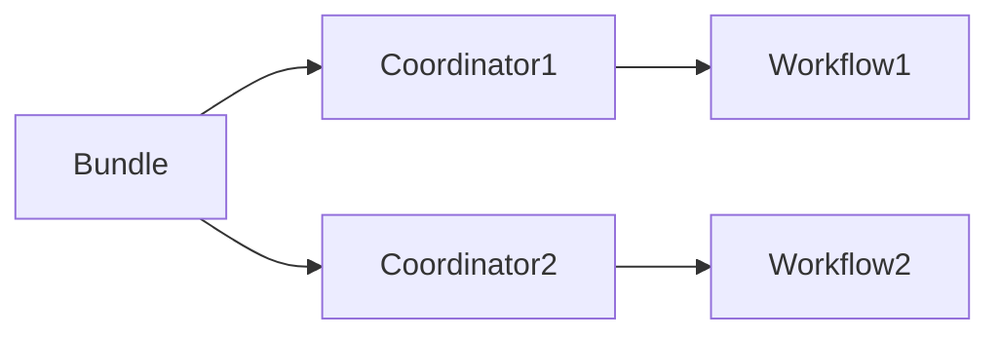

## 1.背景介绍

Oozie Bundle是Apache Oozie的一个重要组成部分，它是一个更高级别的Oozie应用，可以将多个协调应用捆绑在一起，并按照预定的频率启动它们。Oozie Bundle的出现，使得我们可以更加方便地管理和调度Hadoop作业，对于大数据处理任务来说，这无疑是一项重要的工具。

## 2.核心概念与联系

Oozie Bundle包含了一系列的Oozie协调应用，每个协调应用都有自己的频率和启动时间。当启动一个Bundle时，Oozie会自动根据每个协调应用的配置，进行相应的调度。每个协调应用都是独立的，它们之间没有直接的依赖关系，但可以通过数据依赖进行关联。

在Oozie Bundle中，有几个重要的概念需要我们理解：

- **Bundle**：Bundle是一组协调应用的集合，它们可以同时启动，也可以按照预定的频率启动。
- **Coordinator**：协调应用，它定义了一个作业的执行频率、数据依赖和动作。
- **Workflow**：工作流，它包含了一个或多个作业的执行步骤和依赖关系。

这三者之间的关系可以用下面的Mermaid流程图表示：



## 3.核心算法原理具体操作步骤

Oozie Bundle的工作原理是，当Bundle启动时，它会启动所有的协调应用。每个协调应用会根据自己的频率和启动时间，生成对应的作业实例。每个作业实例会按照预定的工作流进行执行。

下面是一个简单的操作步骤：

1. 定义Bundle，包含了一组协调应用。
2. 启动Bundle，Oozie会启动所有的协调应用。
3. 每个协调应用会根据自己的频率和启动时间，生成作业实例。
4. 每个作业实例会按照预定的工作流进行执行。

## 4.数学模型和公式详细讲解举例说明

在Oozie Bundle中，协调应用的频率和启动时间是非常重要的。它们决定了作业实例的生成和执行。

假设我们有一个协调应用，它的频率是$f$，启动时间是$t_0$。那么在时间$t$，它会生成$\lfloor \frac{t-t_0}{f} \rfloor$个作业实例。

这个公式告诉我们，协调应用的频率和启动时间对于作业实例的生成有着直接的影响。我们可以通过调整这两个参数，来控制作业实例的生成。

## 5.项目实践：代码实例和详细解释说明

下面我们来看一个简单的Oozie Bundle的例子。在这个例子中，我们有两个协调应用，它们的启动时间都是0，频率分别是1和2。

Bundle的定义如下：

```xml
<bundle-app name="my_bundle" xmlns="uri:oozie:bundle:0.1">
    <coordinator name="coord1">
        <app-path>hdfs://localhost:9000/user/oozie/coord1.xml</app-path>
    </coordinator>
    <coordinator name="coord2">
        <app-path>hdfs://localhost:9000/user/oozie/coord2.xml</app-path>
    </coordinator>
</bundle-app>
```

协调应用coord1的定义如下：

```xml
<coordinator-app name="coord1" frequency="1" start="0" xmlns="uri:oozie:coordinator:0.1">
    <action>
        <workflow>
            <app-path>hdfs://localhost:9000/user/oozie/workflow1.xml</app-path>
        </workflow>
    </action>
</coordinator-app>
```

协调应用coord2的定义如下：

```xml
<coordinator-app name="coord2" frequency="2" start="0" xmlns="uri:oozie:coordinator:0.1">
    <action>
        <workflow>
            <app-path>hdfs://localhost:9000/user/oozie/workflow2.xml</app-path>
        </workflow>
    </action>
</coordinator-app>
```

当我们启动这个Bundle时，Oozie会启动两个协调应用。协调应用coord1每1个时间单位会生成一个作业实例，协调应用coord2每2个时间单位会生成一个作业实例。

## 6.实际应用场景

Oozie Bundle在大数据处理任务中有着广泛的应用。例如，我们可以使用Oozie Bundle来管理和调度ETL作业，每个协调应用可以代表一个ETL流程，它们可以按照预定的频率启动，确保数据的及时处理。

另一个应用场景是数据分析。我们可以将一系列的数据分析任务打包成一个Bundle，按照预定的频率启动，这样可以确保我们的分析结果总是基于最新的数据。

## 7.工具和资源推荐

- Apache Oozie：Oozie是Apache的一个开源项目，它是一个用于管理Hadoop作业的调度系统。
- Hadoop：Hadoop是一个开源的分布式计算框架，它可以处理大量的数据。
- XML：XML是一种标记语言，我们使用它来定义Oozie的应用。

## 8.总结：未来发展趋势与挑战

随着大数据处理任务的复杂性不断增加，Oozie Bundle的重要性也日益突出。它可以帮助我们更好地管理和调度作业，提高工作效率。然而，随着作业数量的增加，如何有效地管理和调度作业，如何处理作业之间的依赖关系，这些都是我们面临的挑战。

## 9.附录：常见问题与解答

1. **问**：Oozie Bundle和Oozie Coordinator有什么区别？
   
   **答**：Oozie Bundle是一组协调应用的集合，它们可以同时启动，也可以按照预定的频率启动。而Oozie Coordinator是一个独立的应用，它定义了一个作业的执行频率、数据依赖和动作。

2. **问**：如何启动一个Oozie Bundle？

   **答**：我们可以使用Oozie的命令行工具来启动一个Bundle，命令如下：

   ```bash
   oozie job -oozie http://localhost:11000/oozie -config job.properties -run
   ```

3. **问**：Oozie Bundle的频率和启动时间有什么影响？

   **答**：协调应用的频率和启动时间决定了作业实例的生成和执行。我们可以通过调整这两个参数，来控制作业实例的生成。

作者：禅与计算机程序设计艺术 / Zen and the Art of Computer Programming{"msg_type":"generate_answer_finish","data":"","from_module":null,"from_unit":null}