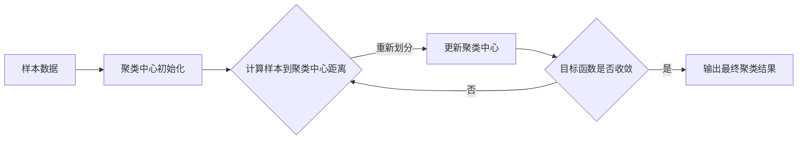

# Python机器学习实战：K均值聚类算法及其在Python中的实战

## 1.背景介绍

在当今大数据时代,海量数据的分析和处理已成为各行各业的重要课题。机器学习作为人工智能的核心技术之一,为数据分析提供了强大的工具。其中,无监督学习算法K均值聚类(K-Means Clustering)以其简单高效的特点,在数据挖掘、模式识别等领域得到了广泛应用。

本文将深入探讨K均值聚类算法的原理,并通过Python代码实战,展示如何利用该算法对数据进行聚类分析。通过本文的学习,读者将掌握K均值聚类的基本概念、数学模型和编程实现,为后续在实际场景中应用该算法打下坚实基础。

### 1.1 聚类分析简介
#### 1.1.1 什么是聚类分析
#### 1.1.2 聚类分析的应用场景
#### 1.1.3 常见的聚类算法

### 1.2 K均值聚类算法概述 
#### 1.2.1 K均值聚类的基本思想
#### 1.2.2 K均值聚类的优缺点
#### 1.2.3 K均值聚类的适用条件

## 2.核心概念与联系

在深入讨论K均值聚类算法之前,我们先来了解一下该算法涉及的几个核心概念:

### 2.1 聚类中心
聚类中心(Cluster Center)是每个聚类的中心点,通常用该聚类内所有数据点的均值向量表示。在K均值算法中,聚类中心的选取至关重要,直接影响聚类的效果。

### 2.2 样本间距离
样本间距离(Distance)衡量了两个数据点之间的相似程度。常用的距离度量包括欧氏距离、曼哈顿距离等。K均值聚类使用距离来判断每个样本应该归属哪个聚类。

### 2.3 目标函数 
K均值聚类的优化目标是最小化所有样本点到其所属聚类中心的距离平方和。通过不断迭代优化,使得最终的聚类结果尽可能地紧凑。

### 2.4 概念之间的联系
下图展示了K均值聚类算法中几个核心概念之间的关系:



由图可见,K均值聚类是一个迭代优化的过程。通过合理选择初始聚类中心,计算样本到聚类中心的距离并进行重新划分,不断更新聚类中心,直至目标函数收敛,最终得到满意的聚类结果。

## 3.核心算法原理具体操作步骤

### 3.1 算法输入
- 待聚类的数据集 $D=\{x_1,x_2,...,x_n\}$,其中每个样本 $x_i$ 是一个 $d$ 维特征向量。
- 聚类数 $k$,即将数据集划分为 $k$ 个聚类。

### 3.2 算法流程
1. 随机选取 $k$ 个样本作为初始聚类中心 $\{c_1,c_2,...,c_k\}$。
2. 重复下列步骤,直至聚类结果不再变化或达到最大迭代次数:
   - 对每个样本 $x_i$,计算其到各个聚类中心的距离,将其划分到距离最近的聚类中。样本 $x_i$ 到聚类中心 $c_j$ 的距离为:
$$d(x_i,c_j)=\sqrt{\sum_{l=1}^d (x_{il}-c_{jl})^2}$$
   - 对每个聚类 $j$,重新计算聚类中心 $c_j$ 为该聚类内所有样本的均值向量:
$$c_j=\frac{1}{|C_j|}\sum_{x\in C_j} x$$
3. 输出最终的聚类结果 $\{C_1,C_2,...,C_k\}$。

### 3.3 算法输出
$k$ 个聚类 $\{C_1,C_2,...,C_k\}$,每个聚类 $C_j$ 包含一部分样本点,且不同聚类之间没有交集。

## 4.数学模型和公式详细讲解举例说明

K均值聚类算法的数学模型可以表述为一个优化问题。设待聚类数据集为 $D=\{x_1,x_2,...,x_n\}$,聚类数为 $k$,优化目标是最小化所有样本点到其所属聚类中心的距离平方和,即:

$$\min \sum_{j=1}^k \sum_{x_i \in C_j} ||x_i-c_j||^2$$

其中 $C_j$ 表示第 $j$ 个聚类,$c_j$ 为该聚类的中心点。

举个例子,假设我们有一个二维数据集如下:

```
x1 = (1, 2)
x2 = (1.5, 1.8) 
x3 = (5, 8)
x4 = (8, 8)
x5 = (1, 0.6)
x6 = (9, 11)
```

我们希望将其划分为2个聚类(k=2),并随机选取 $x_1$ 和 $x_4$ 作为初始聚类中心。接下来,我们计算每个样本到两个聚类中心的距离:

$$
d(x_1,c_1)=0, d(x_1,c_2)=9.90 \\
d(x_2,c_1)=0.53, d(x_2,c_2)=9.43 \\
d(x_3,c_1)=7.21, d(x_3,c_2)=3.00 \\
d(x_4,c_1)=9.90, d(x_4,c_2)=0 \\  
d(x_5,c_1)=1.40, d(x_5,c_2)=11.31 \\
d(x_6,c_1)=12.04, d(x_6,c_2)=2.24
$$

根据距离最近原则,可得到第一次迭代后的聚类结果:
$C_1=\{x_1,x_2,x_5\}, C_2=\{x_3,x_4,x_6\}$

然后更新两个聚类的中心点:
$$
c_1=\frac{x_1+x_2+x_5}{3}=(1.17,1.47) \\
c_2=\frac{x_3+x_4+x_6}{3}=(7.33,9.00)
$$

以此类推,不断重复上述过程,直至聚类结果收敛。最终我们得到的聚类结果可能是:
$C_1=\{x_1,x_2,x_5\}, C_2=\{x_3,x_4,x_6\}$

这个简单例子展示了K均值聚类算法的基本运作流程。在实际应用中,我们通常需要处理更高维度、更大规模的数据集。

## 5.项目实践：代码实例和详细解释说明

下面我们使用Python和scikit-learn库来实现K均值聚类算法,并应用于著名的鸢尾花(Iris)数据集。

### 5.1 数据准备

首先导入需要的库并加载鸢尾花数据集:

```python
from sklearn.datasets import load_iris
from sklearn.cluster import KMeans
import matplotlib.pyplot as plt

# 加载鸢尾花数据集
iris = load_iris()
X = iris.data[:, :2] # 为了可视化,仅取前两个特征
```

### 5.2 模型训练

接下来,我们创建一个KMeans对象,设置聚类数为3(对应鸢尾花的三个品种),然后用fit方法训练模型:

```python
# 创建KMeans对象,设置聚类数为3  
kmeans = KMeans(n_clusters=3)

# 训练模型
kmeans.fit(X) 
```

### 5.3 结果可视化

最后,我们将聚类结果可视化:

```python
# 聚类结果
labels = kmeans.labels_

# 聚类中心
centroids = kmeans.cluster_centers_

# 可视化
plt.scatter(X[:,0], X[:,1], c=labels, cmap='viridis')
plt.scatter(centroids[:,0], centroids[:,1], marker='x', s=200, linewidths=3, color='r')
plt.xlabel('Sepal length')
plt.ylabel('Sepal width')
plt.title('K-Means Clustering of Iris Data')
plt.show()
```

运行上述代码,我们得到如下聚类结果图:


可以看到,K均值聚类算法成功地将鸢尾花数据集划分为3个聚类,聚类中心用红色叉号标出。不同颜色的点代表不同的聚类。

以上就是使用Python实现K均值聚类算法并应用于实际数据集的完整流程。通过调整聚类数k和距离度量方式等参数,我们可以根据具体问题对算法进行优化,以获得更好的聚类效果。

## 6.实际应用场景

K均值聚类算法作为一种无监督学习方法,在许多领域都有广泛应用,下面列举几个典型场景:

### 6.1 客户细分
在商业领域,K均值聚类可用于客户细分。通过对客户的消费行为、人口统计学特征等进行聚类分析,企业可以识别不同的客户群体,从而制定针对性的营销策略。

### 6.2 图像分割
K均值聚类是图像分割的常用方法之一。将图像像素点按照颜色、纹理等特征进行聚类,可以实现图像的分割,在目标检测、医学影像分析等任务中有重要应用。

### 6.3 文本聚类
在自然语言处理领域,K均值聚类可用于文本聚类。通过对文本的词频、主题分布等特征进行聚类,可以发现文本集合中的主题结构,实现文本分类、信息检索等功能。

### 6.4 异常检测
K均值聚类还可以用于异常检测。通过对正常数据进行聚类,可以建立数据的正常模式。当新数据到来时,若其与任何一个聚类中心的距离都很远,则可能是异常数据。

### 6.5 推荐系统
在推荐系统中,K均值聚类可用于对用户或物品进行分组。通过聚类分析发现相似的用户或物品,可以实现基于聚类的协同过滤推荐。

总之,凡是需要对未标注数据进行自动分组的场合,K均值聚类都可以派上用场。该算法简单高效,易于实现,是机器学习工程师必须掌握的重要工具之一。

## 7.工具和资源推荐

为了方便读者进一步学习和应用K均值聚类算法,这里推荐一些有用的工具和资源:

- scikit-learn: 功能强大的Python机器学习库,提供了易用的K均值聚类API。官网: https://scikit-learn.org/

- ELKI: 专门用于聚类分析的Java开源数据挖掘平台,实现了多种聚类算法。官网: https://elki-project.github.io/

- Weka: 基于Java的开源机器学习工具集,包含了K均值聚类在内的多种聚类算法。官网: https://www.cs.waikato.ac.nz/ml/weka/

- Stanford CS221: 斯坦福大学的人工智能原理课程,对K均值聚类有深入讲解。课程主页: http://web.stanford.edu/class/cs221/

- "统计学习方法" 李航: 经典的机器学习教材,对K均值聚类的原理和推导有详细介绍。

- "机器学习" 周志华: 另一本优秀的机器学习教材,对聚类算法有系统性的讲解。

上述资源可以帮助读者从理论到实践全面掌握K均值聚类算法,建议读者根据自己的需求和基础选择合适的资源进行深入学习。

## 8.总结：未来发展趋势与挑战

K均值聚类算法自提出以来,已经成为机器学习领域的重要工具。随着大数据时代的到来,该算法在可扩展性、效率等方面面临新的挑战和机遇。

### 8.1 算法优化
传统的K均值聚类