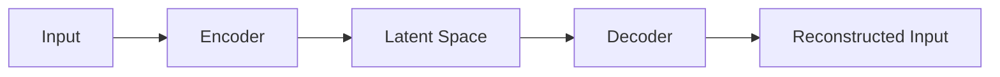
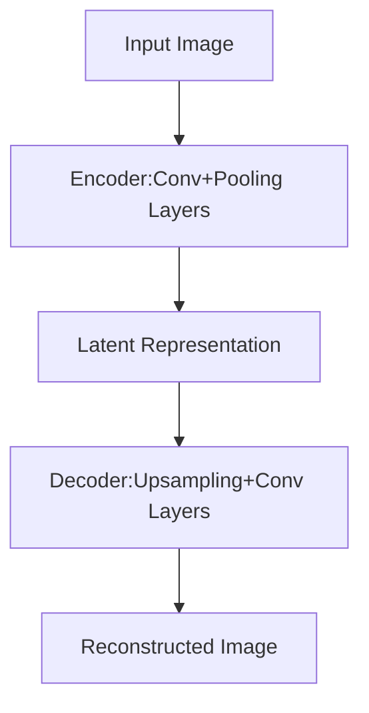

# Python机器学习实战：自编码器(Autoencoders)在数据压缩中的实践

## 1. 背景介绍

### 1.1 数据压缩的重要性
在当今大数据时代,海量的数据给存储和传输带来了巨大的压力。数据压缩技术成为了提高数据存储和传输效率的关键手段。传统的数据压缩算法如霍夫曼编码、游程编码等,虽然在通用数据上有不错的表现,但面对图像、视频等复杂数据,其压缩效果往往不尽如人意。近年来,随着深度学习的发展,以自编码器为代表的神经网络模型在数据压缩领域展现出了巨大的潜力。

### 1.2 自编码器的优势
自编码器是一种无监督学习的神经网络模型,由编码器(Encoder)和解码器(Decoder)两部分组成。其核心思想是通过编码器将原始高维数据映射到一个低维的隐空间,再通过解码器从隐空间恢复出原始数据。这个过程可以看作是数据的压缩与解压缩。与传统压缩算法相比,自编码器具有以下优势:

1. 自适应性强,可以根据数据的特点自动学习压缩的特征。
2. 压缩率高,尤其在处理图像等高维数据时优势明显。
3. 可以处理复杂的非线性数据。
4. 压缩后的低维表示可用于其他下游任务如分类、异常检测等。

### 1.3 本文的主要内容
本文将详细介绍如何使用Python和Keras库来实现基于自编码器的图像压缩。内容涵盖自编码器的基本原理、网络结构设计、训练流程、压缩效果评估等。通过本文的学习,读者可以掌握自编码器的实现细节,并将其应用到实际的数据压缩任务中。

## 2. 核心概念与联系

### 2.1 自编码器的基本结构
自编码器的基本结构如下图所示:



其中,编码器负责将原始高维输入映射到低维隐空间,解码器负责从隐空间恢复出原始输入。编码器和解码器通常都是由多层神经网络构成。

### 2.2 损失函数
自编码器的训练目标是最小化重构误差,即输入与重构输出之间的差异。常用的损失函数有:

1. 均方误差(Mean Squared Error,MSE):

$$L_{MSE}=\frac{1}{n}\sum_{i=1}^n(x^{(i)}-\hat{x}^{(i)})^2$$

其中$x^{(i)}$是第$i$个样本,$\hat{x}^{(i)}$是其重构输出。

2. 交叉熵(Cross Entropy):

$$L_{CE}=-\frac{1}{n}\sum_{i=1}^n[x^{(i)}\log\hat{x}^{(i)}+(1-x^{(i)})\log(1-\hat{x}^{(i)})]$$

交叉熵损失常用于输入数据取值为0或1的情况。

### 2.3 正则化
为了防止自编码器学习到一个恒等映射,即解码器直接复制编码器的输出,需要对网络加以正则化约束。常见的正则化手段有:

1. 在隐空间加入噪声,如高斯噪声。这迫使自编码器学习到更加鲁棒的特征。
2. 在损失函数中加入隐空间表示的L1或L2范数。这促使自编码器学习到更加稀疏的表示。
3. 在编码器和解码器中加入Dropout层。这提高了模型的泛化能力。

### 2.4 卷积自编码器
对于图像数据,直接使用全连接的编码器和解码器网络通常效果不佳。卷积自编码器引入了卷积层和池化层,可以更好地提取和保留图像的二维结构特征。卷积自编码器的结构示意如下:



## 3. 核心算法原理具体操作步骤

下面我们以卷积自编码器为例,详细介绍其实现步骤。

### 3.1 数据准备
首先准备训练数据集,这里我们使用MNIST手写数字数据集。将图像像素值缩放到0~1之间,并reshape为4维张量形式(样本数,高度,宽度,通道数)。

### 3.2 构建编码器
编码器由若干卷积层和池化层组成,逐步将图像尺寸缩小,特征图数量增加。每个卷积层后面接一个激活函数如ReLU。池化层通常使用最大池化。假设输入图像尺寸为28x28,一个示例编码器结构如下:

```python
encoder = Sequential([
    Conv2D(16, 3, activation='relu', padding='same'), 
    MaxPooling2D(2, padding='same'),
    Conv2D(32, 3, activation='relu', padding='same'),
    MaxPooling2D(2, padding='same') 
])
```

经过编码器后,图像被压缩为7x7x32的特征图。

### 3.3 构建解码器
解码器的结构与编码器相反,由若干上采样层和卷积层组成,逐步将特征图尺寸扩大,数量减少,最终恢复为原始图像尺寸。上采样层可以使用UpSampling2D或Conv2DTranspose。示例解码器结构:

```python
decoder = Sequential([
    Conv2D(32, 3, activation='relu', padding='same'),
    UpSampling2D(2), 
    Conv2D(16, 3, activation='relu', padding='same'), 
    UpSampling2D(2),
    Conv2D(1, 3, activation='sigmoid', padding='same')
])
```

最后一层卷积的输出通道数应与原始图像一致,激活函数设为sigmoid将像素值映射到0~1。

### 3.4 组装并编译模型
将编码器和解码器连接起来,构成完整的自编码器模型:

```python
autoencoder = Sequential([encoder, decoder])
autoencoder.compile(optimizer='adam', loss='binary_crossentropy')
```

这里使用binary_crossentropy作为损失函数,因为图像像素值在0~1之间。

### 3.5 训练模型
将准备好的数据输入自编码器进行训练:

```python
autoencoder.fit(x_train, x_train, epochs=50, batch_size=128, validation_data=(x_test, x_test))
```

注意,输入和目标都是原始图像本身。验证集数据不参与训练,只用于评估模型性能。

### 3.6 评估压缩效果
在测试集上评估训练好的模型,计算重构图像与原图的相似度,如PSNR、SSIM等指标。还可将原图与重构图像可视化对比。一个理想的自编码器应该在较高的压缩率下仍能较好地恢复原始图像。

## 4. 数学模型和公式详细讲解举例说明

本节我们详细讲解自编码器涉及的几个关键数学模型与公式。

### 4.1 卷积运算
卷积是卷积自编码器的核心操作,其数学定义为:

$$(f*g)(x)=\int_{-\infty}^{\infty}f(\tau)g(x-\tau)d\tau$$

其中$f$是输入信号,$g$是卷积核。在二维图像上,卷积运算变为:

$$(I*K)(i,j)=\sum_m\sum_nI(m,n)K(i-m,j-n)$$

$I$为输入图像,$K$为卷积核。卷积的物理意义是用卷积核对图像的每个局部区域做加权求和,提取局部特征。

例如,考虑一个3x3的图像I和一个2x2的卷积核K:

$$I=\begin{bmatrix}1&2&3\\4&5&6\\7&8&9\end{bmatrix}, K=\begin{bmatrix}1&0\\0&-1\end{bmatrix}$$

则卷积结果为:

$$(I*K)=\begin{bmatrix}1&2\\-4&-5\end{bmatrix}$$

可见,卷积运算可以提取图像的边缘、纹理等局部特征。

### 4.2 池化运算
池化是一种下采样操作,用于减小特征图尺寸。以最大池化为例,其数学表达为:

$$y_{i,j}=\max_{(m,n)\in R_{i,j}}x_{m,n}$$

其中$x$为输入特征图,$R_{i,j}$为$(i,j)$位置对应的池化窗口。最大池化取窗口内的最大值作为输出。

例如,考虑一个4x4的特征图x,用2x2的窗口做最大池化:

$$x=\begin{bmatrix}1&2&3&4\\5&6&7&8\\9&10&11&12\\13&14&15&16\end{bmatrix}$$

则池化结果为:

$$y=\begin{bmatrix}6&8\\14&16\end{bmatrix}$$

池化操作可以在保留主要特征的同时缩小特征图尺寸,减少计算量。

### 4.3 上采样运算
上采样是池化的逆操作,用于增大特征图尺寸。最近邻上采样(Nearest Neighbor Upsampling)是最简单的一种,将每个像素复制到相邻的几个像素。数学表达为:

$$y_{i,j}=x_{\lfloor i/s\rfloor,\lfloor j/s\rfloor}$$

其中$x$为输入特征图,$s$为上采样因子。$\lfloor\cdot\rfloor$表示向下取整。

例如,将一个2x2的特征图x上采样2倍:

$$x=\begin{bmatrix}1&2\\3&4\end{bmatrix}$$

则上采样结果为:

$$y=\begin{bmatrix}1&1&2&2\\1&1&2&2\\3&3&4&4\\3&3&4&4\end{bmatrix}$$

除最近邻外,还有双线性插值、转置卷积等上采样方法。它们在恢复图像细节方面通常优于最近邻上采样。

## 5. 项目实践：代码实例和详细解释说明

下面我们通过一个完整的代码实例,演示如何使用Keras实现卷积自编码器对MNIST图像进行压缩。

```python
import numpy as np
from tensorflow.keras.datasets import mnist
from tensorflow.keras.models import Sequential
from tensorflow.keras.layers import Conv2D, MaxPooling2D, UpSampling2D

# 加载MNIST数据集
(x_train, _), (x_test, _) = mnist.load_data()

# 数据预处理
x_train = x_train.astype('float32') / 255.
x_test = x_test.astype('float32') / 255.
x_train = np.reshape(x_train, (len(x_train), 28, 28, 1))
x_test = np.reshape(x_test, (len(x_test), 28, 28, 1))

# 构建卷积自编码器
autoencoder = Sequential()

# 编码器
autoencoder.add(Conv2D(16, 3, activation='relu', padding='same', input_shape=(28, 28, 1)))
autoencoder.add(MaxPooling2D(2, padding='same'))
autoencoder.add(Conv2D(8, 3, activation='relu', padding='same'))
autoencoder.add(MaxPooling2D(2, padding='same'))

# 解码器
autoencoder.add(Conv2D(8, 3, activation='relu', padding='same'))
autoencoder.add(UpSampling2D(2))
autoencoder.add(Conv2D(16, 3, activation='relu', padding='same'))
autoencoder.add(UpSampling2D(2))
autoencoder.add(Conv2D(1, 3, activation='sigmoid', padding='same'))

# 编译模型
autoencoder.compile(optimizer='adam', loss='binary_crossentropy')

# 训练模型
autoencoder.fit(x_train, x_train, epochs=50, batch_size=128, validation_data=(x_test, x_test))

# 评估模型
reconstructed_images = autoencoder.predict(x_test)

# 可视化重构图像
import matplotlib.pyplot as plt
n = 10
plt.figure(figsize=(20, 4))
for i in range(n):
    ax = plt.subplot(2, n, i+1)
    plt.imshow(x_test[i].reshape(28, 28))
    plt.gray()
    ax.get_xaxis().set_visible(False)
    ax.get_yaxis().set_visible(False)

    ax = plt.subplot(2, n, i+1+n)
    plt.imshow(reconstructed_images[i].reshape(28, 28))
    plt.gray()
    ax.get_xaxis().set_visible(False){"msg_type":"generate_answer_finish","data":"","from_module":null,"from_unit":null}