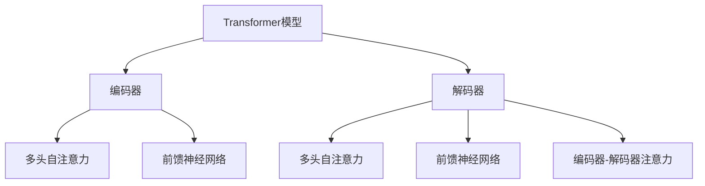

# Python深度学习实践：使用Transformers处理NLP问题

## 1.背景介绍

在当今的数字时代,自然语言处理(NLP)已经成为人工智能领域中最重要和最具挑战性的任务之一。NLP旨在使计算机能够理解、解释和生成人类语言,这对于构建智能系统至关重要,如聊天机器人、机器翻译、情感分析等。然而,自然语言的复杂性和多样性使得NLP任务变得极具挑战。

传统的NLP方法,如基于规则的系统和统计模型,在处理复杂语言现象时存在局限性。随着深度学习技术的兴起,特别是Transformer模型的出现,NLP领域取得了突破性进展。Transformer模型通过自注意力机制有效捕捉长距离依赖关系,从而更好地理解和生成自然语言。

本文将探讨如何使用Python中的Transformers库来解决各种NLP任务。Transformers是一个强大的开源库,提供了预训练的Transformer模型和用于微调这些模型的工具。我们将介绍Transformers库的核心概念,详细解释其关键算法原理,并通过实际代码示例展示如何应用Transformers来解决文本分类、机器翻译、问答系统等NLP问题。

## 2.核心概念与联系

在深入探讨Transformers库之前,我们需要了解一些核心概念和它们之间的关系。

### 2.1 Transformer模型

Transformer是一种基于自注意力机制的序列到序列(Seq2Seq)模型,由Google的Vaswani等人在2017年提出。它不依赖于循环神经网络(RNN)和卷积神经网络(CNN),而是完全基于注意力机制来捕获输入序列中的长距离依赖关系。

Transformer模型的核心组件包括编码器(Encoder)和解码器(Decoder)。编码器负责处理输入序列,而解码器则生成输出序列。两者都由多个相同的层组成,每层包含多头自注意力(Multi-Head Attention)和前馈神经网络(Feed-Forward Neural Network)子层。

### 2.2 自注意力机制

自注意力机制是Transformer模型的核心,它允许模型在计算表示时关注输入序列中的不同位置。与RNN和CNN不同,自注意力机制不需要按顺序处理序列,而是可以同时关注所有位置。这使得Transformer模型能够更好地捕获长距离依赖关系,并提高了并行计算能力。

### 2.3 Transformer预训练模型

预训练模型是指在大量未标记数据上预先训练的模型,可以有效地捕获语言的一般特征。通过在下游任务上微调预训练模型,我们可以获得出色的性能,同时节省了从头开始训练模型的时间和计算资源。

Transformers库提供了多种预训练的Transformer模型,如BERT、GPT、T5等。这些模型在各种NLP任务上表现出色,如文本分类、机器翻译、问答系统等。

## 3.核心算法原理具体操作步骤

在本节中,我们将深入探讨Transformer模型的核心算法原理,包括自注意力机制、多头注意力、位置编码等。

### 3.1 自注意力机制

自注意力机制是Transformer模型的核心,它允许模型在计算表示时关注输入序列中的不同位置。给定一个输入序列 $X = (x_1, x_2, ..., x_n)$,自注意力机制计算序列中每个位置的表示,并将其映射到一个新的序列 $Z = (z_1, z_2, ..., z_n)$。

对于每个位置 $i$,自注意力机制首先计算一个查询向量 $q_i$、一个键向量 $k_i$ 和一个值向量 $v_i$,它们是通过线性变换得到的:

$$q_i = X_iW^Q$$
$$k_i = X_iW^K$$
$$v_i = X_iW^V$$

其中 $W^Q$、$W^K$ 和 $W^V$ 是可学习的权重矩阵。

然后,自注意力机制计算查询向量 $q_i$ 和所有键向量 $k_j$ 之间的点积,并对其进行缩放和软最大化,得到注意力分数 $\alpha_{ij}$:

$$\alpha_{ij} = \text{softmax}\left(\frac{q_i^Tk_j}{\sqrt{d_k}}\right)$$

其中 $d_k$ 是键向量的维度,用于缩放点积以防止梯度过大或过小。

最后,自注意力机制将注意力分数与值向量 $v_j$ 相乘,并对所有位置求和,得到位置 $i$ 的新表示 $z_i$:

$$z_i = \sum_{j=1}^n \alpha_{ij}v_j$$

通过这种方式,自注意力机制可以捕获输入序列中的长距离依赖关系,并生成更好的表示。

### 3.2 多头注意力

多头注意力是一种并行计算多个自注意力机制的方法,它可以从不同的表示子空间捕获不同的信息。

具体来说,多头注意力将查询、键和值向量线性投影到 $h$ 个子空间,对每个子空间分别计算自注意力,然后将结果拼接起来:

$$\text{MultiHead}(Q, K, V) = \text{Concat}(head_1, head_2, ..., head_h)W^O$$

其中 $head_i$ 是第 $i$ 个子空间的自注意力计算结果:

$$head_i = \text{Attention}(QW_i^Q, KW_i^K, VW_i^V)$$

$W_i^Q$、$W_i^K$、$W_i^V$ 和 $W^O$ 是可学习的权重矩阵。

通过多头注意力,Transformer模型可以从不同的表示子空间捕获不同的信息,从而提高模型的表现能力。

### 3.3 位置编码

由于Transformer模型没有像RNN那样的顺序结构,因此需要一种方式来编码输入序列中每个位置的位置信息。Transformer模型使用位置编码来实现这一点。

位置编码是一个与位置相关的向量,它被添加到输入的嵌入向量中,以提供位置信息。具体来说,对于位置 $i$,位置编码 $PE_{(i, 2j)}$ 和 $PE_{(i, 2j+1)}$ 分别定义为:

$$PE_{(i, 2j)} = \sin\left(\frac{i}{10000^{\frac{2j}{d_{model}}}}\right)$$
$$PE_{(i, 2j+1)} = \cos\left(\frac{i}{10000^{\frac{2j}{d_{model}}}}\right)$$

其中 $j$ 是位置编码的维度索引,取值范围为 $[0, d_{model}/2)$。$d_{model}$ 是模型的嵌入维度。

通过添加位置编码,Transformer模型可以捕获输入序列中每个位置的位置信息,从而更好地理解和生成自然语言。

## 4.数学模型和公式详细讲解举例说明

在上一节中,我们介绍了Transformer模型的核心算法原理,包括自注意力机制、多头注意力和位置编码。现在,让我们通过一个具体的例子来更深入地理解这些概念。

假设我们有一个输入序列 $X = (x_1, x_2, x_3)$,其中每个 $x_i$ 是一个词嵌入向量。我们将计算自注意力机制和多头注意力,以生成新的表示序列 $Z = (z_1, z_2, z_3)$。

### 4.1 自注意力机制

首先,我们计算查询向量 $q_i$、键向量 $k_i$ 和值向量 $v_i$:

$$q_1 = x_1W^Q, \quad k_1 = x_1W^K, \quad v_1 = x_1W^V$$
$$q_2 = x_2W^Q, \quad k_2 = x_2W^K, \quad v_2 = x_2W^V$$
$$q_3 = x_3W^Q, \quad k_3 = x_3W^K, \quad v_3 = x_3W^V$$

其次,我们计算注意力分数 $\alpha_{ij}$:

$$\alpha_{11} = \text{softmax}\left(\frac{q_1^Tk_1}{\sqrt{d_k}}\right), \quad \alpha_{12} = \text{softmax}\left(\frac{q_1^Tk_2}{\sqrt{d_k}}\right), \quad \alpha_{13} = \text{softmax}\left(\frac{q_1^Tk_3}{\sqrt{d_k}}\right)$$
$$\alpha_{21} = \text{softmax}\left(\frac{q_2^Tk_1}{\sqrt{d_k}}\right), \quad \alpha_{22} = \text{softmax}\left(\frac{q_2^Tk_2}{\sqrt{d_k}}\right), \quad \alpha_{23} = \text{softmax}\left(\frac{q_2^Tk_3}{\sqrt{d_k}}\right)$$
$$\alpha_{31} = \text{softmax}\left(\frac{q_3^Tk_1}{\sqrt{d_k}}\right), \quad \alpha_{32} = \text{softmax}\left(\frac{q_3^Tk_2}{\sqrt{d_k}}\right), \quad \alpha_{33} = \text{softmax}\left(\frac{q_3^Tk_3}{\sqrt{d_k}}\right)$$

最后,我们计算新的表示序列 $Z = (z_1, z_2, z_3)$:

$$z_1 = \alpha_{11}v_1 + \alpha_{12}v_2 + \alpha_{13}v_3$$
$$z_2 = \alpha_{21}v_1 + \alpha_{22}v_2 + \alpha_{23}v_3$$
$$z_3 = \alpha_{31}v_1 + \alpha_{32}v_2 + \alpha_{33}v_3$$

通过这种方式,自注意力机制可以捕获输入序列中的长距离依赖关系,并生成更好的表示。

### 4.2 多头注意力

现在,让我们计算多头注意力。假设我们有两个注意力头 ($h=2$),每个注意力头都有自己的权重矩阵 $W_i^Q$、$W_i^K$、$W_i^V$ 和 $W^O$。

对于第一个注意力头,我们计算:

$$head_1 = \text{Attention}(QW_1^Q, KW_1^K, VW_1^V)$$

对于第二个注意力头,我们计算:

$$head_2 = \text{Attention}(QW_2^Q, KW_2^K, VW_2^V)$$

然后,我们将两个注意力头的结果拼接起来,并通过权重矩阵 $W^O$ 进行线性变换:

$$\text{MultiHead}(Q, K, V) = \text{Concat}(head_1, head_2)W^O$$

通过多头注意力,Transformer模型可以从不同的表示子空间捕获不同的信息,从而提高模型的表现能力。

### 4.3 位置编码

最后,让我们看一下位置编码的计算方式。假设我们有一个输入序列 $X = (x_1, x_2, x_3)$,其中每个 $x_i$ 是一个词嵌入向量,维度为 $d_{model}=4$。

对于位置 $i=1$,位置编码为:

$$PE_{(1, 0)} = \sin\left(\frac{1}{10000^{0}}\right) = 0.00000$$
$$PE_{(1, 1)} = \cos\left(\frac{1}{10000^{0}}\right) = 1.00000$$
$$PE_{(1, 2)} = \sin\left(\frac{1}{10000^{1}}\right) = 0.00010$$
$$PE_{(1, 3)} = \cos\left(\frac{1}{10000^{1}}\right) = 0.99999$$

对于位置 $i=2$,位置编码为:

$$PE_{(2, 0)} = \sin\left(\frac{2}{10000^{0}}\right) = 0.00000$$
$$PE_{(2, 1)} = \cos\left(\frac{2}{10000^{0}}\right) = 0.99999$$
$$PE_{(2, 2)} = \sin\left(\frac{2}{10000^{1}}\right) = 0.00019$$
$$PE_{(2, 3)} = \cos\left(\frac{2}{10000^{1}}\right) = 0.99998$$

对于位置 $i=3$,位置编码为:

$$PE_{(3, 0)} = \sin\left(\frac{3}{