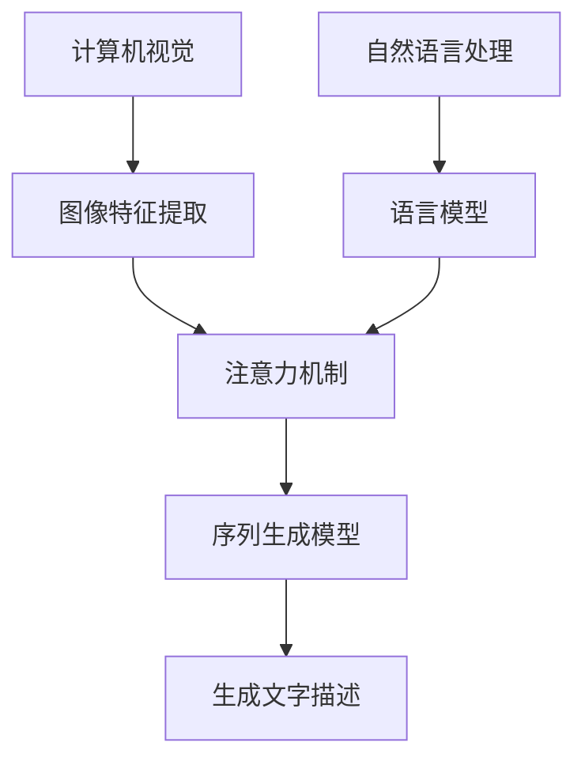

# Python深度学习实践：生成文字描述从图像识别迈向图像理解

## 1.背景介绍

在过去几年中,计算机视觉和自然语言处理领域取得了长足的进步,这在很大程度上归功于深度学习技术的发展。图像识别任务已经取得了令人瞩目的成就,但仅仅识别图像中的物体还远远不够,我们需要进一步理解图像的内容和语义信息。生成文字描述(Image Captioning)任务旨在为给定的图像生成自然语言的描述性文本,这是实现图像理解的重要一步。

生成文字描述技术将计算机视觉和自然语言处理两个领域紧密结合,需要模型同时具备理解图像内容和生成自然语言描述的能力。这一任务具有广泛的应用前景,如为视障人士提供图像辅助描述、图像搜索和检索、人机交互等。随着深度学习在这两个领域的快速发展,生成文字描述任务也取得了令人瞩目的进展。

### 1.1 图像识别与生成文字描述的区别

传统的图像识别任务关注于识别图像中的物体类别和位置,通常以标签或边界框的形式给出结果。而生成文字描述任务则需要模型理解图像的整体语义信息,并用自然语言生成对图像内容的描述性文本,这对模型的理解和生成能力要求更高。

生成文字描述不仅需要识别图像中的物体,还需要捕捉它们之间的关系、场景信息、发生的动作等丰富的语义信息。此外,模型还需要具备自然语言生成能力,能够将理解到的信息用流畅、准确的语言表达出来。这一任务将计算机视觉和自然语言处理两个领域的挑战有机结合,是实现真正的图像理解和人机交互的重要一步。

### 1.2 生成文字描述的应用前景

生成文字描述技术具有广阔的应用前景,可以为以下领域带来极大的便利:

- **辅助视障人士理解图像内容**: 为视障人士提供图像的自然语言描述,帮助他们更好地理解周围环境。
- **图像搜索和检索**: 根据生成的文字描述对图像进行搜索和检索,提高效率。
- **人机交互系统**: 在人机交互场景下,通过生成文字描述增强机器对图像的理解能力,提升交互体验。
- **自动化图像标注**: 利用生成的文字描述自动为图像添加标签和注释,降低人工标注的工作量。
- **多媒体内容理解**: 对图像、视频等多媒体内容进行自动描述,提高内容理解和检索能力。

总的来说,生成文字描述技术将计算机视觉和自然语言处理紧密结合,是实现真正的图像理解和人机交互的关键一步,在多个领域具有广阔的应用前景。

## 2.核心概念与联系

生成文字描述任务涉及多个核心概念,包括计算机视觉、自然语言处理、序列生成模型和注意力机制等。这些概念之间存在着紧密的联系,共同构建了完整的生成文字描述模型。



### 2.1 计算机视觉与图像特征提取

计算机视觉是生成文字描述任务的基础,负责从图像中提取有用的视觉特征。常用的深度卷积神经网络模型(如VGG、ResNet等)被广泛应用于图像特征提取。这些模型能够自动学习图像的低级和高级语义特征,为后续的自然语言生成提供视觉信息。

### 2.2 自然语言处理与语言模型

自然语言处理则负责理解和生成自然语言文本。语言模型(如LSTM、Transformer等)被用于捕捉文本的语义和语法信息,生成流畅、准确的自然语言描述。生成文字描述任务需要将视觉特征和语言模型有机结合,实现跨模态的信息融合和表达。

### 2.3 注意力机制

注意力机制在生成文字描述任务中扮演着关键角色。它允许模型在生成每个单词时,selectively关注图像的不同区域和之前生成的文本,从而捕捉更加丰富的上下文信息。注意力机制有助于模型更好地理解图像内容,并生成与图像内容高度相关的描述性文本。

### 2.4 序列生成模型

生成文字描述本质上是一个序列生成任务,需要根据图像特征和之前生成的单词,预测下一个最可能的单词。序列生成模型(如LSTM解码器、Transformer解码器等)被广泛应用于该任务。这些模型能够学习文本序列的内在规律,并基于上下文信息生成连贯、合理的文本描述。

上述核心概念相互依赖、紧密联系,共同构建了完整的生成文字描述模型。计算机视觉提取图像特征,自然语言处理建模语言信息,注意力机制融合跨模态信息,序列生成模型则负责根据上下文预测下一个单词,最终生成描述性文本。这些概念的有机结合是实现图像理解的关键所在。

## 3.核心算法原理具体操作步骤

生成文字描述任务的核心算法原理可以概括为以下几个关键步骤:

1. **图像特征提取**: 使用预训练的深度卷积神经网络(如VGG、ResNet等)从输入图像中提取视觉特征。这些特征编码了图像的内容和语义信息,为后续的文本生成提供视觉信息。

2. **序列建模**: 使用序列模型(如LSTM、Transformer等)对目标文本序列进行建模。序列模型能够捕捉文本的语法和语义信息,为生成流畅、准确的描述性文本奠定基础。

3. **注意力机制**: 引入注意力机制,使模型能够在生成每个单词时,selectively关注图像的不同区域和之前生成的文本。这有助于模型更好地理解图像内容,并生成与图像高度相关的描述。

4. **解码器**: 使用解码器(如LSTM解码器、Transformer解码器等)根据图像特征、注意力权重和之前生成的单词,预测下一个最可能的单词。解码器负责将视觉信息和语言信息融合,生成连贯的文本描述。

5. **训练与优化**: 使用监督学习的方式,以最小化模型在训练数据上的损失函数(如交叉熵损失)为目标,对模型进行端到端的训练和优化。常用的优化算法包括SGD、Adam等。

6. **推理与生成**: 在推理阶段,模型接收一张新的输入图像,提取图像特征,然后通过训练好的解码器逐步生成单词,最终输出完整的描述性文本。

上述步骤构成了生成文字描述任务的核心算法流程。其中,注意力机制和解码器的设计是关键所在,它们共同实现了视觉信息和语言信息的融合,最终生成与图像高度相关的描述性文本。

## 4.数学模型和公式详细讲解举例说明

生成文字描述任务中涉及多个数学模型和公式,包括图像特征提取、序列建模、注意力机制和解码器等模块。下面将详细介绍这些核心模块的数学原理。

### 4.1 图像特征提取

图像特征提取通常使用预训练的深度卷积神经网络模型,如VGG、ResNet等。这些模型将输入图像$I$通过多层卷积、池化和非线性激活操作,最终得到图像的特征表示$v$:

$$v = f_{cnn}(I; \theta_{cnn})$$

其中,$f_{cnn}$表示卷积神经网络模型,$\theta_{cnn}$为模型参数。得到的特征向量$v$编码了图像的语义和视觉信息,为后续的文本生成提供输入。

### 4.2 序列建模

序列建模模块通常采用循环神经网络(RNN)或Transformer等序列模型,对目标文本序列$Y = \{y_1, y_2, \dots, y_T\}$进行建模。以LSTM为例,在时间步$t$,隐状态$h_t$的更新公式为:

$$\begin{aligned}
f_t &= \sigma(W_f[h_{t-1}, x_t] + b_f) \\
i_t &= \sigma(W_i[h_{t-1}, x_t] + b_i) \\
o_t &= \sigma(W_o[h_{t-1}, x_t] + b_o) \\
c_t &= f_t \odot c_{t-1} + i_t \odot \tanh(W_c[h_{t-1}, x_t] + b_c) \\
h_t &= o_t \odot \tanh(c_t)
\end{aligned}$$

其中,$\sigma$为sigmoid激活函数,$\odot$为元素wise乘积,${f_t, i_t, o_t}$分别为遗忘门、输入门和输出门,${c_t, h_t}$为单元状态和隐状态。LSTM能够有效捕捉长期依赖关系,为生成流畅的文本描述奠定基础。

### 4.3 注意力机制

注意力机制是生成文字描述任务的核心,它允许模型在生成每个单词时,selectively关注图像的不同区域和之前生成的文本。

给定图像特征$v$和前一隐状态$h_{t-1}$,注意力权重$\alpha_t$的计算公式为:

$$\begin{aligned}
e_t &= f_{att}(v, h_{t-1}) \\
\alpha_t &= \text{softmax}(e_t)
\end{aligned}$$

其中,$f_{att}$为注意力打分函数,可以是简单的向量点乘或多层感知机等。$\alpha_t$表示在时间步$t$,模型对图像不同区域的注意力分布。

接下来,注意力加权的图像特征$\hat{v}_t$和上下文向量$c_t$的计算如下:

$$\begin{aligned}
\hat{v}_t &= \sum_i \alpha_{t,i} v_i \\
c_t &= \phi([h_{t-1}, \hat{v}_t])
\end{aligned}$$

其中,$\phi$为非线性函数,将隐状态和注意力加权特征融合为上下文向量$c_t$。

### 4.4 解码器

解码器模块根据图像特征、注意力权重和之前生成的单词,预测下一个最可能的单词。以LSTM解码器为例,在时间步$t$,给定上下文向量$c_t$和嵌入的前一单词$y_{t-1}$,隐状态$h_t$和预测概率$p(y_t|y_{<t}, I)$的更新公式为:

$$\begin{aligned}
h_t &= f_{lstm}(h_{t-1}, [y_{t-1}, c_t]) \\
p(y_t|y_{<t}, I) &= g(h_t, c_t)
\end{aligned}$$

其中,$f_{lstm}$为LSTM更新函数,$g$为生成函数,可以是简单的线性层或多层感知机等。通过最大化$p(y_t|y_{<t}, I)$,模型可以逐步生成描述性文本。

上述数学模型和公式详细阐述了生成文字描述任务中的核心模块,包括图像特征提取、序列建模、注意力机制和解码器等。这些模块的有机结合,使模型能够融合视觉和语言信息,最终生成与图像高度相关的描述性文本。

## 5.项目实践:代码实例和详细解释说明

为了更好地理解生成文字描述任务,我们将通过一个基于PyTorch的代码实例,详细解释模型的实现细节。本例使用了Encoder-Decoder框架和注意力机制,能够生成简单的图像描述。

### 5.1 数据准备

首先,我们需要准备图像和对应的描述文本作为训练数据。这里使用COCO数据集,它包含了大量的图像及其描述性文本。我们将数据集划分为训练集、验证集和测试集。

```python
import os
import torch
from torchvision import transforms
from PIL import Image
from pycocotools.coco import COCO

# 数据预处理