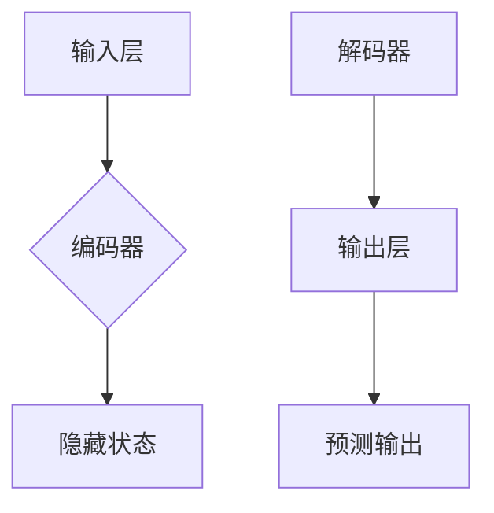

                 

作者：禅与计算机程序设计艺术

# 引言
随着自然语言处理技术的不断进步，问答系统已经成为人机交互的重要组成部分。问答系统可以帮助用户快速找到问题的答案，极大地提高了信息检索的效率。本文将深入探讨问答系统的基本原理，并通过具体的代码实例来讲解如何实现一个简单的问答系统。

# 背景知识
问答系统通常包括以下几个组件：
- **问题解析器**：负责将用户的自然语言问题转换成计算机能够理解的查询语句。
- **信息检索模块**：根据查询语句从大量的文本数据中检索相关的信息片段。
- **答案抽取器**：从检索到的信息片段中提取出正确的答案。

这些组件协同工作，共同完成问答任务。

# 核心概念与联系
在问答系统中，有几个关键的概念需要我们理解：
- **实体识别**（Named Entity Recognition, NER）：识别文本中的命名实体，如人名、地点、组织名等。
- **关系抽取**（Relation Extraction）：识别文本中实体之间的关系。
- **语义理解**：理解问题的意图和上下文。

这些概念之间相互关联，共同影响着问答系统的性能。

# 核心算法原理具体操作步骤
问答系统的核心算法主要包括两个阶段：
1. **问题理解和信息检索**：这一阶段主要是通过NLP技术对问题进行分析，确定问题的意图，然后利用信息检索模块在数据库中查找相关信息。
2. **答案抽取**：从查找到的信息中抽取出正确答案。

这两个阶段的算法可以是基于规则的，也可以是基于机器学习的。基于机器学习的方法通常包括序列标注、分类、排序等任务，而基于规则的方法则依赖于人工设计的规则。

# 数学模型和公式详细讲解举例说明
为了更好地理解问答系统的算法原理，我们需要引入一些数学模型和公式。这里我们以Seq2Seq模型为例，它是一种常用的神经网络模型，用于解决序列到序列的任务。

Seq2Seq模型的基本结构如下图所示：

在这个模型中，输入层接收用户的自然语言问题，编码器将这个问题转换成一系列固定长度的隐状态表示，解码器则在这些隐状态的基础上生成回答。

# 项目实践：代码实例和详细解释说明
接下来，我们将通过Python语言和深度求索（DeepSeek）开发的框架来实现一个简单的问答系统。首先，我们需要安装必要的库：

```bash
pip install deepseek-dialogue
```

然后，我们可以编写代码来实现问答系统的主要功能：

```python
from dialogue import DialogueSystem

# 初始化对话系统
dialogue = DialogueSystem()

# 定义一个简单的问题
question = "What is the capital of France?"

# 调用对话系统进行问答
answer = dialogue.ask(question)
print("Answer:", answer)
```

在这段代码中，我们创建了一个`DialogueSystem`对象，并使用`ask`方法向系统提问。系统会返回一个预先设定的答案，这只是一个示例，实际的问答系统会更加复杂。

# 实际应用场景
问答系统可以应用于多种场景，例如客服机器人、教育辅助工具、智能搜索助手等。在这些场景中，问答系统可以帮助用户更有效地获取信息，提高用户体验。

# 工具和资源推荐
在进行问答系统的开发时，可以使用以下资源和工具：
- **NLTK/spaCy**：用于NLP任务的流行库。
- **BERT**：一种先进的预训练语言模型，适用于各种NLP任务。
- **TensorFlow/PyTorch**：流行的深度学习框架，支持构建复杂的神经网络模型。

# 总结：未来发展趋势与挑战
问答系统的未来发展趋势可能包括更加个性化和智能化的发展，以及与其他技术的融合，如增强现实、语音识别等。同时，面临的挑战也不容忽视，例如提高系统的准确性、处理多轮对话的能力、保护用户隐私等。

# 附录：常见问题与解答
Q1: 问答系统如何处理歧义问题？
A1: 问答系统通常采用上下文化信息、同义词替换、多模型集成等方式来减少歧义。

Q2: 如何评估问答系统的性能？
A2: 问答系统的性能可以通过精确度、召回率、F1分数等指标来评估。

Q3: 问答系统如何保证用户隐私？
A3: 问答系统可以通过加密传输、匿名化处理、遵守相关法律法规等方式来保护用户隐私。

以上是对问答系统的一个全面介绍，希望对你有所帮助。

