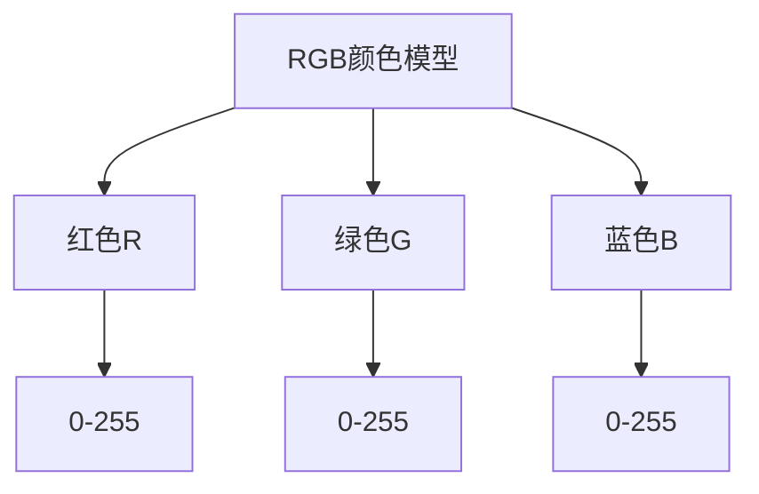
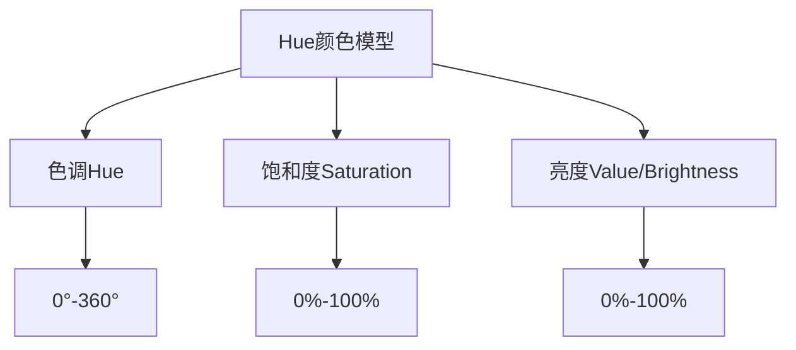

# RGB颜色模型与Hue的关系:理解它们的区别与联系

## 1.背景介绍

### 1.1 什么是颜色模型

颜色模型是一种抽象的数学模型,用于表示和操作颜色。它定义了一种方法来描述和表示颜色,使计算机能够处理、存储和显示颜色。颜色模型通常由一组基本颜色组成,这些颜色可以通过不同的方式组合来产生其他颜色。

### 1.2 RGB颜色模型

RGB颜色模型是最常见和最广泛使用的颜色模型之一。它基于人眼对红(R)、绿(G)和蓝(B)三种颜色的感知。每种颜色都由一个介于0到255之间的值表示,其中0表示该颜色完全不存在,而255表示该颜色的最大强度。

### 1.3 Hue颜色模型

Hue是另一种常用的颜色模型,它基于颜色的色调、饱和度和亮度。Hue代表颜色在色环上的位置,通常用角度(0°到360°)表示。饱和度表示颜色的纯度或鲜艳程度,而亮度表示颜色的明亮程度。

## 2.核心概念与联系

### 2.1 RGB颜色模型的核心概念

RGB颜色模型的核心概念是将颜色表示为红、绿和蓝三种基本颜色的组合。每种颜色的强度由一个介于0到255之间的值表示。当三种颜色的值都为0时,产生的是黑色;当三种颜色的值都为255时,产生的是白色。



### 2.2 Hue颜色模型的核心概念

Hue颜色模型的核心概念是将颜色表示为色调、饱和度和亮度三个独立的分量。色调决定了颜色在色环上的位置,饱和度决定了颜色的纯度或鲜艳程度,而亮度决定了颜色的明亮程度。



### 2.3 RGB与Hue的关系

RGB颜色模型和Hue颜色模型之间存在着密切的关系。事实上,它们可以相互转换。给定一个RGB值,我们可以计算出对应的Hue、饱和度和亮度值;反之亦然。这种转换关系使得在不同的颜色模型之间进行操作和表示成为可能。

## 3.核心算法原理具体操作步骤

### 3.1 RGB到Hue的转换

将RGB颜色值转换为Hue颜色模型涉及以下步骤:

1. 计算RGB值的最大值(M)和最小值(m)。
2. 计算色差(C),即最大值与最小值之差: C = M - m
3. 计算亮度(V),即最大值与最小值之和除以2: V = (M + m) / 2
4. 如果色差C等于0,则Hue值为0(红色)。
5. 否则,根据最大值是R、G还是B,计算Hue值:
   - 如果M是R,则Hue = 60° * ((G - B) / C) (modulo 360°)
   - 如果M是G,则Hue = 60° * ((B - R) / C + 2) (modulo 360°)
   - 如果M是B,则Hue = 60° * ((R - G) / C + 4) (modulo 360°)
6. 计算饱和度(S): 如果V = 0,则S = 0;否则S = C / (1 - abs(2 * V - 1))

以上步骤可以用以下伪代码表示:

```
function rgbToHsv(r, g, b)
    r, g, b := r/255, g/255, b/255
    mx = max(r, g, b)
    mn = min(r, g, b)
    df = mx-mn
    if mx == mn
        h = 0
    else if mx == r
        h = (60 * ((g-b)/df) + 360) % 360
    else if mx == g
        h = (60 * ((b-r)/df) + 120) % 360
    else if mx == b
        h = (60 * ((r-g)/df) + 240) % 360
    end if
    if mx == 0
        s = 0
    else
        s = df/mx
    end if
    v = mx
    return h, s, v
end function
```

### 3.2 Hue到RGB的转换

将Hue颜色模型转换为RGB值涉及以下步骤:

1. 计算色相(H')为H除以60,结果落在[0,6)范围内。
2. 计算中间值X: X = C * (1 - abs(mod(H', 2) - 1))
3. 根据H'的值,分配R'、G'和B'的值:
   - 当0 ≤ H' < 1时,R' = C,G' = X,B' = 0
   - 当1 ≤ H' < 2时,R' = X,G' = C,B' = 0
   - 当2 ≤ H' < 3时,R' = 0,G' = C,B' = X
   - 当3 ≤ H' < 4时,R' = 0,G' = X,B' = C
   - 当4 ≤ H' < 5时,R' = X,G' = 0,B' = C
   - 当5 ≤ H' < 6时,R' = C,G' = 0,B' = X
4. 将R'、G'和B'加上m,得到最终的RGB值。

以上步骤可以用以下伪代码表示:

```
function hsvToRgb(h, s, v)
    c = v * s
    x = c * (1 - abs((h/60) % 2 - 1))
    m = v - c
    r = 0
    g = 0 
    b = 0
    if 0 <= h and h < 60
        r = c
        g = x
    else if 60 <= h and h < 120
        r = x
        g = c
    else if 120 <= h and h < 180
        g = c
        b = x
    else if 180 <= h and h < 240
        g = x
        b = c
    else if 240 <= h and h < 300
        r = x
        b = c
    else
        r = c
        b = x
    end if
    r = (r + m) * 255
    g = (g + m) * 255
    b = (b + m) * 255
    return r, g, b
end function
```

通过以上算法,我们可以在RGB和Hue颜色模型之间进行无缝转换,实现不同颜色表示方式之间的相互操作。

## 4.数学模型和公式详细讲解举例说明

在RGB到Hue的转换过程中,我们需要使用一些数学公式来计算Hue、饱和度和亮度的值。下面我们将详细讲解这些公式,并给出具体的例子说明。

### 4.1 计算Hue值

Hue值的计算公式如下:

$$Hue = \begin{cases}
0, & \text{if } C = 0 \\
60^\circ \times \frac{G - B}{C} \pmod{360^\circ}, & \text{if } M = R \\
60^\circ \times \frac{B - R}{C} + 120^\circ \pmod{360^\circ}, & \text{if } M = G \\
60^\circ \times \frac{R - G}{C} + 240^\circ \pmod{360^\circ}, & \text{if } M = B
\end{cases}$$

其中:

- $C$ 是色差,即最大值与最小值之差: $C = M - m$
- $M$ 是RGB值中的最大值
- $R$、$G$、$B$ 分别代表红、绿、蓝三种颜色的值

例如,对于RGB值(255, 0, 0),我们有:

- $M = 255$ (红色的值)
- $m = 0$ (绿色和蓝色的值)
- $C = M - m = 255 - 0 = 255$

根据公式,我们可以计算出Hue值:

$$Hue = 60^\circ \times \frac{0 - 0}{255} \pmod{360^\circ} = 0^\circ$$

因此,RGB值(255, 0, 0)对应的Hue值为0°,代表红色。

### 4.2 计算饱和度

饱和度的计算公式如下:

$$Saturation = \begin{cases}
0, & \text{if } V = 0 \\
\frac{C}{1 - |2V - 1|}, & \text{otherwise}
\end{cases}$$

其中:

- $C$ 是色差,即最大值与最小值之差: $C = M - m$
- $V$ 是亮度,计算方式为: $V = \frac{M + m}{2}$

例如,对于RGB值(255, 0, 0),我们有:

- $M = 255$
- $m = 0$
- $C = M - m = 255 - 0 = 255$
- $V = \frac{M + m}{2} = \frac{255 + 0}{2} = 127.5$

根据公式,我们可以计算出饱和度:

$$Saturation = \frac{255}{1 - |2 \times 127.5 - 1|} = \frac{255}{1 - 254} = 1$$

因此,RGB值(255, 0, 0)对应的饱和度为1,代表完全饱和的颜色。

### 4.3 计算亮度

亮度的计算公式很简单,就是取RGB值中的最大值:

$$Brightness = \max(R, G, B)$$

对于RGB值(255, 0, 0),最大值是255,因此亮度为1。

通过以上公式,我们可以将任意RGB值转换为对应的Hue、饱和度和亮度值。反之,我们也可以根据给定的Hue、饱和度和亮度值,计算出对应的RGB值。

## 5.项目实践:代码实例和详细解释说明

为了更好地理解RGB和Hue颜色模型之间的转换,我们将提供一些代码示例,并详细解释每一步的操作。

### 5.1 Python实现RGB到Hue的转换

```python
import math

def rgb_to_hsv(r, g, b):
    r, g, b = r/255.0, g/255.0, b/255.0
    mx = max(r, g, b)
    mn = min(r, g, b)
    df = mx-mn
    if mx == mn:
        h = 0
    elif mx == r:
        h = (60 * ((g-b)/df) + 360) % 360
    elif mx == g:
        h = (60 * ((b-r)/df) + 120) % 360
    elif mx == b:
        h = (60 * ((r-g)/df) + 240) % 360
    if mx == 0:
        s = 0
    else:
        s = (df/mx)
    v = mx
    return h, s, v

# 示例用法
r, g, b = 255, 0, 0
h, s, v = rgb_to_hsv(r, g, b)
print(f"RGB({r}, {g}, {b}) 对应的 HSV 值为: ({h:.2f}, {s:.2f}, {v:.2f})")
```

上面的代码实现了RGB到Hue的转换。我们定义了一个名为`rgb_to_hsv`的函数,它接受三个参数`r`、`g`和`b`,分别表示RGB值。

1. 首先,我们将RGB值缩放到[0, 1]范围内,以便后续计算。
2. 然后,我们找到RGB值中的最大值`mx`和最小值`mn`,并计算它们之间的差值`df`。
3. 根据前面介绍的公式,我们计算Hue值`h`。如果`mx`等于`mn`,则`h`为0;否则,根据`mx`是`r`、`g`还是`b`,我们使用不同的公式计算`h`。
4. 接下来,我们计算饱和度`s`。如果`mx`为0,则`s`为0;否则,`s`等于`df/mx`。
5. 最后,我们将亮度`v`设置为`mx`。
6. 函数返回计算得到的`h`、`s`和`v`值。

在代码的最后,我们提供了一个示例用法,将RGB值(255, 0, 0)转换为对应的Hue、饱和度和亮度值,并打印出结果。

### 5.2 Python实现Hue到RGB的转换

```python
def hsv_to_rgb(h, s, v):
    h = float(h)
    s = float(s)
    v = float(v)
    h60 = h / 60.0
    h60f = math.floor(h60)
    hi = int(h60f) % 6
    f = h60 - h