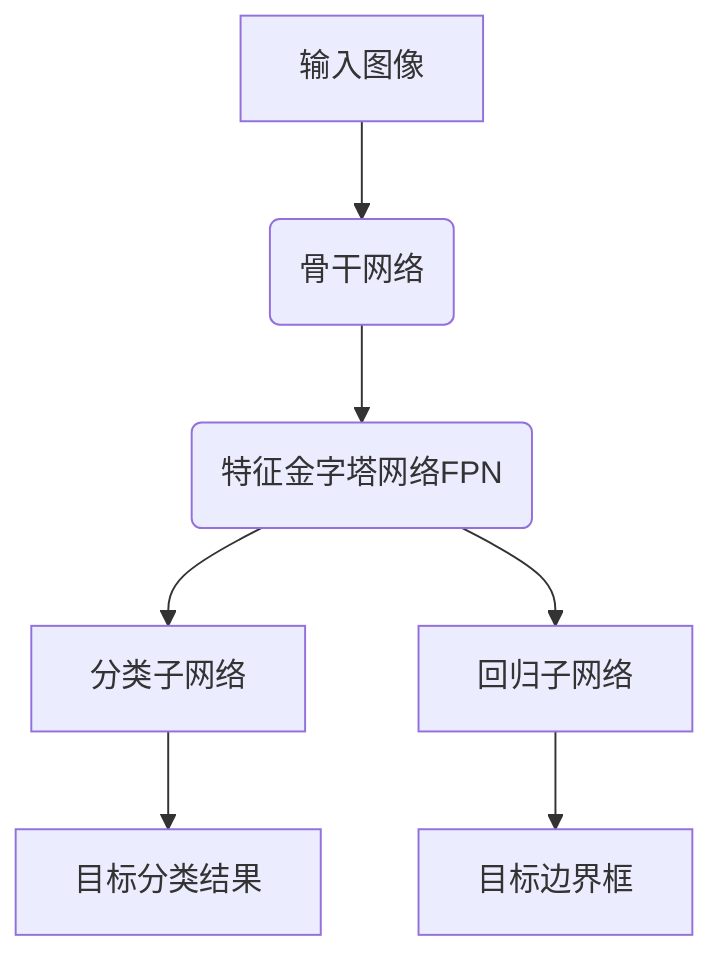

# RetinaNet模型部署在医疗设备

## 1.背景介绍

### 1.1 医疗影像分析的重要性

在医疗领域中,影像分析扮演着至关重要的角色。医生们依赖各种影像技术(如X射线、CT、MRI等)来诊断疾病、规划治疗方案和监测病情进展。然而,人工阅读和分析大量影像资料是一项极其耗时且容易出错的工作。因此,自动化的医疗影像分析技术应运而生,旨在提高诊断效率和准确性。

### 1.2 目标检测在医疗影像分析中的应用

目标检测是计算机视觉领域的一个核心任务,旨在自动定位和识别图像或视频中感兴趣的目标物体。在医疗影像分析中,目标检测技术可用于自动检测和定位病灶、肿瘤、结节等异常区域,为医生提供辅助诊断支持。

### 1.3 RetinaNet模型介绍

RetinaNet是一种先进的单阶段目标检测模型,由Facebook AI研究院(FAIR)于2017年提出。它采用特征金字塔网络(FPN)和焦点损失(Focal Loss)等创新技术,在保持高精度的同时,实现了更快的推理速度。由于其卓越的性能表现,RetinaNet已广泛应用于多个领域,包括医疗影像分析。

## 2.核心概念与联系

### 2.1 目标检测任务

目标检测任务的目标是在给定的图像或视频中,定位出感兴趣目标的边界框(bounding box),并为每个检测到的目标预测相应的类别标签。它是一个综合性任务,需要同时解决目标定位(localization)和目标分类(classification)两个子任务。

### 2.2 RetinaNet模型架构

RetinaNet模型的核心架构由两部分组成:

1. **骨干网络(Backbone Network)**: 通常采用预训练的卷积神经网络(如ResNet、VGG等)作为特征提取器,从输入图像中提取多尺度特征图。

2. **双子网络头(Two Subnetworks)**: 包括一个用于目标分类的子网络和一个用于目标边界框回归的子网络。这两个子网络共享来自骨干网络的特征图,并在每个位置密集地预测目标分数和边界框坐标。



### 2.3 特征金字塔网络(FPN)

FPN是RetinaNet的一个关键创新点。它通过自上而下的横向连接,构建了一个具有多尺度、高语义特征的特征金字塔。这种设计使得RetinaNet能够利用所有尺度的特征信息,从而更好地检测不同大小的目标。

### 2.4 焦点损失(Focal Loss)

传统的交叉熵损失函数在处理类别不平衡问题时表现不佳。RetinaNet引入了焦点损失,通过为每个样本分配一个模ulating因子,自动降低大量简单负样本的权重,使模型更专注于难分类的样本,从而有效解决了类别不平衡问题。

## 3.核心算法原理具体操作步骤

### 3.1 RetinaNet模型前向传播

RetinaNet在前向传播时执行以下步骤:

1. 输入图像经过骨干网络(如ResNet)提取多尺度特征图。
2. 特征图被输入到FPN中,生成具有不同尺度的特征金字塔。
3. 每个尺度的特征图被分别输入到分类子网络和回归子网络中。
4. 分类子网络对每个锚框(anchor box)的目标分数进行预测,回归子网络对锚框的位置偏移量进行预测。
5. 应用非极大值抑制(NMS)在预测结果中去除重叠的冗余检测框。
6. 输出最终的目标检测结果,包括目标类别和边界框坐标。

### 3.2 锚框(Anchor Boxes)生成

RetinaNet在每个特征图位置均匀地放置一组预定义的锚框,这些锚框具有不同的尺寸和纵横比。这些锚框作为初始猜测,在训练过程中被学习调整以更好地拟合真实目标。

### 3.3 分类子网络和回归子网络

分类子网络和回归子网络共享来自FPN的特征图输入。

- 分类子网络对每个锚框的目标分数进行预测,输出一个 `(A*K)`维向量,其中 `A` 是锚框数量, `K` 是目标类别数(包括背景类)。
- 回归子网络对每个锚框的位置偏移量进行预测,输出一个 `(A*4)`维向量,表示预测的边界框相对于锚框的调整量。

### 3.4 损失函数

RetinaNet使用了焦点损失(Focal Loss)作为分类任务的损失函数,并采用平滑L1损失(Smooth L1 Loss)作为回归任务的损失函数。

- 焦点损失:
  $$
  FL(p_t) = -(1-p_t)^\gamma \log(p_t)
  $$
  其中 $p_t$ 是正样本的预测概率, $\gamma$ 是调节因子,用于降低大量简单负样本的权重。

- 平滑L1损失:
  $$
  SmoothL1(x) = \begin{cases}
    0.5x^2 & \text{if }|x| < 1 \\
    |x| - 0.5 & \text{otherwise}
  \end{cases}
  $$
  用于回归任务,对于小的误差使用平方项,对于大的误差使用线性项,从而减轻outlier对训练的影响。

### 3.5 非极大值抑制(NMS)

由于存在大量重叠的预测框,RetinaNet使用非极大值抑制(NMS)算法去除这些冗余检测结果。NMS根据预测分数保留得分最高的检测框,并去除与之重叠度较高的其他检测框。

## 4.数学模型和公式详细讲解举例说明

### 4.1 RetinaNet损失函数

RetinaNet的总损失函数是分类损失和回归损失的加权和:

$$
L = \lambda_{cls} L_{cls} + \lambda_{reg} L_{reg}
$$

其中 $\lambda_{cls}$ 和 $\lambda_{reg}$ 分别是分类损失和回归损失的权重系数。

#### 4.1.1 分类损失(Classification Loss)

RetinaNet使用焦点损失作为分类损失函数,公式如下:

$$
FL(p_t) = -(1-p_t)^\gamma \log(p_t)
$$

其中 $p_t$ 是正样本的预测概率, $\gamma$ 是调节因子,通常取值 $\gamma=2$。焦点损失通过降低大量简单负样本的权重,使模型更专注于难分类的样本,从而有效解决了类别不平衡问题。

对于一个mini-batch中的所有锚框,分类损失定义为:

$$
L_{cls} = \frac{1}{N_{cls}} \sum_{i} FL(p_i)
$$

其中 $N_{cls}$ 是分类器的总样本数。

#### 4.1.2 回归损失(Regression Loss)

RetinaNet采用平滑L1损失作为回归损失函数,公式如下:

$$
SmoothL1(x) = \begin{cases}
    0.5x^2 & \text{if }|x| < 1 \\
    |x| - 0.5 & \text{otherwise}
  \end{cases}
$$

对于每个锚框,回归损失定义为:

$$
L_{reg}(t_i, v_i) = \sum_{m\in\{x,y,w,h\}} SmoothL1(t_i^m - v_i^m)
$$

其中 $t_i = (t_i^x, t_i^y, t_i^w, t_i^h)$ 是真实边界框的参数, $v_i = (v_i^x, v_i^y, v_i^w, v_i^h)$ 是预测边界框的参数。

对于一个mini-batch中的所有锚框,回归损失定义为:

$$
L_{reg} = \frac{1}{N_{reg}} \sum_{i} p_i^* L_{reg}(t_i, v_i)
$$

其中 $N_{reg}$ 是回归器的总样本数, $p_i^*$ 是锚框 $i$ 是否为正样本的指示器(0或1)。

### 4.2 实例解释

假设我们有一个输入图像,经过RetinaNet模型的前向传播,得到以下预测结果:

- 分类子网络输出:
  - 锚框1: [0.8, 0.1, 0.05, 0.05] (分别对应背景、人、车、狗的分数)
  - 锚框2: [0.2, 0.7, 0.05, 0.05]
  - 锚框3: [0.1, 0.1, 0.7, 0.1]

- 回归子网络输出:
  - 锚框1: [0.1, 0.2, 0.3, 0.4] (相对于锚框的位置偏移量)
  - 锚框2: [-0.2, 0.1, 0.1, -0.1]
  - 锚框3: [0.05, -0.1, 0.2, 0.15]

- 真实标注:
  - 边界框1: (0.2, 0.3, 0.5, 0.6) 类别为"人"
  - 边界框2: (0.6, 0.7, 0.2, 0.1) 类别为"车"

我们可以计算分类损失和回归损失如下:

1. 分类损失:
   - 锚框1是正样本(人),分类损失为 $FL(0.8) = -(1-0.8)^2 \log(0.8)$
   - 锚框2是正样本(车),分类损失为 $FL(0.7)$
   - 锚框3是负样本,分类损失为 $FL(0.1)$
   - 总分类损失为 $L_{cls} = \frac{1}{3}(FL(0.8) + FL(0.7) + FL(0.1))$

2. 回归损失:
   - 锚框1是正样本,回归损失为 $L_{reg}((0.2, 0.3, 0.5, 0.6), (0.1, 0.2, 0.3, 0.4))$
   - 锚框2是正样本,回归损失为 $L_{reg}((0.6, 0.7, 0.2, 0.1), (-0.2, 0.1, 0.1, -0.1))$
   - 锚框3是负样本,不计算回归损失
   - 总回归损失为 $L_{reg} = \frac{1}{2}(L_{reg}(...) + L_{reg}(...))$

通过优化总损失函数 $L = \lambda_{cls} L_{cls} + \lambda_{reg} L_{reg}$,RetinaNet模型可以学习到更准确的分类和回归能力。

## 5.项目实践：代码实例和详细解释说明

在本节中,我们将提供一个使用PyTorch实现的RetinaNet模型代码示例,并对关键部分进行详细解释。

### 5.1 导入必要的库

```python
import torch
import torch.nn as nn
import torchvision
```

### 5.2 RetinaNet模型定义

```python
class RetinaNet(nn.Module):
    def __init__(self, num_classes):
        super(RetinaNet, self).__init__()
        
        # 骨干网络
        self.backbone = torchvision.models.resnet50(pretrained=True)
        
        # FPN
        self.fpn = FPN(backbone_out_channels)
        
        # 分类子网络和回归子网络
        self.cls_head = ClassificationHead(fpn_out_channels, num_anchors, num_classes)
        self.reg_head = RegressionHead(fpn_out_channels, num_anchors)
        
        # 锚框生成器
        self.anchor_generator = AnchorsGenerator()
        
    def forward(self, images, targets=None):
        # 提取特征图
        features = self.backbone(images)
        
        # 构建特征金字塔
        features = self.fpn(features)
        
        # 生成锚框
        anchors = self.anchor_generator(images)
        
        # 前向传播分类子网络和回归子网络
        cls_outputs = self.cls_head(features)
        reg_outputs = self.reg_head(features)
        
        # 计算损失(如果提供了目标)
        if targets is not None:
            loss, cls_loss, reg_loss = self.loss_fn(cls_outputs, reg_outputs, anchors, targets)
            return loss, cls_{"msg_type":"generate_answer_finish","data":"","from_module":null,"from_unit":null}