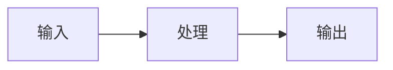
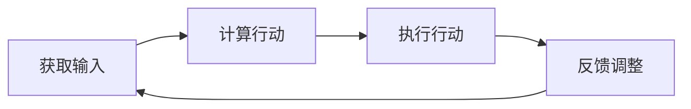

## 1.背景介绍

随着科技的发展，机器人技术和控制系统已经渗透到我们生活的方方面面，从自动驾驶汽车到智能家居，再到工业生产线上的自动化装配机器人。这些都离不开对机器人技术和控制系统的深入理解和应用。

## 2.核心概念与联系

控制系统是机器人技术的核心，它包括输入、处理和输出三个部分。输入是从外部环境获取的信息，处理是根据这些信息来决定机器人的行动，输出则是机器人的实际行动。而这个过程中，最关键的就是控制算法，它决定了机器人如何根据输入信息来产生输出行为。



## 3.核心算法原理具体操作步骤

控制算法的核心是反馈控制，即根据输出的结果反馈调整输入，以达到预期的效果。具体的操作步骤如下：

1. 获取外部环境的信息，作为输入。
2. 根据输入信息和预设的目标，计算出应该采取的行动。
3. 执行行动，产生输出。
4. 根据输出的结果，反馈调整输入。



## 4.数学模型和公式详细讲解举例说明

在控制系统中，我们通常使用PID（Proportional, Integral, Derivative）控制器来实现反馈控制。PID控制器的数学模型如下：

$$
u(t) = K_p e(t) + K_i \int_{0}^{t} e(\tau) d\tau + K_d \frac{de(t)}{dt}
$$

其中，$u(t)$ 是控制器的输出，$e(t)$ 是目标值和实际值的差值，$K_p$、$K_i$ 和 $K_d$ 分别是比例、积分和微分三个参数。

## 5.项目实践：代码实例和详细解释说明

下面我们以一个简单的自平衡机器人为例，通过Python代码来实现PID控制器。

```python
class PIDController:
    def __init__(self, Kp, Ki, Kd):
        self.Kp = Kp
        self.Ki = Ki
        self.Kd = Kd
        self.previous_error = 0
        self.integral = 0

    def control(self, error, delta_time):
        self.integral += error * delta_time
        derivative = (error - self.previous_error) / delta_time
        output = self.Kp * error + self.Ki * self.integral + self.Kd * derivative
        self.previous_error = error
        return output
```

## 6.实际应用场景

机器人技术和控制系统在许多领域都有广泛的应用，例如：

- 自动驾驶：通过控制系统，自动驾驶汽车可以根据路况自动调整行驶速度和方向。
- 工业生产：在生产线上，控制系统可以使机器人精确地完成装配、焊接等任务。
- 智能家居：通过控制系统，智能家居设备可以根据用户的需求自动调整环境参数，如温度、湿度等。

## 7.工具和资源推荐

- ROS（Robot Operating System）：一个用于机器人应用开发的开源框架，提供了大量的工具、库和软件包。
- MATLAB：一个用于数值计算的高级编程语言和交互式环境，特别适合用于控制系统的设计和分析。
- Python：一个广泛用于科学计算和机器人编程的编程语言，有许多用于机器人技术和控制系统的库和框架。

## 8.总结：未来发展趋势与挑战

随着科技的发展，机器人技术和控制系统将会越来越普及，它们将在更多的领域发挥作用。未来的挑战将是如何设计出更加智能、更加自适应的控制系统，以适应复杂多变的环境。

## 9.附录：常见问题与解答

1. Q: PID控制器的参数如何设置？
   A: PID控制器的参数需要根据具体的应用场景和需求来调整，一般需要通过实验来确定。

2. Q: 控制系统的设计有哪些常见的方法？
   A: 常见的控制系统设计方法包括频域方法、时域方法和状态空间方法等。

作者：禅与计算机程序设计艺术 / Zen and the Art of Computer Programming